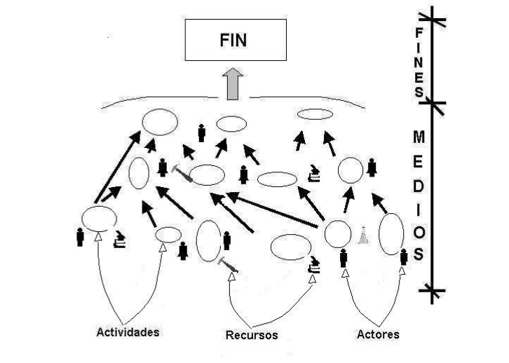

<h2> INTERPRETANDO ORGANIZACIONES</h2>

<h3>Que es una organización</h3>

<h4> MODELO BÁSICO DE UNA ORGANIZACIÓN</h4>

<h5>Definiciones iniciales (pseudo-axiomas)</h5>

*  **Organización:** Un sistema de actividades humanas (realizadas con o sin instrumentos) diseñadas y formalmente realizadas con el propósito decumplir con un fin prefijado y explícitamente
predefinido.
* **Organizacional:** Referente a la organización.
* **Eficiencia:** Medida de economía en recursos y tiempo para lograr fines prefijados.
* **Racionalidad:** Cualidad referente a la acción organizacional dirigida a cumplir fines prefijados.
* **Formal:** Referente al fin prefijado y explícitamente predefinido.
* **Actividades:** Conjunto de acciones entendidas como proceso cuyo sentido está fundado en el propósito de transformar un estado de cosas en otro. Formalmente se entiende que cada actividad organizacional contribuye con la realización del
fin prefijado mencionado en la definición de **organización**.
* **Objetivo:** Definición de un fin.
* **Recursos:** Bienes materiales requeridos para realizar actividades.
* **Actores:** Personas que realizan actividades en la organización. Entorno socio-organizacional: Micro-sociedad
emergente de las relaciones (formales y no formales) sostenidas entre los actores de una cierta organización.
* **Sector social receptor:** Sector de la sociedad que recibe el producto (bien o servicio) de la organización.

Las anteriores definiciones nos permiten esbozar, mediante una serie de comentarios referentes a las mismas, un modelo formal básico que podrá ser enriquecido y criticado a lo largo del desarrollo teórico que iniciamos en la sección 1.3 con la discusión de dos concepciones organizacionales opuestas.

<h4>Modelo básico de una organización</h4>
Tal como lo indica la definición y como lo ilustra la figura 1.2.2, la organización está definida como un sistema de actividades expresamente ordenado **organizado** de acuerdo con un fin que ha sido definido de antemano. Se trata, pues, de un sistema de actividades orientado por un propósito. Las actividades, aunque estén sujetas a un alto grado de automatización,
requieren, en última instancia, del concurso de (son responsabilidad de) un grupo de personas que denominamos **actores**. Por otra parte, la realización de dichas actividades requiere de un conjunto de recursos materiales cuya distribución y uso pretenden ser, en principio, lo más económico posible, de modo tal que el objetivo pueda cumplirse al menor costo

### Definicion de poder  Robert Dahl

El poder de una persona A sobre una persona B es la capacidad que
A tiene para lograr que B haga algo que no hubiera hecho sin la
intervención de A.