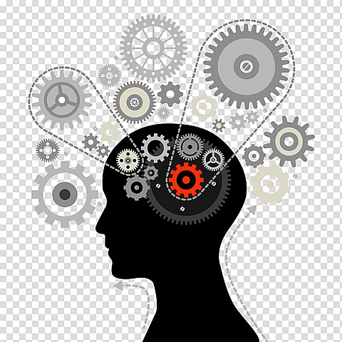
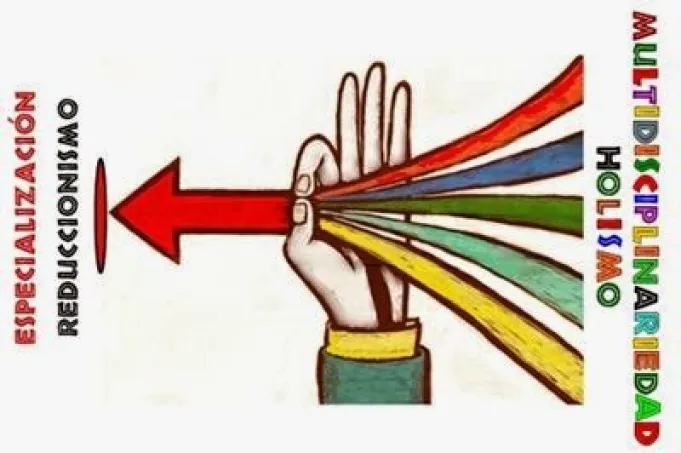
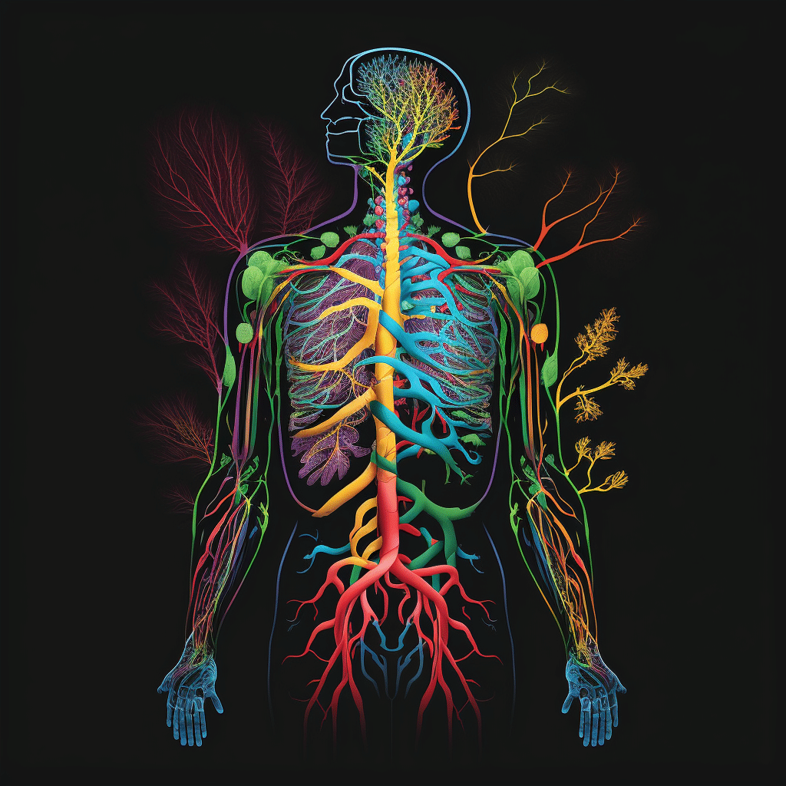
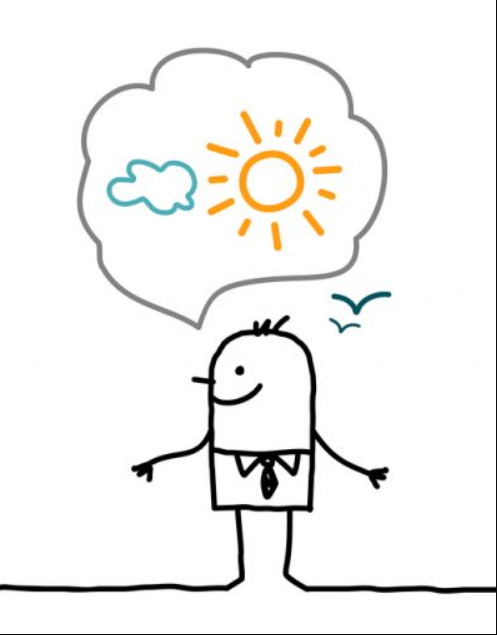
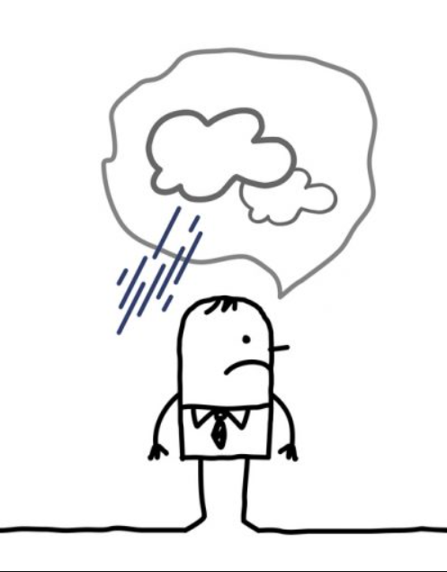

<h1 style = "color:#066694"> 1) Geomorfología del Pensamiento Sistémico </h1>

<h2 style="color:#066694">1.1) INTRODUCCIÓN  </h2> 

<strong>¿A qué llamamos pensamiento sistémico?</strong> Esta es una de las preguntas centrales que anima al presente libro. Pero la variedad de respuestas a las que el lector se enfrentará pueden generar una gran confusión. Por ello es necesario dar unas orientaciones preliminares que permitan situarse y comprender el por qué de esa variedad. Sin embargo, si fuéramos forzados por un lector impaciente a dar una respuesta rápida, adelantaríamos la siguiente afirmación que sin duda, a esta altura luce enigmática pero que esperarnos se vaya clarificando en el transcurso del libro: <mark>'El pensamiento sistémico es un pensamiento impulsado continuamente por un "afán holista "</mark>, es decir, una búsqueda de unidad en la diversidad.

#### Holismo

es una posición metodológica y epistemológica que postula cómo los sistemas (ya sean físicos, biológicos, sociales, económicos, mentales, lingüísticos, etc.) y sus propiedades deben ser analizados en su conjunto y no solo a través de las partes que los componen. Pero aún consideradas estas separadamente, analiza y observa el sistema como un todo integrado y global que en definitiva determina cómo se comportan las partes, mientras que un mero análisis de éstas no puede explicar por completo el funcionamiento del "todo". 

<h2 style="color:#066694">1.1.1) Situandonos en un nuevo mundo conceptual  </h2> 

A menudo, cuando nos hallamos en una nueva situación, nos preguntamos no sólo qué la caracteriza y cómo difiere de otras situaciones, sino también cuál es su dinámica, hacia dónde parece que
se dirige: Dichas preguntas surgen de la necesidad que tenemos los seres humanos de <strong>situarnos </strong>, es decir, la necesidad de mantenemos <strong>orientados.</strong> En efecto, hay dos modos (no independientes) de estar perdidos.
 
<mark>Uno es de carácter espacial y el otro temporal.</mark> La pérdida espacial se manifiesta en la pregunta: <strong> ¿Dónde estoy? </strong> Este interrogante requiere la definición de unas referencias espaciales con respecto a las cuales podemos <mark>situarnos</mark>.
La pérdida temporal se manifiesta en la pregunta: <strong>¿Qué futuro me espera? </strong>, Cuando reflexionamos sobre el significado de este interrogante, encontramos que el mismo se da en el contexto de un devenir: algo estábamos haciendo, algo que teníamos en mente nos daba la dirección e el impulso <mark>"hacia delante" </mark>

 El ser humano tiene la necesidad de saber donde esta para ello el ser humano se realiza dos preguntas:
  
<strong>¿Donde estoy ? (Caracter espacial)</strong>
  Para responder esta pregunta nesecitamos tener una marco de referecia espacial para poder definir en donde estamos situados.
   
<strong>¿Que futuro me espera? (Caracter temporal)</strong>
 Para responder esta pregunta nesecitamos reflecionar que estamos haciendo y que me implusa hacia delante es decir para mirar hacia el futuro es necesario saber de donde vinimos.
 Estas dos caracteristicas  estan asociadas ya que que tanto espacial como temporal esta intrínsecamente entrelazados.

<h2 style="color:#066694"> 1.1.2) Pensamiento y Geomorfología: Una metáfora Deleuziana </h2> 

#### metáfora geológica planteada porDeleuze y Guattari 

De acuerdo con  estos autores, contemplar el estado actual del pensamiento filosófico es similar a contemplar una formación geológica con los ojos de un geólogo <mark>Como "geólogos del pensamiento" estamos interesados no solo en hacer "mapas" y "clasificaciones" de las "rocas" expuestas en la "superficie de la tierra" , sino también, en explicar el origen y la distribución de las mismas Debemos, entonces, dilucidar el origen y la formación de los "paisajes" actuales que conforman el pensamiento
sistémico</mark>, así como la unidad que subyace en estos. Dichos "paisajes" han sido conformados por la acción de fuerzas "constructivas" que dan lugar a las "montañas y valles" y a las fuerzas "erosionantes" o
"tallantes" (v.gr. "agua'', "viento") que modifican el material traído a la superficie por las fuerzas constructivas.

És decir, el pensamiento filosófico es una fuerza telúrica que se manifiesta, deja huella, en paisajes (ordenes o arreglos) conceptuales. El devenir de este pensamiento no puede entenderse como una secuencia causal de eventos, pues su tiempo es estratigráfico; Esto quiere decir que su devenir se asemeja al de las formaciones geológicas, donde los estratos y las capas se desplazan abriendo espacios para que surjan nuevos pensamientos o para que las capas viejas puedan volver a irrumpir en un primer plano! <mark>IPor consiguiente, modos de pensamiento que ya se consideraban obsoletos, pueden aparecer nuevamente en el presente y desempeñar un papel importante. </mark>

<h2 style="color:#066694"> 1.1.2.1) Ejemplo de despliegue geomorfológico del pensamiento ·  </h2> 

<strong>Un pensamiento holista: </strong>sobre el castigo público busca entender el castigo como una actividad humana que hace parte integral de una manera de concebir el mundo <mark>(es decir, el castigo hace parte integral del mundo social, histórico y cultural de un pueblo en una época).</mark>
 
<strong>Un pensamiento reduccionista: </strong>, por el contrario, ve el castigo como un aspecto separado de la sociedad (el problema del delito y las leyes para lidiar con él). <mark>Se caracteriza por su deseo de aislar (reducir) de su contexto global todo lo que contempla, con el ánimo de analizarlo y explicarlo en sus propios términos.</mark> Un pensamiento reduccionista descontextualiza el objeto de reflexión de la totalidad a la que pertenece.) 

Con el ejemplo de la prision podemos ver como esta idea no viene de la actualidad sino de que se sostiene en ideas panteadas en el siglo VI y VII en los monosterios hasta la transformacion que a tenido en la actualidad perdiendo el fin de castigo y siendo remplazado per el de reeducacion e reinserción  

<h2 style="color:#066694"> 1.1.2.2) La Geomorfología del Pensamiento Sistémico: Nota Preliminar  </h2> 

Dar cuenta del pensamiento sistémico actual es, pues, describir el devenir de las formaciones estratigráficas con sus discontinuidades y tensiones. La tarea, sin embargo, reviste sus peculiaridades. 

En cierto modo la naturaleza del pensamiento es similar a la de los sueños. Estos no pueden ser programados, ni hay un método que permita tener sueños prefabricados de antemano! Tampoco hay un método para pensar. Lo que tal vez podemos sugerir es que así como el sueño trabaja con diversos materiales de nuestra experiencia (sucesos del día, deseos insatisfechos, etc.) así también lo hace el pensamiento. Éste trabaja" ... con esos mismos materiales y con otros, en un campo de fuerzas en que se enfrentan las ideas que tratan de irrumpir y las constricciones científico-ideológicas que determinan lo comunicable y por lo tanto, lo propiamente pensable.

<mark>El pensamiento sistémico es además, un evento muy peculiar ya que es doblemente consciente de la naturaleza del pensamiento mismo. En efecto, por una parte, es un pensamiento conscientemente respetuoso del objeto del pensamiento, permitiéndole manifestarse en su diversidad pero al mismo tiempo, buscando siempre un hilo conductor que le dé unidad a lo así manifestado.</mark> Esta característica la hemos denominado el afán holista del pensamiento sistémico. Por otra parte, es extrañamente autorreflexivo (o auto referencial), es decir, es histórico en sí mismo, porque se vuelca sobre sí para dar cuenta del piso sobre el cual se yergue y que lo ha hecho posible.

<strong>Un paradigma </strong>es, pues, una estructura conceptual. de creencias
metodológicas y teóricas entrelazadas que abre el campo de visión de
una comunidad científica específica, a la vez que la constituye como
tal.  

<h2 style="color:#066694">  1.2) LA PRIMERA OLA: ANTECEDENTES AL SURGIMIENTO DEL
PARADIGMA CIBERNETICO  </h2> 

Comenzaremos describiendo las condiciones que anteceden al surgimiento de la primera ola sísmica de cambio paradigmático, ola que transformará el panorama del pensamiento científico de la época introduciendo la idea de sistema (y con ella la propuesta para un nuevo paradigma de la ciencia). El panorama anterior estaba caracterizado por una visión mecanicista del mundo (el mundo es una gran máquina) y un consiguiente pensamiento mecanicista. La metáfora que acompañará esta primera ola de cambio será la de un organismo viviente en un medio ambiente. Sin embargo, el surgimiento del paradigma organicista en el panorama del pensamiento no implicará de ningún modo la desaparición del pensamiento mecanicista. Por el contrario, ya se verá cómo este pensamiento absorberá las ideas organicistas que emergen transformadas en lo que se denominará cibernética. 

<h2 style="color:#066694"> 1.2.1) Los orígenes del Movimiento de Sistemas en el Siglo XX   </h2> 

El llamado paradigma de Sistemas nació en los años cincuenta con la propuesta que el biólogo <strong>von Bertalanffy (1969, 1976) </strong>hiciera a la comunidad científica para que adoptase este paradigma como el
nuevo paradigma de la ciencia y centrara sus esfuerzos en un proyecto de integración de las ciencias, mediante la construcción conjunta de una Teoría General de Sistemas. <mark>Dicho proyecto intentaba una reorientación científica de gran envergadura, tendiente a lograr la integración en una unidad armoniosa, de las múltiples disciplinas inconexas en que la ciencia se venia fragmentando. Mas esta mision integradora no era el único objetivo del proyecto. Detrás había otro interés, Esta sociedad buscaba como objetivo esencial contribuir a mejoramiento de la humanidad y el pensamieto sistémico resultaba ser el instrumento más apropiado para el logro de tan noble objetivo.</mark> El pensamiento reduccionista, por el contrario, no sólo no era apropiado sino que de algun modo habia sído corresponsable del retardo de es progreso. 
 
Puede decirse entonces que Bertalanffy fue simplemente el portavoz del sentir de una época en la que las ideas organicistas y teleológicas (que explicaremos más adelante) comienzan a tomar fuerza
de nuevo en el pensamiento occidental. El movimiento intelectual que se fue estructurando alrededor de su propuesta de cambio paradigmático, y que luego cobró gran fuerza bajo el nombre de
<strong>movimiento de sistemas</strong>, así lo atestigua. En efecto, diversos manifiestos y proclamas que en los últimos cincuenta años se han publicado, afirman que estamos viviendo una revolución paradigmática que cambiará a la humanidad y que dará paso a la era sistémica

#### Pensamiento Instrumental

Se trata de la estructura de pensamiento que privilegia la utilidad de la acción y que considera los objetos como medios para alcanzar un fin determinado. Puede asociarse la razón instrumental, por lo tanto, al pragmatismo: importa más aquello que se quiere conseguir que el camino que lleva hacia eso.

<h2 style="color:#066694"> 1.2.1.1) El Paradigma Mecanicista  </h2> 

 Ve el mundo como una máquina (como un reloj mecánico). En función de los supuestos ontológicos y epistemológicos que subyacen a la visión mecanicista del mundo, tratemos de entender qué quiere decir esto. A grosso modo,<mark> la visión mecanicista de la realidad supone concebirla como un compuesto de piezas básicas o elementales que sostienen una interacción mecánica para realizar algún proceso (como las piezas de un reloj lo hace para dar la hora). </mark>Por ejemplo, en el caso de la materia, estas piezas elementales son los átomos, protones, electrones, etc. Su interacción constituye la materia de la cual está hecho el mundo natural. En el caso del ser humano, hay una parte psíquica y una parte fisiológica. La "pieza" psíquica es el resultado de procesos electroquímicos de la materia, los cuales dan lugar a su vez, al ego, el alter-ego, etc. La parte fisiológica está compuesta de órganos ... etc. Ahora bien, dado que el mecanicismo supone que todo está hecho a imagen y semejanza de una máquina, y <mark>dado que toda máquina supone un diseñador que es su creador, entonces conocer la realidad es desmontar la máquina (o la pieza de relojería) que ha sido creada por el gran diseñador que es Dios</mark>. Observe que la metáfora conlleva la idea de <mark>separación entre la máquina, el diseñador y el observador (o agente deseoso de conocer el diseño del creador). </mark>El estudioso de la realidad parado en un enfoque mecanicista, se asume separado de ella y por tanto, abordará el estudio de la misma en términos del modelo universal de máquina. Por consiguiente el problema que se planteará en cada caso, es dilucidar el tipo de máquina que corresponde al fenómeno bajo estudio. Y aquí surge un problema. Como el observador está separado de lo observado y no tiene acceso Geomorfología del Pensamiento Sistémico, directo a éste sino que su acceso está siempre mediado por los sentidos: <strong>¿Cómo se halla cuál es el modelo de máquina apropiado en cada caso? ¿Qué criterio de "verdad" interviene y asegura que el procedimiento sea verdadero? </strong> Las respuestas a estas preguntas, por la certeza del conocimiento, dependerán de la relación entre el observador y lo observado o entre mente y materia. <mark>Una respuesta a este problema se basa en la concepción de la mente como un espejo. Conocer es reflejar la realidad en dicho espejo. Objetividad es mantener el espejo siempre limpio y sin distorsiones. Las emociones y los valores lo empañan. El conocimiento científico es el que refleja con mayor claridad la realidad, por el método que tiene para corregir las posibles distorsiones que las emociones, valorés, y otras subjetividades introducen. Este método, primero que todo, aísla el objeto de estudio con el fin de poder analizarlo, es decir desarmarlo. Desarmar la máquina es reducirla a sus componentes básicos y examinar cada componente por separado y la conexión que tienen entre sí. Una vez analizada la máquina, se procede a reunir todas sus partes de nuevo, se ensamblan y se explica su funcionamiento como unidad. </mark>

>

<h2 style="color:#066694"> 1.2.1.2) Los Puntos de Quiebre del Mecanicismo </h2> 

Punto de quiebre es un concepto relativo. Sólo cuando un nuevo paradigma emerge es que reinterpretamos el pasado bajo este nuevo campo de visibilidad y definimos tales o cuales aspectos como críticos. Los puntos de quiebre son aspectos críticos paradigmáticos, problemas y paradojas relativos al paradigma mismo pero que éste no puede resolver o explicar. Sin embargo, retrospectivamente, se puede decir que fue gracias a las dificultades e inquietudes que esos problemas y paradojas fueron generando, que se dieron las condiciones propicias para el surgimiento del nuevo paradigma.
 
Desde los años 30, diversos intelectuales europeos <strong> Husserl </strong> habían venido hablando de la crisis de las ciencias europeas. A finales de los años 40, <strong>Bertalanffy  </strong> nos
cuenta que el ideal de todas las ciencias de llegar a ser.cómo la física <mark>(interesadas en determinar grupos de leyes explicativas y predictivas de los fenómenos bajo estudio),</mark> era un ideal que sólo se había realizado en el campo de laa física. Intentos similares en otras áreas como las ciencias sociales y del comportamiento, habían resultado fallidos.
 
En el dominio de las ciencias humanas estaba el problema de explicar el comportamiento humano en términos causales. Nociones como intención, telas o propósito, no eran admitidas en el lenguaje
científico por haber sido desterradas de su ámbito siglos atrás. La concepción mecanicista que reemplazó la concepción aristotélica del mundo, las nociones de telas y propósito fueron consideradas ilusorias,
o simplemente innecesarias. Sin embargo, era difícil desconocer que la acción humana es acción con sentido, con propósito. Frecuentemente actuamos porque lo que hacemos es significativo, no porque
respondamos a un estímulo (como ratón de laboratorio).
 
En la biología había problemas que no encontraban tampoco solución dentro del paradigma mecanicista. Uno de ellos era dar cuenta del aparente comportamiento teleológico de los seres vivos (es decir
que se comportan como si estuvieran guiados por un telas o propósito y no como si hubiese una causa física que los moviese). Otro era explicar el fenómeno de la vida mediante relaciones causales. La química y la física moleculares podían explicar las características físico-químicas de la célula, mas no cómo el conjunto de estos procesos produce la vida. El ADN, el código genético, tampoco podía explicar el fenómeno de la vida ya que diversos .arreglos u organizaciones de las cadenas de aminoácidos que lo constituyen, son perfectamente válidas desde el punto de vista de las leyes fisicoquímicas, y sin embargo, no han dado Jugar a ninguna forma de vida. Sólo en un cierto orden, estas cadenas
pueden dar lugar a un código vital y con éste, al surgimiento de un ser vivo.
 
La física, también estaban surgiendo graves dificultades. Así, en campos tales como el estudio de
la radiación de los cuerpos negros o en la física cuántica (Bohm, 1980), ocurrían cosas "extrañas". En esta última se encontró, por ejemplo, que el electrón sólo puede existir en ciertos niveles de energía y no en otros; y que además, posee una naturaleza dual lo que quiere decir que puede comportarse como partícula o como campo (u onda) de acuerdo al contexto de observación.
 
<mark>La realidad no quedaba entonces totalmente explicada por el modelo mecanicista de la física. Esto no quería decir que lo descubierto hasta ese momento por la física fuese incorrecto o falso. Era cuestión de darse cuenta de que la realidad es compleja y multifacética ella posee ciertos aspectos mecanicista, pero eso no todo.</mark>
 
La ciencia debe buscar entonces <strong>(según la propuesta de von Bertalanffy) </strong><mark> el desarrollo de una teoría general de sistemas. Esto implica hallar las estructuras generales o sistemas (la equivalencia entre sistema y estructura será aclarada más adelante) que están en la base del comportamiento de diversos fenómenos en diversos campos y entonces, intentar destilar una especie de estructura o modelo general de sistema, que pueda servir de espacio conceptual de encuentro donde las variadas disciplinas compartan sus diferentes perspectivas.</mark>

<h2 style="color:#066694"> 1.2.2) El Paradigma Sistémico </h2> 

<strong>El paradigma de sistemas</strong> se basa en la idea de que existen múltiples fenómenos que poseen características similares a las de un organismo vivo. Un organismo es una unidad bien díferenciada, que presenta propiedades que ninguna de sus partes posee. Por ejemplo, todos los seres vivos tienen materia, pero la vida no es mera materia sino una propiedad emergente de la materia. <mark>(Entiéndase por propiedad emergente de algo, una propiedad que ninguna de las partes que componen ese algo, posee pero que como conjunto relacionado entre sí, esas partes dan lugar a dicha propiedad).</mark>
 
<mark>la concepción organicista también supone que las cosas son totalidades que trascienden la mera coleccion de las partes y que a su vez, ellas estan insertas en un todo mayor en el que cumplen su funcion. Por ello, el comportamiento del todo sería explicable en términos de la funcion que cumple en ese contexto más amplio.</mark>
 
La noción de sistema será propuesta como una abstracción de los elementos básicos de esta metáfora. La definición de sistema de <strong>Checkland </strong>refleja bien dicha abstracción. Para <strong>Checkland </strong> <mark>la idea de sistema es la idea de un todo organizado jerárquicamente, que tiene propiedades emergentes y que en principio, puede sobrevivir en un medio cambiante si tiene procesos de comunicación y de control que le permitan adaptarse a dicho medio como respuesta a las perturbaciones que en el mismo se originen.</mark>

<h2 style = "color:#066694"> 1.2.2.1) Reduccionismo (o Atomismo) v.s Expansionismo (u Holismo) </h2>

El pensamiento sistematico surge como reaccion al pensamiento analitoco reduccionista.
 
<strong>El reduccionismo</strong>  <mark>es una dotrina que afirma que todo los objetos y eventos, sus propiedades, nuestra experiencia y el conocimiento de estos,esta constituidas por elementos primarios o partes invicibles <strong>(atomos)</strong> </mark>
En la ciencia de la eploca anterior todo estaba en terminos reducccionistas:
 
En las ciencias físicas, todo se consideraba constituido, en ultimo término, de átomos de materia, en la química, todo quedaba reducido a ciertas clases de sustancias elementales; en la biología, la célula (y más recientemente el ADN) es el átomo biológico; en sicología, el id, ego y superego ... etc.
 
explicaciones del comportamiento del objeto se inferían de los estudios del comportamíento de cada una de las partes elementales (o átomos) del objeto y de sus mutuas relaciones.
  
 Un área en la que cobró especial fuerza (y aún la sigue teniendo) fue en la solución de problemas institucionales y del Estado en general. En este campo, el proceso de solución consiste en descomponer el problema, la administración de una ciudad en problemas más séncillos tales como: transporte, vivienda, salud, educación, seguridad, etc. Cada uno de estos problemas es atendido generalmente por algún experto. La suma de las soluciones que cada experto aporta se supone que da como resultado una ciudad bien administrada.
  
Serán entonces, <strong>las doctrinas sintético-expansionistas</strong> las que surgirán en oposición a estas doctrinas analítico-reduccionistas.
 
<strong>Las doctrinas sintético-expansionistas</strong>  <mark>sostiene que todos los objetos, eventos y experiencias de estos, hacen parte de totalidades [holanes] más amplias que los contienen. El énfasis de esta doctrina está en el entendimiento de la totalidad a la que pertenece objeto de estudio. El expansionismo es otra forma de ver las cosas. Se centra en totalidades y no en <strong>átomos.</strong></mark>
 
<mark>De acuerdo con esta doctrina, estudiar cualquier fenómeno implica,primero, identificar el Todo o la Totalidad más amplia que lo contiene y del cual nuestro fenómeno objeto de estudio es una parte.</mark>
 
El llamado enfoque de sistemas puede verse entonces, como un modo de abordar el estudio de las cosas, lo cual consiste en no descómponerlas en partes sino en tratar de insertarlas en todos más
amplios que las contengan, buscando identificar el papel que cumplen en ese todo mayor del que hacen parte. Así, el estudio sistémico de una universidad buscaría explicar, ante todo, el papel o la función que la universidad cumple en el sistema educativo al que pertenece, más que intentar averiguar cuántos departamentos, institutos o centros de investigación tiene y cómo están entrelazados.

<h2 style = "color:#066694">1.2.2.2) Relaciones Causa Efecto v.s. Relaciones Teleológicas,
Condicionantes o de Significado </h2>

<strong>El pensamiento analítico-reduccionista </strong>buscaba no sólo descomponer en partes los odjetos de estudio, sino también, estudiar aisladamente la relaciones entre las partes.Como era de esperarse, el
reduccionismo redujo el tipo de posibles relaciones a la relación <strong>causa-efecto.</strong>
<mark>Dado que los efectos son completamente determinados por sus causas, entonces el mundo se presenta de un modo determinista para la era mecanicista. En dicha era toda explicación buscaba, ante encontrar la causa que producía el fenómeno en cuestión.</mark>
 
En contraposición surgió un modo teleológico. explicar el comportamiento de algo en términos teleológicos quiere decir, dar cuenta del propósito, meta o función que ese <strong>algo </strong> está tratando de cumplir.

<h2 style = "color:#066694">1.2.3) <strong>"Semillas"</strong> en la Propuesta de von Bertalanffy que han orientadolos desarrollos del Pensamiento Sistémico</h2>

<strong>La propuesta de von Bertalanffy</strong> de cambio de paradigma, ya se encontraban las semillas de los futuros desarrollos del pensamiento sistémico. Extraigamos de la discusión anterior esas semillas, encamadas en tres grandes temas, mejor dicho, un gran tema, el del holismo y dos grandes subtemas, el
del organicismo y el perspectivismo. Bosquejemos superficialmente dichos temas antes de comenzar nuestro relato de las tres olas sísmicas o cambios paradigmáticos del movimiento de sistemas.

<h2 style = "color:#066694">1.2.3.1) la Metáfora Organicista</h2>

La metáfora organicista es la más prominente en la propuesta de <strong>von Bertalanffy.</strong>
Ya hemos mencionado que en un organismo sus órganos no son piñones conectados entre sí causalmente. Parece que estos se coordinan armónicamente para el bien del todo que los contiene;
presentan un comportamiento <strong>teleológico </strong> <mark>(es decir, guiado odirigido por un fin) </mark> que se manifiesta en sus procesos de adaptación a las condiciones cambiantes en un medio ambiente, a través de mecanismos de autorregulación (también llamados mecanismos homeostaticos). Un organismo vivo exhibe equifinalidad (Ashby, 1958), es decir, puede alcanzar sus metas funcionales desde distintos estados iniciales. La posición que cada órgano ocupa con respecto a los demás y las funciones que cumplen en sus posiciones respectivas para el mantenimiento de la
unidad del organismo, también son importantes. Todas estas características diferencian un organismo de una máquina. Ahora bien, cuando esta metáfora se aplica al universo como un todo, el hombre y
el sentido de su existencia se van revelando como el de pertenencia a un gran todo viviente, al que armónicamente nos integramos. Contrasta esta visión organísmica con la visión precedente, la
llamada visión mecanicista del mundo. En ésta, como ya lo mencionamos, el mundo es reducido a un conjunto de partes elementales, átomos que sólo se influencian a través de fuerzas externas, mecánicas,
que no alteran para nada la naturaleza misma de las partes. No está en su naturaleza ninguna preocupación innata por la armonía o la organización del todo del cual puedan estar formando parte.

<h2 style = "color:#066694"> 1.2.3.2.) Perspectivismo</h2>

Este tema parece haber evolucionado en dos direcciones diferentes. 
 
Un dirección es la que ha surgido dentro de la misma cibernética, con la llamada cibernética del observado o  <strong>Cibernética de segundo orden</strong> (von Foerster, 1979, 1984). El desarrollo
de las <strong>teorías autopoléticas de Maturana y Varela </strong>, fundamentarán, desde el punto de vista de la biología teórica, la cibernética del observador, la cual pretenderá explicar la relaciones de regulación entre el observador y lo observado y la constitución del mundo que resulta de tales relaciones.
 
La otra dirección de desarrollo vendrá de una confluencia de las ciencias sociales, la filosofía y la ingeniería de sistemas. La referencia es al enfoque sistémico blando originado por Churchman y Checkland.<strong>"Abordamos el mundo sistémicamente cuando intentamos verlo a través de los ojos de otro".</strong> Relaciona así Churchman el enfoque de sistemas con la habilidad
de ver el mundo desde distintas perspectivas. Dentro de la línea de Churchman, surgirá una subcorriente interesante llamada Pensamiento Sistémico Crítico <mark>"El enfoque de sistemas lo impulsa la noción de que cada visión del mundo (o perspectiva) es terriblemente restringida"
.</mark>Es decir, siempre estamos parados desde alguna perspectiva viendo el mundo y no somos conscientes de ello. Criticar es sacar a flote y hacemos conscientes de las "plataformas" restringidas
sobre las que estamos parados viendo el mundo.

<h2 style = "color:#066694"> 1.2.3.3) la Idea del Holismo</h2>

El holismo es una doctrina que defiende la tesis de que el mundo conforma una totalidad armónica.
Esto implica que para conocer o entender cualquier cosa, es necesario poder identificar la posición que ella ocupa en el todo al cual pertence. En este sentido, el organicismo es una versión particular del holismo, fundamentada principalmente en la analogía con los seres vivos.
 
<mark>En conclusión, podríamos definir un pensamiento holista como un pensamiento que busca ver el mundo en términos de un orden o un fondo en el que todas las cosas encuentran su lugar o su sentido.</mark>

<h1 style = "color:#066694"> 1.3) LA PRIMERA OLA: El PARADIGMA CIBERNÉTICO</h1>

**¿Cómo cambió el paisaje del pensamiento científico con la ola
sísmica que acompañó la introducción de las ideas organicistas en dicho
paisaje?**

<strong>La cibernetica</strong>  es la ciencia que estudia los sistemas de control, y especialmente de autocontrol, tanto en los organismos como en las máquinas. La ciencia del control se guiará en buena medida por la metáfora organísmica y <mark>buscará desarrollar las teorías matemáticas que permitan hacer máquinas que automáticamente se regulen, es decir, que cumplan con su función, en un medio ambiente dado, regulándose ellas mismas como si fueran un organismo.</mark>
 
El desarrollo de las máquinas cibernéticas (máquinas que se autocontrolan) será tan influyente en las sociedades industrializadas, que se constituiran en la nueva metáfora que reemplazará gradualmente la metáfora organísmica. <strong>¿Qué cambios en la manera de ver el mundo trajo esta nueva metáfora?</strong>

<h2 style = "color:#066694"> 1.3.1) Modificaciones Unto-Epistemológicas al Mecanicismo</h2>

<strong>El estructúralismo</strong>, por tanto, se adhiere a una epistemología <strong>realista</strong>. Esta es la diferencia fundamental con respecto al funcionalismo , el cual se adhiere a una epistemología positivista. El positivismo alienta la observación empírica, el análisis y la clasificación de las manifestaciones superficiales de un sistema. Por contraste, <mark>el estructuralismo cree que estas manifestaciones a nivel fenoménico [de los sistemas] son generadas por estructuras subyacentes o conjuntos de relaciones que deben ser descubiertas y entendidas por el investigador de sistemas. Los estructuralistas buscan modelar los procesos causales que están funcionando a nivel estructural del sistema y que son los que generan sus manifestaciones a nivel fenoménico.</mark>

<h2 style = "color:#066694">1.3.2) los Quiebres del Paradigma Cibernético</h2>

<mark>La búsqueda de estructuras no podrá hacerse sin antes aclarar en cada caso cuál es el telas o fin que el sistema parece perseguir.</mark> Observe cómo los conceptos básicos que definen un sistema
particular se desvanecen cuando el fin o el propósito del sistema no se especifica: por ejemplo, la noción de adaptación pierde sentido, pues decir que un sistema se adapta, es decir, que ajusta su estructura o los
valores de sus entradas de tal modo que su fin o función fundamental puede seguir lográndose. De otro modo, los cambios que sufre un sistema no podrían catalogarse de adaptativos. Sin embargo, <strong>¿cómo se determinan los fines o propósitos de un sistema? ¿Son acaso intrínsecos al sistema, de tal modo que cualquier observador pueda <mark>"identificarlos"</mark> si tiene los instrumentos de observación apropiados?</strong> El asunto se complica más cuando nos preguntamos <strong>¿cómo se determina un sistema, es decir qué identifica a algo como sistema? ¿Están acaso las fronteras de un sistema a la vista del observador para ser identificadas? </strong><mark>El estudio de las organizaciones humanas nos enseña que las fronteras del sistema y sus fines no son independientes del observador o de los actores del sistema.
Surgen entonces dos formas para intentar lidiar con este problema. Una forma dará lugar al perspectivismo y la otra, al constructivismo (que examinaremos a continuación).</mark>

<h1 style = "color:#066694">1.4) LA SEGUNDA OLA: EL PARADIGMA PERSPECTIVISTA</h1>

Retrospectivamente diremos que la problemática de la relación sistema objeto de estudio y observador, abrirá el camino para el surgimiento de la segunda ola sísmica transformadora del paisaje del pensamiento sistémico. Dos ideas claves que catalizarán el cambio serán las ideas de perspectiva y de construcción de la realidad respectivamente.

<h2 style = "color:#066694">1.4.1) Perspectivismo</h2>

Los pintores del Renacimiento hicieron un gran descubrimiento con la idea de perspectiva. A diferencia de sus antecesores, ellos se hicieron conscientes de que <mark>los objetos se presentan de manera distinta según la posición y la distancia del pintor. No hay por tanto, una posición o distancia exclusiva o privilegiada desde la cual el pintor pueda reclamar que tiene posesión de la verdadera percepción del objeto. La realidad del objeto no se agota en una perspectiva. </mark>Las perspectivas nos despliegan distintas, variadas y hasta insospechadas posibilidades del objeto.

<h2 style = "color:#066694">1.4.1.1) los Supuestos Ontológicos y Epistemológicos </h2>

<mark>Un supuesto que surge casi de inmediato es el de que las cosas se nos muestran según la perspectiva del observador. Por tanto, la realidad no se presenta independientemente del observador y su punto de vista. Sin embargo, esto no implica que la perspectiva distorsione la realidad de los objetos. </mark>Si la observación es aguda desde la posición en que nos encontremos, el observador o su aparato perceptivo funciona como un filtro lumínico. Así como estos filtros dejan pasar ciertas frecuencias de luz y no otras, sin que las que pasen queden deformadas, también, en nuestra percepción de la realidad desde una perspectiva dada, dejamos pasar ciertos aspectos y no otros, sin que esto quiera decir que lo que nuestro aparato perceptivo reciba esté distorsionado.
 
O<mark>tro supuesto importante del perspectivismo es que ninguna perspectiva agota la realidad del objeto. Cada punto de vista abre un aspecto de la realidad. Asímismo, cada punto de vista da una visión unitaria de la realidad (es decir, vemos una naranja y no simplemente un ángulo de la naranja) mas no una visión total.</mark>

<h2 style = "color:#066694">1.4.1.2) Quiebres</h2>

Pero dado que <mark>el método científico no es perspectivista, pues para la ciencia clásica sólo hay una manera única y verdadera de ver la realidad, a saber, la de la ciencia</mark>, <strong>¿es acaso posible aplicarlo en el perspectivismo sin caer en contradicciones?</strong> Planteemos el problema de otro modo: <strong>¿Cómo hacemos para saber si un filtro lúmínico es defectuoso y por tanto, si el conocimiento que obtenemos desde una perspectiva dada es verdadero? </strong>Si respondemos diciendo : <strong>"confrontándolo con los hechos"</strong>, esta verificación supone que podríamos tener acceso a los hechos independientemente del uso de cualquier filtro o, en su defecto, haciendo uso de un filtro neutro, estándar universal calibrador de filtros <mark>(¿perspectiva neutra y universal de perspectivas?).</mark> Lo primero contradice los supuestos perspectivistas, pues siempre estamos parados en alguna perspectiva. Lo segundo, abre una serie de problemas filosóficos que no podemos discutir en estas breves notas. Aparentemente la solución al problema estaría en poner el asunto en términos de una verificación intersubjetiva. Sin embargo, esta verificación requiere clarificar cómo pueden comunicarse distintas perspectivas. Habría que contar con una especie de terreno común.

<h1 style = "color:#066694">1.5) El PARADIGMA CONSTRUCTIVISTA COMO 
PARADIGMA DE TRANSICIÓN HACIA LA TERCERA OLA 
</h1>

Para comenzar a resolver la prengunta que nos lleve hacia la tercera ola tenemos que empezar a reconocer que no somos receptores pasivos de datos sensoriales, no somos maquinas que recibimos
datos que luego procesamos para obtener informacion sobre la realidad. <mark>Nuestras estructuras mentales juegan un papel importate en la construccion de lo que se llama realidad, pues le da forma a los datos  e impresiones que nos llegan del mundo esterior. </mark> Una manera de explicar mejor es usando la metafora del alfarero: 

<I>
La realidad es que la materia prima y nuestras estructuras mentales son el alfarero que le da forma a esa materia prima.
Esto no quiere decir que podamos construir cualquier cosa que nos de la gana, pues la materia prima tiene sus propias 
caracteristicas. El buen alfarero sabe que cualquier forma no puede lograrse con la arcilla. Sabe, tambien, que la arcilla
se deja moldear mejor con ciertas formas que con otras. Al terminar la obra, el alfarero no puede claramente distinguir 
su contribucion de la de la arcilla. Es decir, no se posible separar de una percepcion aquello que sido puesto por las 
estruturas mentales de quello que la realidad aporta en si.</I>

Ninguna obsercacion es independiente de las mencionadas estructuras ni de las presupocisiones que hacemos. No hay, entonces, un mundo o realidad alla fuera, independiente del observador, que podamos verificar.

<h2 style="color:#066694">1.5.1)  Aspectos Ontológicos </h2> 

#### ¿que es ontologia ?

es la rama de la filosofía que estudia lo que hay, así como las relaciones entre los entes (por ejemplo, la relación entre un universal —como el rojo— y un particular que lo "tiene" —como una manzana—) o la relación entre un acto (como el que Sócrates bebiera la cicuta) y sus participantes (Sócrates y la cicuta).

#### Teoria de los sistemas autopoeiticos (Maturana y Valera)

Estos autores parten del descubrimiento biologico de que toda experiencia ocurre a traves  de nuestro cuerpo y el sistema nervioso, y que esta mediada por ellos. Mas concretamente, la existencia de una realidad depende de las operaciones de distincion que se hacen en el lenguaje. Por ello, de algun modo, el observador y lo observado se constituyen mutuamente <mark>(autopoiesis significa autocreacion o autoconstruccion)</mark>
 
Una consecuencia de ello es que siempre estamos existiendo dentro de un dominio de descripciones que depende de las distinciones del observador (en el lenguaje) y que son muestra unica realidad posible. <mark>Este dominio es la realidad ! no hay otra detras de ella ni otra enfrente de ella</mark> 
 
En la medida en que es posible existir en diferentes dominios de descripciones (cada uno con sus criterios de validación propios), tendremos que hablar de múltiples realidades y no de "la realidad". Es importante aclarar que no se trata de que distintos
observadores, desde distintas perspectivas, perciban e interpreten de distinta manera la realidad (el perspectivismo puro la supone como única). No es perspectivismo del que Maturana está hablando. No hay un "universo" sino "multiversos" (incluyendo el que hace toda esta descripción maturaniana de la realidad!!). 

Es decir desde la perspectivismo la totalidad de las observaciones genera una unica realidad mientras que en la descripcion maturaniana cada una es una realidad propia.

<h2 style="color:#066694">1.5.2)  Aspectos Epistemológicos  </h2> 

Dado que no podemos tener acceso a un mundo o realidad independiente del observador, surge la pregunta:
 
<strong>¿como juzgamos la verdad o la validez de nuestras teorias o descripciones?</strong>
 
La validez de lo que es real se da en la confrontacion con las experiencia de otros se da en el lenguaje. O sea,  la validacion de lo real se da en el consenso que se logra en la recurrencia de coordinaciones de accion que configuran un espacio o dominio comun de experiencia. <mark>Como el lenguaje es coordinacion de coordinaciones de accion </mark> es en este ambito donde se establece con otros un consenso sobre lo que se llama real o ilusorio. <mark>En resumen, el lenguaje nos permite establecer un dominio de experiencias comunes.</mark>
 
Lo anterior tiene implicaciones por el problema de inconmensurabilidad paradigmática que planteábamos para el perspectivismo. Es el lenguaje entendido como coordinación de coordinaciones de acción lo que "resuelve" el problema. Es así como se establecen los dominios consensuales de la experiencia, por ejemplo, el dominio llamado <mark>ciencia</mark>. Las aseveraciones científicas se distinguen de las comunes y corrientes, en que son validadas por el método científico que se usa para producirlas y no por una supuesta correspondencia de dichas aseveraciones con un mundo externo.(Mingers,1990) 

<h2 style="color:#066694">1.5.3) Nota sobre el lenguaje y la interacción entre observadores </h2> 

Ahondemos un poco más en esta noción de lenguaje y dominios consensuales. Dado que, desde el punto de vista biológico somos seres estructuralmente determinados <mark>(es decir, la experiencia está determinada por la estructura del sistema nervioso)</mark>, tenemos que la concencion de que el lenguaje es nada mas que la transmision de infromacion rebajandos al nivel de las maquinas el lenguaje es mucho mas que eso es un proceso unico el cual desencadena en el otro una serie de "resonancias" que están determinadas por su estructura. Es por ello que el lenguaje " ... como fenómeno, ocurre como una danza de coordinaciones de acciones y no como un intercambio de informaciones mediante símbolos.

<I>La metáfora de la danza la entendemos así. Supongamos que una pareja de bailarines A y B van a <strong>improvisar</strong> una danza. El bailarín A comienza a danzar y B está muy atento a los movimientos de A. Dichos movimientos cataliza/inspiran a B ciertos movimientos propios,movimientos que a su vez son percibidos por A, catalizando/inspirando en el, nuevos movimientos. Este proceso puede o no llegar a estabilizarse en uns ciertos patrones de movimiento que ambos bailarines consideran satisfatorios e incluso sublimes. En afecto, A y B puee reportar la experiencia de haber establecido un domino de la realidad distinto en el que no se experimentan como seres aislados si no como coparticipes de algo que les traciende. Un observador externo puede identificar esto patrones y llegar a juzgarlos, como un conjunto, armonico y artistico </I>

<h2 style="color:#066694"> 1.5.4) Sobre la suposición de una realidad primaria o sustrato
independiente del observador  </h2> 

Si suponemos que hay sustrato que define una realidad independiente del observador y que esta genera las perturbaciones que hace que difera de obervador a obsevador generano uno o otro domino de realidad. Dicha hipotesis no tiene sentido ya que se esta realizadon por medio del lenguaje y no del  sustrato.

<mark>lo único a lo cual tenemos acceso (y tendremos)son los mapas. Nunca tendremos más que eso. Por tanto, los mapas son la realidad! </mark>

<h2 style="color:#066694"> 1.5.5) Autopoiésis y La Cibernética de Segundo Orden </h2> 

No podemos dejar de mencionar en este capítulo la relación que ha tenido la teoría de los sistemas autopoiéticos y la cibernética llamada de segundo orden. Esta nace dentro de la misma cibernética en un movimiento liderado por von Foerster (1979), como respuesta al problema de tener que darle cabida plena al observador dentro de las descripciones de lo observado. <mark>El llamará esta cibernética de segundo orden (pues el foco de atención estará en las relaciones peculiares de "realimentación" entre el observador y lo observado)</mark>. La segunda cibernética surgirá también preocupada por entender los problemas y paradojas como la dualidad de la partícula-onda del electrón en la física; las fallas de las ciencias sociales para explicar la
acción humana en términos meramente causales; en matemática, la imposibilidad de desterrar las paradojas de su reino, a pesar del esfuerzo de Whitehead y Russel con su Teoría de Tipos Lógicos para erradicarlas pero que Godel mostró que era fallido e imposible de lograr para cualquier sistema formal con la siguiente conclusión:<mark> todo sistema formal contiene proposiciones que dicen de sí mismas que no pueden ser probadas </mark>(Fuenmayor, 199la, pag.445). La cibernética de segundo orden logrará dar un salto cualitativo de gran importancia al descubrir que la solución de esos problemas y paradojas está en entender la <mark> lógica autorreferencial </mark> (Maturana y Varela 1984, Spencer-Brown 1972, Fuenmayor 199la,b,c; Reyes, 1995). Específicamente, la cibernética de segundo orden estudiará cómo el conocer y lo conocido se construyen mutuamente, formando un sistema autorregulado estable. Por otra parte, la cibernética de primer orden (o simplemente la cibernética) continuará siendo la ciencia de los sistemas observados, es decir, el estudio de las relaciones de autorregulación en las máquinas y en los seres vivos

La cibernetica de segundo orden deja atras las ideas de que todos vemos lo mismo [entiéndase el mismo sistema o las mismas fronteras que identifican al sistema bajo estudio] o que hay un punto particular donde es igual para todos, o que se puede describir independiente de un observador, ni que todo el mundo comparta la misma manera de entender los fines u objetivos del sistema o de los
mecanismos reguladores de éste.

En otras palabras, el cambio de una a otra cibernética involucrará un cambio en la forma de entender la realidad, alejándose de un realismo ingenuo y acercándose más a una posición en la que se permita que en las descripciones de lo observado aparezcan de manera constitutiva,las propiedades del observador

<h2 style="color:#066694"> 1.5.6.) Los Quiebres </h2> 

Ante la imposibilidad de describir la realidad independientemente del observador, tendremos que aceptar que la segunda ola sumerge al pensamiento sistémico en una peculiar situación: <mark> la realidad es mera construcción conversacional!</mark> Antes de responder a esta inquietud, veamos el impacto que las dos olas sísmicas ya mencionadas, han tenido en el paisaje del pensamiento sistémico. 

<h1 style="color:#066694"> 1.6. El IMPACTO DE LAS DOS PRIMERAS OLAS EN El "PAISAJE" DEL PENSAMIENTO SISTÉMICO</h1> 

<mark>Centremos el examen del impacto en un concepto que ha sido clave en el pensamiento sistémico, a saber, el concepto de emergencia. Recordemos que la primera ola introduce una transformación importante en el panorama del pensamiento científico (mecanicista) de la época con el concepto de sistema como un conjunto de partes relacionadas entre sí que posee propiedades emergentes (es decir, propiedades que ninguna de las partes que lo conforman posee). (Metafora organismica)</mark> en un sistema se cumple que el todo es mayor que la suma de las partes. Esta es la característica que presentan los objetos de estudio en diversas ciencias como la biología y la misma física. En el ánimo de una propuesta de cambio paradigmático como la de <strong>von Bertalanffy</strong> estaba el poder .explicar las propiedades emergentes.
 
En la segunda ola, se cuestionan las premisas de que las fronteras de un sistema sean independientes del observador. Por tanto la llamada propiedad emergente pasa a estar relacionada con el punto de vista del observador.<mark>Se introduce así un cambio en el panorama del pensamiento sistémico con el perspectivismo: hay una realidad externa multifacética que no puede ser abarcada con una sola mirada.</mark> Desde una cierta perspectiva es posible que <strong>percibamos</strong> ciertas fronteras del sistema que no pueden ser percibidas desde otra perspectiva. Las propiedades emergentes, por tanto, dependen de la perspectiva desde la cual se mire la realidad. La noción de sistema se altera. Ya no es más una especie de organismo adaptativo, en lucha continua con un medio ambiente para mantener su identidad. Ahora, sistema pasa a ser una especie de <strong>constructo (construcción conceptual) </strong> <mark>cuyas fronteras son definidas por el observador y con el cual ordena una parte de la realidad (precisamente desde el punto de mira que el constructo sistema le suministra). 
 
</mark> La objetividad científica se mantiene en esta visión de la realidad, imponiendo la condición de que cualquier otro observador, parado desde nuestro punto de mira, tendría que ver la misma perspectiva del objeto (las mismas propiedades emergentes, las mismas fronteras del sistema). Los estándares de control de esta verificación intersubjetiva son los mismos de la ciencia clásica y su método científico (sólo que aplicados para cada perspectiva en particular). <mark>La empresa científica tendría por objetivo llegar a armar el gran rompecabezas de la realidad mediante la suma de perspectivas. Es inevitable preguntarse en este punto, si no es irrealizable la ambición científica de lograr una perspectiva privilegiada desde la cual se capte la totalidad de la realidad y por ende, las propiedades emergentes de esa totalidad. Anteriormente se explicaba que una reflexión sobre la lógica de esta proposición nos lleva a negar la posibilidad de una tal "perspectiva de perspectivas", pues esto implicaría que dicha perspectiva es una perspectiva y por consiguiente, hay otras y así sucesivamente, ad infinitum. Este y otros problemas dan pie a la entrada del constructivismo relativista en el ámbito del pensamiento sistémico.</mark>
 
<strong>En el constructivismo</strong> se examina más de cerca el significado de perspectiva y percepción, para encontrar que nuestro aparato perceptor no es pasivo sino que está estrechamente involucrado en la descripción <strong>(¿constitución?) </strong> de lo que se percibe <strong>(Merleau Ponty 1945, Maturana y Varela 1984; Maturana 1997).</strong> <mark>Se descubre que no se trata de que el aparato perceptivo-cognitivo funcione como una cámara fotográfica o que realice un simple filtrado de la información que llega del mundo externo . Se trata de que les imprima su propio sello de manufactura, de tal modo que en el producto acabado (el objeto percibido) no es posible distinguir el aporte que el observador ha hecho de aquello que la naturaleza ha puesto. Por ello, esta corriente se denominará "constructivista", pues el observador construye la realidad.</mark> La variante maturaniana de esta posición ontológica se moverá hacia un extremo más cercano al relativismo extremo o al solipsismo, abandonando la idea de que haya una realidad externa a la cual podamos tener acceso directo. Sólo podemos conocer lo que nuestro aparato cognitivo nos organiza: estructuralmente estamos limitados por éste.
Dicho aparato desempeña un papel activo en la definición y selección de estímulos a los que responde "construyendo" su propio medio ambiente. <strong> ¿Cómo explica esta corriente el concepto de emergencia?</strong> Dado que el observador está estructuralmente determinado y dado que siempre se mueve en algún dominio consensual estable, con el cual se encuentra acoplado estructuralmente, lo que se designa o se distingue como emergente, estará determinado por el dominio consensual mismo. <mark> Por tanto, ni lo percibido como emergente es fruto de las relaciones o estructuras internas de aquello que se distingue, ni tampoco es una construcción individual del observador. Lo que se presenta como realidad a cada observador, se presenta como tal en el contexto de un dominio consensual. Es la danza conversacional estable (que hemos alcanzado) la que nutre y sostiene nuestras construcciones de la realidad (por ejemplo, la danza de la familia o la danza de la organización a la cual pertenezco, etc.).</mark>

<h1 style="color:#066694"> 1.7. LA TERCERA OLA: EL PARADIGMA HOLISTA FENOMENOLÓGICO </h1> 

<h2 style="color:#066694">1.7.1) Escapando de un Aparente Dilema  </h2> 

Llegados a este punto, es posible que nuestro lector esté debatiéndose entre dos posiciones extremas: O bien los sistemas y sus
propiedades emergentes son entes externos al observador que pueden ser conocidos y estudiados como cualquier otro ente de la realidad, o bien son mera construcción conversacional.
La primera, la que exige la separación entre el sujeto y el objeto, no es posible sostenerla incólume en los diversos campos de la ciencia, inclusive, la física. La segunda, la posibilidad de que el mundo sea únicamente creación conversacional, hay que descartarla si por ello se entiende la sola construcción mental de los agentes que conversan. La razón es la siguiente: Si el mundo fuera solamente creación conversacional, ésta no podría distinguirse de ninguna cosa (puesto que es lo único que existe), en cuyo caso no existiría, pues nunca podríamos ser conscientes de ello. Como no es éste el caso, debe haber otras cosas. La respuesta que la tercera ola aportará a esta pregunta, requiere de una verdadera <strong>revolución copernicana.</strong> <mark>Lo que se plantea es precisamente, una inversión de la óptica del problema: ¿qué tal si el manifestarse de las cosas es primario a cualquier división mente-objeto o sujeto-objeto? Las cosas son. Los sistemas son. Pero son con nosotros. Es decir, no podemos hablar de las cosas sin hablar de nosotros (y viceversa) . Por ello, las cosas no están ni afuera ni dentro de nosotros. Y esto incluye a la misma mente!</mark>

Para decirlo de otro modo, la tercera ola planteará una diferencia radical con las otras dos a nivel onto-epistemológico: Las dos primeras olas se fundamentan en una concepción de la realidad basada en dualismos, mientras que la tercera ola elimina definitivamente el dualismo sujeto-objeto como primario . Examinemos estas diferencias de modo tal que al paso que las vamos destacando, también podamos ir introduciendo la concepción sistémica de la tercera ola.

<h2 style="color:#066694">1.7.2) Diferencias en los "Paisajes" que conforman Las Olas </h2> 

<strong>En la primera ola la realidad es un algo externo e independiente del observador. En la segunda, la realidad es externa y tiene su propia estructura y constitución, pero no es independiente del punto de mira del observador.</strong> Dicho punto es la perspectiva desde la cual vemos la realidad. Esta es multiperspectivista. En cambio, en el paradigma de transición hacia la tercera ola, a saber, el  <strong>constructivismo</strong>, la realidad comienza a dejar de tener ese halo de externalidad pero no termina de clarificarse su verdadera naturaleza. Si imaginamos una línea recta, en uno de cuyos extremos situamos el realismo y en el otro extremo el solipsismo (el mundo es una mera construcción de la mente), pareciera que la ontología del <strong>constructivismo (maturaniano) </strong>estuviera más cerca del polo solipsista pero por otra parte, no encaja bien en esta clasificación. 
 
<mark>En cambio, en las ontologías que pueden situarse sobre el eje de la dualidad, no hay polos antagónicos sino autorreferencialmente constituyentes, como las dos caras de una misma moneda: El polo A no puede ser sin el polo Z, y viceversa. No hay un sujeto y una realidad externa que se le oponga, un yin y un yang, una figura y un fondo. Estas supuestas parejas de opuestos forman realmente una dualidad.</mark>

<h2 style="color:#066694">1.7.3) los supuestos ontológicos de la Tercera Ola </h2> 

De acuerdo con estas premisas, lo primario en el mundo es el evento aparecer, el evento fundador de alguna cosa, el evento que la distingue, la saca a la luz, la trae a "presencia". Lo que se presenta
aparecería en un primer plano, pero gracias al espacio o escenario en el que esa presencia se manifiesta. Observemos, sin embargo, los residuos de dualismo que aún persisten en este planteamiento. Estamos implicando por una parte, que hay un escenario <strong>(¿una estructura?) </strong>y por otra, que están las cosas. Estas últimas se presentan en ese escenario o fondo. Mas esta no es la idea que queremos expresar. Si decimos que el evento primario es el "aparecer", con ello queremos indicar que previo a dicho evento no hay nada (ni escenario, ni cosas, ni sujetos, ni objetos); por ello es fundador tanto del espacio abierto como de lo que aparece en él. Ambos son fundados por el evento presenciar. Debido a esto, es imposible delimitar con claridad dónde está lo que es propio de la cosa
que aparece y dónde está el abierto (claro), o el escenario de esa aparición.
 
<mark>Por tanto, todo lo que es tiene tres características importantes en la ontología del <strong>paradigma holístico fenomenológico .</strong> La primera es que todo lo que es va precedido de un evento fundador. Este es el evento que lo constituye. La segunda es que lo que es se da siempre en un "fondo" , en un "abierto", en un "escenario", con el que constituye instantáneamente y al mismo tiempo de su aparición, una unidad figura-fondo . La tercera es que lo que es, es flujo continuo, es un continuo siendo.</mark> Esta última característica tal vez pueda capturarse en la siguiente <strong>metáfora del remolino</strong>

El remolino presenta dos aspectos, uno estático y otro dinámico. En su carácter estático, el remolino se nos muestra como una figura o patrón geométrico bien definido y permanente en el agua. Ahora bien, el carácter estático del remolino es aparente, pues en realidad es un flujo de agua continuo el que forma el patrón que llamamos "remolino" <strong>¿Qué significa entonces decir que el mundo es continuo flujo? </strong><mark>Significa que lo que se presenta tiene, por una parte, un carácter de aparente quietud y por otra, un carácter de continuo cambio: no es posible separar nada de lo que se presenta (y que tiene una aparente quietud), del flujo del devenir que lo constituye y con el que forma una unidad indivisible.</mark>
 
Hay un último aspecto de la metáfora del remolino que deseamos explotar. En cuanto a su aspecto dinámico, la presencia del remolino es el resultado de un continuo e incesante forjamiento de la misma por la fuerza constitutiva del flujo . En el plano ontológico (en donde estamos haciendo uso de la metáfora), esta fuerza puede denominarse intencionalidad. Es la fuerza que continuamente trae a presencia todo lo que es, desplegándolo en el "abierto" que somos y al mismo tiempo,(simultáneamente) haciendo presente nuestra presencia.
 
<mark>Resumamos. Las cosas y nosotros estamos ineludiblemente emparentados con un mismo origen fundador de ambos. Por eso no es posible hablar de sujeto y objeto como entes independientes: la frontera que pudiera separarlos es ficticia ya que el evento que los funda, los funda simultáneamente y en relación esencial el uno con el otro (sin abierto no se hace presente lo que se hace presente y viceversa).</mark>

<h2 style="color:#066694">1.7.4) La noción de Sistema
</h2> 

La tercera ola destaca de la noción intuitiva de sistema, su aspecto de unidad, de totalidad. <mark>No hay tal cosa en esta ontología: es un conjunto de partes, independientes del observador, y que reunidas o relacionadas entre sí de una cierta manera, "milagrosamente" exhiben propiedades (emergentes) que ninguna parte por separado tiene. </mark>Emergencia es un nombre equivocado para designar el carácter unitario con el que se presenta lo que se presenta. Decimos que equivocado porque primero es el todo, la unidad. Primero es el agua, después vienen los intentos por explicarla en términos de hidrógeno y oxígeno. El agua no puede explicarse en sí misma, es decir, acudiendo a relaciones entre sus partes (o de éstas con un supuesto medio ambiente). Dado que las cosas no son cosas-en-sí-mismas, <mark>explicar su carácter unitario requiere entender su relación con el escenario o fondo en el que se presentan. Es esta unidad constituida por la relación autorreferencial dinámica entre figura y fondo, la denominada "sistema."</mark>

<h2 style="color:#066694">1.7.5) Aspectos Epistemológicos</h2>

<h3 style="color:#066694">1.7.5.1) Conocer y Verdad</h3>

De acuerdo con la ontología fenomenológica previamente bosquejada,<strong> ¿qué podría significar conocer o estudiar un sistema?</strong> <mark>Significa desplegar el carácter holístico (es decir de sido-siendo) de las cosas.</mark> Contrastemos esta respuesta con la concepción de lo que es el conocimiento en una ontología realista <mark>(es decir, la que asume la existencia de la realidad, independiente del observador).</mark> Allí, conocer es una relación entre dos cosas, a saber, mente (o sujeto) y objeto. Se conoce algo cuando el sujeto ha logrado establecer y verificar una representación del objeto. El conocimiento es verdadero cuando esa representación coincide con el objeto. Verdad es la congruencia entre la representación de la cosa y la cosa en sí misma. Por el contrario, <mark>en la ontología fenomenológica, las cosas están, en cada situación, indisolublemente ligadas al fondo o abierto en el que se manifiestan. Lo verdadero es lo que se manifiesta.</mark> Conocer, por tanto, no significa cuestionar la veracidad de lo que se presenta, pues es claro que lo que se presenta existe. Conocer no sería otra cosa entonces que intentar desplegar el plexo o fondo en el que se presenta lo que se presenta. <mark>El plexo es la forma concreta en que la reflexión intenta articular el fondo (o el abierto) en el que ha hecho presencia la cosa (el martillo) .</mark>

<h3 style="color:#066694">1.7.5.2) Sobre Interpretación y Búsqueda de sentido</h3>

<mark>Exploremos un poco más lo que implica conocer en la tercera ola. Como lo acabamos de decir, conocer implica desplegar el contexto o fondo en el que la figura (objeto foco de atención) se presenta como figura. En cada situación concreta este fondo,</mark> cuando intentamos revelarlo (articularlo), se nos muestra más directamente como el plexo funcional en el que se da el objeto focal. Hay un aspecto dinámico de este revelamiento debido al carácter de flujo del acontecer, lo que a primera vista hace imposible pretender articular algo que es únicamente un flujo . <mark>Sin embargo si es posible, precisamente, intentar revelar ese carácter dinámico construyendo contextos conceptuales en los que parcialmente pareciera que hemos logrado articular definitivamente el fondo en un plexo estable.</mark> Un cuidadoso examen de los "desencajes" entre figura y fondo en estos contextos, ayudará a revelar lo inatrapable del fondo en un plexo, pero a la vez ayudará a impulsar la búsqueda de conocimiento hacia la construcción de nuevos contextos (López Garay y Suárez, 1999)

<h2 style="color:#066694">1.7.6.)Quiebres</h2>

La tercera ola está aún surgiendo. Los cambios en el paisaje del pensamiento sistémico hasta ahora comienzan a mostrarse y aún no vemos bien qué forma definitiva puedan tomar. Hablar por tanto de quiebres es prematuro, entre otras cosas, porque implicaría que una cuarta ola está surgiendo y que desde la posición que nos permite tener, podemos mirar históricamente el paisaje y hablar de quiebres. No siendo éste el caso, lo que nos queda es intentar sintetizar una visión de conjunto para el pensamiento sistémico y su devenir. <mark>Dicho de otro modo, lo que nos queda es preguntarnos por la unidad del movimiento ante la diversidad que acabamos de desplegar.</mark>

<h1 style="color:#066694">1.8) LA AUTORREFERENCIALIDAD DEL PENSAMIENTO SISTÉMICO:
BUSCANDO UNIDAD EN SU PROPIA DIVERSIDAD (CONCLUSIÓN)</h1>

Se ha mostrado que el <strong> afán holístico </strong> <mark>(el impulso por entender el mundo en términos de una totalidad armónica, o dicho de otro modo, el afán por comprender la diversidad de sus manifestaciones como unidas por un hilo conductor que les da sentido y unidad)</mark> es un aspecto que caracteriza al pensamiento sistémico desde sus orígenes. Por consiguiente, un reto fundamental para el pensamiento sistémico (que surge de todo lo anterior) es el de intentar la búsqueda de su propia unidad en su diversidad. Esta tarea se presenta aún más perentoria cuando (según se ha visto) esa diversidad se nos aparece en el presente tan contrastante <mark>(nótese la aparente inconmensurabilidad entre el paradigma cibernético de la primera ola sísmica y el fenomenológico de la tercera ola).</mark>
 
En una reciente reunión de trabajo, posterior al congreso anual de la Sociedad de Sistemas del Reino Unido <strong>(UKSS)</strong>, dos pensadores sistémicos <strong>(Fuenmayor y Jackson)</strong> sostuvieron un debate en relación con la siguiente pregunta: <strong>¿Hacia dónde se dirige el pensamiento sistémico?</strong> El primero de ellos <strong>(Fuenmayor 1997a)</strong> dibuja un escenario pesimista, no sin advertir primeramente que la pregunta hacia dónde vamos exige, por lógica, un examen de dónde venimos, es decir, cuál es la jornada que nos ha traído hasta el punto en el que nos encontramos<mark> (y por ende una visión de conjunto que deja traslucir una cierta unidad en el movimiento de sistemas).</mark> En este escenario <strong>pesimista</strong> fuenmayoriano, el pensamiento sistémico está seriamente amenazado, al punto de que podría encontrarse en vías de extinción . Por el contrario, el segundo pensador sistémico <strong>(Jackson, 1997)</strong>, presenta un cuadro optimista de la situación. Según él, en los 40 años o más que han pasado desde la propuesta de <strong>von Bertalanffy</strong>, se ha venido adquiriendo una conciencia más amplia de lo que se entiende por pensamiento sistémico y por las aplicaciones potenciales y reales que este pensamiento pueda tener para el mejoramiento de la condición humana.
 
Inspirados en este debate, procedamos a dibujar los dos bosquejos prometidos. Dichos bosquejos tendrán una forma narrativa. Entiéndase por narrativa, una forma de desplegar la unidad de "algo" en términos de su devenir, contando desde la perspectiva del presente, lo que le ha sucedido a ese "algo" y qué lo ha llevado a ser lo que es en el presente. El asunto es análogo a desplegar la unidad que somos en términos de una narrativa de nuestra vida. La biügrafía que da cuenta
de nuestro devenir es la unidad que nos constituye. <mark>De acuerdo con estas ideas, el primer bosquejo será una narrativa optimista, la cual tratará de mostramos cómo la morfología estratigráfica actual del pensamiento sistémico puede entenderse como el resultado de la historia del surgimiento y la tensión "tectónica" de dos capas anteriores, capas que son fruto de los movimientos telúricos ocasionados por la ola cibernética y la ola del perspectivismo. Por otra parte, el segundo bosquejo será una narrativa pesimista, la cual intentará convencernos de que los movimientos telúricos antes mencionados, no sólo han dado lugar a un ocultamiento del pensamiento sistémico (es decir han ocultado la voluntad de búsqueda de unidad en la diversidad), sino que dicho pensamiento muestra resquebrajamientos y fragmentación en corrientes inconexas, anunciando tal vez su futura desaparición.</mark> Sin embargo, dado que siempre estamos parados en alguna formación "geológica", <strong>las dos narrativas no podrán decirmos si el ocultamiento o desmoronamiento del pensamiento sistémico es definitivo, o si estamos en la alborada de un nuevo amanecer para dicho pensamiento.</strong>

<h3 style="color:#066694">1.8.1) Una Narrativa "Optimista"</h3>

<mark>La tres olas sísmicas o cambios paradigmáticos han contribuido a transformar la geomorfología del pensamiento sistémico en una dirección que ha ampliado nuestra comprensión del concepto de sistema. En términos de la metáfora geomorfológica, cada ola sísmica ha dado lugar a una nueva manera de entender lo sistémico pero sin desligarse de la concepción anterior. Esto se debe al surgimiento de nuevas capas geológicas en el paisaje sistémico, que a su vez crean en ellas, las condiciones de posibilidad para el paisaje que surgirá con un nuevo sismo. </mark>La dinámica de las formaciones geológicas es tal, que las nuevas capas conceptuales han inrrumpido en el paisaje como fruto de formaciones estratigráficas en las que las antiguas capas hicieron posible el surgimiento de las nuevas e incluso, quedan sustentandolas. A su vez, <strong>cabe la posibilidad de que las viejas capas resurjan más adelante.</strong>
 
Con la tercera ola hay una configuración de pensamiento que está irrumpiendo en el presenté. Vista esa irrupción en relación con el surgimiento en el pasado de otras capas, geológicas,<mark> la tercera ola muestra un panorama histórico que posibilita un conocimiento más comprensivo de la noción de sistema y lo que puede significar un pensamiento sistémico. </mark>Específicamente, se encuentran en tensión dos capas tectónicas que con sus desplazamientos van generando paisajes cuya configuración está definiéndose con más claridad hoy día, arrojando luz sobre la naturaleza y unidad del pensamiento sistémico. Estas capas son, por un lado, la representada por el <strong>anti-holismo</strong> (<mark>encarnado recientemente en una concepción mecanicista del mundo, acompañada de un reduccionismo fragmentador que divide y aisla todo lo que toca) que concibe el mundo en términos de fragmentos o partes.</mark> Por otro lado, está la capa <strong>holista (o sistémica)</strong>, que concibe el pensamiento que se mueve en la dirección contraria, es decir, <mark>el mundo en términos de totalidades </mark>. En su devenir, el pensamiento occidental es el resultado de las tensiones y resoluciones parciales de estas dos capas. En la medida en que se tenga un panorama amplio de estos enfrentamientos, desplazamientos, irrupciones y cambios superficiales podemos hablar de comprensión y progreso. <strong>Se avanza en cuanto se pueda tener una
visión más comprensiva de toda la dinámica estratigráfica.</strong> Entendemos ahora que la razón por la cual luce fragmentado el movimiento en corrientes inconexas de pensamiento, es porque no se había logrado colocar los supuestos fragmentos en un contexto <strong>histórico-geomorfológico</strong> que le diera unidad, en términos del relato de su devenir, al devenir modulado por la dialéctica del <strong>holismo/anti-holismo.</strong>

<h3 style="color:#066694">1.8.2) Una Narrativa "Pesimista"</h3>

La narrativa pesimista intenta convencemos de que es la capa <strong>holista</strong> misma la que se está desintegrando y sobre ella se está imponiendo la <strong>antiholista</strong>. En otras palabras, <mark>la dialéctica <strong>holismo/antiholismo</strong> está desvaneciéndose y uno de sus polos se está constituyendo en dominante absoluto.</mark>Una manifestación clara de esta situación, argumenta nuestro narrador pesimista, es la observación de que el movimiento de sistemas se ha puesto gradualmente, al servicio de las fuerzas <strong>anti-holistas</strong> representadas por la <strong>racionalidad instrumental</strong> que domina en nuestra época <strong>(Fuenmayor y López Garay, 1991; Taylor, 1991).</strong> <mark>Pero más grave aún, es que los pensadores sistémicos no sólo no se den cuenta de esto, sino que han llegado a creer que ésta es su real misión sistémica. No ven que no ven. Dos potentes ideas configuran algunas de las líneas de fuerza del campo de fuerzas tectónicas que hacen posible esta ceguera en la presente configuración del pensamiento.</mark> Una de estas ideas es la del <strong>pluralismo relativista</strong>, y la otra, la de la <strong>racionalidad instrumental.</strong>
 
<strong>El pluralismo relativista</strong> defiende la posición de que no hay un estándar universal aceptado por todos , que permitan integrar coherentemente las diversas manifestaciones y los puntos de vista que abundan en el presente. Por tanto, todas las manifestaciones tienen igual validez y debemos respetarlas y dejarlas existir en su individualidad. <mark>Esto es contrario a un pluralismo que busca desplegar diversas "vistas" pero con la intención expresa de alumbrar un fondo o unidad común que las integre . Con el primer tipo de pluralismo, el afán sistémico queda, claramente, amenazado de muerte, puesto que cualquier esfuerzo por destapar un orden en el que "todo lo que es", tenga sentido, encaje y armonice en ese orden, es visto como una amenaza totalitarista.</mark>

<h3 style="color:#066694">1.8.3) Conclusión</h3>

<mark>De acuerdo con la narrativa pesimista, el pensamiento de sistemas ha dejado de "pensar" y por tanto, de existir como tal. De acuerdo con la optimista, el pensamiento de sistemas no solamente continua "pensando" sino que además, ha cobrado conciencia de sí mismo y reflexiona sobre su unidad en medio de la diversidad de sus manifestaciones. </mark>Como muestra de ser una narrativa que da mejor cuenta del presente, la narrativa optimista le pregunta a la narrativa pesimista: De ser sustentable su planteamiento, <strong>¿cómo se explica la existencia de un pensamiento que cuenta lo que esa narrativa describe? ¿No es acaso el pensamiento que genera la narrativa pesimista una muestra, precisamente, de un pensamiento sistémico en pleno ejercicio?</strong> Por consiguiente, ni el pensamiento sistémico ha muerto ni carece de unidad. La narrativa optimista encuentra dicha unidad en la historia del devenir del pensamiento sistémico. Esa perspectiva histórica no sólo lo muestra movido por un <strong>afán holístico</strong> sino además, lo hace consciente de que un afán sistémico de segundo nivel, realmente lo caracteriza en el presente: <mark>el afán por buscar su propia unidad en la diversidad de sus manifestaciones!!</mark>

