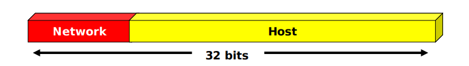

<h1> Introduccion <h1>


<h2>Direcciones IP</h2>

<div  style = "background-color:#066694; color:white; padding:10px; border-radius: 5px">
Las direcciones de red identifican unívocamente cada computador.
<br>
Cada direccíon IP esta conformanda por 32 bits agrupados en 4 conjuntos de 8 bits cada uno <strong>(octectos).</strong>
</div>
<br>

<center>

</center>


<div  style = "background-color:#066694; color:white; padding:10px; border-radius: 5px">
Cada dirección IP tiene dos elementos:
<ul>    
    <li>La dirección de red</li>
    <li>La dirección del host</li>
<ul>
</div>
<br>




<div  style = "background-color:#066694; color:white; padding:10px; border-radius: 5px">
La notación decimal es una forma sencilla de representar una dirección IP
</div>


<div  style = "background-color:#066694; color:white; padding:10px; border-radius: 5px">
Podemos clasificar las redes según su dirección IP
</div>


<div  style = "background-color:#066694; color:white; padding:10px; border-radius: 5px">
Direcciones IP Públicas y Privadas
<ul>    
    <li>Las IP públicas pueden ser alcanzadas desde Internet</li>
    <li>Las IP privadas no</li>
<ul>
</div>

```bash

10.0.0.0/8        10.0.0.0    - 10.255.255.255 (16,777,216)
172.16.0.0/12     172.16.0.0  - 172.31.255.255 (1,048,576)
192.168.0.0/16    192.168.0.0 - 192.168.255.255 (65,536)
169.254.0.0/16    169.254.0.0 - 169.254.255.255 (65,536)
```
<div  style = "background-color:#066694; color:white; padding:10px; border-radius: 5px">
Algunas veces es necesario dividir una red en varias sub redes. Una de las razones es reducir el dominio de broadcast de la capa dos.
Para esto, se crea otro elemento dentro de una IP (subnet) utilizando una máscara de sub red (subnetmask).
</div>
<br>


<div  style = "background-color:#066694; color:white; padding:10px; border-radius: 5px">
Para esto el administrador de red presta bits de la porción de host para asignarlos a la sub red
</div>

<div  style = "background-color:#066694; color:white; padding:10px; border-radius: 5px">
Máscara de Red
<ul>
<li>Una máscara de red es un número de 32 bits que se utiliza para determinar cual es la porción de red y cual es la porción de host de una dirección
IP. Esta contiene 1s en la porción de red y sub red y 0s en la porción del host.</li>
</ul>
</div>


<div  style = "background-color:#066694; color:white; padding:10px; border-radius: 5px">
La máscara de red define el número de direcciones (rango de IPs) que podemos utilizar
</div>

<br>

```bash
192.168.1.0
192.168.1.1
.
.
.
192.168.1.255
```
<br>

```bash
#1s     Notación Binaria               #Ips     #Clases C
/30 11111111.11111111.11111111.11111100 4
/29 11111111.11111111.11111111.11111000 8
/28 11111111.11111111.11111111.11110000 16
/27 11111111.11111111.11111111.11100000 32
/26 11111111.11111111.11111111.11000000 64        1/4
/25 11111111.11111111.11111111.10000000 128       1/2
/24 11111111.11111111.11111111.00000000 256       1
/23 11111111.11111111.11111110.00000000 512       2
/22 11111111.11111111.11111100.00000000 1024      4
/21 11111111.11111111.11111000.00000000 2048      8
/20 11111111.11111111.11110000.00000000 4096      16
```
<br>

```bash
# 1s Notación Decimal. #Ips  #Clases C
/30 255.255.255.252     4
/29 255.255.255.248     8
/28 255.255.255.240     16     1/16
/27 255.255.255.224     32     1/8
/26 255.255.255.192     64     1/4
/25 255.255.255.128     128    1/2
/24 255.255.255.0       256      1
/23 255.255.254.0       512      2
/22 255.255.252.0       1024     4
/21 255.255.248.0       2048     8
/20 255.255.240.0       4096     16
```
<br>

<div  style = "background-color:#066694; color:white; padding:10px; border-radius: 5px">
Para definir una subred a partir de un rango de direcciones IP debemos especificar cuatro elementos:
    <ul>
        <li>La dirección de la red (primera dirección)</li>
        <li>La máscara de la red</li>    
        <li>El número de direcciones utilizables</li>
        <li>La dirección de difusión o broadcast (última dirección)</li>
    </ul>
</div>

<br>

<div  style = "background-color:#066694; color:white; padding:10px; border-radius: 5px">
Dadas la IP de un host y su máscara se puede conocer la dirección de la red a través de una operación AND entre las éstas.
</div>

<br>

```bash
192.168.0.193       11000000.10101000.00000000. 11000001
255.255.255.0 = 24  11111111.11111111.11111111. 00000000
192.168.0.0/24      11000000.10101000.00000000. 00000000
```

<h3>Capa de Red</h3>


<div  style = "background-color:#066694; color:white; padding:10px; border-radius: 5px">
    <ul>
        <li>Ruta: instrucción o indicación para llegar a una red remota</li>
        <li>Tabla mínima de enrutamiento</li>
        <li>Rutas estáticas</li>    
        <li>Rutas dinámicas</li>
    </ul>
 </ul>
 </div>

<br> 

<div  style = "background-color:#066694; color:white; padding:10px; border-radius: 5px">
Una ruta está conformada por los siguientes elementos:
<ul>
    <li>La dirección de la red destino</li>
    <li>La máscara de la red destino</li>
    <li>La interfaz de red por donde deben retransmitirse los paquetes</li>
    <li>La dirección IP del router adyacente</li>
    <li>El número de router que hay que atravesar para llegar a la red destino (saltos)</li>
</ul>
</div>