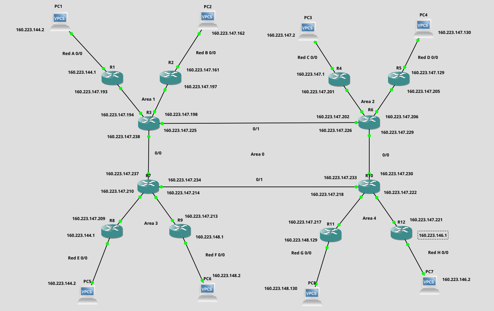

<h1> Parcial 1</h1>

<h2> Redes por definir </h2>

* Network: 160.223.144.0/20
    * **Red A:** 221
    * **Red B:** 17
    * **Red C:** 112
    * **Red D:** 98
    * **Red E:** 245
    * **Red F:** 84
    * **Red G:** 27
    * **Red H:** 192


160.223.144.0/20


 | Red  | Solicitud de Host  | Host Encontrados  | Direccion de Red  | Mask  | Mascara  | Primera IP utilizable  | Ultima IP utilizable  | Direccion de Broadcast |
|---|---|---|---|---|---|---|---|---|
| E | 245  | 254  | 160.223.144.0  | /24  | 255.255.255.0  | 160.223.144.1  | 160.223.144.254  | 160.223.144.255   |
| A | 221  | 254  | 160.223.145.0  | /24  | 255.255.255.0  | 160.223.145.1  | 160.223.145.254  | 160.223.145.255   |
| H | 192  | 254  | 160.223.146.0  | /24  | 255.255.255.0  | 160.223.146.1  | 160.223.146.254  | 160.223.146.255   |
| C | 112  | 126  | 160.223.147.0  | /25  | 255.255.255.128  | 160.223.147.1 | 160.223.147.126 |  160.223.147.127  |    
| D | 98 | 126  |  160.223.147.128 | /25  | 255.255.255.128  | 160.223.147.129  | 160.223.147.254  | 160.223.147.255 |
| F | 84 | 126  | 160.223.148.0  | /25  | 255.255.255.128  | 160.223.148.1  | 160.223.148.126  |  160.223.148.127 |
| G | 27 | 30  | 160.223.148.128  | /27   | 255.255.255.224  | 160.223.148.129  | 160.223.148.158  | 160.223.147.159   |
| B | 17 | 30  | 160.223.147.160  | /27  | 255.255.255.224  | 160.223.147.161  | 160.223.147.190  | 160.223.147.191  |
| Enlace A | 2 | 2  | 160.223.147.192  | /30  | 255.255.252  | 160.223.147.193  | 160.223.147.194 | 160.223.147.195  |
| Enlace B | 2 | 2  | 160.223.147.196 | /30  | 255.255.252  | 160.223.147.197  | 160.223.147.198  | 160.223.147.199  |
| Enlace C | 2 | 2  | 160.223.147.200  | /30 | 255.255.252  | 160.223.147.201  | 160.223.147.202  | 160.223.147.203  |
| Enlace D | 2 | 2  | 160.223.147.204  | /30  | 255.255.252   | 160.223.147.205 | 160.223.147.206  | 160.223.147.207 |
| Enlace E | 2 | 2  | 160.223.147.208  | /30  | 255.255.252  | 160.223.147.209   | 160.223.147.210  | 160.223.147.211 |
| Enlace F | 2 | 2  | 160.223.147.212  | /30  | 255.255.252  | 160.223.147.213   | 160.223.147.214  | 160.223.147.215 |
| Enlace G | 2 | 2  | 160.223.147.216  | /30  | 255.255.252  | 160.223.147.217  | 160.223.147.218  | 160.223.147.219  |
| Enlace H | 2 | 2  | 160.223.147.220  | /30  | 255.255.252  | 160.223.147.221   | 160.223.147.222  | 160.223.147.223  |
| Enlace 1 | 2 | 2  | 160.223.147.224  | /30  | 255.255.252  | 160.223.147.225   | 160.223.147.226  | 160.223.147.227  |
| Enlace 2 | 2 | 2  | 160.223.147.228  | /30  | 255.255.252  | 160.223.147.229   | 160.223.147.230   | 160.223.147.231 |
| Enlace 3 | 2 | 2  | 160.223.147.232  | /30  | 255.255.252  | 160.223.147.233  | 160.223.147.234  |  160.223.147.235  |
| Enlace 4 | 2 | 2  | 160.223.147.236  | /30  | 255.255.252  | 160.223.147.237  | 160.223.147.238  |  160.223.147.239  |




<h3>1) Configuración De Los PCs</h3>


Primero Asignamos las ip a los PCs de cada red:

* PC Red A

```bash
ip 160.223.144.2 255.255.255.0 160.223.144.1
save 
show
```
* PC Red B

```bash
ip 160.223.147.162 255.255.255.224 160.223.147.161
save 
show
```
* PC Red C

```bash
ip 160.223.147.2 255.255.255.128 160.223.147.1
save 
show
```

* PC Red D

```bash
ip 160.223.147.130 255.255.255.128 160.223.147.129
save 
show
```
* PC Red E

```bash
ip  160.223.144.2 255.255.255.0 160.223.144.1
save 
show
```
* PC Red F

```bash
ip 160.223.148.2 255.255.255.128 160.223.148.1
save 
show
```

* PC Red G

```bash
ip  160.223.148.130 255.255.255.224  160.223.148.129
save 
show
```
* PC Red H160.223.148.1

```bash
ip 160.223.146.2 255.255.255.0 160.223.146.1
save 
show
```

<h3>2.1) Configuración Del Enrutador 1</h3>

Para configurar el router 1 ejecute los siguientes comandos en la cónsola del mismo

```bash
enable
configure terminal
interface FastEthernet 0/1
ip address 160.223.147.193  255.255.255.252
no shutdown
exit
interface fastEthernet 0/0
ip address 160.223.144.1 255.255.255.0
no shutdown
exit160.223.147.217 
end
wr
show ip interface brief
```

<h3>2.2) Configuración Del Enrutador 2</h3>

Para configurar el router 2 ejecute los siguientes comandos en la cónsola del mismo

```bash
enable
configure terminal
interface FastEthernet 0/1
ip address 160.223.147.197 255.255.255.252
no shutdown
exit
interface fastEthernet 0/0
ip address 160.223.147.161 255.255.255.224
no shutdown
exit
end
wr
show ip interface brief
```

<h3>2.3) Configuración Del Enrutador 3</h3>

Para configurar el router 3 ejecute los siguientes comandos en la cónsola del mismo

```bash
enable
configure terminal

interface fastEthernet 0/0
ip address 160.223.147.238 255.255.255.252
no shutdown
exit
interface FastEthernet 0/1
ip address 160.223.147.225 255.255.255.252
no shutdown
exit
interface FastEthernet 1/0
ip address 160.223.147.194 255.255.255.252
no switchport
no shutdown
exit
interface fastEthernet 1/1
no switchport
ip address 160.223.147.198  255.255.255.252
no shutdown
exit
end
wr
show ip interface brief
```

<h3>2.4) Configuración Del Enrutador 4</h3>

Para configurar el router 4 ejecute los siguientes comandos en la cónsola del mismo

```bash
enable
configure terminal
interface FastEthernet 0/1
ip address 160.223.147.201  255.255.255.252
no shutdown
exit
interface fastEthernet 0/0
ip address 160.223.147.1 255.255.255.128
no shutdown
exit
end
wr
show ip interface brief
```

<h3>2.5) Configuración Del Enrutador 5</h3>

Para configurar el router 5 ejecute los siguientes comandos en la cónsola del mismo

```bash
enable
configure terminal
interface FastEthernet 0/1
ip address 160.223.147.205  255.255.255.252
no shutdown
exit
interface fastEthernet 0/0
ip address 160.223.147.129 255.255.255.128
no shutdown
exit
end
wr
show ip interface brief
```

<h3>2.6) Configuración Del Enrutador 6</h3>

Para configurar el router 6 ejecute los siguientes comandos en la cónsola del mismo

```bash
enable
configure terminal

interface fastEthernet 0/0
ip address 160.223.147.229 255.255.255.252
no shutdown
exit
interface FastEthernet 0/1
ip address 160.223.147.226 255.255.255.252
no shutdown
exit
interface FastEthernet 1/0
ip address 160.223.147.202 255.255.255.252
no switchport
no shutdown
exit
interface fastEthernet 1/1
no switchport
ip address 160.223.147.206  255.255.255.252
no shutdown
exit
end
wr
show ip interface brief
```
<h3>2.7) Configuración Del Enrutador 7</h3>

Para configurar el router 7 ejecute los siguientes comandos en la cónsola del mismo

```bash
enable
configure terminal

interface fastEthernet 0/0
ip address 160.223.147.237 255.255.255.252
no shutdown
exit
interface FastEthernet 0/1
ip address 160.223.147.234 255.255.255.252
no shutdown
exit
interface FastEthernet 1/0
ip address 160.223.147.210 255.255.255.252
no switchport
no shutdown
exit
interface fastEthernet 1/1
no switchport
ip address 160.223.147.214  255.255.255.252
no shutdown
exit
end
wr
show ip interface brief
```

<h3>2.8) Configuración Del Enrutador 8</h3>

Para configurar el router 8 ejecute los siguientes comandos en la cónsola del mismo

```bash
enable
configure terminal
interface FastEthernet 0/1
ip address 160.223.147.209  255.255.255.252
no shutdown
exit
interface fastEthernet 0/0
ip address  160.223.144.1 255.255.255.0
no shutdown
exit
end
wr
show ip interface brief
```

<h3>2.9) Configuración Del Enrutador 9</h3>

Para configurar el router 9 ejecute los siguientes comandos en la cónsola del mismo

```bash
enable
configure terminal
interface FastEthernet 0/1
ip address 160.223.148.1  255.255.255.252
no shutdown
exit
interface fastEthernet 0/0
ip address  160.223.147.213 255.255.255..128 
no shutdown
exit
end
wr
show ip interface brief
```

<h3>2.10) Configuración Del Enrutador 10</h3>

Para configurar el router 10 ejecute los siguientes comandos en la cónsola del mismo

```bash
enable
configure terminal

interface fastEthernet 0/0
ip address 160.223.147.230 255.255.255.252
no shutdown
exit
interface FastEthernet 0/1
ip address 160.223.147.233 255.255.255.252
no shutdown
exit
interface FastEthernet 1/0
ip address 160.223.147.218 255.255.255.252
no switchport
no shutdown
exit
interface fastEthernet 1/1
no switchport
ip address 160.223.147.222  255.255.255.252
no shutdown
exit
end
wr
show ip interface brief
```

<h3>2.11) Configuración Del Enrutador 11</h3>

Para configurar el router 11 ejecute los siguientes comandos en la cónsola del mismo

```bash
enable
configure terminal
interface FastEthernet 0/1
ip address 160.223.147.217  255.255.255.252
no shutdown
exit
interface fastEthernet 0/0
ip address  160.223.148.129 255.255.255.224 
no shutdown
exit
end
wr
show ip interface brief
```

<h3>2.12) Configuración Del Enrutador 12</h3>

Para configurar el router 12 ejecute los siguientes comandos en la cónsola del mismo

```bash
enable
configure terminal
interface FastEthernet 0/1
ip address 160.223.147.221 255.255.255.252
no shutdown
exit
interface fastEthernet 0/0
ip address  160.223.146.1 255.255.255.0
no shutdown
exit
end
wr
show ip interface brief
```
* <h3>3) Configuración del Protocolo OSPF</h3>

    * <h4>3.1) Configuración del Enrutador 1</h4>

    Ejecute los siguientes comandos en el enrutador 1


    ```bash
    configure terminal
    router ospf 1
    network 160.223.147.193  0.0.0.3 area 1
    network 160.223.144.1 0.0.0.255 area 1
    end
    ```
   * <h4>3.2) Configuración del Enrutador 2</h4>

    Ejecute los siguientes comandos en el enrutador 2


    ```bash
    configure terminal
    router ospf 1
    network 160.223.147.197   0.0.0.3 area 1
    network 160.223.147.161   0.0.0.31 area 1
    end
    ```

    * <h3>3.3) Configuración del Router 3</h3>

    Ejecute los siguientes comandos en el enrutador 3


    ```bash
    configure terminal
    router ospf 1
    network 160.223.147.194 0.0.0.3 area 1
    network 160.223.147.198  0.0.0.3 area 1
    network 160.223.147.238 0.0.0.3 area 0
    network 160.223.147.225 0.0.0.3 area 0
    end
    ```

    * <h4>3.4) Configuración del Enrutador 4</h4>

    Ejecute los siguientes comandos en el enrutador 4


    ```bash
    configure terminal
    router ospf 1
    network 160.223.147.201 0.0.0.3 area 2
    network 160.223.147.1  0.0.0.127 area 2
    end
    ```

     * <h4>3.5) Configuración del Enrutador 5</h4>

    Ejecute los siguientes comandos en el enrutador 5


    ```bash
    configure terminal
    router ospf 1
    network 160.223.147.129 0.0.0.3 area 2
    network 160.223.147.205  0.0.0.127 area 2
    end
    ```

    * <h3>3.6) Configuración del Router 6</h3>

    Ejecute los siguientes comandos en el enrutador 6


    ```bash
    configure terminal
    router ospf 1
    network 160.223.147.202 0.0.0.3 area 2
    network 160.223.147.206  0.0.0.3 area 2
    network 160.223.147.226 0.0.0.3 area 0
    network 160.223.147.229 0.0.0.3 area 0
    end
    ```

   
    * <h3>3.7) Configuración del Router 7</h3>

    Ejecute los siguientes comandos en el enrutador 7


    ```bash
    configure terminal
    router ospf 1
    network 160.223.147.237 0.0.0.3 area 0
    network 160.223.147.234  0.0.0.3 area 0
    network 160.223.147.210 0.0.0.3 area 3
    network 160.223.147.214 0.0.0.3 area 3
    end
    ```

     * <h4>3.8) Configuración del Enrutador 8</h4>

    Ejecute los siguientes comandos en el enrutador 8


    ```bash
    configure terminal
    router ospf 1
    network 160.223.147.209 0.0.0.3 area 3
    network  160.223.144.1  0.0.0.255 area 3
    end
    ```

     * <h4>3.9) Configuración del Enrutador 9</h4>

    Ejecute los siguientes comandos en el enrutador 9


    ```bash
    configure terminal
    router ospf 1
    network 160.223.147.213 0.0.0.3 area 3
    network  160.223.148.1  0.0.0.127 area 3
    end
    ```

    * <h3>3.10) Configuración del Router 10</h3>

    Ejecute los siguientes comandos en el enrutador 10


    ```bash
    configure terminal
    router ospf 1
    network 160.223.147.233 0.0.0.3 area 0
    network 160.223.147.230  0.0.0.3 area 0
    network 160.223.147.218 0.0.0.3 area 4
    network 160.223.147.222 0.0.0.3 area 4
    end
    ```

     * <h4>3.9) Configuración del Enrutador 9</h4>

    Ejecute los siguientes comandos en el enrutador 9


    ```bash
    configure terminal
    router ospf 1
    network 160.223.147.217 0.0.0.3 area 4
    network  160.223.148.129  0.0.0.31 area 4
    end
    ```


   * <h4>3.9) Configuración del Enrutador 9</h4>

    Ejecute los siguientes comandos en el enrutador 9


    ```bash
    configure terminal
    router ospf 1
    network 160.223.147.221 area 4
    network  160.223.146.1  0.0.0.255 area 4
    end
    ```

<h3> 4) Verificación de las conexiones </h3>
Para verificar el funcionamiento de la topología y la creación de las rutas dinámicas podemos ejecutar los siguientes comandos

```bash
show ip ospf
show ip route
```