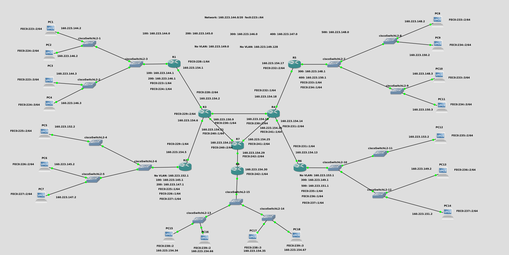

<h1> Parcial 2</h1>

<h2> Redes por definir </h2>

* Network: 160.223.144.0/20

    * 100: 160.223.144.0
    * 100: 160.223.145.0
    * 200: 160.223.146.0
    * 200: 160.223.147.0
    * 300: 160.223.148.0
    * 300: 160.223.149.0
    * 400:160.223.150.0
    * 500:160.223.151.0
    * No Vlan: 160.223.152.0
    * No Vlan: 160.223.153.0

 

 | Red  | Solicitud de Host  | Host Encontrados  | Direccion de Red  | Mask  | Mascara  | Primera IP utilizable  | Ultima IP utilizable  | Direccion de Broadcast |
|---|---|---|---|---|---|---|---|---|
| 100 | 254  | 254  | 160.223.144.0  | /24  | 255.255.255.0  | 160.223.144.1  | 160.223.144.254  | 160.223.144.255   |
| 100 | 254  | 254  | 160.223.145.0  | /24  | 255.255.255.0  | 160.223.145.1  | 160.223.145.254  | 160.223.145.255   |
| 200 | 254  | 254  | 160.223.146.0  | /24  | 255.255.255.0  | 160.223.146.1  | 160.223.146.254  | 160.223.146.255   |
| 200 | 254  | 254  | 160.223.147.0  | /24  | 255.255.255.0  | 160.223.147.1  | 160.223.147.254  | 160.223.147.255   |
| 300 | 254  | 254  | 160.223.148.0  | /24  | 255.255.255.0  | 160.223.148.1  | 160.223.148.254  | 160.223.148.255   |
| 300 | 254  | 254  | 160.223.149.0  | /24  | 255.255.255.0  | 160.223.149.1  | 160.223.149.254  | 160.223.149.255   |
| 400 | 254  | 254  | 160.223.150.0  | /24  | 255.255.255.0  | 160.223.150.1  | 160.223.150.254  | 160.223.150.255   |
| 500 | 254  | 254  | 160.223.151.0  | /24  | 255.255.255.0  | 160.223.151.1  | 160.223.151.254  | 160.223.151.255   |
| No Vlan | 254  | 254  | 160.223.152.0  | /24  | 255.255.255.0  | 160.223.152.1  | 160.223.152.254  | 160.223.152.255   |
| No Vlan | 254  | 254  | 160.223.153.0  | /24  | 255.255.255.0  | 160.223.153.1  | 160.223.153.254  | 160.223.153.255   |
| Enlace A | 2 | 2  | 160.223.154.0  | /30  | 255.255.252  | 160.223.154.191  | 160.223.154.192 | 160.223.154.3  |
| Enlace B | 2 | 2  | 160.223.154.4 | /30  | 255.255.252  | 160.223.154.5 | 160.223.154.6  | 160.223.154.7  |
| Enlace C | 2 | 2  | 160.223.154.8  | /30 | 255.255.252  | 160.223.154.9  | 160.223.154.10  | 160.223.154.11  |
| Enlace D | 2 | 2  | 160.223.154.12  | /30  | 255.255.252   | 160.223.154.13 | 160.223.154.14  | 160.223.154.15 |
| Enlace E | 2 | 2  | 160.223.154.16  | /30  | 255.255.252  | 160.223.154.17   | 160.223.154.18  | 160.223.154.19 |
| Enlace F | 2 | 2  | 160.223.154.20  | /30  | 255.255.252   | 160.223.154.21 | 160.223.154.22  | 160.223.154.23 |
| Enlace G | 2 | 2  | 160.223.154.24  | /30  | 255.255.252  | 160.223.154.25  | 160.223.154.26  | 160.223.154.27 |
| Enlace H | 2 | 2  | 160.223.154.28  | /30  | 255.255.252  | 160.223.154.29  | 160.223.154.30  | 160.223.154.31 |
| 600 | 30 | 30 | 160.223.154.32  | /27  | 255.255.252   | 160.223.154.33| 160.223.154.62  | 160.223.154.63 |
| 700 | 30 | 30 | 160.223.154.64  | /27  | 255.255.252  | 160.223.154.65  | 160.223.154.94  | 160.223.154.95 |

<h3>1) Configuración De Los PCs</h3>


Primero Asignamos las ip a los PCs de cada red:

* PC 1

```bash
ip 160.223.144.2 255.255.255.0 160.223.144.1
save 
show
```

* PC 2

```bash
ip 160.223.146.2 255.255.255.0 160.223.146.1
save 
show
```

* PC 3

```bash
ip 160.223.144.3 255.255.255.0 160.223.144.1
save 
show
```

* PC 4

```bash
ip 160.223.146.3 255.255.255.0 160.223.146.1
save 
show
```

* PC 5

```bash
ip 160.223.152.2 255.255.255.0 160.223.152.1
save 
show
```
* PC 6

```bash
ip 160.223.145.2 255.255.255.0 160.223.145.1
save 
show
```
* PC 7

```bash
ip 160.223.147.2 255.255.255.0 160.223.147.1
save 
show
```

* PC 8

```bash
ip 160.223.148.2 255.255.255.0 160.223.148.1
save 
show
```

* PC 9

```bash
ip 160.223.150.2 255.255.255.0 160.223.150.1
save 
show
```


* PC 10

```bash
ip 160.223.148.3 255.255.255.0 160.223.148.1
save 
show
```

* PC 11

```bash
ip 160.223.150.3 255.255.255.0 160.223.150.1
save 
show
```


* PC 12

```bash
ip 160.223.153.2 255.255.255.0 160.223.153.1
save 
show
```

* PC 13

```bash
ip 160.223.149.2 255.255.255.0 160.223.149.1
save 
show
```

* PC 14

```bash
ip 160.223.151.2 255.255.255.0 160.223.151.1
save 
show
```
* PC 15

```bash
ip 160.223.154.34 255.255.255.224 160.223.154.33
save 
show
```

* PC 16

```bash
ip 160.223.154.66 255.255.255.224 160.223.154.65
save 
show
```

* PC 17

```bash
ip 160.223.154.35 255.255.255.224 160.223.154.33
save 
show
```

* PC 18

```bash
ip 160.223.154.67 255.255.255.224 160.223.154.65
save 
show
```

* <h3>2) Configuración De Enrutadores </h3>

    * <h3>2.1) Configuración Del Enrutador 1</h3>

Para configurar el router 1 ejecute los siguientes comandos en la cónsola del mismo

```bash
enable
configure terminal
interface FastEthernet 0/0
ip address 160.223.154.1  255.255.255.252
no shutdown
exit
interface fastEthernet 0/1.100
encapsulation dot1q 100
ip address 160.223.144.1 255.255.255.0
no shutdown
exit
interface fastEthernet 0/1.200
encapsulation dot1q 200
ip address 160.223.146.1 255.255.255.0
no shutdown
exit
end
wr
show ip interface brief
```

   * <h3>2.2) Configuración Del Enrutador 2</h3>

Para configurar el router 2 ejecute los siguientes comandos en la cónsola del mismo

```bash
enable
configure terminal
interface FastEthernet 0/0
ip address 160.223.154.5  255.255.255.252
no shutdown
exit

interface fastEthernet 0/1
ip address 160.223.152.1 255.255.255.0
no shutdown
exit
interface fastEthernet 0/1.100
encapsulation dot1q 100
ip address 160.223.145.1 255.255.255.0
no shutdown
exit
interface fastEthernet 0/1.200
encapsulation dot1q 200
ip address 160.223.147.1 255.255.255.0
no shutdown
exit
end
wr
show ip interface brief
```
   * <h3>2.3) Configuración Del Enrutador 3</h3>

Para configurar el router 3 ejecute los siguientes comandos en la cónsola del mismo

```bash
enable
configure terminal
interface FastEthernet 0/1
ip address 160.223.154.2  255.255.255.252
no shutdown
exit
interface fastEthernet 1/0
no switchport
ip address 160.223.154.6 255.255.255.252
no shutdown
exit
interface fastEthernet 0/0
ip address 160.223.154.9 255.255.255.252
no shutdown
exit
interface fastEthernet 1/1
no switchport
ip address 160.223.154.21 255.255.255.252
no shutdown
exit
end
wr
show ip interface brief
```

   * <h3>2.4) Configuración Del Enrutador 4</h3>

Para configurar el router  4 ejecute los siguientes comandos en la cónsola del mismo

```bash
enable
configure terminal
interface FastEthernet 0/1
ip address 160.223.154.18  255.255.255.252
no shutdown
exit
interface fastEthernet 1/0
no switchport
ip address 160.223.154.14 255.255.255.252
no shutdown
exit
interface fastEthernet 0/0
ip address 160.223.154.10 255.255.255.252
no shutdown
exit
interface fastEthernet 1/1
no switchport
ip address 160.223.154.26 255.255.255.252
no shutdown
exit
end
wr
show ip interface brief
```

   * <h3>2.5) Configuración Del Enrutador 5</h3>

Para configurar el router 5 ejecute los siguientes comandos en la cónsola del mismo

```bash
enable
configure terminal
interface FastEthernet 0/0
ip address 160.223.154.17  255.255.255.252
no shutdown
exit
interface fastEthernet 0/1.300
encapsulation dot1q 300
ip address 160.223.148.1 255.255.255.0
no shutdown
exit
interface fastEthernet 0/1.400
encapsulation dot1q 400
ip address 160.223.150.1 255.255.255.0
no shutdown
exit
end
wr
show ip interface brief
```

   * <h3>2.6) Configuración Del Enrutador 6</h3>

Para configurar el router 6 ejecute los siguientes comandos en la cónsola del mismo

```bash
enable
configure terminal
interface FastEthernet 0/0
ip address 160.223.154.13  255.255.255.252
no shutdown
exit
interface fastEthernet 0/1
ip address 160.223.153.1 255.255.255.0
no shutdown
exit
interface fastEthernet 0/1.300
encapsulation dot1q 300
ip address 160.223.149.1 255.255.255.0
no shutdown
exit
interface fastEthernet 0/1.500
encapsulation dot1q 500
ip address 160.223.151.1 255.255.255.0
no shutdown
exit
end
wr
show ip interface brief
```

   * <h3>2.4) Configuración Del Enrutador 7</h3>

Para configurar el router  7 ejecute los siguientes comandos en la cónsola del mismo

```bash
enable
configure terminal
interface fastEthernet 0/0
ip address 160.223.154.25 255.255.255.252
no shutdown
exit
interface FastEthernet 0/1
ip address 160.223.154.29  255.255.255.252
no shutdown
exit
interface fastEthernet 1/0
no switchport
ip address 160.223.154.22 255.255.255.252
no shutdown
exit
end
wr
show ip interface brief
```
   * <h3>2.4) Configuración Del Enrutador 8</h3>

Para configurar el router  8 ejecute los siguientes comandos en la cónsola del mismo

```bash
enable
configure terminal
interface fastEthernet 0/0
ip address 160.223.154.30 255.255.255.252
no shutdown
exit
interface fastEthernet 0/1.600
encapsulation dot1q 600
ip address 160.223.154.33 255.255.255.224
no shutdown
exit
interface fastEthernet 0/1.700
encapsulation dot1q 700
ip address 160.223.154.65 255.255.255.224
no shutdown
exit
end
wr
show ip interface brief
```

* <h3>3) Configuración del Protocolo OSPF</h3>

    * <h4>3.1) Configuración del Enrutador 1</h4>

    Ejecute los siguientes comandos en el enrutador 1


    ```bash
    configure terminal
    router ospf 1
    network 160.223.144.0  0.0.0.255 area 1
    network 160.223.146.0 0.0.0.255 area 1
    network 160.223.154.0 0.0.0.3 area 0
    end
    ```
    
    * <h4>3.2) Configuración del Enrutador 2</h4>

    Ejecute los siguientes comandos en el enrutador 2


    ```bash
    configure terminal
    router ospf 1
    network 160.223.145.0  0.0.0.255 area 2
    network 160.223.147.0 0.0.0.255 area 2
    network 160.223.152.0 0.0.0.255 area 2
    network 160.223.154.4 0.0.0.3 area 0
    end
    ```
   
    * <h4>3.3) Configuración del Enrutador 3</h4>

    Ejecute los siguientes comandos en el enrutador 3


    ```bash
    configure terminal
    router ospf 1
    network 160.223.154.0 0.0.0.3 area 0
    network 160.223.154.4 0.0.0.3 area 0
    network 160.223.154.8 0.0.0.3 area 0
    network 160.223.154.20 0.0.0.3 area 0
    end
    ```
    
    * <h4>3.4) Configuración del Enrutador 4</h4>

    Ejecute los siguientes comandos en el enrutador 4


    ```bash
    configure terminal
    router ospf 1
    network 160.223.154.8 0.0.0.3 area 0
    network 160.223.154.12 0.0.0.3 area 0
    network 160.223.154.16 0.0.0.3 area 0
    network 160.223.154.24 0.0.0.3 area 0
    end
    ```
    
    * <h4>3.5) Configuración del Enrutador 5</h4>

    Ejecute los siguientes comandos en el enrutador 5


    ```bash
    configure terminal
    router ospf 1
    network 160.223.148.0 0.0.0.255 area 3
    network 160.223.150.0 0.0.0.255 area 3
    network 160.223.154.16 0.0.0.3 area 0
    end
    ```
    * <h4>3.6) Configuración del Enrutador 6</h4>

    Ejecute los siguientes comandos en el enrutador 6


    ```bash
    configure terminal
    router ospf 1
    network 160.223.149.0 0.0.0.255 area 4
    network 160.223.151.0 0.0.0.255 area 4
    network 160.223.153.0 0.0.0.255 area 4
    network 160.223.154.12 0.0.0.3 area 0
    end
    ```
    * <h4>3.7) Configuración del Enrutador 7</h4>

    Ejecute los siguientes comandos en el enrutador 7


    ```bash
    configure terminal
    router ospf 1
    network 160.223.154.20 0.0.0.3 area 0
    network 160.223.154.24 0.0.0.3 area 0
    network 160.223.154.28 0.0.0.3 area 0
    end
    ```
    * <h4>3.8) Configuración del Enrutador 8</h4>

    Ejecute los siguientes comandos en el enrutador 8


    ```bash
    configure terminal
    router ospf 1
    network 160.223.154.28 0.0.0.3 area 0
    network 160.223.154.32 0.0.0.31 area 5
    network 160.223.154.64 0.0.0.31 area 5
    end
    ```
    
* <h3>4) Configurar las VLANs en el Switch</h3>

Encienda el switch, abra una consola y ejecute los siguientes comandos

* <h3> Configurar las VLANs en el Switch 1,2,3</h3>

```bash
enable 
configure terminal
vlan 100
name students
vlan 200
name professors
exit
```
* <h3> Configurar las VLANs en el Switch 4,5</h3>


```bash
enable 
configure terminal
vlan 100
name students
vlan 200
name professors
exit
```
* <h3> Configurar las VLANs en el Switch 7,8,9</h3>


```bash
enable 
configure terminal
vlan 300
name visits
vlan 400
name secretary
exit
```
* <h3> Configurar las VLANs en el Switch 10,12</h3>


```bash
enable 
configure terminal
vlan 300
name visits
vlan 500
name laboratory
exit
```
* <h3> Configurar las VLANs en el Switch 13,14,15</h3>


```bash
enable 
configure terminal
vlan 600
name visits
vlan 700
name laboratory
exit
```
   * <h3>4.1) Asignar los puertos de la switch 1</h3>

```bash
configure terminal
interface GigabitEthernet 0/0
switchport mode access
switchport access vlan 100
exit
interface GigabitEthernet 0/1
switchport mode access
switchport access vlan 200
exit
```
   * <h3>4.2) Asignar los puertos de la switch 2</h3>

```bash
configure terminal
interface GigabitEthernet 0/0
switchport mode access
switchport access vlan 100
exit
interface GigabitEthernet 0/1
switchport mode access
switchport access vlan 200
exit
```
   * <h3>4.3) Asignar los puertos de la switch 5</h3>

```bash
configure terminal
interface GigabitEthernet 0/0
switchport mode access
switchport access vlan 100
exit
interface GigabitEthernet 0/1
switchport mode access
switchport access vlan 200
exit
```
   * <h3>4.4) Asignar los puertos de la switch 8</h3>

```bash
configure terminal
interface GigabitEthernet 0/0
switchport mode access
switchport access vlan 300
exit
interface GigabitEthernet 0/1
switchport mode access
switchport access vlan 400
exit
```
   * <h3>4.5) Asignar los puertos de la switch 9</h3>

```bash
configure terminal
interface GigabitEthernet 0/0
switchport mode access
switchport access vlan 300
exit
interface GigabitEthernet 0/1
switchport mode access
switchport access vlan 400
exit
```
   * <h3>4.6) Asignar los puertos de la switch 12</h3>

```bash
configure terminal
interface GigabitEthernet 0/0
switchport mode access
switchport access vlan 300
exit
interface GigabitEthernet 0/1
switchport mode access
switchport access vlan 500
exit
```
   * <h3>4.7) Asignar los puertos de la switch 13</h3>

```bash
configure terminal
interface GigabitEthernet 0/0
switchport mode access
switchport access vlan 600
exit
interface GigabitEthernet 0/1
switchport mode access
switchport access vlan 700
exit
```
   * <h3>4.8) Asignar los puertos de la switch 14</h3>

```bash
configure terminal
interface GigabitEthernet 0/0
switchport mode access
switchport access vlan 600
exit
interface GigabitEthernet 0/1
switchport mode access
switchport access vlan 700
exit
```

* <h3>5.1) Configurar el Canal Trunk del Switch 1 y 2</h3>

Ejecute los siguientes comandos en el switch 1 y 2

```bash
configure terminal
interface GigabitEthernet 0/2
switchport trunk encapsulation dot1q
switchport mode trunk
switchport trunk allowed vlan add 100,200
end
```

* <h3>5.2) Configurar el Canal Trunk del Switch 3</h3>

Ejecute los siguientes comandos en el switch 3

```bash
configure terminal
interface GigabitEthernet 0/0
switchport trunk encapsulation dot1q
switchport mode trunk
switchport trunk allowed vlan add 100,200
end
configure terminal
interface GigabitEthernet 0/1
switchport trunk encapsulation dot1q
switchport mode trunk
switchport trunk allowed vlan add 100,200
end
configure terminal
interface GigabitEthernet 0/2
switchport trunk encapsulation dot1q
switchport mode trunk
switchport trunk allowed vlan add 100,200
end
```
* <h3>5.3) Configurar el Canal Trunk del Switch 5  </h3>

Ejecute los siguientes comandos en el switch 5

```bash
configure terminal
interface GigabitEthernet 0/2
switchport trunk encapsulation dot1q
switchport mode trunk
switchport trunk allowed vlan add 100,200
end
```

* <h3>5.4) Configurar el Canal Trunk del Switch 6</h3>

Ejecute los siguientes comandos en el switch 6

```bash
configure terminal
interface GigabitEthernet 0/1
switchport trunk encapsulation dot1q
switchport mode trunk
switchport trunk allowed vlan add 100,200
end
configure terminal
interface GigabitEthernet 0/2
switchport trunk encapsulation dot1q
switchport mode trunk
switchport trunk allowed vlan add 100,200
end
```
* <h3>5.5) Configurar el Canal Trunk del Switch 7 </h3>

Ejecute los siguientes comandos en el switch 7

```bash
configure terminal
interface GigabitEthernet 0/0
switchport trunk encapsulation dot1q
switchport mode trunk
switchport trunk allowed vlan add 300,400
end
configure terminal
interface GigabitEthernet 0/1
switchport trunk encapsulation dot1q
switchport mode trunk
switchport trunk allowed vlan add 300,400
end
configure terminal
interface GigabitEthernet 0/2
switchport trunk encapsulation dot1q
switchport mode trunk
switchport trunk allowed vlan add 300,400
end
```

* <h3>5.6) Configurar el Canal Trunk del Switch 8 y 9</h3>

Ejecute los siguientes comandos en el switch 8 y 9

```bash
configure terminal
interface GigabitEthernet 0/2
switchport trunk encapsulation dot1q
switchport mode trunk
switchport trunk allowed vlan add 300,400
end
```

* <h3>5.7) Configurar el Canal Trunk del Switch 10</h3>

Ejecute los siguientes comandos en el switch 10

```bash
configure terminal
interface GigabitEthernet 0/1
switchport trunk encapsulation dot1q
switchport mode trunk
switchport trunk allowed vlan add 300,500
end
configure terminal
interface GigabitEthernet 0/2
switchport trunk encapsulation dot1q
switchport mode trunk
switchport trunk allowed vlan add 300,500
end
```

* <h3>5.8) Configurar el Canal Trunk del Switch 12 </h3>

Ejecute los siguientes comandos en el switch 12

```bash
configure terminal
interface GigabitEthernet 0/2
switchport trunk encapsulation dot1q
switchport mode trunk
switchport trunk allowed vlan add 300,500
end
```

* <h3>5.9) Configurar el Canal Trunk del Switch 13 y 14 </h3>

Ejecute los siguientes comandos en el switch 13 y 14

```bash
configure terminal
interface GigabitEthernet 0/2
switchport trunk encapsulation dot1q
switchport mode trunk
switchport trunk allowed vlan add 600,700
end
```
* <h3>5.10) Configurar el Canal Trunk del Switch 15 </h3>

Ejecute los siguientes comandos en el switch 15

```bash
configure terminal
interface GigabitEthernet 0/0
switchport trunk encapsulation dot1q
switchport mode trunk
switchport trunk allowed vlan add 600,700
end
configure terminal
interface GigabitEthernet 0/1
switchport trunk encapsulation dot1q
switchport mode trunk
switchport trunk allowed vlan add 600,700
end
configure terminal
interface GigabitEthernet 0/2
switchport trunk encapsulation dot1q
switchport mode trunk
switchport trunk allowed vlan add 600,700
end
```


<hr>

* <h3>IPV6</h3>

    * <h3>1.1) Configuracion del Erutador 1</h3>

para configurar el router 1 ejecute los siguientes comandos en la cónsola del mismo.

```bash
enable
configure terminal
interface fastethernet 0/0
ipv6 address FEC0:228::1/64
Ipv6 enable
no shutdown
exit

interface fastethernet 0/1.100
encapsulation dot1q 100
ipv6 add  FEC0:223::1/64
no shutdown
exit

interface fastethernet 0/1.200
encapsulation dot1q 200
ipv6 add FEC0:224::1/64
no shutdown
end

wr

show ipv6 interface brief
```

   * <h3>1.2) Configuracion del Erutador 2</h3>

para configurar el router 2 ejecute los siguientes comandos en la cónsola del mismo.

```bash
enable
configure terminal
interface fastethernet 0/0
ipv6 address FEC0:229::1/64
Ipv6 enable
no shutdown
exit

interface fastethernet 0/1
ipv6 add  FEC0:225::1/64
no shutdown
exit


interface fastethernet 0/1.100
encapsulation dot1q 100
ipv6 add  FEC0:226::1/64
no shutdown
exit

interface fastethernet 0/1.200
encapsulation dot1q 200
ipv6 add FEC0:227::1/64
no shutdown
end

wr

show ipv6 interface brief
```
   * <h3>1.3) Configuracion del Erutador 3</h3>

para configurar el router 3 ejecute los siguientes comandos en la cónsola del mismo.

```bash
enable
configure terminal
interface fastethernet 0/0
ipv6 address FEC0:230::1/64
Ipv6 enable
no shutdown
exit

interface fastethernet 0/1
ipv6 add  FEC0:228::2/64
no shutdown
exit


interface fastethernet 1/0
no switchport
ipv6 add  FEC0:229::2/64
no shutdown
exit

interface fastethernet 1/1
no switchport
ipv6 add  FEC0:240::1/64
no shutdown
exit
wr

show ipv6 interface brief
```

   * <h3>1.4) Configuracion del Erutador 4</h3>

para configurar el router 4 ejecute los siguientes comandos en la cónsola del mismo.

```bash
enable
configure terminal
interface fastethernet 0/0
ipv6 address FEC0:230::2/64
Ipv6 enable
no shutdown
exit

interface fastethernet 0/1
ipv6 add  FEC0:232::1/64
no shutdown
exit


interface fastethernet 1/0
no switchport
ipv6 add  FEC0:231::2/64
no shutdown
exit

interface fastethernet 1/1
no switchport
ipv6 add  FEC0:241::1/64
no shutdown
exit
wr

show ipv6 interface brief
```

   * <h3>1.5) Configuracion del Erutador 5</h3>

para configurar el router 5 ejecute los siguientes comandos en la cónsola del mismo.

```bash
enable
configure terminal
interface fastethernet 0/0
ipv6 address FEC0:232::2/64
Ipv6 enable
no shutdown
exit

interface fastethernet 0/1
no shutdown
exit


interface fastethernet 0/1.300
encapsulation dot1q 300
ipv6 add  FEC0:233::1/64
no shutdown
exit

interface fastethernet 0/1.400
encapsulation dot1q 400
ipv6 add FEC0:234::1/64
no shutdown

end

wr

show ipv6 interface brief
```


   * <h3>1.6) Configuracion del Erutador 6</h3>

para configurar el router 6 ejecute los siguientes comandos en la cónsola del mismo.

```bash
enable
configure terminal
interface fastethernet 0/0
ipv6 address FEC0:231::1/64
Ipv6 enable
no shutdown
exit

interface fastethernet 0/1
ipv6 add FEC0:235::1/64
no shutdown
exit


interface fastethernet 0/1.300
encapsulation dot1q 300
ipv6 add  FEC0:236::1/64
no shutdown
exit

interface fastethernet 0/1.500
encapsulation dot1q 500
ipv6 add FEC0:237::1/64
no shutdown

end

wr

show ipv6 interface brief

```
   * <h3>1.7) Configuracion del Erutador 7</h3>

para configurar el router 7 ejecute los siguientes comandos en la cónsola del mismo.

```bash
enable
configure terminal
interface fastethernet 0/0
ipv6 address FEC0:241::2/64
Ipv6 enable
no shutdown
exit

interface fastethernet 0/1
ipv6 add  FEC0:242::2/64
no shutdown
exit


interface fastethernet 1/0
no switchport
ipv6 add  FEC0:240::2/64
no shutdown
exit

end 

wr

show ipv6 interface brief
```

   * <h3>1.8) Configuracion del Erutador 8</h3>

para configurar el router 8 ejecute los siguientes comandos en la cónsola del mismo.

```bash
enable
configure terminal
interface fastethernet 0/0
ipv6 address FEC0:242::1/64
Ipv6 enable
no shutdown
exit

interface fastethernet 0/1
no shutdown
exit


interface fastethernet 0/1.600
encapsulation dot1q 600
ipv6 add  FEC0:238::1/64
no shutdown
exit

interface fastethernet 0/1.700
encapsulation dot1q 700
ipv6 add FEC0:239::1/64
no shutdown

end

wr

show ipv6 interface brief

```
* <h3>2) Configuracion del OSPF</h3>

    * <h3>2.1) Configuracion del enrutador 1</h3>

Ejecute los siguientes comandos en el enrutador 1

```bash

configure terminal
ipv6 unicast-routing
ipv6 cef
ipv6 router ospf 1
router-id 1.1.1.1
interface fastethernet 0/0
ipv6 ospf 1 area 0
exit

interface fastethernet 0/1.100
ipv6 ospf 1 area 1
exit

interface fastethernet 0/1.200
ipv6 ospf 1 area 1
exit

wr

```
   * <h3>2.2) Configuracion del enrutador 2</h3>

Ejecute los siguientes comandos en el enrutador 2

```bash

configure terminal
ipv6 unicast-routing
ipv6 cef
ipv6 router ospf 1
router-id 2.2.2.2
interface fastethernet 0/0
ipv6 ospf 1 area 0
exit

interface fastethernet 0/1
ipv6 ospf 1 area 2
exit

interface fastethernet 0/1.100
ipv6 ospf 1 area 2
exit

interface fastethernet 0/1.200
ipv6 ospf 1 area 2
exit

wr

```

   * <h3>2.3) Configuracion del enrutador 3</h3>

Ejecute los siguientes comandos en el enrutador 3

```bash

configure terminal
ipv6 unicast-routing
ipv6 cef
ipv6 router ospf 1
router-id 3.3.3.3
interface fastethernet 0/0
ipv6 ospf 1 area 0
exit

interface fastethernet 0/1
ipv6 ospf 1 area 0
exit

interface fastethernet 1/0
ipv6 ospf 1 area 0
exit

interface fastethernet 1/1
ipv6 ospf 1 area 0
exit

wr

```
  * <h3>2.4) Configuracion del enrutador 4</h3>

Ejecute los siguientes comandos en el enrutador 4

```bash

configure terminal
ipv6 unicast-routing
ipv6 cef
ipv6 router ospf 1
router-id 4.4.4.4
interface fastethernet 0/0
ipv6 ospf 1 area 0
exit

interface fastethernet 0/1
ipv6 ospf 1 area 0
exit

interface fastethernet 1/0
ipv6 ospf 1 area 0
exit

interface fastethernet 1/1
ipv6 ospf 1 area 0
exit

wr

```

  * <h3>2.5) Configuracion del enrutador 5</h3>

Ejecute los siguientes comandos en el enrutador 5

```bash

configure terminal
ipv6 unicast-routing
ipv6 cef
ipv6 router ospf 1
router-id 5.5.5.5
interface fastethernet 0/0
ipv6 ospf 1 area 0
exit

interface fastethernet 0/1.300
ipv6 ospf 1 area 3
exit

interface fastethernet 0/1.400
ipv6 ospf 1 area 3
exit


wr

```

   * <h3>2.6) Configuracion del enrutador 6</h3>

Ejecute los siguientes comandos en el enrutador 6

```bash

configure terminal
ipv6 unicast-routing
ipv6 cef
ipv6 router ospf 1
router-id 6.6.6.6
interface fastethernet 0/0
ipv6 ospf 1 area 0
exit

interface fastethernet 0/1
ipv6 ospf 1 area 4
exit
interface fastethernet 0/1.300
ipv6 ospf 1 area 4
exit

interface fastethernet 0/1.500
ipv6 ospf 1 area 4
exit
wr

```

  * <h3>2.7) Configuracion del enrutador 7</h3>

Ejecute los siguientes comandos en el enrutador 7

```bash

configure terminal
ipv6 unicast-routing
ipv6 cef
ipv6 router ospf 1
router-id 7.7.7.7
interface fastethernet 0/0
ipv6 ospf 1 area 0
exit

interface fastethernet 0/1
ipv6 ospf 1 area 0
exit

interface fastethernet 1/0
ipv6 ospf 1 area 0
exit

wr

```

  * <h3>2.8) Configuracion del enrutador 8</h3>

Ejecute los siguientes comandos en el enrutador 8

```bash

configure terminal
ipv6 unicast-routing
ipv6 cef
ipv6 router ospf 1
router-id 8.8.8.8
interface fastethernet 0/0
ipv6 ospf 1 area 0
exit

interface fastethernet 0/1.600
ipv6 ospf 1 area 5
exit

interface fastethernet 0/1.700
ipv6 ospf 1 area 5
exit
wr

```

 * <h2>3) Verificacion de las conexiones </h2>

Para verificar el funcionamiento de la topologia y la creación de las rutas dinámicas podemos ejecutar los siguientes comandos.


```bash

show ipv6 ospf neigh
show ipv6 ospf rib

```

* <h2>4) Configuracion de los PCs</h2>

En las consolas de los PCs ejecuten los comandos para configurar los IPs correspondientes;

```bash

ip FEC0:223::2/64 FEC0:223::1
ip FEC0:224::2/64 FEC0:224::1
ip FEC0:223::3/64 FEC0:223::1
ip FEC0:224::3/64 FEC0:224::1
ip FEC0:223::2/64 FEC0:223::1
ip FEC0:225::2/64 FEC0:225::1
ip FEC0:226::3/64 FEC0:226::1
ip FEC0:227::3/64 FEC0:227::1
ip FEC0:233::2/64 FEC0:233::1
ip FEC0:234::2/64 FEC0:234::1
ip FEC0:233::3/64 FEC0:233::1
ip FEC0:234::3/64 FEC0:234::1
ip FEC0:235::2/64 FEC0:235::1
ip FEC0:236::2/64 FEC0:236::1
ip FEC0:237::2/64 FEC0:237::1
ip FEC0:238::2/64 FEC0:238::1
ip FEC0:239::2/64 FEC0:239::1
ip FEC0:238::3/64 FEC0:238::1
ip FEC0:239::3/64 FEC0:239::1

```
