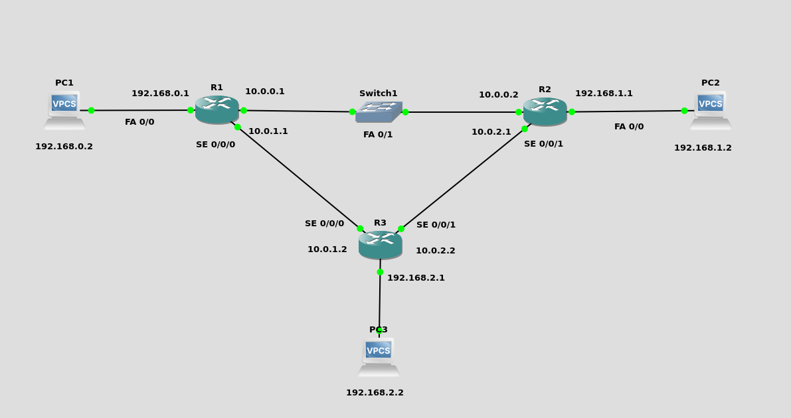

# Practica_OSPF




1. <h3> Configuración De Los PCs</h3>

Primero Asignamos las ip a los PCs de cada red:

* PC red A

```bash
ip 192.168.0.2 255.255.255.0 192.168.0.1
save 
show
```
* PC red B

```bash
ip 192.168.1.2 255.255.255.0 192.168.1.1
save 
show
```
* PC red C

```bash
ip 192.168.2.2 255.255.255.0 192.168.2.1
save 
show
```

2. <h3>Configuracion de Routers</h3>


* <h3>2.1) Configuración Del Enrutador 1</h3>

Para configurar el router 1 ejecute los siguientes comandos en la cónsola del mismo

```bash
enable
configure terminal

interface fastEthernet 0/1
ip address 10.0.0.1 255.255.255.0
no shutdown
exit

interface FastEthernet 0/0
ip address 192.168.0.1 255.255.255.0
no shutdown
exit0/0

interface serial 0/0/0
ip address 10.0.1.1 255.255.255.0
no shutdown
exit

end
wr
show ip interface brief
```

* <h3>2.2) Configuración Del Enrutador 2</h3>

Para configurar el router 2 ejecute los siguientes comandos en la cónsola del mismo

```bash
enable
configure terminal

interface fastEthernet 0/1
ip address 10.0.0.2 255.255.255.0
no shutdown
exit

interface FastEthernet 0/0
ip address 192.168.1.1 255.255.255.0
no shutdown
exit

interface serial 0/0/1
ip address 10.0.2.1 255.255.255.0
no shutdown
exit

end
wr
show ip interface brief
```
* <h3>2.3) Configuración Del Enrutador 3</h3>

Para configurar el router 3 ejecute los siguientes comandos en la cónsola del mismo

```bash
enable
configure terminal

interface FastEthernet 0/0
ip address 192.168.2.1 255.255.255.0
no shutdown
exit

interface serial 0/0/0
ip address 10.0.1.2 255.255.255.0
no shutdown
exit

interface serial 0/0/1
ip address 10.0.2.2 255.255.255.0
no shutdown
exit

end
wr
show ip interface brief
```

