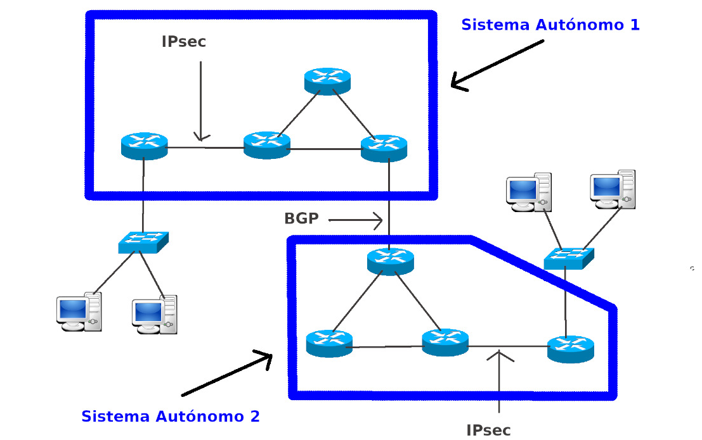
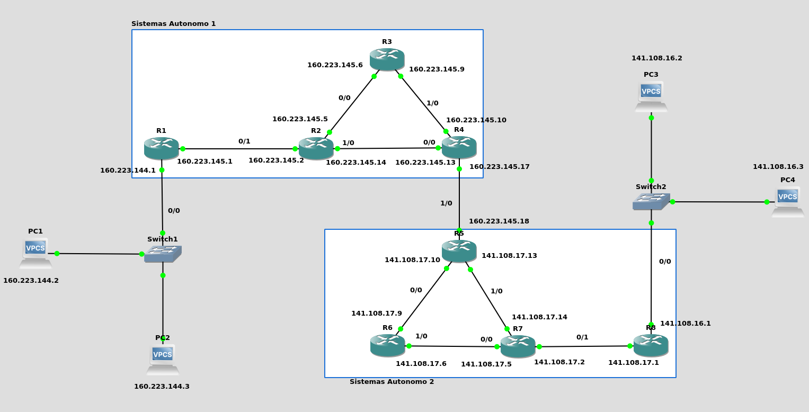

<h2> Proyecto Redes </h2>

El proyecto es investigar y configurar IPsec en los enlaces que se indican en la topología siguiente. IPsec es un protocolo que cifra los datagramas de capa 3.
También deben configurar el protocolo de enrutamiento dinámico externo, entre los sistemas autónomos que se indican en la topología siguiente




<h2> Redes por definir </h2>

* Network: 160.223.144.0/20
    * **AREA 1:** 254
    * **Enlace A:** 2
    * **Enlace B:** 2
    * **Enlace C:** 2
    * **Enlace D:** 2


| CIDR | Máscara de Subred | Máscara Comodín | # de Direcciones IP | # de Direcciones IP Utilizables |
| -------- | -------------------------- | ------------------------- | -------------------------- | ----------------------------------------- |
| /32     | 255.255.255.255      | 0.0.0.0                    | 1                              | 1                                                |
| /31     | 255.255.255.254      | 0.0.0.1                    | 2                              | 2*                                              |
| /30     | 255.255.255.252      | 0.0.0.3                    | 4                              | 2                                                |
| /29     | 255.255.255.248      | 0.0.0.7                    | 8                              | 6                                                |
| /28     | 255.255.255.240      | 0.0.0.15                  | 16                            | 14                                              |
| /27     | 255.255.255.224      | 0.0.0.31                  | 32                            | 30                                              |
| /26     | 255.255.255.192      | 0.0.0.63                  | 64                            | 62                                              |
| /25     | 255.255.255.128      | 0.0.0.127                | 128                          | 126                                            |
| /24     | 255.255.255.0          | 0.0.0.255                | 256                          | 254                                            |
| /23     | 255.255.254.0          | 0.0.1.255                | 512                          | 510                                            |
| /22     | 255.255.252.0          | 0.0.3.255                | 1,024                       | 1,022                                         |
| /21     | 255.255.248.0          | 0.0.7.255                | 2,048                       | 2,046                                         |
| /20     | 255.255.240.0          | 0.0.15.255              | 4,096                       | 4,094                                         |


 | Red  | Solicitud de Host  | Host Encontrados  | Direccion de Red  | Mask  | Mascara  | Primera IP utilizable  | Ultima IP utilizable  | Direccion de Broadcast |
|---|---|---|---|---|---|---|---|---|
| Area 1 | 254  | 254  | 160.223.144.0  | /24  | 255.255.255.0  | 160.223.144.1  | 160.223.144.254  | 160.223.144.255   |
| Enlace A | 2 | 2  | 160.223.145.0  | /30  | 255.255.252  | 160.223.145.1  | 160.223.148.2  |  160.223.145.3  |
| Enlace B | 2 | 2  | 160.223.145.4  | /30  | 255.255.252  | 160.223.145.5  | 160.223.148.6  |  160.223.145.7  |
| Enlace C | 2 | 2  | 160.223.145.8  | /30  | 255.255.252  | 160.223.145.9  | 160.223.148.10  |  160.223.145.11 |
| Enlace D | 2 | 2  | 160.223.145.12  | /30  | 255.255.252  | 160.223.145.13  | 160.223.148.14  |  160.223.145.15  |




<h3>1) Configuración De Los PCs</h3>


Primero Asignamos las ip a los PCs de cada red:

* PC 1

```bash
ip 160.223.144.2 255.255.255.0 160.223.144.1
save 
show
```
* PC 2

```bash
ip 160.223.144.3 255.255.255.0 160.223.144.1
save 
show
```
<h3>2.1) Configuración Del Enrutador 1</h3>

Para configurar el router 1 ejecute los siguientes comandos en la cónsola del mismo

```bash
enable
configure terminal
interface FastEthernet 0/0
ip address 160.223.144.1 255.255.255.0
no shutdown
exit
interface fastEthernet 0/1
ip address 160.223.145.1 255.255.255.252
no shutdown
exit
end
wr
show ip interface brief
```

<h3>2.2) Configuración Del Enrutador 2</h3>

Para configurar el router 2 ejecute los siguientes comandos en la cónsola del mismo

```bash
enable
configure terminal
interface FastEthernet 0/0
ip address 160.223.145.5 255.255.255.252
no shutdown
exit
interface fastEthernet 0/1
ip address 160.223.145.2  255.255.255.252
no shutdown
exit
interface fastEthernet 1/0
no switchport
ip address 160.223.145.14 255.255.255.252
no shutdown
exit
end
wr
show ip interface brief
```
<h3>2.3) Configuración Del Enrutador 3</h3>

Para configurar el router 3 ejecute los siguientes comandos en la cónsola del mismo

```bash
enable
configure terminal
interface FastEthernet 0/0
ip address 160.223.145.6 255.255.255.252
no shutdown
exit
interface fastEthernet 1/0
no switchport
ip address 160.223.145.9  255.255.255.252
no shutdown
exit
end
wr
show ip interface brief
```
<h3>2.4) Configuración Del Enrutador 4</h3>

Para configurar el router 4 ejecute los siguientes comandos en la cónsola del mismo

```bash
enable
configure terminal
interface FastEthernet 0/0
ip address 160.223.145.13 255.255.255.252
no shutdown
exit
interface fastEthernet 0/1
ip address 160.223.145.17  255.255.255.252
no shutdown
exit
interface fastEthernet 1/0
no switchport
ip address 160.223.145.10  255.255.255.252
no shutdown
exit
end
wr
show ip interface brief
```

<h3>3) Configuración del Protocolo OSPF</h3>

<h3>3.1) Configuración del Enrutador 1</h3>

Ejecute los siguientes comandos en el enrutador 1

```bash
configure terminal
router ospf 1
network 160.223.144.0 0.0.0.255 area 1
network 160.223.145.0 0.0.0.3 area 0
end
```

<h3>3.2) Configuración del Enrutador 2</h3>

Ejecute los siguientes comandos en el enrutador 2

```bash
configure terminal
router ospf 1
network 160.223.145.0 0.0.0.3 area 0
network 160.223.145.4 0.0.0.3 area 0
network 160.223.145.12 0.0.0.3 area 0
end
```
<h3>3.3) Configuración del Enrutador 3</h3>

Ejecute los siguientes comandos en el enrutador 3

```bash
configure terminal
router ospf 1
network 160.223.145.4 0.0.0.3 area 0
network 160.223.145.8 0.0.0.3 area 0
end
```

<h3>3.4) Configuración del Enrutador 4</h3>

Ejecute los siguientes comandos en el enrutador 4

```bash
configure terminal
router ospf 1
network 160.223.145.8 0.0.0.3 area 0
network 160.223.145.12 0.0.0.3 area 0
network 160.223.145.16 0.0.0.3 area 2

end
```

<h3> 4) Verificación de las conexiones </h3>
Para verificar el funcionamiento de la topología y la creación de las rutas dinámicas podemos ejecutar los siguientes comandos

```bash
show ip ospf
show ip route
```

<h2> Redes por definir </h2>

* Network: 141.108.16.0/20
    * **AREA 1:** 254
    * **Enlace A:** 2
    * **Enlace B:** 2
    * **Enlace C:** 2
    * **Enlace D:** 2


 | Red  | Solicitud de Host  | Host Encontrados  | Direccion de Red  | Mask  | Mascara  | Primera IP utilizable  | Ultima IP utilizable  | Direccion de Broadcast |
|---|---|---|---|---|---|---|---|---|
| Area 1 | 254  | 254  | 141.108.16.0  | /24  | 255.255.255.0  | 141.108.16.1  | 141.108.16.254  | 141.108.17.255   |
| Enlace A | 2 | 2  | 141.108.17.0 | /30  | 255.255.252  | 141.108.17.1  | 141.108.17.2  |  141.108.17.3  |
| Enlace B | 2 | 2  | 141.108.17.4  | /30  | 255.255.252  | 141.108.17.5  | 141.108.17.6  |  141.108.17.7  |
| Enlace C | 2 | 2  | 141.108.17.8  | /30  | 255.255.252  | 141.108.17.9  | 141.108.17.10  |  141.108.17.11 |
| Enlace D | 2 | 2  | 141.108.17.12  | /30  | 255.255.252  | 141.108.17.13  | 141.108.17.14  |  141.108.17.15  |


<h3>1) Configuración De Los PCs</h3>


Primero Asignamos las ip a los PCs de cada red:

* PC 3

```bash
ip 141.108.16.2 255.255.255.0 141.108.16.1
save 
show
```
* PC 4

```bash
ip 141.108.16.3 255.255.255.0 141.108.16.1
save 
show
```

<h3>2.1) Configuración Del Enrutador 8</h3>

Para configurar el router 8 ejecute los siguientes comandos en la cónsola del mismo

```bash
enable
configure terminal
interface FastEthernet 0/0
ip address 141.108.16.1 255.255.255.0
no shutdown
exit
interface fastEthernet 0/1
ip address 141.108.17.1 255.255.255.252
no shutdown
exit
end
wr
show ip interface brief
```

<h3>2.2) Configuración Del Enrutador 7</h3>

Para configurar el router 7 ejecute los siguientes comandos en la cónsola del mismo

```bash
enable
configure terminal
interface FastEthernet 0/0
ip address  141.108.17.5 255.255.255.252
no shutdown
exit
interface fastEthernet 0/1
ip address  141.108.17.2  255.255.255.252
no shutdown
exit
interface fastEthernet 1/0
no switchport
ip address  141.108.17.14 255.255.255.252
no shutdown
exit
end
wr
show ip interface brief
```
<h3>2.3) Configuración Del Enrutador 6</h3>

Para configurar el router 6 ejecute los siguientes comandos en la cónsola del mismo

```bash
enable
configure terminal
interface FastEthernet 0/0
ip address  141.108.17.9  255.255.255.252
no shutdown
exit
interface fastEthernet 1/0
no switchport
ip address  141.108.17.6 255.255.255.252
no shutdown
exit
end
wr
show ip interface brief
```
<h3>2.4) Configuración Del Enrutador 5</h3>

Para configurar el router 5 ejecute los siguientes comandos en la cónsola del mismo

```bash
enable
configure terminal
interface FastEthernet 0/0
ip address 141.108.17.10  255.255.255.252
no shutdown
exit
interface fastEthernet 0/1
ip address 160.223.145.18  255.255.255.252
no shutdown
exit
interface fastEthernet 1/0
no switchport
ip address 141.108.17.13 255.255.255.252
no shutdown
exit
end
wr
show ip interface brief
```

<h3>3) Configuración del Protocolo OSPF</h3>

<h3>3.1) Configuración del Enrutador 8</h3>

Ejecute los siguientes comandos en el enrutador 8

```bash
configure terminal
router ospf 1
network 141.108.16.0 0.0.0.255 area 1
network 141.108.17.0 0.0.0.3 area 0
end
```

<h3>3.2) Configuración del Enrutador 7</h3>

Ejecute los siguientes comandos en el enrutador 7

```bash
configure terminal
router ospf 1
network 141.108.17.0 0.0.0.3 area 0
network 141.108.17.4 0.0.0.3 area 0
network 141.108.17.12 0.0.0.3 area 0
end
```
<h3>3.3) Configuración del Enrutador 6</h3>

Ejecute los siguientes comandos en el enrutador 6

```bash
configure terminal
router ospf 1
network 141.108.17.4 0.0.0.3 area 0
network 141.108.17.8 0.0.0.3 area 0
end
```

<h3>3.4) Configuración del Enrutador 5</h3>

Ejecute los siguientes comandos en el enrutador 5

```bash
configure terminal
router ospf 1
network 141.108.17.8 0.0.0.3 area 0
network 141.108.17.12 0.0.0.3 area 0
network 160.223.145.16 0.0.0.3 area 0
end
```

<h3> 4) Verificación de las conexiones </h3>
Para verificar el funcionamiento de la topología y la creación de las rutas dinámicas podemos ejecutar los siguientes comandos

```bash
show ip ospf
show ip route
```
<h3>

<h2> 5) Configuracion del BGP </h2>

<h3>5.1) Configuracion router 4 </h3>

Ejecute los siguientes comandos en el enrutador 4

```bash
configure terminal
router bgp 100
neighbor 160.223.145.18 remote-as 200
redistribute ospf 1
router ospf 1
redistribute bgp 100 subnets
end
wr
```
<h3>5.2) Configuracion router 5 </h3>

Ejecute los siguientes comandos en el enrutador 5

```bash
configure terminal
router bgp 200
neighbor 160.223.145.17 remote-as 100
redistribute ospf 1
router ospf 1
redistribute bgp 200 subnets
end
wr
```

