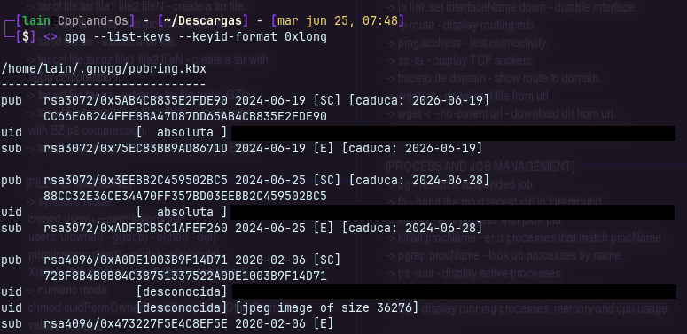
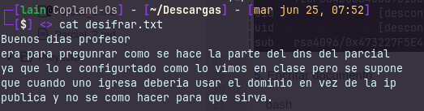
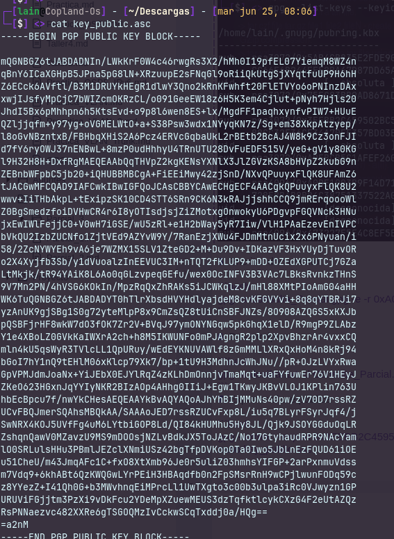

<h2> GPG </h2>

1. Instalar gpg

```bash
sudo apt install gnupg
```

2. Creacion de la key

```bash
gpg --full-generate-key
```

3. Importar **Clave** publica del destinatario

```bash
gpg --import miLlavePublicaGmail.asc
```

4. listar claves

```bash
gpg --list-keys --keyid-format 0xlong
```



5. Encritar documento

```bash
gpg -o Consulta_Parcial.gpg -e -r 0xA0DE1003B9F14D71 -r 0x3EEBB2C459502BC5 Consulta_Parcial.txt
```

6. Desencriptar

```bash
gpg -o desifrar.txt -d Consulta_Parcial.gpg 
```



7. Exportar clave publica 

```bash
gpg --armor --export 0x3EEBB2C459502BC5
nano key_public.asc
```

