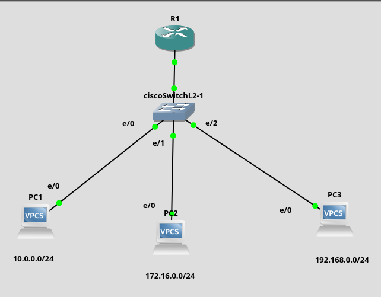

<h2>Práctica: Virtual Local Area Networks (VLAN) Con Enrutamiento</h2>

1. <h3>Construir el diseño de la red</h3>
Construya el siguiente diseño en el simulador



2. <h3>Configurar los IPs de los PCs</h3>
Hago click derecho sobre el PC1, seleccione la opcion <strong>Edit Config</strong> y asigne la IP 192.168.1.2

```bash
#This the configration for PC1
#Uncomment the following line to enable DHCP
#dhcp
#or the line below to manually setup an IP address and subnet mask 
#ip 192.168.1.1 255.0.0.0
set pcname PC1
ip 192.168.1.2/24
```
Repita la operación para el resto de las PCs con los siguientes valores

|  PC  |         IP         |
| ------ | ---------------- |
| PC1 | 10.0.0.2       |
| PC2 | 172.16.0.2   |
| PC3 | 192.168.0.2 |


Conecte los PCs con los puertos del switch en el siguiente orden

|     PC     |       IP        |
| ----------- | ------------- |
| PC1       | Ethernet0 |
| PC2       | Ethernet1 |
| PC3       | Ethernet2 |
| Router1 | Ethernet3 |


3. <h3>Configurar las VLANs en el Switch</h3>

Encienda el switch, abra una consola y ejecute los siguientes comandos

```bash
enable 
configure terminal
vlan 100
name uno
exit
vlan 200
exit
name dos
vlan 300
exit
name tres
exit
```

4. <h3>Asignar los puertos de la VLAN 100</h3>

```bash
configure terminal
interface GigabitEthernet 0/0
switchport mode access
switchport access vlan 100
exit

```
5. <h3>Asignar los puertos de la VLAN 200</h3>


```bash
configure terminal
interface GigabitEthernet 0/1
switchport mode access
switchport access vlan 200
exit

```

6. <h3>Asignar los puertos de la VLAN 300</h3>


```bash
configure terminal
interface GigabitEthernet 0/2
switchport mode access
switchport access vlan 300
exit

```
6. <h3>Asignar Interfaces Router</h3>

```bash
enable
configure terminal
interface fastethernet 0/0
ip add 10.0.0.1 255.255.255.0
no shutdown
ip add 172.16.0.1 255.255.255.0 secondary
no shutdown 
ip add 192.168.0.1 255.255.255.0 secondary
no shutdown
exit
wr

```

6. <h3>Asignar los puertos de la VLAN</h3>


```bash
configure terminal
interface GigabitEthernet 0/3
switchport mode access
switchport access vlan 100
switchport access vlan 200
switchport access vlan 300
exit

```