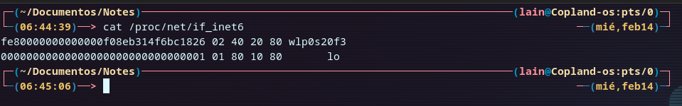
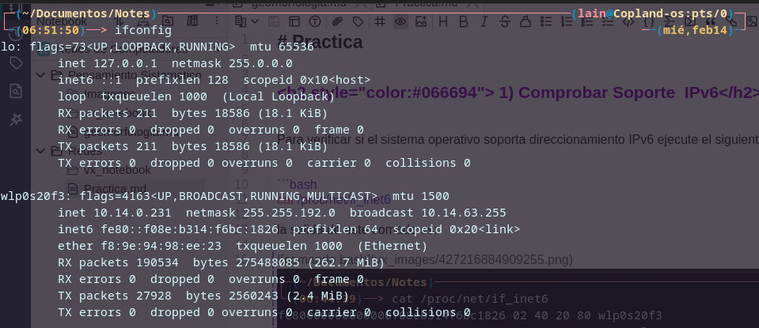
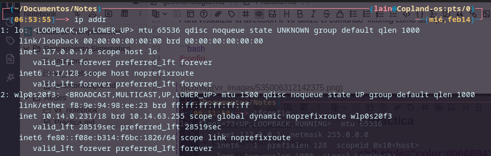
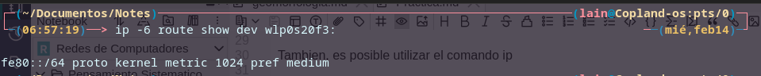
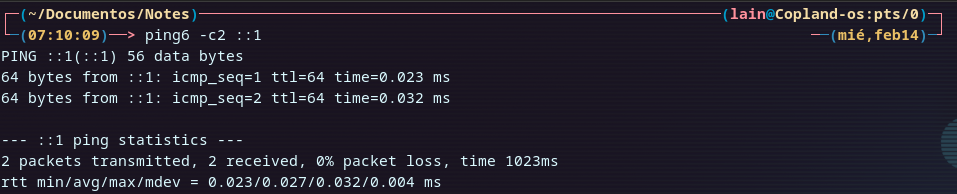
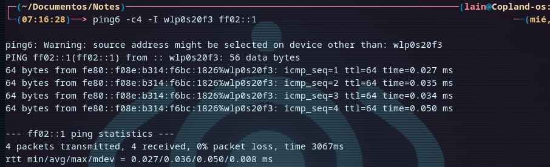
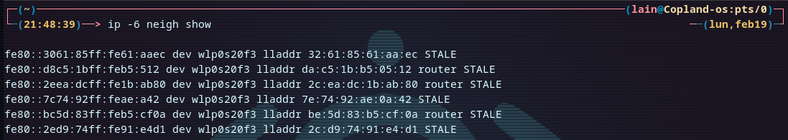
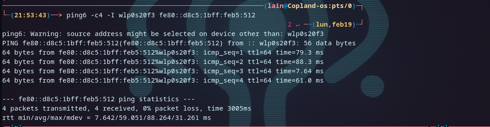
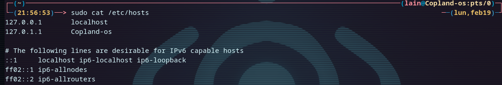
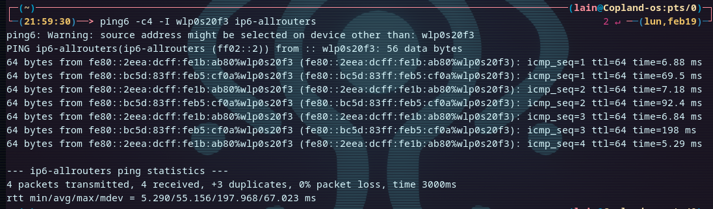

<div style=";border:solid; margin:20px; padding:3%"> 

<h1>Practica</h1>


<h2 style="color:#066694"> 1) Comprobar Soporte  IPv6</h2>


Para verificar si el sistema operativo soporta direccionamiento IPv6 ejecute el siguiente comando:


```bash
cat /proc/net/if_inet6
```
la salida de este comado es: 




<h2 style="color:#066694"> 2) Mostrar la direccion IPv6 de su interfaz </h2>

Para visualizar la direccion IPv6 utilize el comando  ifconfig como siempre:


```bash
ifconfig
```




Tambien, es posible utilizar el comando ip

```bash
ip addr
```
La salida seria algo como esto:




<h2 style="color:#066694"> 3) Mostrar las rutas IPv6  </h2>

Con el siguiente comando se puede visualizar las rutas en IPv6 del sistema.


```bash
ip -6 route show dev wlp0s20f3:
```



<h2 style="color:#066694"> 4) Comprobar si un host es alcanzable  </h2>

El comando ping se utiliza en  IPv4 para verificar si un host remoto es alcanzable. En IPv6.  en Ipv6  **ping6**. Al  utilizar este comando simpre se debe especificar la interface
por donde se enviara el trafico. aun cuando sea la unica interface en el host par acomprobar este comando  ejecutamos un ping  al localhost o loopback.

 ```bash
ping6 -c2 ::1
```
La salida sera algo parecido a lo siguiente:



<h2 style="color:#066694"> 5) Lan Discovery </h2>


Para verificar si existen vecinos en IPv6  en la red local se puede utilizar el siguiente comando:

 ```bash
ping6 -c4 -I wlp0s20f3 ff02::1
```

La salida seria algo parecido a lo siguiente




En esta salida se puede observar que hay varios vecinos. Estas direcciones se alamacenan en una tabla equivalente a la tabla ARP de IPv4


<h2 style="color:#066694"> 6) Mostrar tabla de vecinos.  </h2>

Para visualizar los vecinos almacenados en la tabla se puede ejecutar el siguiente comando :

 ```bash
ip -6 neigh show 
```
La salida seria algo parecido a esto:




<h2 style="color:#066694">  7) Comprobar comunicación con un vecino  </h2>

Se puede hacer ping a un vecino en IPv6. Para ello ejecute el siguiente comando (no use la IP de este ejemplo, debe utilizar unas de las IP que le mostró el comando anterior.


```bash
ping6 -c4 -I eno1 fe80::221:97ff:feed:ef01
```




<h2 style="color:#066694">  8) ¿Cómo utilizar hostnames?  </h2>

El archivo <strong>/etc/hosts</strong> se usa para resolución de nombres localmente. Al igual que en
IPv4 se puede agregar entradas IPv6.



Una vez agregada la entrada en este archivo puede hacer ping utilizando el nombre

```bash
ping6 -c4 -I eno1 nombre
```




<h2 style="color:#066694">  9) Calculando subredes  </h2>

Para mostrar los detalles de una subred IPv6 puede utilizar el comando <strong>ipcalc</strong>

```bash
 ipcalc -6 2001:db8:abcd::0/64
```
</div>
