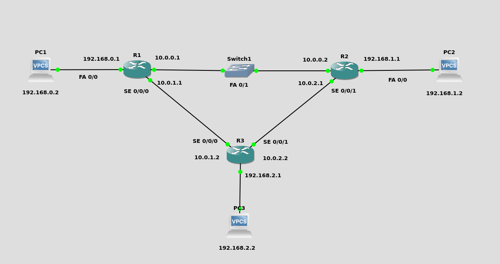

<div style=";border:solid; margin:20px; padding:3%">

<h2 style= "color:#6598BD"> Practica OSPF </h2>




* <h3>1) Configuración De Los PCs</h3>

    Primero Asignamos las ip a los PCs de cada red:

    * <strong>PC red A</strong>

    ```bash
    ip 192.168.0.2 255.255.255.0 192.168.0.1
    save 
    show
    ```
    *  <strong>PC red B</strong>

    ```bash
    ip 192.168.1.2 255.255.255.0 192.168.1.1
    save 
    show
    ```
    * <strong>PC red C</strong>

    ```bash
    ip 192.168.2.2 255.255.255.0 192.168.2.1
    save 
    show
    ```

* <h3>2) Configuracion de Routers</h3>


    * <h4>2.1) Configuración Del Enrutador 1</h4>

    Para configurar el router 1 ejecute los siguientes comandos en la cónsola del mismo

    ```bash
    enable
    configure terminal

    interface fastEthernet 0/1
    ip address 10.0.0.1 255.255.255.0
    no shutdown
    exit

    interface FastEthernet 0/0
    ip address 192.168.0.1 255.255.255.0
    no shutdown
    exit
    
    interface serial 0/0/0
    ip address 10.0.1.1 255.255.255.0
    no shutdown
    exit

    end
    show ip interface brief
    ```

    * <h4>2.2) Configuración Del Enrutador 2</h4>

    Para configurar el router 2 ejecute los siguientes comandos en la cónsola del mismo

    ```bash
    enable
    configure terminal

    interface fastEthernet 0/1
    ip address 10.0.0.2 255.255.255.0
    no shutdown
    exit

    interface FastEthernet 0/0
    ip address 192.168.1.1 255.255.255.0
    no shutdown
    exit
    
    interface serial 0/0/1
    ip address 10.0.2.1 255.255.255.0
    no shutdown
    exit
    
    end
    show ip interface brief
    ```
    * <h4>2.3) Configuración Del Enrutador 3</h4>

    Para configurar el router 3 ejecute los siguientes comandos en la cónsola del mismo

    ```bash
    enable
    configure terminal

    interface FastEthernet 0/0
    ip address 192.168.2.1 255.255.255.0
    no shutdown
    exit

    interface serial 0/0/0
    ip address 10.0.1.2 255.255.255.0
    no shutdown
    exit

    interface serial 0/0/1
    ip address 10.0.2.2 255.255.255.0
    no shutdown
    exit

    end
    show ip interface brief
    ```
* <h3>3) Configuración del Protocolo OSPF</h3>

    * <h4>3.1) Configuración del Enrutador 1</h4>

    Ejecute los siguientes comandos en el enrutador 1


    ```bash
    configure terminal
    router ospf 1
    network 192.168.0.0 0.0.0.255 area 0
    network 10.0.0.0 0.0.0.255 area 0
    network 10.0.1.0 0.0.0.255 area 0
    passive-interface fastEthernet 0/0
    end
    ```
    Para verificar el funcionamiento de la topología y la creación de las rutas dinámicas podemos ejecutar los siguientes comandos
 
    ```bash
    show ip ospf
    show ip route
    ```

    * <h4>3.2) Configuración del Enrutador 2</h4>

    Ejecute los siguientes comandos en el enrutador 2

    ```bash
    configure terminal
    router ospf 1
    network 192.168.1.0 0.0.0.255 area 0
    network 10.0.0.0 0.0.0.255 area 0
    network 10.0.2.0 0.0.0.255 area 0
    passive-interface fastEthernet 0/0
    end
    ```
    Para verificar el funcionamiento de la topología y la creación de las rutas dinámicas podemos ejecutar los siguientes comandos
 
    ```bash
    show ip ospf
    show ip route
    ```

    * <h4>3.3) Configuración del Enrutador 3</h4>

    Ejecute los siguientes comandos en el enrutador 3

    ```bash
    configure terminal
    router ospf 1
    network 192.168.2.0 0.0.0.255 area 0
    network 10.0.1.0 0.0.0.255 area 0
    network 10.0.2.0 0.0.0.255 area 0
    passive-interface fastEthernet 0/0
    end
    ```
    Para verificar el funcionamiento de la topología y la creación de las rutas dinámicas podemos ejecutar los siguientes comandos
 
    ```bash
    show ip ospf
    show ip route
    ```
  </div>
