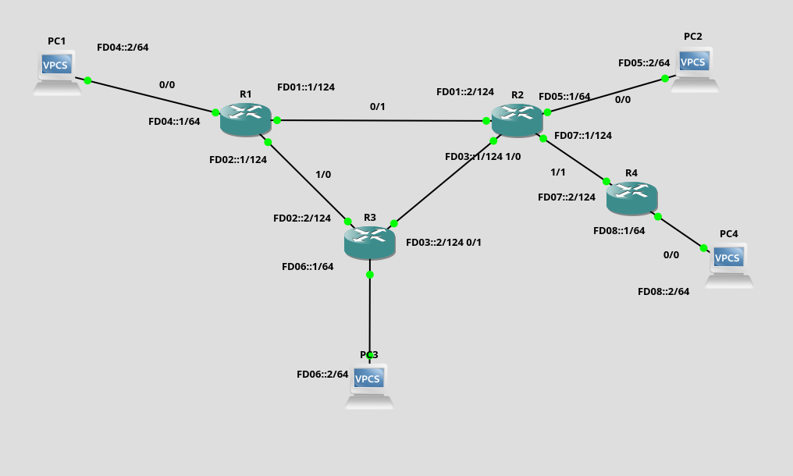

<div style=";border:solid; margin:20px; padding:3%">


<h1> Practica_OSPF_IPv6 </h1>

<h2>1) Topologia</h2>

El objetivo de esta práctica es conocer los fundamentos del protocolo de enrutamiento dinamico interno OSPF utilizando IPv6. Construya la siguiente topologia en el simulador GNS3.





Primero debemos configurar todas las interfaces de los enrutadores.

<h3>1.1) Configuracion del Erutador 1</h3>

para configurar el router 1 ejecute los siguientes comandos en la cónsola del mismo.

```bash
enable
configure terminal
interface fastethernet 0/0
ipv6 address FD04::1/64
Ipv6 enable
no shutdown
exit

interface fastethernet 0/1
ipv6 add  FD01::1/124
no shutdown
exit

interface fastethernet 1/0
no switchport
ipv6 add FD02::1/124
end

wr

show ipv6 interface brief
```


<h3>1.2) Configuracion del Erutador 2</h3>

para configurar el router 2 ejecute los siguientes comandos en la cónsola del mismo.

```bash
enable
configure terminal
interface fastethernet 0/0
ipv6 address FD05::1/64
Ipv6 enable
no shutdown
exit

interface fastethernet 0/1
ipv6 add  FD01::2/124
no shutdown
exit

interface fastethernet 1/0
no switchport
ipv6 add FD03::1/124
end

wr

show ipv6 interface brief
```

<h3>1.3) Configuracion del Erutador 3</h3>

para configurar el router 3 ejecute los siguientes comandos en la cónsola del mismo.

```bash
enable
configure terminal
interface fastethernet 0/0
ipv6 address FD06::1/64
Ipv6 enable
no shutdown
exit

interface fastethernet 0/1
ipv6 add  FD02::1/124
no shutdown
exit

interface fastethernet 1/0
no switchport
ipv6 add FD02::2/124
end

wr

show ipv6 interface brief
```

<h3>1.4) Configuracion del Erutador 4</h3>

para configurar el router 4 ejecute los siguientes comandos en la cónsola del mismo.

```bash
enable
configure terminal
interface fastethernet 0/0
ipv6 address FD08::1/64
Ipv6 enable
no shutdown
exit

interface fastethernet 1/1
ipv6 add  FD07::2/124
no shutdown
exit

wr

show ipv6 interface brief
```


<h2>2) Configuracion del enrutador OSPF</h2>

Esta sección como se realiza la configuración del protocolo de enrutamiento dinámico con OSPF.

<h3>2.1) Configuracion del enrutador 1</h3>

Ejecute los siguientes comandos en el enrutador 1

```bash

configure terminal
ipv6 unicast-routing
ipv6 cef
ipv6 router ospf 1
internet-id 1.1.1.1
interface fastethernet 0/0
ipv6 ospf 1 area 0
exit

interface fastethernet 0/1
ipv6 ospf 1 area 0
exit

interface fastethernet 1/0
ipv6 ospf 1 area 0
exit

wr

```

<h3>2.2) Configuracion del enrutador 2</h3>

Ejecute los siguientes comandos en el enrutador 2

```bash

configure terminal
ipv6 unicast-routing
ipv6 cef
ipv6 router ospf 1
internet-id 2.2.2.2
interface fastethernet 0/0
ipv6 ospf 1 area 0
exit

interface fastethernet 0/1
ipv6 ospf 1 area 0
exit

interface fastethernet 1/0
ipv6 ospf 1 area 0
exit

wr

```

<h3>2.3) Configuracion del enrutador 3</h3>

Ejecute los siguientes comandos en el enrutador 3

```bash

configure terminal
ipv6 unicast-routing
ipv6 cef
ipv6 router ospf 1
internet-id 3.3.3.3
interface fastethernet 0/0
ipv6 ospf 1 area 0
exit

interface fastethernet 0/1
ipv6 ospf 1 area 0
exit

interface fastethernet 1/0
ipv6 ospf 1 area 0
exit

wr

```
<h3>2.4) Configuracion del enrutador 4</h3>

Ejecute los siguientes comandos en el enrutador 4

```bash

configure terminal
ipv6 unicast-routing
ipv6 cef
ipv6 router ospf 1
internet-id 3.3.3.3
interface fastethernet 0/0
ipv6 ospf 1 area 1
exit

interface fastethernet 1/1
ipv6 ospf 1 area 0
exit

wr

```

<h2>3) Verificacion de las conexiones </h2>

Para verificar el funcionamiento de la topologia y la creación de las rutas dinámicas podemos ejecutar los siguientes comandos.


```bash

show ipv6 ospf neigh
show ipv6 ospf rib

```

<h2>4) Configuracion de los PCs</h2>

En las consolas de los PCs ejecuten los comandos para configurar los IPs correspondientes;

```bash

ip FD04::2/64 FD04::1
ip FD05::2/64 FD05::1
ip FD06::2/64 FD06::1
ip FD08::2/64 FD08::1

```


</div>