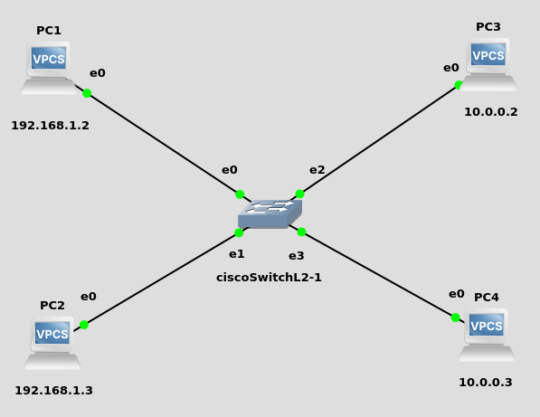
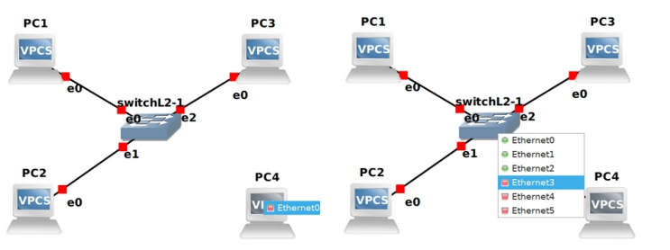
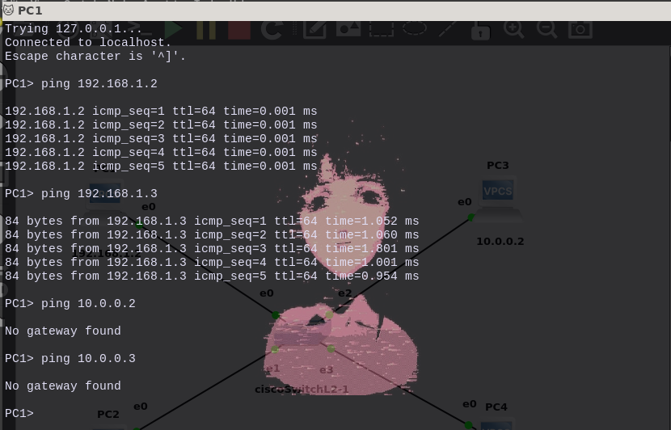

<h2>Práctica: Virtual Local Area Networks (VLAN)</h2>

1. <h3>Construir el diseño de la red</h3>
Construya el siguiente diseño en el simulador



2. <h3>Configurar los IPs de los PCs</h3>
Hago click derecho sobre el PC1, seleccione la opcion <strong>Edit Config</strong> y asigne la IP 192.168.1.2

```bash
#This the configration for PC1
#Uncomment the following line to enable DHCP
#dhcp
#or the line below to manually setup an IP address and subnet mask 
#ip 192.168.1.1 255.0.0.0
set pcname PC1
ip 192.168.1.2/24
```
Repita la operación para el resto de las PCs con los siguientes valores

|  PC  |         IP         |
| ------ | ---------------- |
| PC1 | 192.168.1.2 |
| PC2 | 192.168.1.3 |
| PC3 | 10.0.0.2       |
| PC4 | 10.0.0.3       |

Conecte los PCs con los puertos del switch en el siguiente orden

|  PC  |        IP        |
| ------ | -------------- |
| PC1 | Ethernet0  |
| PC2 | Ethernet1  |
| PC3 | Ethernet2  |
| PC4 | Ethernet3  |



3. <h3>Configurar las VLANs en el Switch</h3>

Encienda el switch, abra una consola y ejecute los siguientes comandos

```bash
enable 
configure terminal
vlan 10
name students
vlan 20
name professors
exit
```

4. <h3>Asignar los puertos de la VLAN 10</h3>

```bash
configure terminal
interface GigabitEthernet 0/0
switchport mode access
switchport access vlan 10
exit
interface GigabitEthernet 0/1
switchport mode access
switchport access vlan 10
exit

```
5. <h3>Asignar los puertos de la VLAN 20</h3>


```bash
configure terminal
interface GigabitEthernet 0/2
switchport mode access
switchport access vlan 20
exit
interface GigabitEthernet 0/3
switchport mode access
switchport access vlan 20
exit

```

6. <h3>Comprobar las conexiones</h3>

Encienda los PCs y compruebe que ha comunicación entre los PCs 1 y 2 y entre los PCs 2 y 3.

