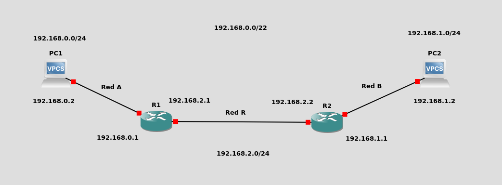
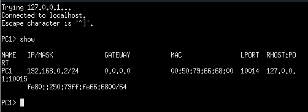
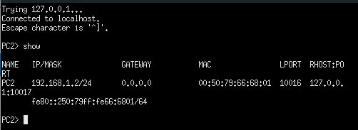
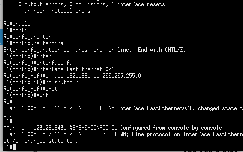
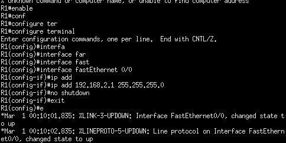
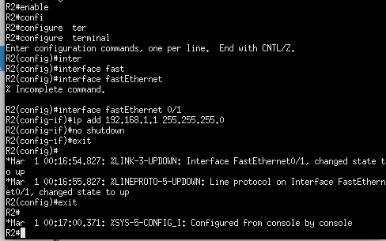
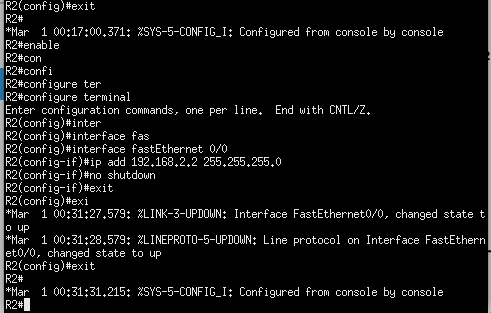
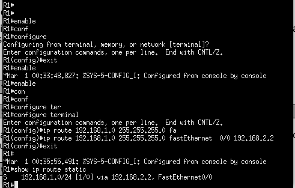
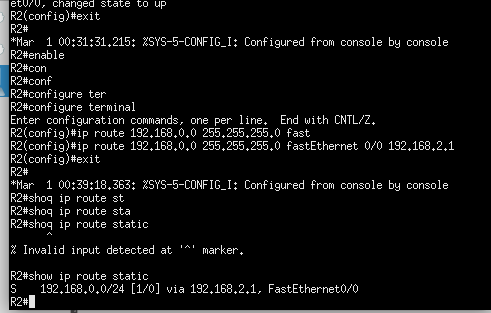
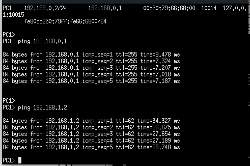

<div style=";border:solid; margin:20px; padding:3%">

<h1> Taller <h1>


<h2>Práctica 2 de Capa 3: Enrutamiento Estático</h2>

En esta práctica se configurará un infraestructura sencilla compuesta por dos redes, cada una con su enrutador correspondiente.



<br>
Utilice el siguiente segmento de red para la <strong>red A: </strong>

```
192.168.0.0/24
```
Utilice el siguiente segmento de red para la <strong>red B:</strong>

```
192.168.1.0/24
```
Utilice el siguiente segmento de red para la <strong>red R:</strong>

```
192.168.2.0/27
```

<h2>Configurar los PCs </h2>

Para confirgurar el PC de la red A utilizamos los siguientes comandos:


```bash
ip 192.168.0.2 255.255.255.0 192.168.0.1
save
show
```



<br>
Para confirgurar el PC de la red B utilizamos los siguientes comandos:


```bash
ip 192.168.1.2 255.255.255.0 192.168.1.1
save
show
```




<h3>Configurar la Interfaz FastEthernet 0/1 del router A</h3>

Ingrese los siguientes comandos

```bash
enable
configure terminal
interface fastEthernet 0/1
ip add 192.168.0.1 255.255.255.0
no shutdown
exit
```




<br>
Puede ver la configuración con el comando

```bash
show int
```

<h3>Configurar la Interfaz FastEthernet 0/0 del router A</h3>

Ingrese los siguientes comandos

```bash
enable
configure terminal
interface fastEthernet 0/0
ip add 192.168.2.1 255.255.255.0
no shutdown
exit
```



<br>
Puede ver la configuración con el comando

```bash
show int
```

<h3>Configurar la Interfaz FastEthernet 0/1 del router B</h3>


Ingrese los siguientes comandos

```bash
enable
configure terminal
interface fastEthernet 0/1
ip add 192.168.1.1 255.255.255.0
no shutdown
exit
```



<br>
Puede ver la configuración con el comando

```bash
show int
```

<h3>Configurar la Interfaz FastEthernet 0/0 del router B</h3>


```bash
enable
configure terminal
interface fastEthernet 0/0
ip add 192.168.2.2 255.255.255.0
no shutdown
exit
```


<br>
Puede ver la configuración con el comando

```bash
show int
```

Para guardar la configuracion del Router

Abreviatura de write memory, que guarda la configuración en la memoria no volátil.

```bash
wr
```

Este comando copia la configuración actual (en la memoria RAM) a la configuración de inicio (que se carga al reiniciar el router).

```bash
copy running-config startup-config

```

Configurar las Rutas Estáticas en los Enrutadores


<h2>Ruta Estática del enrutador A</h2>

Esta ruta le indica al enrutador A como llegar a la red B. Para configurar la ruta ingrese los siguientes comandos

```bash
enable
configure terminal
ip route 192.168.1.0 255.255.255.0 fastEthernet 0/0 192.168.2.2
```



<br>
Para ver todas las rutas estáticas salga del modo de configuración y luego utilice el siguiente comando

```bash
show ip route static
```

<h2>Ruta Estática del enrutador B</h2>


Esta ruta le indica al enrutador B como llegar a la red A. Para configurar la ruta
ingrese los siguientes comandos

```bash
enable
configure terminal
ip route 192.168.0.0 255.255.255.0 fastEthernet 0/0 192.168.2.1
```



<br>
Para ver todas las rutas estáticas salga del modo de configuración y luego utilice el siguiente comando

```bash
show ip route static
```

Para ver la comunicacion entre el PC de la Red A y el PC de la Red B  usamos el comando <strong>ping</strong>

```bash
ping 192.168.1.2
```


</div>