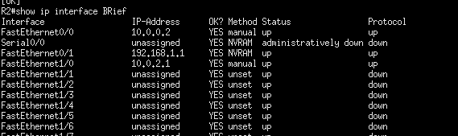
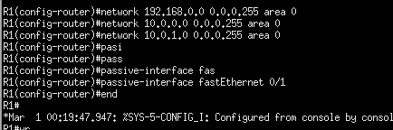

<div style=";border:solid; margin:20px; padding:3%">


<h1> Taller 3 </h1>


<h2>Práctica: Protocolo OSPF Open Shortest Path First</h2>

<h3>1) Configuración De Los PCs</h3>

Primero Asignamos las ip a los PCs de cada red:

* PC red A

```bash
ip 192.168.0.2 255.255.255.0 192.168.0.1
save 
show
```
* PC red B

```bash
ip 192.168.1.2 255.255.255.0 192.168.1.1
save 
show
```
* PC red C

```bash
ip 192.168.2.2 255.255.255.0 192.168.2.1
save 
show
```

<h3>3.1 Configuración Del Enrutador 1</h3>

Para configurar el router 1 ejecute los siguientes comandos en la cónsola del mismo

```bash
enable
configure terminal
interface FastEthernet 0/1
ip address 192.168.0.1 255.255.255.0
no shutdown
exit
interface fastEthernet 0/0
ip address 10.0.0.1 255.255.255.0
no shutdown
exit
interface fastEthernet 1/0
no switchport
ip address 10.0.1.1 255.255.255.0
end
show ip interface brief
copy running-config startup-config
```


<h3>3.2 Configuración Del Enrutador 2</h3>

Configurar el router 2 ejecutando los siguientes comandos en la cónsola del mismo

```bash
enable
configure terminal
interface FastEthernet 0/1
ip address 192.168.1.1 255.255.255.0
no shutdown
exit
interface fastEthernet 0/0
ip address 10.0.0.2 255.255.255.0
no shutdown
exit
interface fastEthernet 1/0
no switchport
ip address 10.0.2.1 255.255.255.0
no shutdown
end
show ip interface brief
copy running-config startup-config
```



<h3>3.3 Configuración Del Enrutador 3</h3>

Para configurar el router 3 ejecute los siguientes comandos en la cónsola del mismo

```bash
enable
configure terminal
interface FastEthernet 0/1
ip address 192.168.2.1 255.255.255.0
no shutdown
exit
interface fastEthernet 1/0
ip address 10.0.1.2 255.255.255.0
no shutdown
exit
interface fastEthernet 0/0
no switchport
ip address 10.0.2.2 255.255.255.0
no shutdown
end
show ip interface brief
copy running-config startup-config
```


<h3>4 Configuración del Protocolo OSPF</h3>

Esta sección muestra como se realiza la configuración del protocolo de enrutamiento dinámico con OSPF.

<h3>4.1 Wildcard Mask</h3>


Antes de realizar las configuraciones de los enrutadores, debemos revisar un parámetro que se utiliza en la publicación de las redes que participan en el enrutamiento dinámico, denominado <strong>wildcard mask</strong>, o máscara comodín. Este parámetro puede pensarse como la máscara de red invertida. Ésta es una máscara de bit que se utiliza, al igual que la máscara de red, para determinar un rango de direcciones IPs. Para obtener este parámetro se realiza una resta de la máscara tradicional al valor 255.255.255.255. Ejemplo, si tenemos una máscara /24 o 255.255.255.0 se opera como sigue:

<strong>255.255.255.255 – 255.255.255.0 = 0.0.0.255</strong>

<h3>4.2 Configuración del Enrutador 1</h3>

Ejecute los siguientes comandos en el enrutador 1

```bash
configure terminal
router ospf 1
network 192.168.0.0 0.0.0.255 area 0
network 10.0.0.0 0.0.0.255 area 0
network 10.0.1.0 0.0.0.255 area 0
passive-interface fastEthernet 0/1
end
```



<h3>4.3 Configuración del Enrutador 2</h3>

Ejecute los siguientes comandos en el enrutador 2

```bash
configure terminal
router ospf 1
network 192.168.1.0 0.0.0.255 area 0
network 10.0.0.0 0.0.0.255 area 0
network 10.0.2.0 0.0.0.255 area 0
passive-interface fastEthernet 0/1
end
```


<h3>4.4 Configuración del Enrutador 3</h3>

Ejecute los siguientes comandos en el enrutador 3


```bash
configure terminal
router ospf 1
network 192.168.2.0 0.0.0.255 area 0
network 10.0.1.0 0.0.0.255 area 0
network 10.0.2.0 0.0.0.255 area 0
passive-interface fastEthernet 0/1
end
```


<h3>5 Verificación de las conexiones</h3>
Para verificar el funcionamiento de la topología y la creación de las rutas dinámicas podemos ejecutar los siguientes comandos


```bash
show ip ospf
show ip route
```

</div>