<div style=";border:solid; margin:20px; padding:3%">

<h1> Taller 4 </h1>

<h2>Practica de OSPF con diferentes areas</h2>

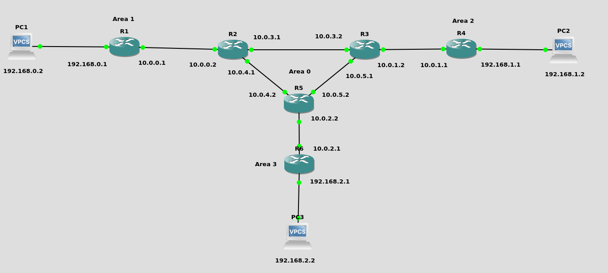

<h3>1) Configuración De Los PCs</h3>


Primero Asignamos las ip a los PCs de cada red:

* PC Area 1

```bash
ip 192.168.0.2 255.255.255.0 192.168.0.1
save 
show
```
* PC Area 2

```bash
ip 192.168.1.2 255.255.255.0 192.168.1.1
save 
show
```
* PC Area 3

```bash
ip 192.168.2.2 255.255.255.0 192.168.2.1
save 
show
```
<h3>2.1) Configuración Del Enrutador 1</h3>

Para configurar el router 1 ejecute los siguientes comandos en la cónsola del mismo

```bash
enable
configure terminal
interface FastEthernet 0/1
ip address 192.168.0.1 255.255.255.0
no shutdown
exit
interface fastEthernet 0/0
ip address 10.0.0.1 255.255.255.0
no shutdown
exit
end
wr
show ip interface brief
```

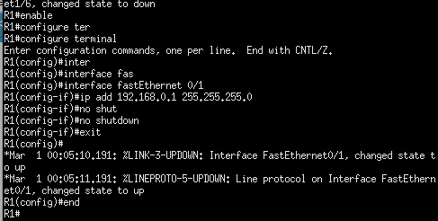

<h3>2.2) Configuración Del Enrutador 4</h3>

Para configurar el router 1 ejecute los siguientes comandos en la cónsola del mismo

```bash
enable
configure terminal
interface FastEthernet 0/1
ip address 192.168.1.1 255.255.255.0
no shutdown
exit
interface fastEthernet 0/0
ip address 10.0.1.1 255.255.255.0
no shutdown
exit
end
wr
show ip interface brief
```
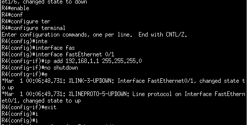

<h3>2.3) Configuración Del Enrutador 6</h3>

Para configurar el router 1 ejecute los siguientes comandos en la cónsola del mismo

```bash
enable
configure terminal
interface FastEthernet 0/1
ip address 192.168.2.1 255.255.255.0
no shutdown
exit
interface fastEthernet 0/0
ip address 10.0.2.1 255.255.255.0
no shutdown
exit
end
wr
show ip interface brief
```
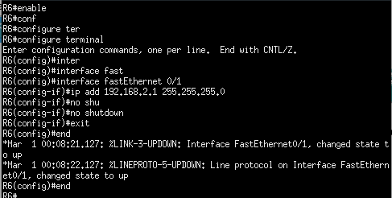


<h3>2.4) Configuración Del Enrutador 2</h3>

Configurar el router 2 ejecutando los siguientes comandos en la cónsola del mismo

```bash
enable
configure terminal
interface FastEthernet 0/0
ip address 10.0.0.2 255.255.255.0
no shutdown
exit
interface fastEthernet 0/1
ip address 10.0.3.1 255.255.255.0
no shutdown
exit
interface fastEthernet 1/0
no switchport
ip address 10.0.4.1 255.255.255.0
no shutdown
end
show ip interface brief
copy running-config startup-config
```
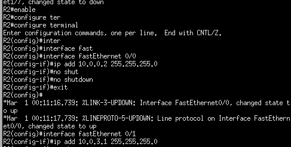

<h3>2.5) Configuración Del Enrutador 3</h3>

Configurar el router 3 ejecutando los siguientes comandos en la cónsola del mismo

```bash
enable
configure terminal
interface FastEthernet 0/0
ip address 10.0.1.2 255.255.255.0
no shutdown
exit
interface fastEthernet 0/1
ip address 10.0.3.2 255.255.255.0
no shutdown
exit
interface fastEthernet 1/0
no switchport
ip address 10.0.5.1 255.255.255.0
no shutdown
end
show ip interface brief
copy running-config startup-config
```
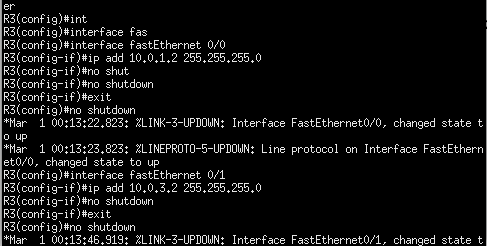


<h3>2.6) Configuración Del Enrutador 5</h3>

Configurar el router 5 ejecutando los siguientes comandos en la cónsola del mismo

```bash
enable
configure terminal
interface FastEthernet 0/0
ip address 10.0.2.2 255.255.255.0
no shutdown
exit
interface fastEthernet 0/1
ip address 10.0.4.2 255.255.255.0
no shutdown
exit
interface fastEthernet 1/0
no switchport
ip address 10.0.5.2 255.255.255.0
no shutdown
end
show ip interface brief
copy running-config startup-config
```
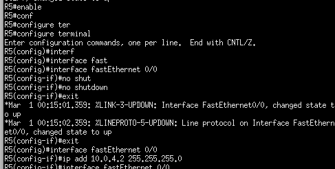


<h3>3) Configuración del Protocolo OSPF</h3>

<h3>3.1) Configuración del Enrutador 1</h3>

Ejecute los siguientes comandos en el enrutador 1

```bash
configure terminal
router ospf 1
network 192.168.0.0 0.0.0.255 area 1
network 10.0.0.0 0.0.0.255 area 0
passive-interface fastEthernet 0/1
end
```

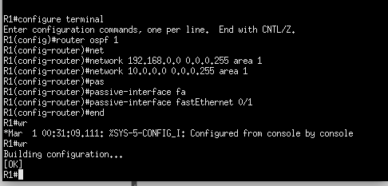


<h3>3.2) Configuración del Enrutador 4</h3>

Ejecute los siguientes comandos en el enrutador 4

```bash
configure terminal
router ospf 1
network 192.168.1.0 0.0.0.255 area 2
network 10.0.1.0 0.0.0.255 area 0
passive-interface fastEthernet 0/1
end
```
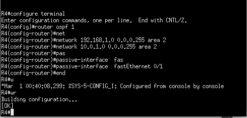

<h3>3.3) Configuración del Enrutador 6</h3>

Ejecute los siguientes comandos en el enrutador 6

```bash
configure terminal
router ospf 1
network 192.168.2.0 0.0.0.255 area 3
network 10.0.2.0 0.0.0.255 area 0
passive-interface fastEthernet 0/1
end
```
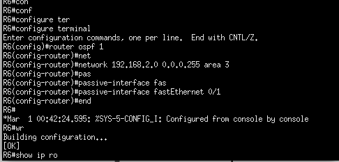


<h3>3.4) Configuración del Enrutador 2</h3>

Ejecute los siguientes comandos en el enrutador 2

```bash
configure terminal
router ospf 1
network 10.0.0.0 0.0.0.255 area 0
network 10.0.3.0 0.0.0.255 area 0
network 10.0.4.0 0.0.0.255 area 0
end
```


<h3>3.5) Configuración del Enrutador 3</h3>

Ejecute los siguientes comandos en el enrutador 3

```bash
configure terminal
router ospf 1
network 10.0.1.0 0.0.0.255 area 0
network 10.0.3.0 0.0.0.255 area 0
network 10.0.5.0 0.0.0.255 area 0
end
```

<h3>3.6) Configuración del Enrutador 5</h3>

Ejecute los siguientes comandos en el enrutador 5

```bash
configure terminal
router ospf 1
network 10.0.2.0 0.0.0.255 area 0
network 10.0.4.0 0.0.0.255 area 0
network 10.0.5.0 0.0.0.255 area 0
end
```


<h3> 4) Verificación de las conexiones </h3>
Para verificar el funcionamiento de la topología y la creación de las rutas dinámicas podemos ejecutar los siguientes comandos

```bash
show ip ospf
show ip route
```

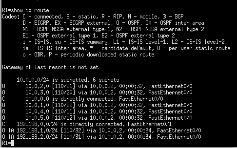


<h3> 5) Verificación de conexiones por medio de ping </h3>

Para verificar el funcionamiento de la topología y podemos ejecurar el comando <strong>ping</strong> entre los PCs.

```bash
ping 192.168.1.2
ping 192.168.2.2
```
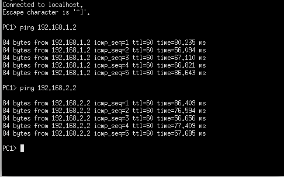

</div>