

<h1> Los sistemas de información en los negocios globales contemporáneos<h1>

<h1 style = "color:#066694"> <I> LOS GIGANTES DE SAN FRANCISCO GANAN EN
GRANDE CON LA TECNOLOGÍA DE LA INFORMACIÓN </I></h1>

Los  Gigantes de San Francisco son uno de los equipos de beisbol mas antiguos de Estados Unidos y uno de los mas exitosos. (Cuentan con mas jugadores en el salon de la fama que los demas equipos de beisbol).
 
Son el equipo que mas juegos a ganado en la historia del deporte profesional estadounidense. Los Gigantes ha caturado 23 banderines de la liga nacional y  han judado 20 competencias de la serie mundial.
 
El beisbol es un juego en el que se aplican mucho las estadisticas, por lo que todos los principales equipos analizan de manera constante sus datos sobre el rendimineto de los jugadores y el posicionamiento optimo en el campo. Pero los Gigantes esta haciendo mas que eso:
Actualmente esta empleando 4 tecnologias una enfocada al desarrollo deportivo y otras 3 para maximizar los ingresos.
 
<strong>Sistema de video de Sportsvision llamado  <mark>FIELDf/x</mark>: </strong> El cual registra digitalmente en tiempo real la posicion de todos los jugadores y las pelotas bateadas. El sistema genera estadisticas defensivas como la dificultad de una atrapada y la probabilidad de que un jardinero especifico realice esa atrapada.
 
<strong>FIELDf/x</strong> genera un  millon de registros por juego. Esto representa 5 mil millones de registros en tres años, la cantidad de tiempo requerida para proveer un alto nivel de confianza en los datos.
 
<strong>Gracias al software Qcue : </strong> <mark>En el cual el precio de un boleto varia de acuerdo con el nivel de demanda de un juego de beisbol especifico. </mark>Si un juego forma parte de una serie crucial, si los Gigantes juega con un rival de su misma division, o bien el juego parece estarse vendiendo especialmente rapido,los precios de los boletos aumentaran. Si por el contrario el juego no es muy actractivo o los boletos no se estan vendiendo bien el precio disminuye. (Los Gigantes han vendido el 100%
de sus juegos en casa desde octubre de 2010, y lograron aumentar las ventas de los abonos de temporada de 21,000 en 2010 a 29,000 en 2012.)
 
<strong>los Gigantes crearon un mercado secundario de boletos en línea</strong>, Donde los propietarios de los abonos puede vende los boletos que no van a usar. <mark>(cada abonado que no asiste a un partido representa una perdidad de 20 dolares para la franquincia en ventas de comida y mercancia)</mark>
 
<strong>Los Gigantes también aprovecharon la tecnología inalámbrica para mejorar la experiencia de sus aficionados. </strong>Hay una red que se extiende desde los asientos y pasa por los puestos de comidas hasta ciertas áreas fuera del estadio, y es una de las redes inalámbricas públicas más grandes del mundo. El estadio, AT&T Park, tiene una red inalámbrica gigante de alta velocidad, que los aficionados pueden usar para revisar las puntuaciones y videos destacados, actualizar sus redes sociales y enviar o recibir mensajes de correo electrónico.

Para incrementar los ingresos del estadio, los Gigantes de San Francisco desarrollaron un <mark>sistema de ajuste dinámico de precios de los boletos </mark> para ajustarlos a la demanda de los clientes y vender los asientos al precio óptimo. El equipo desarrolló otro <mark> sistema de venta de boletos que permite a los propietarios de boletos venderlos fácilmente en línea a alguien más.</mark> Una forma adicional de cautivar a los clientes es <mark>implementar tecnología de información moderna en el AT&T Park, incluyendo una red inalámbrica Wi-Fi masiva con servicios interactivos.</mark> Para mejorar el rendimiento de los jugadores, los Gigantes <mark>implementaron un sistema que captura video sobre los jugadores y luego usa los datos para analizar sus estadísticas defensivas, incluyendo la velocidad y los tiempos de reacción.</mark>

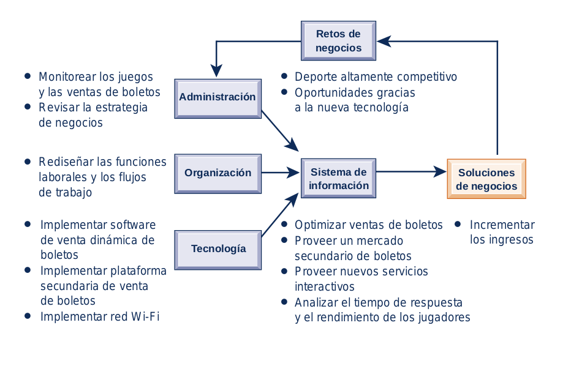

<h1 style = "color:#066694"> <I> 1.1) ¿CÓMO TRANSFORMAN LOS SISTEMAS DE INFORMACIÓN A LOS NEGOCIOS Y POR QUÉ SON TAN ESENCIALES PARA OPERAR Y ADMINISTRAR UN NEGOCIO EN LA ACTUALIDAD?</I></h1>

Los negocios ya no son los mismos en Estados Unidos ni en el resto de la economía global. En 2014 las empresas estadounidenses invertirían cerca de $817 mil millones en hardware, software y equipo de telecomunicaciones para los sistemas de información. Además, invertirían otros $230 mil millones en consultoría y servicios de negocios y administración, <mark>gran parte de lo cual implica el rediseño de las operaciones comerciales de las empresas para sacar provecho de estas nuevas tecnologías.</mark>

<h2 style="color:#066694">  CÓMO TRANSFORMAN LOS SISTEMAS
DE INFORMACIÓN A LOS NEGOCIOS </h2> 

Podemos ver los resultados a nuestro alrededor si observamos cómo hacen negocios las personas. <mark>Los cambios en la tecnología, junto con los nuevos modelos de negocios innovadores, transformaron la vida social y las prácticas de negocios.</mark>
 
Cada ves hay mas usuarios de  smartphone y tablets, mas gente comprando en linea, mas usuarios de redes sociales (Facebook, Twitter, blogs. etc), el uso masivo de correos electronicos y los webinarios.
Han provocado que estas herramientas sean esenciales en los negocios ya que ahi es donde puede encontrar a sus clientes, proveedores y colegas.
 
El crecimento de internet, de la cantidad de blogs y dominios registrados, y del comercio en linea a generado que empresas como <strong> UPS </strong> <mark>tengan que implementar tecnologia de la informacion para dectectar y responder a la demanda cambiante de los clientes,reducir inventarios a los niveles mas bajos posibles y lograr niveles mas altos de eficiencia operacional. </mark> Las cadenas de suministro se han vuelto mas aceleradas, con empresas de todos los tamaños que dependen del inventario justo a tiempo para reducir sus costos indirectos y llegar mas rapido al mercado.
  
 Ademas las nuevas leyes federales de seguridad y contabilidad, que requieren que muchas empresas almacenen sus mensajes de correo electrónico por cinco años, aunadas a las leyes laborales y de salud existentes, que solicitan que las empresas almacenen los datos de exposición química de los empleados hasta por 60 años, <mark>estimulan el crecimiento de la información digital a una tasa estimada de 5 exabytes al año.</mark>

<h2 style="color:#066694">  NOVEDADES EN LOS SISTEMAS DE INFORMACIÓN
GERENCIAL </h2> 

¡Hay muchas! Gracias a estas novedades en los sistemas de informacion aparecen nuevos negocios e industrias, los anteriores desaparecen y las empresas exitosas
son las que aprenden a usar las nuevas tecnologías.
 
En el área de tecnología hay <mark>tres cambios interrelacionados: (1) la adopción generalizada de la <strong>plataforma computacional móvil</strong>; (2) el crecimiento en cuanto al uso comercial de los <strong>big data</strong>, y (3) el crecimiento de la <strong>computación en la nube</strong></mark>, donde se ejecuta cada vez más software de negocios a través de Internet.
 
Los dispositivos<strong> iPhone, iPad, las tablet Android y los smartphone </strong> no son sólo aparatos o puntos de entretenimiento. Representan las nuevas plataformas de computación emergentes, con base en un arreglo de nuevas tecnologías de hardware y software. <mark>Los gerentes están utilizando con mayor frecuencia estos dispositivos para coordinar su trabajo, comunicarse con los empleados y proveer información para la toma de decisiones</mark>. A estos desarrollos les llamamos la <strong>plataforma digital móvil</strong>.
 
La solidez de la computación en la nube y el crecimiento de la <strong>plataforma digital móvil</strong> permiten a las organizaciones confiar más en el teletrabajo, el trabajo remoto y la toma de decisiones distribuida. <mark>Esta misma plataforma significa que las empresas pueden subcontratar más trabajo y depender de los mercados (en vez de los empleados) para generar valor. </mark>También implica que las empresas puedan colaborar con los proveedores y clientes para crear nuevos productos, o producir los existentes de una manera más eficiente.

 1. <h3 style="color:#066694"> Tecnologia </h3> 

* #### Cambio

<strong>La plataforma de computación en la nube</strong> emerge como una importante área de innovación en los negocios

* #### Impacto En Los Negocios

<mark>Un conjunto flexible de computadoras en Internet empieza a llevar a cabo tareas que antes se realizaban en computadoras corporativas. </mark>Las principales aplicaciones de negocios se ofrecen en línea como un servicio de Internet (Software como un servicio, o SaaS).

* #### Cambio

<strong>Big data.</strong>

* #### Impacto En Los Negocios

<mark>Las empresas buscan perspectivas de los enormes volúmenes de datos del tráfico Web,</mark> los mensajes de correo electrónico, el contenido de los social media y las máquinas (sensores) que requieren nuevas herramientas administrativas para capturar, almacenar y analizar.

* #### Cambio

<strong>Emerge una plataforma digital móvil</strong> para competir con la PC como
un sistema de negocios

* #### Impacto En Los Negocios

<mark>El iPhone de Apple y tanto las computadoras tipo Tablet como los dispositivos móviles Android pueden descargar cientos de miles de aplicaciones para dar soporte a los servicios de colaboración,</mark> basados en la ubicación y la comunicación con los colegas. Las pequeñas computadoras tipo Tablet, incluyendo el iPad y el Kindle Fire, desafían a las laptop convencionales como plataformas de computación para los consumidores y el área corporativa.

 2. <h3 style="color:#066694"> Administración
 </h3> 

* #### Cambio

<strong>Los gerentes adoptan el software de colaboración en línea y redes sociales para mejorar la coordinación, la colaboración y la compartición del conocimiento.</strong> 

* #### Impacto En Los Negocios

Más de 100 millones de profesionales de negocios en todo el mundo utilizan Google Apps, Google Sites, Microsoft Windows Sharepoint Services y Lotus Connections de IBM para <mark>ofrecer soporte a los blogs, la administración de proyectos, las reuniones en línea, los perfiles personales, los sitios sociales favoritos y las comunidades en línea.</mark>

* #### Cambio

<strong>Se aceleran las aplicaciones de inteligencia de negocios.</strong>

* #### Impacto En Los Negocios

Los análisis de datos más poderosos y los tableros de control interactivos proporcionan a los gerentes <mark>información en tiempo real sobre el desempeño, para que mejoren sus procesos de toma de decisiones.</mark>

* #### Cambio

<strong>Las reuniones virtuales proliferan.</strong>

* #### Impacto En Los Negocios

Los gerentes adoptan las tecnologías de conferencias de video con telepresencia y
conferencias Web para <strong>reducir el tiempo y el costo de viajar, a la vez que se
mejoran la colaboración y el proceso de toma de decisiones. </strong>

 3. <h3 style="color:#066694"> Organizaciones </h3> 

* #### Cambio

<strong>Negocios sociales.</strong> 

* #### Impacto En Los Negocios

Los negocios usan las plataformas de redes sociales, como Facebook, Twitter y herramientas sociales corporativas internas,<mark> para profundizar en las interacciones con los empleados, clientes y proveedores. Los empleados usan blogs, wikis, mensajes de texto por correo electrónico y mensajes SMS para interactuar en las comunidades en línea.</mark>

* #### Cambio

<strong>El trabajo a distancia a través de Internet adquiere impulso en el
entorno de trabajo.</strong>

* #### Impacto En Los Negocios

Internet, las laptop inalámbricas, los smartphone y las computadoras tipo Tablet hacen posible que cada vez más personas trabajen lejos de la oficina tradicional. <mark>55% de los negocios en Estados Unidos tiene cierta forma de programa de trabajo remoto.</mark>

* #### Cambio

<strong>Cocreación del valor comercial.</strong>

* #### Impacto En Los Negocios

<mark>Las fuentes de valor comercial cambian de productos a soluciones y experiencias, y de fuentes internas a redes de proveedores y colaboración</mark> con los clientes. Las cadenas de suministro y el desarrollo de productos son más globales y colaborativos; las interacciones con los clientes ayudan a las empresas a definir nuevos productos y servicios.

<h1 style = "color:#066694"> <I>CONOZCA A LOS NUEVOS TRABAJADORES MÓVILES </I></h1>

<mark>En la actualidad la tecnología móvil se esparce hacia las funciones laborales básicas</mark>, como los materiales de marketing para los representantes farmacéuticos, el software de cuentas de clientes para los técnicos de servicio y las apps para que los granjeros evalúen la calidad de la leche de vaca.
 
<strong>McClendon’s Select,</strong> una granja orgánica familiar ubicada en Peoria, depende del <strong> iPad </strong> <mark>en cada etapa de su operación: sembrar campos, cosechar cultivos, surtir pedidos, cargar camiones, entregar a los restaurantes y vender productos en los mercados de campesinos.</mark>
 
<strong>La app mydlinkLite </strong> en su iPad le permite ver las imágenes mientras conduce el arado.
 
El gerente realiza el mantenimiento de registros requerido para mantener una certificación orgánica. Con la conexión de su <strong> iPad a la red celular 3G</strong> puede acceder <strong>al sistema de administración COG Pro</strong> <mark>basado en Web para actualizar sus registros de tipos de semillas, además de dónde y cuándo deben sembrarse.</mark>
 
Cada empleado toma un <strong>iPad</strong> al llegar a trabajar en la mañana y usa <mark>una app propietaria llamada</mark> <strong>Picker Entry</strong> <mark>para generar una lista de productos a recolectar en el campo a partir de los pedidos en línea colocados por los restaurantes y consumidores.</mark>
 
Utilizando la tecnología <strong>AirPrint</strong> en el iPad, <mark>los empleados imprimen en forma inalámbrica sus pedidos y se dirigen al campo a recolectar el producto.</mark> Una vez que los empleados regresan del campo, agregan el inventario que recolectaron usando un <strong>iPad</strong>. Pueden ver todos los restaurantes en la pantalla, tocar el nombre del restaurante y surtir los pedidos justo desde el <strong> iPad.</strong>
 
<strong>Picker Entry </strong> <mark>genera un informe indicando hacia dónde va cada caja en el camión para la entrega en restaurantes.</mark>
 
El uso de dispositivos portátiles para que el negocio opere no se limita a compañías pequeñas.<strong> PepsiCo</strong>
empresa con presencia en todo el mundo, y que tiene cerca de 280,000 empleados.<mark>Tiene una compleja red de sistemas de distribución de interbloqueo para mover sus productos desde sus instalaciones de manufactura y almacén a los camiones, y luego a las tiendas para satisfacer a tiempo la demanda de los clientes.</mark>
<strong>PepsiCo</strong> opera diariamente cerca de 17,000 rutas de distribución. El <strong>iPhone y el iPad</strong> ayudan a los empleados de la división North America Beverages de <strong>PepsiCo</strong> a <mark>asegurar que los productos correctos lleguen a las ubicaciones correctas de la manera más rápida y eficiente
posible.</mark> 
 
<strong>PepsiCo North America Beverages</strong> creó una app interna personalizada para el <strong>iPhone</strong> conocida como <strong>Power4Merch</strong>, que notifica de inmediato a los vendedores cuando un conductor llega a una tienda. <mark>El iPhone del vendedor tiene una tarjeta de tiempo electrónica y puede ver su itinerario, los detalles de la tienda, los perfiles de la cuenta y todo lo que necesita saber para dar servicio a la tienda.</mark> 
 
La app <strong>Manager’s Briefcase</strong> provee a <mark>los gerentes de ventas por territorios versiones electrónicas de toda la papelería y los recursos que necesitan para administrar sus equipos, incluyendo auditorías de tiendas, formularios de formación para los empleados y notificaciones automatizadas a los vendedores.</mark>
Un gerente puede asignar personal directamente en el <strong> iPad</strong>; por ejemplo, este dispositivo envía automáticamente una notificación al <strong>iPhone</strong> del vendedor para informarle que tiene que realizar una parada adicional.
 
La segunda app del <strong>iPad</strong>, conocida como <strong>SPOTLight</strong>, da a los gerentes el acceso inmediato a su <mark>contenido de SharePoint basado en Web. Pueden obtener precios, desplegar planogramas, acuerdos de desarrollo con los clientes o nuevos contratos.</mark>
<strong>Los sistemas de iPhone y iPad de PepsiCo están integrados con sus sistemas establecidos de información corporativa. </strong>
La empresa usa <strong>Mobile Device Management de AirWatch</strong> para implementar y administrar en forma segura sus aplicaciones móviles, y también aprovecha la seguridad integrada en los dispositivos <strong>iPhone y iPad</strong> para protegerlos contra el acceso no autorizado.
 
<strong>Coca-Cola Enterprises Inc. (CCE)</strong>, se beneficia también de la tecnología móvil. <strong>CCE</strong> usa software de servicio móvil de <strong>ServiceMax Inc.</strong> en el campo para optimizar las actividades de trabajo de sus técnicos, <strong>CCE </strong> utiliza  <strong>ServiceMax Inc.</strong> <mark>para enviar a los técnicos un día completo de llamadas de servicio, ofrecer información detallada de los clientes, actualizar automáticamente las listas de refacciones almacenadas en sus camiones y transferir información al departamento de facturación.</mark> El nuevo sistema recortó en un tercio el
tiempo de administración para los técnicos de servicio.
<strong>ServiceMax </strong> cobra una suscripción anual de aproximadamente $1,000
por persona.

<h2 style="color:#066694"> DESAFÍOS Y OPORTUNIDADES DE LA GLOBALIZACIÓN:
UN MUNDO PLANO </h2> 

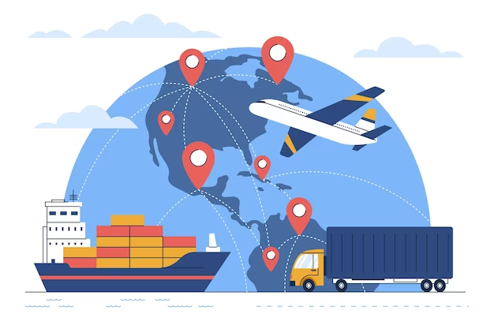

En 2005 el periodista Thomas Friedman escribió un libro inspirador que declaraba que ahora el mundo era <strong>plano</strong>, con lo cual quería decir que <mark>Internet y las comunicaciones globales han reducido considerablemente las ventajas económicas y culturales de los países desarrollados.</mark> Friedman argumentaba que Estados Unidos y los países europeos luchaban por sus vidas económicas <mark>compitiendo por empleos, mercados, recursos e incluso ideas con poblaciones muy motivadas y con un alto nivel de educación, en áreas laborales de bajos sueldos en países con menos desarrollo.</mark>
 
<strong>Qué tiene que ver la globalización con los sistemas de información gerencial?</strong>
 
La respuesta es sencilla: todo. <mark>El surgimiento de Internet para convertirse en un sistema de comunicaciones mundial ha reducido de manera drástica los costos de operar y realizar transacciones a una escala global. Ahora la comunicación entre el piso de una fábrica en Shanghai y un centro de distribución en Rapid Falls, Dakota del Sur, es instantánea y prácticamente gratuita. </mark>Los clientes pueden ir de compras en un mercado mundial en el que obtienen información sobre precios y calidad de manera confiable las 24 horas del día. <mark>Las empresas que producen bienes y servicios a escala global logran reducciones extraordinarias en los costos al encontrar proveedores de bajo costo y administrar instalaciones de producción en otros países.</mark> Las empresas de servicios de Internet, como Google o eBay, pueden duplicar sus modelos de negocios y servicios en varios países sin tener que rediseñar su costosa infraestructura de sistemas de información de costo fijo.

<h2 style="color:#066694"> LA EMPRESA DIGITAL EMERGENTE </h2> 

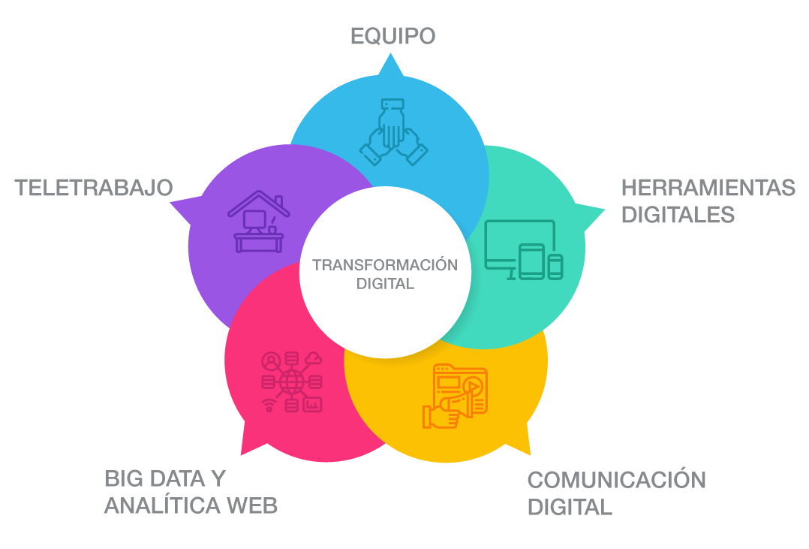

<strong>En una empresa digital</strong>, casi todas las relaciones de negocios significativas de la organización con los clientes, proveedores y empleados están habilitadas y mediadas en forma digital. Los procesos de negocios básicos se realizan por medio de redes digitales que abarcan a toda la empresa, o que enlazan a varias organizaciones.
 
Los <strong>procesos de negocios</strong> se refieren al conjunto de tareas y comportamientos relacionados en forma lógica, que <mark>las organizaciones desarrollan con el tiempo para producir resultados de negocios específicos, y la forma única en que se organizan y coordinan estas actividades.</mark> Desarrollar un nuevo producto, generar y completar un pedido, crear un plan de marketing y contratar a un empleado
 
<mark>En una empresa digital siempre está disponible cualquier pieza de información que se requiera para dar soporte a las decisiones de negocios clave en cualquier parte de la empresa.</mark>
 
Las <strong>empresas digitales</strong> detectan y responden a sus entornos con mucha más rapidez
que las compañías tradicionales, lo cual les brinda mayor flexibilidad para sobrevivir en
tiempos turbulentos.<strong>(pueden manejar horarios de jornada continua o tradicionales.)</strong>

<h2 style="color:#066694"> OBJETIVOS DE NEGOCIOS ESTRATÉGICOS
DE LOS SISTEMAS DE INFORMACIÓN</h2> 

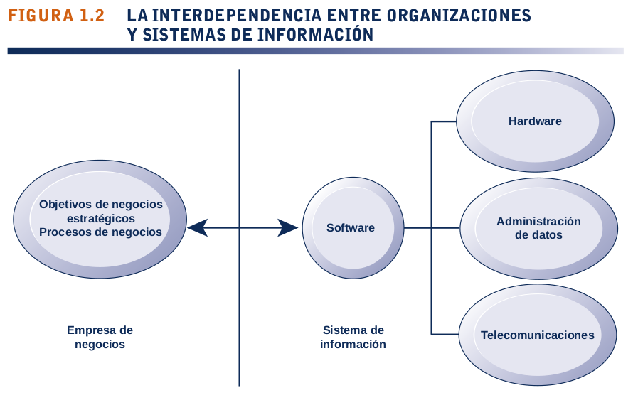

<strong>¿Por qué son tan esenciales los sistemas de información en la actualidad?</strong>
<strong>¿Por qué la empresas están invirtiendo tanto en sistemas y tecnologías de información?</strong>
 
<mark>Los sistemas de información son esenciales para realizar las actividades comerciales diarias en la mayoría de países avanzados, así como para lograr los objetivos de negocios estratégicos.</mark> Sectores completos de la economía serían casi inconcebibles sin las inversiones sustanciales en los sistemas de información.
 
<strong>Basicamente ninguna empresa mediana o  grande en un pais desarrollado puede sobrevivir sin sistemas de informacion ya que la mayoria de sus actividades estan sostenidos por estos sistemas (inventarios,facturacion,registros. etc).</strong>
 
Hay una interdependencia cada vez mayor entre la habilidad de una empresa para usar la tecnología de la información y su destreza para implementar estrategias corporativas y lograr los objetivos corporativos
  
<mark> Específicamente, las empresas de negocios invierten mucho en sistemas de información para lograr seis objetivos de negocios estratégicos: excelencia operacional; nuevos productos, servicios y modelos de negocios; intimidad con el cliente y con el proveedor; toma de decisiones mejorada; ventaja competitiva, y sobrevivencia.</mark>

 1. <h3 style="color:#066694"> Excelencia opercional </h3> 

<mark>Los negocios buscan de manera continua mejorar la eficiencia de sus operaciones para poder obtener una mayor rentabilidad. </mark>Los sistemas y tecnologías de información son algunas de las herramientas más importantes disponibles para que los gerentes obtengan mayores niveles de eficiencia y productividad.
 
<mark> Walmart, la cadena de tiendas de venta al detalle más grande de la Tierra, ejemplifica el poder de los sistemas de información junto con sus brillantes prácticas de negocios y su gerencia de apoyo para obtener una eficiencia operacional a nivel mundial</mark>. En el año fiscal 2014 obtuvo $473 mil millones en ventas, casi una décima parte de las ventas al detalle en Estados Unidos en gran parte debido a su sistema 
 
<strong>Retail Link</strong>, <mark>que enlaza digitalmente a sus proveedores con cada una de sus tiendas. Tan pronto como un cliente compra un artículo, el proveedor que lo supervisa sabe que debe enviar un reemplazo a los anaqueles.</mark>

 2. <h3 style="color:#066694">Nuevos productos, servicios y modelos de negocios</h3> 

<mark>Los sistemas de información y las tecnologías son una importante herramienta de habilitación para que las empresas creen nuevos productos y servicios, así como modelos de negocios totalmente nuevos.</mark>
 
<strong>Un modelo de negocios</strong> <mark>describe la forma en que una empresa produce, entrega y vende un producto o servicio para crear riqueza.</mark>
 
Actualmente la industria de la música es muy distinta a la de hace una década. <strong>Apple Inc</strong>. transformó un antiguo modelo de negocios de distribución de música basado en <strong>discos de vinilo, cintas y CDs,</strong> <mark>en un modelo de distribución legal en línea a partir de su propia plataforma de tecnología iPod. </mark>Apple ha prosperado desde un flujo continuo de innovaciones del iPod,incluyendo el  <strong>servicio de música iTunes </strong>, el iPad y el iPhone.

 3. <h3 style="color:#066694">Intimidad con clientes y proveedores</h3> 

Cuando una empresa conoce realmente a sus clientes y les da un buen servicio, <strong>por lo general ellos responden volviendo y comprando más.</strong> <mark>Esto genera ingresos y ganancias</mark>. Lo mismo ocurre con los proveedores: <mark>cuanto más se involucre un negocio con ellos, mejor será la forma en que ofrezcan aportaciones vitales.</mark><strong> Esto reduce los costos.</strong>
 
<strong>El hotel Mandarin Oriental </strong>en Manhattan, junto con otros hoteles de gama alta, ejemplifican el uso de los sistemas y tecnologías de información para lograr una intimidad con el cliente. <mark>Estos hoteles usan computadoras para registrar las preferencias de los huéspedes, como la temperatura preferida en la habitación, el tiempo de llegada, los números telefónicos que marcan con frecuencia, así como sus programas favoritos de televisión, y almacenan esta información en una gran base de datos.</mark> <strong>Las habitaciones individuales en los hoteles están conectadas en red a una computadora servidor de red central, de modo que se puedan supervisar o controlar de forma remota.</strong> <mark>Cuando un cliente llega a uno de estos hoteles, el sistema cambia automáticamente las condiciones de la habitación, como reducir la intensidad de las luces, ajustar la temperatura o seleccionar la música apropiada, con base en el perfil digital del huésped. Los hoteles también analizan los datos de sus clientes para identificar a los que son frecuentes y desarrollar campañas de marketing individuales con base en sus preferencias.</mark>
 
<strong>JCPenney</strong> es un ejemplo de los beneficios de la intimidad con proveedores habilitada
mediante sistemas de información. Cada vez que alguien compra una camisa de vestir en una tienda <strong>JCPenney</strong> en Estados Unidos, <mark>el registro de la venta aparece de inmediato en Hong Kong en las computadoras del <strong>proveedor TAL Apparel Ltd.</strong></mark>, un fabricante contratista que produce una de las ocho camisas de vestir que se venden en Estados Unidos.<mark> <strong>TAL </strong>pasa los números a través de un modelo de computadora que el mismo contratista desarrolló y entonces decide cuántas camisas de repuesto fabricar y en qué estilos, colores y tallas. Luego las envía a cada tienda de <strong>JCPenney </strong>,</mark> sin pasar por los almacenes del vendedor minorista.<mark> En otras palabras, el inventario de camisas de <strong>JCPenney </strong>, es casi cero, al igual que el costo de almacenarlas.</mark>

4. <h3 style="color:#066694">Toma de decisiones mejorada</h3> 

<strong>Muchos gerentes de negocios trabajan en un banco de niebla de información, sin nunca contar realmente con los datos correctos en el momento oportuno para tomar una decisión informada. </strong>Por el contrario, dependen de las proyecciones, las mejores suposiciones y de la suerte. El resultado es una producción excesiva o baja de bienes y servicios, una mala asignación de los recursos y tiempos de respuesta deficientes.
 
<mark>En la década anterior los sistemas y tecnologías de información hicieron posible que a la hora de tomar decisiones los gerentes usaran datos en tiempo real provenientes del mercado.</mark>
 
<strong>Verizon Corporation</strong>, una de las más grandes compañías de telecomunicaciones en Estados Unidos, <mark><strong>usa un tablero de control digital basado en Web </strong>para proveer a los gerentes de información precisa en tiempo real sobre las quejas de los clientes, el desempeño de la red para cada localidad atendida, así como los apagones o las líneas dañadas por tormentas.</mark> Con esta información los gerentes pueden asignar de inmediato recursos de reparación a las áreas afectadas, informar a los consumidores sobre los esfuerzos de reparación y restaurar el servicio con rapidez.

5. <h3 style="color:#066694">Ventaja competitiva</h3>

 

Cuando las empresas obtienen uno o más de estos objetivos de negocios <strong>excelencia operacional, nuevos productos, servicios y modelos de negocios, intimidad con los clientes y los proveedores, y toma de decisiones mejorada </strong>, <mark>es probable que ya hayan logrado una ventaja competitiva.</mark> Hacer las cosas mejor que sus competidores, cobrar menos por productos superiores y responder tanto a los clientes como a los proveedores en tiempo real, son puntos positivos que producen mayores ventas y perfiles más
altos que sus competidores no podrán igualar. Como veremos más adelante en este capítulo,<strong> Apple Inc., Walmart y UPS </strong><mark>son líderes en la industria debido a que saben cómo usar los sistemas de información para este propósito.</mark>

6. <h3 style="color:#066694">Sobrevivencia</h3>

 

<mark>Las empresas de negocios también invierten en sistemas de información y tecnologías debido a que son indispensables para realizar las actividades comerciales. Algunas veces estas <strong>necesidades</strong> se ven impulsadas por cambios de nivel industrial.</mark>
 Por ejemplo, después de que <strong>Citibank </strong> introdujo en 1977 las primeras máquinas de cajero automático <strong> (ATM) </strong> en la región de Nueva York para atraer clientes a través de niveles más altos de servicios, sus competidores se apresuraron a proveer de cajeros <strong>ATM </strong> a sus clientes para mantenerse a la par con <strong>Citibank.</strong> Actualmente casi todos los bancos en Estados Unidos tienen cajeros <strong> ATM </strong>regionales y se enlazan con redes de cajeros ATM nacionales e internacionales, como <strong>CIRRUS.</strong><mark> El hecho de proveer de servicios <strong> ATM </strong> a los clientes bancarios minoristas es un requisito sencillo para estar y sobrevivir en el negocio bancario minorista.</mark>
  
<mark>Hay muchos estatutos federales y estatales además de regulaciones que crean un deber legal para las empresas y sus empleados con respecto a conservar los registros, incluyendo los digitales.</mark> Por ejemplo, la <strong>Ley de control de sustancias tóxicas (1976)</strong> que regula la exposición de los trabajadores estadounidenses a más de 75,000 químicos tóxicos, requiere que las empresas conserven durante 30 años los registros sobre la exposición de los empleados. <strong>La Ley Sarbanes-Oxley (2002),</strong> destinada a mejorar la rendición de cuentas de las asociaciones públicas y sus auditores, exige a las empresas de contabilidad pública certificadas que auditan a las empresas públicas que conserven por cinco años los informes y registros de trabajo de las auditorías, incluyendo todos los correos electrónicos. <strong>La ley Dodd-Frank de Reforma de Wall Street y Protección al Consumidor (2010),</strong> destinada a reforzar la regulación de la industria bancaria, requiere que las empresas guarden sus registros durante diez años. Muchas otras piezas de legislación federal 1516 Parte Uno Organizaciones, administración y la empresa en red y estatal en el cuidado de la salud, los servicios financieros, la educación y la protección privada, imponen requisitos considerables de retención de datos y los informes sobre las empresas estadounidenses. <mark>Éstas recurren a los sistemas y tecnologías de información para obtener la capacidad de responder a estos desafíos.</mark>

<h1 style="color:#066694">1.2) ¿QUÉ ES UN SISTEMA DE INFORMACIÓN? ¿CÓMO FUNCIONA? ¿CUÁLES SON SUS COMPONENTES DE ADMINISTRACIÓN, ORGANIZACIÓN Y TECNOLOGÍA, Y POR QUÉ LOS
ACTIVOS COMPLEMENTARIOS SON ESENCIALES PARA ASEGURAR QUE LOS SISTEMAS DE
INFORMACIÓN PROPORCIONEN UN VALOR GENUINO PARA LAS ORGANIZACIONES?</h1>

Hasta aquí hemos utilizado los términos sistemas y tecnologías de información de manera informal, sin definirlos. <strong>La tecnología de la información (TI)</strong> <mark>consiste en todo el hardware y software que una empresa necesita usar para poder cumplir con sus objetivos de negocios. Esto incluye no sólo a los equipos de cómputo, los dispositivos de almacenamiento y los dispositivos móviles de bolsillo, sino también a los componentes de software, como los sistemas operativos Windows o Linux, la suite de productividad de escritorio Microsoft Office y los muchos miles de programas de computadora que se encuentran en la típica empresa de gran tamaño.</mark> Los <strong>sistemas de información </strong> son más complejos y la mejor manera de comprenderlos es analizarlos desde una perspectiva de tecnología y de negocios.

<h2 style="color:#066694">¿QUÉ ES UN SISTEMA DE INFORMACIÓN?</h2>

<strong>Es un conjunto de componentes interrelacionados que recolectan (o recuperan), procesan, almacenan y distribuyen información para apoyar los procesos de toma de decisiones y de control en una organización.
</strong>

 

<mark>Además de apoyar la toma de decisiones, la coordinación y el control, los sistemas de información también pueden ayudar a los gerentes y trabajadores del conocimiento a analizar problemas, visualizar temas complejos y crear nuevos productos.</mark>
 
Los sistemas de información contienen información sobre personas, lugares y cosas importantes dentro de la organización, o en el entorno que la rodea.
 
<strong>Información </strong><mark>son  los datos que se han modelado en una forma significativa y útil para los seres humanos.</mark><strong>Datos</strong> <mark>son flujos de elementos en bruto que representan los eventos que ocurren en las organizaciones o en el entorno físico antes de ordenarlos e interpretarlos de forma que las personas los puedan comprender y usar.</mark>

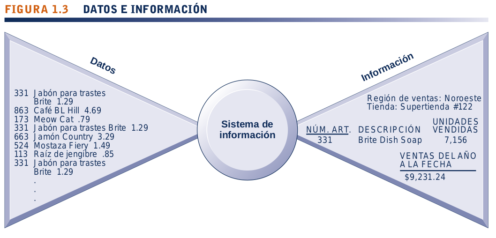

Un breve y útil ejemplo de comparación entre información y datos pueden ser las cajas registradoras de los supermercados, donde se exploran millones de piezas de datos en los códigos de barras, los cuales describen cada producto. Se puede obtener un total de dichas piezas de datos y analizarlo para conseguir información relevante, como el total de botellas de detergente para trastes vendidas en una tienda específica, las marcas de detergente para trastes que se venden con más rapidez en esa tienda o territorio de ventas, o la cantidad total que se gastó en esa marca de detergente para trastes en esa
tienda o región de ventas.

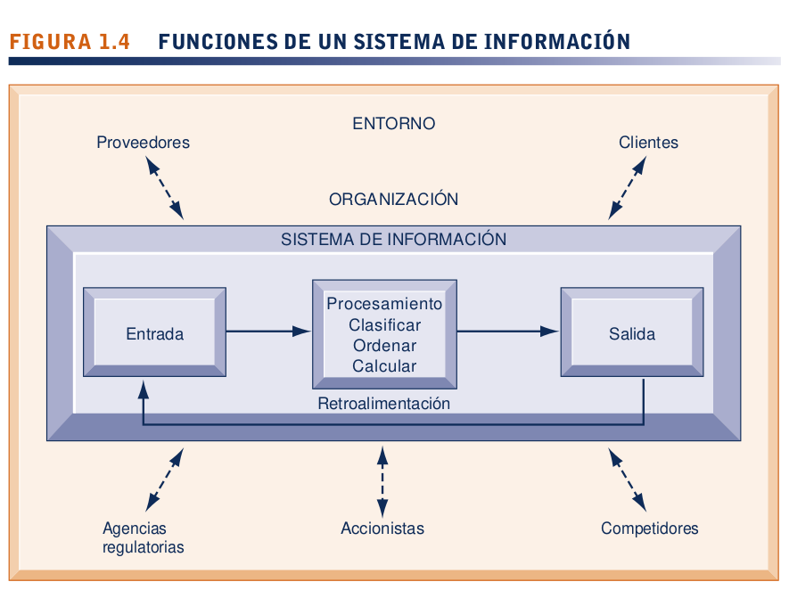

 

<mark>Hay tres actividades en un sistema de información que producen los datos necesarios para que las organizaciones tomen decisiones, controlen las operaciones, analicen problemas y creen nuevos productos o servicios. </mark>Estas actividades son: <strong>entrada, procesamiento y salida </strong>. <strong>La entrada, captura o recolecta</strong> los datos en bruto desde dentro de la organización o a través de su entorno externo. <strong>El procesamiento</strong> convierte esta entrada en bruto en un formato significativo. <strong>La salida</strong> transfiere la información procesada a las personas que harán uso de ella, o a las actividades para las que se utilizará.
 
<mark>Los sistemas de información también requieren retroalimentación, la cual es la salida que se devuelve a los miembros adecuados de la organización para ayudarles a evaluar o corregir la etapa de entrada.</mark>
 
<mark>En el sistema de venta de boletos de los Gigantes de San Francisco la entrada en bruto consiste en los datos del pedido de boletos,</mark> como el nombre del comprador, su dirección, número de tarjeta de crédito, cantidad de boletos pedidos y la fecha del juego para el que desea comprar los boletos. Otra entrada sería el precio del boleto, el cual fluctuaría con base en el análisis computacional del precio óptimo a cobrar para un boleto de un juego específico. <mark>Las computadoras almacenan estos datos y los procesan para calcular los totales de los pedidos, rastrear las compras de boletos y enviar solicitudes de pago a las compañías de tarjetas de crédito.</mark><mark> La salida consiste en los boletos que hay que imprimir, los recibos de los pedidos y los informes sobre los pedidos en línea de boletos. </mark><strong>El sistema provee información significativa, como el número de boletos vendidos para un juego específico o a cierto precio, el total de boletos vendidos cada año y los clientes frecuentes.</strong>

 

<mark>Las computadoras electrónicas y los programas de software relacionados son la base técnica, las herramientas y los materiales de los modernos sistemas de información.</mark> <strong>Las computadoras</strong> proporcionan el equipo para almacenar y procesar información.</strong> Los programas de computadora, o software</strong>, son conjuntos de instrucciones de operación que dirigen y controlan el procesamiento de las computadoras. Es importante saber cómo funcionan las computadoras y los programas informáticos al diseñar soluciones para problemas organizacionales, pero las computadoras son solo parte de un sistema de información.
 
Una analogía adecuada es la de una vivienda. Las casas se construyen con martillos, clavos y madera, pero éstos no constituyen una casa. La arquitectura, el diseño, el entorno, el paisaje y todas las decisiones que conducen a la creación de estas características forman parte de la casa y son cruciales para resolver el problema de poner un techo sobre nuestra cabeza. <mark>Las computadoras y los programas son los martillos, clavos y madera de los sistemas de información basados en computadora, pero por sí solos no pueden producir la información que necesita una organización en particular. </mark><strong>Para comprender los sistemas de información usted debe entender que están diseñados para resolver problemas así como conocer sus elementos arquitectónicos y de diseño, y los procesos organizacionales que conducen a estas soluciones.</strong>

<h2 style="color:#066694">DIMENSIONES DE LOS SISTEMAS DE INFORMACIÓN</h2>

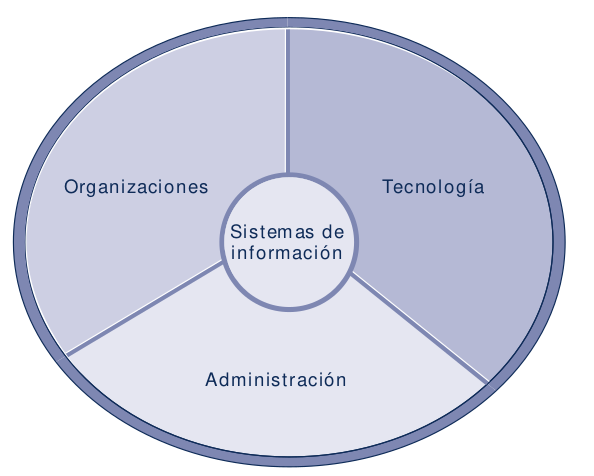

 

Para comprender los sistemas de informacion debe conocer las dimensiones mas amplias de la organizacion.La cual abarca un entendimiento de los niveles gerenciales y organizacionales de los sistemas, así como de sus dimensiones técnicas, como el <strong>alfabetismo en los sistemas de información</strong>. En cambio, <strong>el alfabetismo computacional</strong> se enfoca principalmente en el conocimiento de la tecnología de la información.
 
<strong>El campo de los sistemas de información gerencial (MIS) </strong>trata de obtener este alfabetismo más amplio en los sistemas de información. Los sistemas <strong>MIS</strong> tratan con
los aspectos del comportamiento al igual que con los aspectos técnicos que rodean el desarrollo, uso e impacto de los sistemas de información que utilizan los gerentes y empleados en la empresa. Examinemos cada una de las dimensiones de los sistemas de información:<strong> organizaciones, administración y tecnología de la información.</strong>

* <h3 style="color:#066694">Organizaciones</h3>

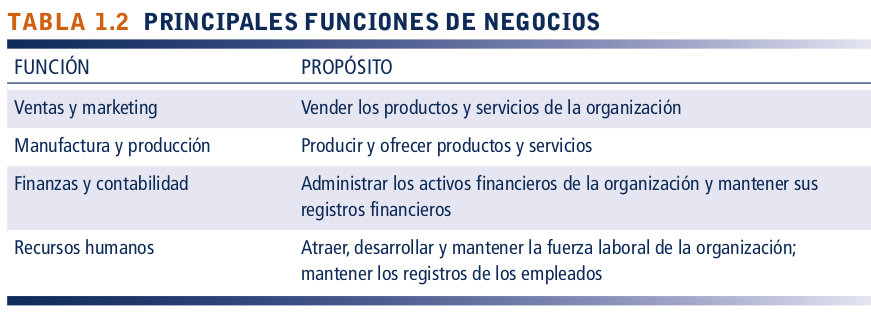

 

<strong>Los elementos clave de una organización son su gente, su estructura, sus
procesos de negocios, sus políticas y su cultura. </strong> <mark>Las organizaciones tienen una estructura compuesta por distintos niveles y especialidades. Sus estructuras revelan una clara división de labores. La autoridad y responsabilidad en una empresa de negocios se organizan como una jerarquía o estructura de pirámide. </mark>
 
Los niveles superiores de esta jerarquía son los <strong>empleados gerenciales, profesionales y técnicos</strong>, en tanto que en los niveles base de la pirámide está el <strong>personal de operaciones.</strong>
 
La gerencia de nivel superior toma decisiones estratégicas de largo alcance en cuanto a productos y servicios, además de asegurar el desempeño financiero de la empresa. La gerencia de nivel medio lleva a cabo los programas y planes de la gerencia de nivel superior y la gerencia operacional es responsable de supervisar las actividades diarias de la empresa. Los <strong>trabajadores del conocimiento</strong>, como son los ingenieros, científicos o arquitectos, diseñan productos o servicios y crean nuevo conocimiento para la empresa, en tanto que los <strong>trabajadores de datos (secretarias o asistentes administrativos)</strong> ayudan con la calendarización y las comunicaciones en todos los niveles de la empresa. <strong>Los trabajadores de producción o de servicio</strong> son los que realmente elaboran el producto y ofrecen el servicio.
 
Los expertos se emplean y capacitan para distintas funciones de negocios. Las principales funciones de negocios, o tareas especializadas que realizan las organizaciones comerciales, consisten en ventas y marketing, manufactura y producción, finanzas y contabilidad, y recursos humanos . <mark>Una organización coordina el trabajo mediante su jerarquía y sus procesos de negocios, los cuales son tareas y comportamientos relacionados en forma lógica para realizar el trabajo. Desarrollar un nuevo producto, cumplir con un pedido y contratar un empleado son ejemplos de procesos de negocios.</mark>
 
<strong>Los procesos de negocios de la mayoría de las organizaciones incluyen reglas formales para realizar tareas que se han desarrollado a través de un largo periodo</strong>. Estas reglas guían a los empleados en una variedad de procedimientos, desde elaborar una factura hasta responder a las quejas de los clientes. Algunos de estos procesos se hacen de manera manual. Los sistemas de información automatizan muchos procesos de negocios; por ejemplo, cómo recibe crédito un cliente o cómo se le factura,
lo cual se suele determinar por medio de un sistema de información que incorpora un conjunto de procesos formales de negocios. 

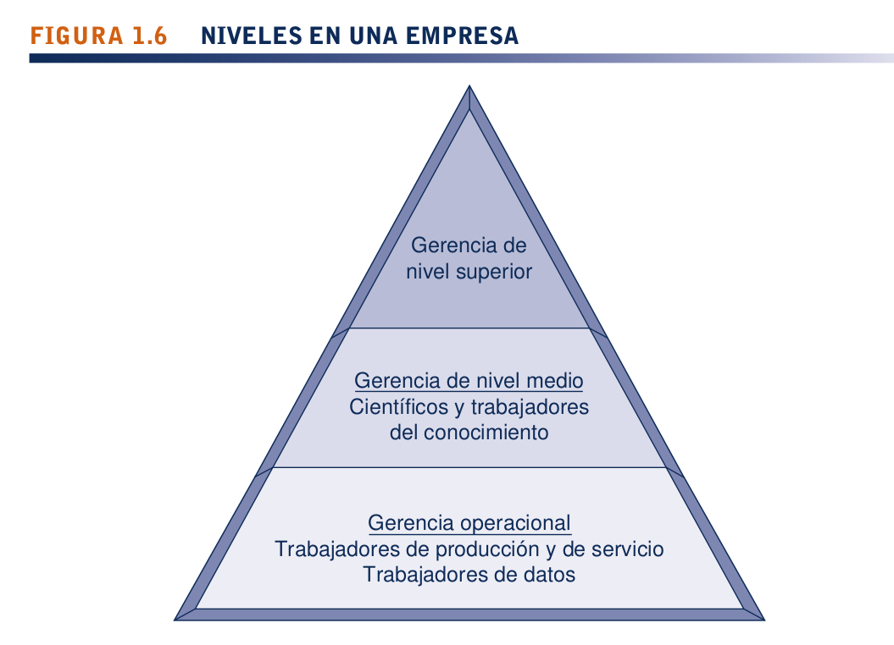

* <h3 style="color:#066694">Administración</h3>

 

<mark>El trabajo de la gerencia es dar sentido a las distintas situaciones a las que se enfrentan las organizaciones, tomar decisiones y formular planes de acción para resolver los problemas organizacionales.</mark> Los gerentes perciben los desafíos de negocios en el entorno; establecen la estrategia organizacional para responder a esos retos y asignan los recursos tanto financieros como humanos para coordinar el trabajo y tener éxito<mark>.Un gerente debe crear nuevos productos y servicios, e incluso de vez en cuando crear de nuevo la organización. Una buena parte de la responsabilidad de la gerencia es el trabajo creativo impulsado por el nuevo conocimiento y la información.</mark> <strong>La tecnología de la información puede desempeñar un rol poderoso para ayudar a los gerentes a diseñar y ofrecer nuevos productos y servicios, así como para redirigir y rediseñar sus organizaciones.</strong>

* <h3 style="color:#066694">Tecnología de la  información</h3>

 

<mark>La tecnología de la información es una de las diversas herramientas que utilizan los gerentes para 
enfrentar el cambio.</mark><strong>
 
El hardware </strong> de computadora es el equipo físico.  (computadoras,smartphone,dispositvos moviles.etc). <strong>
 
El software de computadora</strong> consiste en las instrucciones detalladas y preprogramadas que controlan y coordinan los componentes de hardware de computadora en un sistema de información.
 
<strong>La tecnología de administración de datos</strong> consiste en el software que gobierna la organización de los datos en medios de almacenamiento físico.
 
<strong>La tecnología de redes y telecomunicaciones </strong><mark>que consiste tanto en los dispositivos físicos como en el software, conecta las diversas piezas de hardware y transfiere datos de una ubicación física a otra.</mark> Las computadoras y el equipo de comunicaciones se pueden conectar en redes para compartir voz, datos, imágenes, sonido y video. Una red enlaza a dos o más computadoras para compartir datos o recursos, por ejemplo una impresora. 
 
La red más grande y utilizada del mundo es <strong>Internet</strong>, una <strong>red de redes</strong> global que utiliza estándares universales para conectar millones de redes distintas con cerca de 3 mil millones de usuarios en más de 230 países de todo el mundo.
 
<mark>Internet creó una nueva plataforma de tecnología “universal”, sobre la cual se pueden crear nuevos productos, servicios, estrategias y modelos de negocios.</mark> Esta misma plataforma tecnológica tiene usos internos, pues provee la conectividad para enlazar los distintos sistemas y redes dentro de una empresa. Las redes corporativas internas basadas en tecnología de Internet se denominan intranets. <strong>Las intranet </strong> privadas que se extienden a los usuarios autorizados fuera de la organización se denominan <strong>extranets </strong> y las empresas usan dichas redes para coordinar sus actividades con otras empresas, como realizar compras, colaborar en el diseño y otros tipos de trabajo interno de la organización. <mark>En la actualidad, para la mayoría de las empresas, el uso de la tecnología de Internet es tanto una necesidad de negocios como una ventaja competitiva. La Web puede servir como punto de partida para nuevos tipos de sistemas de información</mark>, como el sistema de rastreo de paquetes basado en Web de UPS.
<bt>
Todas estas tecnologías, junto con las personas requeridas para operarlas y administrarlas, representan recursos que se pueden compartir en toda la organización y constituyen <strong> la infraestructura de tecnología de la información (TI)</strong> de la empresa. <mark>La infraestructura de <strong>TI </strong>provee la base, o plataforma, desde la cual una empresa puede crear sus sistemas de información específicos. Cada organización debe diseñar y administrar con cuidado su infraestructura de <strong>TI</strong>, de modo que cuente con el conjunto de servicios tecnológicos que necesita para el trabajo que desea realizar con los sistemas de información</mark>
 
<strong>UPS invierte mucho en la tecnología de sistemas de información para aumentar la eficiencia de sus negocios y hacerlos más orientados al cliente.</strong> Utiliza una variedad de tecnologías de información, como sistemas de identificación de código de barras, redes inalámbricas, grandes computadoras mainframe, computadoras portátiles, Internet y muchas piezas distintas de software para rastrear paquetes, calcular cuotas, dar mantenimiento a las cuentas de los clientes y administrar la logística. Identifiquemos ahora los elementos de organización, administración y tecnología en el sistema de rastreo de paquetes de UPS que acabamos de describir.
  
<mark>El elemento de organización asegura el sistema de rastreo de paquetes en las funciones de ventas y producción de UPS </mark>(el principal producto de UPS es un servicio: la entrega de paquetes). Especificalos procedimientos requeridos para identificar paquetes con información del remitente y del destinatario, realizar inventarios, rastrear los paquetes en ruta y proveer informes del estado de los paquetes a los clientes y a los representantes de servicio al cliente de UPS.<mark> El sistema también debe proveer información para satisfacer las necesidades de los gerentes y trabajadores. Los conductores de UPS necesitan capacitarse en los procedimientos de recolección y entrega de paquetes, y también en cómo usar el sistema de rastreo de paquetes para que puedan trabajar con eficiencia y efectividad.</mark> Tal vez los clientes requieran cierta capacitación para usar el software de rastreo interno de paquetes o el sitio Web de UPS. La gerencia de UPS es responsable de supervisar los niveles de servicio y los costos, además de promover la estrategia de la compañía en cuanto a combinar un bajo costo y un servicio superior. <mark>La gerencia decidió utilizar los sistemas computacionales para incrementar la facilidad de enviar un paquete a través de UPS y de verificar su estado de entrega, con lo cual se reducen los costos y aumentan los ingresos por ventas.</mark>

<h1 style="color:#066694">UPS COMPITE EN FORMA GLOBAL CON TECNOLOGÍA DE LA INFORMACIÓN</h1>

El servicio de paquetería <strong>United Parcel Service (UPS)</strong> empezó en 1907 sus fundadores 
<strong>Jim Casey y Claude Ryan</strong> prometian el mejor servicio y las menores tarifas, formula que les sirvio para convertir a <strong>UPS</strong> en la <mark>empresa de entrega de paqueteria mas grande del mundo cuenta con casi 400000 empleandos y 96000 vehiculos y es la novena aerolinea mas grande del mundo.</mark>
 
Actualmente <strong>UPS</strong> entrega 16.3 millones de paquetes y documentos a diario en Estados Unidos y en más de 220 países y territorios pero debido a la competencia de <strong>FedEx</strong> y de <strong>Airborner Express</strong> ha tenido que invertir en tecnologia de la informacion. <mark>UPS invierte más de $1,000 millones al año para mantener un alto nivel de servicio al cliente, a la vez que mantiene los costos bajos y aumenta la eficiencia de sus operaciones en general.</mark>
 
Todo empieza con <strong>la etiqueta de código de barras</strong> que se pega a los paquetes, la cual contiene información detallada sobre el remitente, el destino y cuándo debe llegar el paquete. <mark>Los clientes pueden descargar e imprimir sus propias etiquetas mediante el uso de software especial proporcionado por UPS, o también pueden acceder al sitio Web de la compañía. Incluso antes de que se recoja el paquete</mark>, la informacion de la etiqueta se envía al centro de distribución más cercano a su destino final.Los despachadores en este centro descargan los datos de la etiqueta y <strong>utilizan software especial</strong> para <mark>crear la ruta de entrega más eficiente para cada conductor, en la que se toman en cuenta el tráfico, las condiciones del clima y la ubicación de cada escala</mark>.  
 
<strong>En 2009 UPS</strong> comenzó a instalar <strong>sensores</strong> en sus vehículos de entrega que pueden capturar la velocidad y ubicación del camión, el número de veces que se coloca en reversa y si el cinturón de seguridad del conductor está abrochado. Al final de cada día estos datos se envían a una computadora central de UPS para su análisis. <mark>Al combinar la información del GPS y los datos de los sensores de ahorro de combustible instalados en 2011 en más de 46,000 vehículos, UPS redujo el consumo de combustible en 8.4 millones de galones y recortó 85 millones de millas de sus rutas.</mark>
 
Cada conductor de UPS tiene computadora portátil llamada <strong>Dispositivo de Adquisición de Información de Entrega (DIAD)</strong>, el cual puede acceder a una red telefónica celular inalámbrica. y por medio de este dispositivo se descarga su ruta del día.<mark> <strong>El DIAD</strong> también captura automáticamente las firmas de los clientes, junto con la información de recolección y entrega. Entonces la información de rastreo de los paquetes se transmite a la red de computadoras de UPS para su guarda y procesamiento. De ahí se puede acceder a la información desde cualquier parte del mundo para proveer una prueba de entrega a los clientes, o responder a sus dudas.</mark>
 
A través de su sistema de rastreo automatizado de paquetes, <strong>UPS</strong> puede supervisar e incluso cambiar la ruta de los paquetes durante el proceso de entrega.<mark> En diversos puntos a lo largo de la ruta del remitente al destinatario, los dispositivos de código de barras exploran la información de envío en la etiqueta del paquete y alimentan los datos sobre el progreso de éste a la computadora central. Los representantes de servicio al cliente pueden verificar el estado de cualquier paquete al igual que los clientes por medio del sitio web de UPS.</mark>
 
Quienquiera que desee enviar un paquete puede acceder al <strong>sitio Web de UPS</strong> para rastrear paquetes, verificar las rutas de entrega, calcular tarifas de envío, determinar el tiempo en tránsito, imprimir etiquetas y programar una recolección. <mark>La compañía también ofrece herramientas que permiten a los clientes (como Cisco Systems) incrustar en sus propios sitios Web funciones de UPS, como rastrear paquetes y calcular costos, de modo que puedan rastrear los envíos sin tener que visitar el sitio de UPS.</mark>
 
Ahora <strong>UPS</strong> está aprovechando sus décadas de experiencia en la administración de su propia red de entrega global para gestionar las actividades de logística y de la cadena de suministro para otras compañías. Creó una división llamada <strong>UPS Supply Chain Solutions</strong>, <mark>la cual ofrece todo un conjunto de servicios estandarizados para las compañías suscriptoras por una fracción de lo que les costaría crear sus propios sistemas e infraestructura. Estos servicios incluyen el diseño y la administración de la cadena de suministro, expedición de carga, agencia aduanal, servicios de correo, transportación multimodal y servicios financieros, además de los servicios de logística.</mark>
 
<strong>UPS</strong> maneja la logística para <strong>Lighting Science Group</strong>, el principal fabricante mundial de productos avanzados de iluminación, como las luces de diodos emisores de luz (LED) de alto rendimiento y sistemas de iluminación de diseño personalizado. <mark>La empresa tiene operaciones de manufactura en Satellite Beach, Florida y China.</mark> <strong>UPS</strong> <mark>realizó un análisis de almacén/distribución para dar forma a la estrategia de distribución del fabricante, en la cual los productos terminados provenientes de China se llevan a un almacén de UPS en Fort Worth, Texas, para su distribución. El almacén de UPS reempaqueta los productos terminados, maneja las devoluciones y realiza los conteos de ciclo diarios así como el inventario anual.</mark> <strong>Lighting Science</strong> usa <strong>Trade Management Services y Customs Brokerage de UPS</strong> <mark>para ayudar a administrar la observancia con las importaciones y exportaciones a fin de asegurar una entrega oportuna y confiable, además de reducir los retrasos en las aduanas.</mark> <strong>UPS</strong> también ayuda a <strong>Lighting Science</strong> a reducir el inventario de los clientes y mejorar el cumplimiento de los pedidos.
 
<strong>UPS</strong> administra la logística y los envíos internacionales para <strong>Cellairis</strong>, el distribuidor de accesorios inalámbricos más grande del mundo, que vende fundas para teléfonos celulares, audífonos, protectores de pantalla y cargadores. <strong>Cellairis</strong> tiene casi 1,000 franquicias en Estados Unidos, Canadá y el Reino Unido.<mark> La cadena de suministro de la empresa es compleja; los productos se desarrollan en Georgia, se fabrican en más de 25 sitios en Asia y 10 en Estados Unidos; se almacenan en un centro de distribución en Georgia y se envían a franquicias y clientes en todo el mundo</mark>. <strong>UPS</strong> rediseñó la cadena de suministro <strong>entrante/saliente de Cellairis</strong> e introdujo nuevos servicios para crear un modelo de envío más eficiente. <strong>UPS Buyer Consolidation for International Air Freight</strong> <mark>reduce la complejidad al trabajar con varias fuentes de manufactura internacionales.</mark> <strong>UPS Worldwide Express Freight</strong> <mark>garantiza un servicio oportuno para los envíos de plataformas de carga de transporte críticos</mark> y <strong>UPS Customs Brokerage</strong> <mark>permite un despacho de aduanas de una sola fuente para varios modos de transportación.</mark> Estos cambios le han ahorrado a <strong>Cellairis</strong> más de 5,000 horas y $500,000 al año, y el diseño de la cadena de suministro por sí solo ha ahorrado más de 15% en los envíos.

<h2 style="color:#066694">NO ES SÓLO TECNOLOGÍA: UNA PERSPECTIVA DE NEGOCIOS SOBRE LOS SISTEMAS DE INFORMACIÓN</h2>

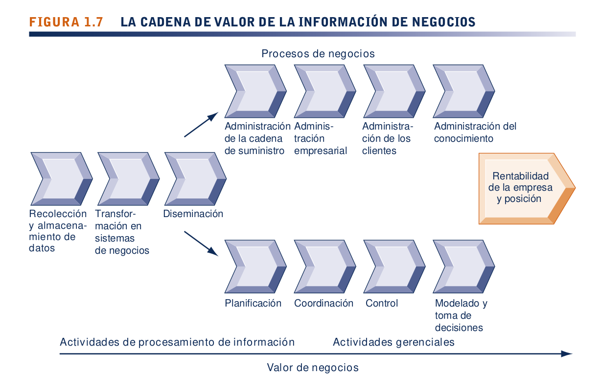

 

<mark>Los gerentes y las empresas de negocios invierten en tecnología y sistemas de información porque ofrecen un valor económico real para la empresa. La decisión de crear o mantener un sistema de información asume que los rendimientos de esta inversión serán superiores a otras inversiones en edificios, máquinas u otros activos.</mark> Estos rendimientos superiores se expresarán como aumentos en la productividad, en los ingresos <strong>(lo cual incrementará el valor de la empresa en el mercado bursátil)</strong> o tal vez como un posicionamiento estratégico superior de la empresa en el largo plazo en ciertos mercados <strong>(lo cual producirá mayores ingresos en el futuro).</strong>
 
<mark>Los sistemas de información permiten a la empresa incrementar sus ingresos o disminuir sus costos al proveer información que ayuda a los gerentes a tomar mejores decisiones, o que mejora la ejecución de los procesos de negocios.</mark> Por ejemplo, el sistema de información para analizar los datos de las cajas registradoras de un supermercado, puede incrementar la rentabilidad de una empresa al ayudar a
<mark>los gerentes a tomar mejores decisiones sobre los productos que deben tener en existencia y promoverlos en los supermercados de venta al detalle.</mark>
 
<strong>Toda empresa tiene una cadena de valor de información</strong>, en donde la información en bruto se adquiere de manera sistemática y después se transforma a través de varias etapas que agregan valor a esa información. El valor de un sistema de información para una empresa, así como la decisión de invertir en cualquier sistema de información nuevo, <mark>se determina en gran parte debido al grado en que ayude a obtener mejores decisiones gerenciales, procesos de negocios más eficientes y una mayor rentabilidad de la empresa.</mark>

Desde una perspectiva de negocios, los sistemas de información forman parte de una serie de actividades que agregan valor para adquirir, transformar y distribuir la información que los gerentes pueden usar para mejorar la toma de decisiones, el desempeño organizacional y, en última instancia, incrementar la rentabilidad de la empresa.

 

<mark>Un sistema de información representa una solución organizacional y gerencial, basada en la tecnología de la información, para un desafío o problema impuesto por el entorno.</mark> Cada capítulo en este libro empieza con un breve caso de estudio que ilustra este concepto. Un diagrama al principio de cada capítulo ilustra la relación entre un desafío de negocios con las decisiones gerenciales y organizacionales resultantes para usar la <strong>TI</strong> como una solución a los desafíos generados por el entorno de negocios. Puede usar este diagrama como punto inicial para analizar cualquier sistema de información o problema derivado del sistema de información que usted pueda encontrar.

<h2 style="color:#066694">ACTIVOS COMPLEMENTARIOS: CAPITAL ORGANIZACIONAL Y EL MODELO DE NEGOCIOS CORRECTO</h2>

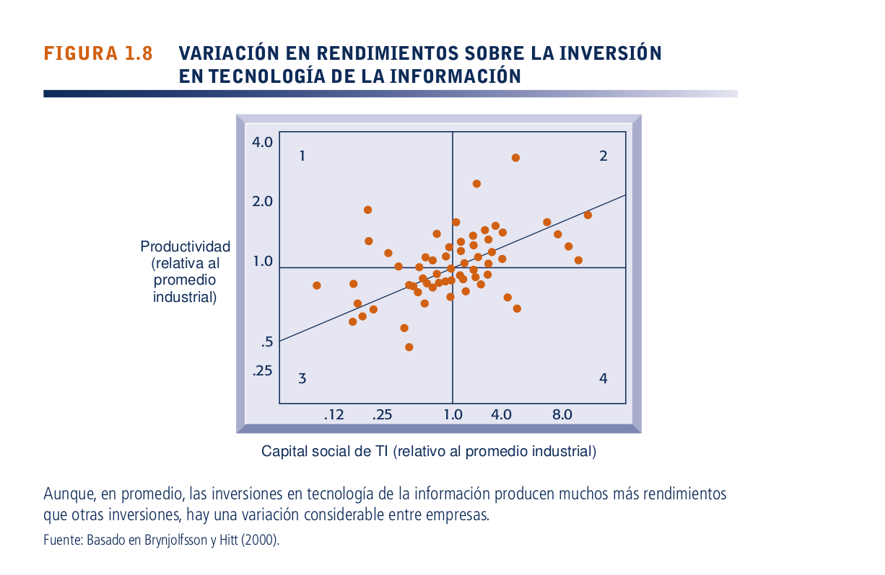

 

<mark>Si estamos conscientes de las dimensiones organizacionales y gerenciales de los sistemas de información podemos comprender por qué algunas empresas obtienen mejores resultados de sus sistemas de información que otras. Los estudios de rendimientos de las inversiones en tecnología de información muestran que hay una variación considerable en los rendimientos que reciben las empresas.</mark> Algunas de ellas invierten y reciben mucho (cuadrante 2); otras invierten una cantidad igual y reciben pocos rendimientos (cuadrante 4). Asimismo, otras empresas invierten poco y reciben mucho (cuadrante 1), mientras que otras invierten poco y reciben poco (cuadrante 3). <mark>Esto sugiere que el hecho de invertir en tecnología de la información no garantiza por sí solo buenos rendimientos.</mark> <strong>¿Qué explica esta variación entre las empresas?</strong>
 
La respuesta radica en el concepto de los <strong>activos complementarios</strong>. <mark>Las inversiones en tecnología de la información por sí solas no pueden aumentar la efectividad de las organizaciones y los gerentes, a menos que se apoyen con valores, estructuras y patrones de comportamiento en la organización, además de otros activos complementarios.</mark> Las empresas comerciales necesitan cambiar la forma de hacer negocios para que realmente puedan cosechar las ventajas de las nuevas tecnologías de la información.
 
<mark>Algunas empresas no adoptan el modelo de negocios correcto que se adapte a la nueva tecnología, o buscan preservar un modelo de negocios antiguo condenado al fracaso por la nueva tecnología.</mark>
 
Las compañías discográficas se rehusaron a cambiar su antiguo modelo de negocios basado en las tiendas de música tradicionales para la distribución, <mark>en vez de adoptar un nuevo modelo de distribución en línea</mark>. Como resultado, las ventas legales de música en línea están controladas por una compañía de tecnología llamada <strong>Apple Computer</strong>, en lugar de las compañías discográficas.
 
<strong>Los activos complementarios</strong> <mark>son aquellos valores requeridos para derivar valor a partir de una inversión primaria</mark> (Teece, 1988). Por ejemplo, para aprovechar el valor de los automóviles se requieren inversiones complementarias considerables en carreteras, caminos, estaciones de gasolina, instalaciones de reparación y una estructura regulatoria legal para establecer estándares y controlar a los conductores. <mark>La investigación indica que las empresas que apoyan sus inversiones en tecnología con inversiones en activos complementarios, como nuevos modelos y procesos de negocios, el comportamiento gerencial, la cultura organizacional o la capacitación, reciben mayores rendimientos</mark>, en tanto que las empresas que no realizan estas inversiones complementarias reciben menos rendimientos (o ninguno) sobre sus inversiones en tecnología de la información. Estas inversiones en organización y administración también se conocen como <strong>capital organizacional y administrativo.</strong>
 
Para aprovechar el valor de sus gastos en tecnología de la información. Parte de esta inversión implica los activos tangibles, como edificios, maquinaria y herramientas. Sin embargo, el valor de estas compras de tecnología de la información depende en gran parte de las inversiones complementarias en administración y organización.

<strong>Las inversiones complementarias organizacionales</strong> clave son una cultura de negocios de apoyo, la cual aprecia la eficiencia y la efectividad, un modelo de negocios apropiado, procesos de negocios eficientes, la descentralización de la autoridad, los derechos de decisión altamente distribuidos y un sólido equipo de desarrollo de sistemas de información (SI).

<strong>Los activos complementarios gerenciales</strong> importantes son un sólido apoyo de la gerencia de nivel superior con respecto al cambio, sistemas de incentivos que supervisen y recompensen la innovación individual, un énfasis en el trabajo en equipo y la colaboración, programas de capacitación, y una cultura gerencial que aprecie la flexibilidad y el conocimiento.

<strong>Las inversiones sociales</strong> importantes (no las que hace la empresa, sino la sociedad en general, otras empresas, gobiernos y otros participantes clave del mercado) son Internet y la cultura de apoyo de Internet, los sistemas educativos, los estándares de redes y computación, las regulaciones y leyes, y la presencia de las empresas de tecnología y servicios.

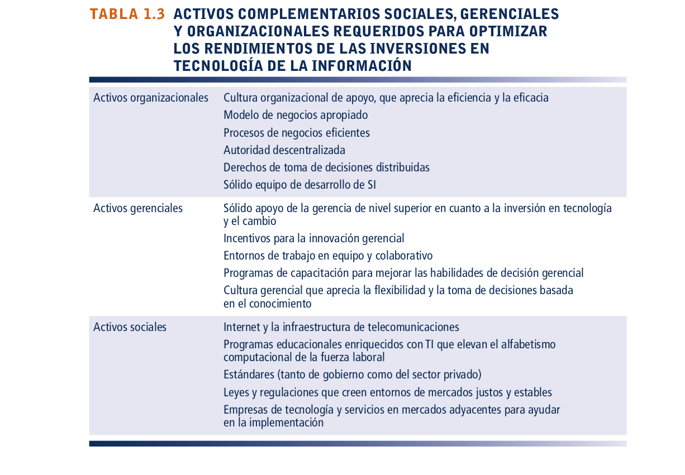

<h2 style="color:#066694">1.3) ¿QUÉ DISCIPLINAS ACADÉMICAS SE UTILIZAN PARA ESTUDIAR LOS SISTEMAS DE INFORMACIÓN, Y CÓMO CONTRIBUYE CADA UNA A LA COMPRENSIÓN DE LOS SISTEMAS DE INFORMACIÓN?</h2>

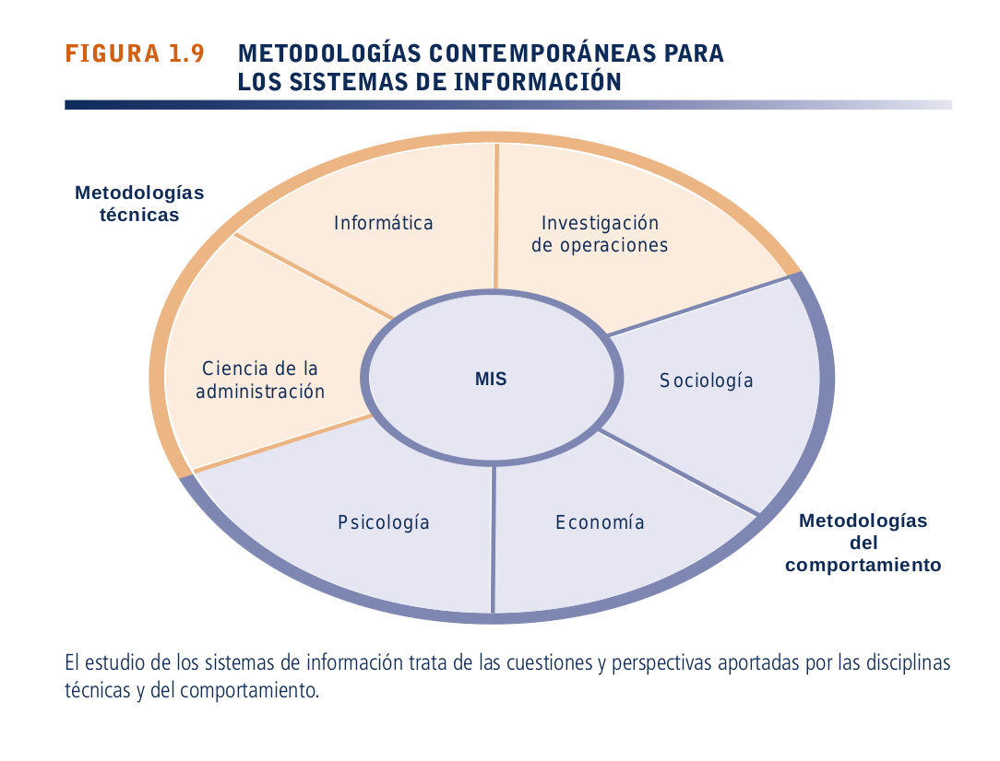

 

El estudio de los sistemas de información es un campo multidisciplinario. No hay ninguna teoría o perspectiva dominante. La figura 1.9 ilustra las principales disciplinas que contribuyen a los problemas, las cuestiones y las soluciones en el estudio de los sistemas de información.

* <h3 style="color:#066694">METODOLOGÍA TÉCNICA</h3>

 

La metodología técnica para los sistemas de información enfatiza los modelos basados en las matemáticas para estudiar los sistemas de información, así como en la tecnología física y las capacidades formales de éstos. Las disciplinas que contribuyen a la metodología técnica son:<strong> informática, ciencia de la administración, e investigación de operaciones</strong>.
 
<strong>La informática</strong> <mark>se encarga del tratamiento automático de la información y métodos de computación, además de métodos de almacenamiento y acceso eficiente de datos.</mark>
 
<strong>La ciencia de la administración</strong> <mark>enfatiza el desarrollo de modelos para la toma de decisiones y las prácticas gerenciales.</mark>
 
<strong>La investigación de operaciones</strong> <mark>se enfoca en las técnicas matemáticas para optimizar parámetros seleccionados de las organizaciones, como el transporte, el control de inventario y los costos de las transacciones.</mark>

* <h3 style="color:#066694">METODOLOGÍA DEL COMPORTAMIENTO</h3>

La metodologia del comportamiento surgen en el desarrollo y mantenimiento en el largo plazo de los sistemas de información. <mark>Aspectos como la integración estratégica de negocios, el diseño, la implementación, la utilización y la administración no se pueden explorar útilmente con los modelos que se utilizan en la metodología técnica. Hay otras disciplinas del comportamiento que aportan conceptos y métodos importantes.</mark> 
 
Por ejemplo, los sociólogos estudian los sistemas de información con un enfoque hacia la manera en que los grupos y las organizaciones dan forma al desarrollo de los sistemas y en cómo afectan a individuos, grupos y organizaciones. Los psicólogos los estudian porque les interesa la forma en que los humanos que toman las decisiones perciben y utilizan la información formal, y los economistas lo hacen con el fin de comprender la producción de los bienes digitales, la dinámica de los mercados digitales y la forma en que los nuevos sistemas de información cambian las estructuras de control y costos dentro de la empresa.

La metodología del comportamiento no ignora a la tecnología. En realidad, la tecnología de sistemas de información suele ser el estímulo ante un problema o emergencia de comportamiento. Sin embargo, por lo general, el enfoque de esta metodología no está en las soluciones técnicas; antes bien, se concentra en los cambios de las actitudes, la política gerencial y organizacional, y en el comportamiento.

* <h3 style="color:#066694">METODOLOGÍA DE ESTE LIBRO: SISTEMAS SOCIOTÉCNICOS</h3>

A lo largo del libro encontrará una intensa trama con cuatro actores principales: proveedores de hardware y software <strong>(los tecnólogos)</strong>; empresas de negocios que realizan inversiones y buscan obtener valor de la tecnología; gerentes y empleados que pretenden lograr un valor de negocios <strong>(y otros objetivos),</strong> y el contexto legal, social y cultural <strong>(el entorno de la empresa).</strong> En conjunto, estos actores producen lo que conocemos como sistemas de información gerencial.
 
<strong>El estudio de los sistemas de información gerencial (MIS)</strong> surgió para enfocarse en el uso de los sistemas de información basados en computadora en las empresas comerciales y las agencias gubernamentales. Los <strong>MIS</strong> combinan el trabajo de la informática, la ciencia de la administración y la investigación de operaciones, <mark>con una orientación práctica hacia el desarrollo de soluciones de sistemas para los problemas del mundo real y la administración de los recursos de tecnología de la información.</mark> También se encarga de los aspectos del comportamiento relacionados con el desarrollo, uso e impacto de los sistemas de información, que por lo general se analizan en los campos de la sociología, la economía y la psicología.
 
La perspectiva que adoptaremos en este libro se caracteriza mejor como la <strong>perspectiva sociotécnica</strong> de los sistemas. En ella se logra un desempeño organizacional excelente al optimizar en conjunto los sistemas sociales y técnicos que se utilizan en producción.
 
<mark>Al adoptar una perspectiva sociotécnica de sistemas es más fácil evitar una metodología únicamente técnica para los sistemas de información. Por ejemplo, el hecho de que la tecnología de la información esté disminuyendo con rapidez en el costo y creciendo en poder no necesaria o fácilmente se traduce en una mejora en la productividad o en utilidades netas.</mark> El que una empresa haya instalado recientemente un sistema de informes financieros a nivel empresarial no significa que se vaya a utilizar, o que se use con efectividad. De igual forma, el que una empresa tenga poco de haber introducido nuevos procedimientos y procesos de negocios no significa que los empleados serán más productivos al no haber inversiones en nuevos sistemas de información para habilitar esos procesos.

En este libro enfatizamos la necesidad de optimizar el desempeño de la empresa como un todo. Tanto los componentes técnicos como los del comportamiento requieren atención. Esto significa que la tecnología se debe cambiar y diseñar de tal forma que se ajuste a las necesidades organizacionales e individuales.

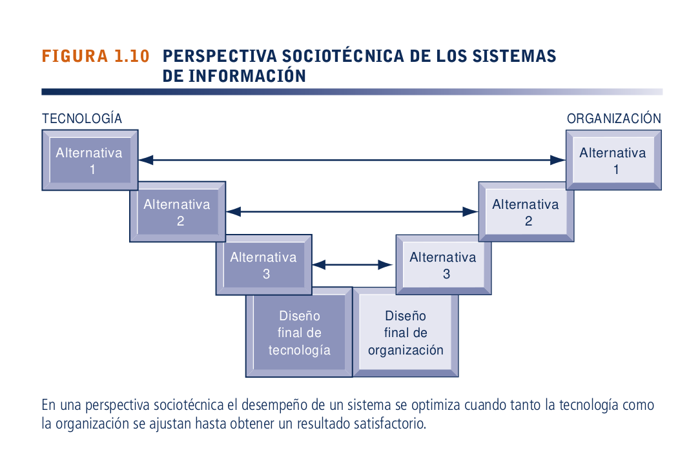

<h1 style="color:#066694"><strong>Home Depot</strong> se renueva a sí misma con nuevos sistemas y formas de trabajar</h1>

<strong>Home Depot</strong> <mark>es el mayor minorista del mundo especializado en productos para mejoras en el hogar, el cuarto minorista más grande de Estados Unidos y el quinto minorista más grande del mundo, que opera 2,256 tiendas en Estados Unidos,Canadá y México, así como un negocio en línea. <strong>Home Depot</strong> se enfoca en los mercados “hágalo usted mismo (DIY)” y profesional con su selección de más de 400,000 artículos,</mark> entre ellos madera, pisos, artículos de plomería, productos para jardín, herramientas, pintura y aparatos domésticos. <strong>Home Depot</strong> también ofrece servicios de instalación para alfombrados,ebanistería y otros productos.
 
<strong>Home Depot</strong> fue fundada en 1978 por Bernie Marcus y Arthur Blank.Las primeras dos tiendas de <strong>Home Depot</strong> abrieron el 22 de junio de 1979 en Atlanta, Georgia. Con un espacio aproximado de 60,000 pies cuadrados, cada tienda era un enorme almacén que contenía 25,000 productos distintos, mucho más que la ferretería promedio de ese tiempo. Las cajas vacías apiladas en los niveles altos de las repisas daban la ilusión de tener aún más productos. <strong>Home Depot</strong> eclipsó a la competencia. Desde el principio, los asociados capacitados de las tiendas <strong>Home Depot</strong><mark> podían ofrecer el mejor servicio al cliente en la industria, guiando a las personas a través de proyectos como colocar tejas, cambiar una válvula de llenado o manejar una herramienta eléctrica. <strong>Home Depot</strong> revolucionó la industria de mejoramiento del hogar al llevar el conocimiento y las herramientas a los consumidores, al mismo tiempo que les ahorraba dinero.</mark>
 
El éxito inicial de <strong>Home Depot</strong> se basó en un modelo de negocios descentralizado, en el que las tiendas se administraban casi de manera independiente y estaban llenas de vendedores conocedores y con experiencia en los distintos sectores de la construcción. Los gerentes a nivel regional y de tienda tomaban las decisiones en cuanto a qué mercancía tener en cada tienda y qué cantidad de artículos iguales mantener en existencia. Las tiendas individuales eran lo bastante grandes (alrededor de 100,000 pies cuadrados, con ingresos anuales de $60 a $80 millones) para almacenar enormes inventarios de materiales y suministros de construcción. Los proveedores enviaban la mercancía directamente a los almacenes de <strong>Home Depot</strong>, que servían como sus propios centros de distribución.
 
<mark>Durante esos primeros años, <strong>Home Depot</strong> contaba con poca tecnología. El primer director de información <strong>(CIO)</strong> de <strong>Home Depot</strong>, <strong>Bob Derhodes</strong>, observó que toda los procesos se hacian de manera escrita(manual), en el año 2000 <strong>Home Depot</strong> carecía de la infraestructura de hardware para que su <strong>CEO</strong> enviara un correo electrónico a toda la empresa. A menudo los artículos se quedaban sin existencias debido a que el sistema de inventario era muy deficiente.</mark>
 
La gerencia de <strong>Home Depot</strong> se concentró en hacer crecer el negocio. Con el tiempo <strong>Home Depot</strong> había saturado todos los principales mercados metropolitanos y se dirigió a los mercados secundarios para seguir creciendo. La empresa comenzó a construir tiendas más pequeñas cuyo tamaño era más apropiado para esos mercados. Estas tiendas de menor tamaño carecían del espacio para almacenar inventarios grandes, lo que significaba que no tenían todos los artículos en existencia cuando los clientes querían comprarlos. A menudo, los camiones que transportaban los suministros para cada tienda llegaban medio vacíos. <mark>Los empleados de las tiendas invertían el 60% de su día de trabajo en el proceso de almacenamiento y sólo el 40% en asistir a los clientes. <strong>Home Depot</strong> también tuvo docenas de centros de distribución de madera, almacenes para productos importados y “centros de distribución de cajas” diseñados para manejar artículos voluminosos como tractores de jardín. Esta era una infraestructura de logística muy grande y costosa de mantener para una empresa en la que el 75 % de las entregas iban directamente a las tiendas individuales.</mark> Cuando <strong>Marcus y Blanc</strong> se retiraron en el año 2000, <strong>Robert <strong>Nardelli</strong></strong>, proveniente de GE, tomó su lugar y se convirtió en el director, presidente y <strong>CEO</strong> de la empresa. 
 
Para cuando <strong>Nardelli</strong> se hizo cargo, <strong>Home Depot</strong> había perdido su ventaja competitiva ante <strong>Lowe’s</strong>. Sus tiendas se parecían mucho a las madererías, en tanto que las de <strong>Lowe’s</strong> eran más modernas y acogedoras, y contaban con productos más lujosos dirigidos a las mujeres. <mark><strong>Nardelli</strong> se esforzó mucho para hacer que la empresa fuera más eficiente, instituyendo muchas medidas y centralizando las operaciones, además de recortar empleos para cumplir con los objetivos de ingresos trimestrales.</mark> Aunque en un principio estas medidas duplicaron los ingresos y redujeron los gastos, enfadaron a muchos de los gerentes de tienda, al personal base de ventas y a los clientes. <strong>Nardelli</strong> creía que las ventas de productos para mejoraramiento del hogar de cada tienda eran menos importantes debido a la saturación del mercado por parte de la competencia como <strong>Lowe’s</strong>. Esperaba que el área de negocios de más rápido crecimiento de <strong>Home Depot</strong> fuera la de servicios de instalación en el hogar, las ventas minoristas por Web, las ventas a contratistas comerciales y las operaciones internacionales.
 
<mark>Los sistemas internos de la empresa se habían vuelto cada vez más caros de operar y modificar. Los planes de tecnología de la información de <strong>Nardelli</strong> exigían una metodología de “TI grande”. En 2002, <strong>Home Depot</strong> invirtió $1000 millones para renovar su infraestructura de TI, incluyendo el reemplazo de los sistemas de punto de venta (POS), la creación de un enorme repositorio de datos para acceder a la información de ventas y administración laboral, y la implementación de software de <strong>PeopleSoft y SAP</strong> para ofrecer una plataforma de software empresarial estándar para todas las operaciones básicas de la empresa,</mark> desde los informes financieros hasta el rastreo de inventario. Se esperaba que el software empresarial permitiera a los vendedores acceder a los detalles sobre los productos en venta, sus características y disponibilidad, además de buscar información sobre los clientes a quienes estaban atendiendo, incluyendo su historial de transacciones anteriores con la empresa. Este software prometía determinar la mezcla correcta de productos para los puntos de venta, establecer los precios regionales y rastrear el inventario desde las líneas de ensamblaje de los fabricantes hasta las cajas registradoras de la tienda.
 
<strong>Nardelli</strong> creía que los sistemas de autopago podrían reemplazar a todos los cajeros de las tiendas. Comenzó a centralizar las compras, la mercadotecnia, la planeación de tiendas y el marketing para lograr economías de escala e invirtió $2 millones en software de administración de carga de trabajo para mejorar la eficiencia de las actividades laborales. Su principal objetivo era reducir los costos generales de operación del negocio y elevar los rendimientos para los accionistas de <strong>Home Depot</strong>. Los pasillos de autoservicio y estas otras medidas produjeron algunos ahorros, pero no lo suficiente.<mark> Bajo el liderazgo de <strong>Nardelli</strong>, <strong>Home Depot</strong> siguió perdiendo terreno frente a <strong>Lowe’s</strong>, la cual prestaba mucha más atención a los clientes en sus tiendas.</mark>
 
En enero de 2007 <strong>Nardelli</strong> fue reemplazado por <strong>Frank <strong>Blake</strong></strong>, <mark>quien se concentró más en atender y cultivar a los clientes. <strong>Blake</strong> también comenzó a investigar sobre los sistemas de información para ayudar a la empresa con precios competitivos. <strong>Home Depot</strong> compró <strong>BlackLocus</strong>, un proveedor de software de inteligencia de precios competitivos, como ayuda para averiguar cómo comparar sus precios con los de sus competidores y mantener su reputación de tener los precios más bajos.</mark> <strong>BlackLocus</strong> ofrece herramientas de precios automatizadas y optimizadas para los minoristas del mercado mediano y los grandes minoristas en línea, las cuales pueden combinar los datos de precios competitivos a través de Web con los datos de las tiendas en línea de los clientes.
 
Aunque <strong>Nardelli</strong> hizo muchas inversiones considerables en tecnología, <strong>Home Depot</strong> aún tenía muchas formas obsoletas de trabajo. En 2008, <strong>Home Depot</strong> contrató al CIO <strong>Matt <strong>Carey</strong></strong>, quien anteriormente había estado a cargo de los sistemas de información de eBay y de Walmart. <strong>Carey</strong> decía que cuando llegó a <strong>Home Depot</strong>, la tecnología minorista de la empresa se comparaba con lo que otras cadenas poseían en 1990. Para determinar qué productos carecían de existencias, los vendedores aún tenían que inspeccionar físicamente las repisas. La computación móvil en <strong>Home Depot</strong> se reducía a una terminal de computadora sobre un carrito “operada por una batería de bote”, con un escáner conectado. Cuando se determinaba que la mercancía tenía un nivel bajo de existencias, el gerente de la tienda volvía a pedir los productos por su cuenta; el reabastecimiento del inventario aún no estaba totalmente automatizado.
 
<strong>Carey</strong> trabajó con <strong>Mark Holifield</strong>, vicepresidente senior de la cadena de suministro de <strong>Home Depot</strong>, <mark>para modernizar y hacer más eficiente el proceso de gestión de proveedores. Holifield puso de cabeza el diseño de la cadena de suministro de la empresa al hacer que el 75% del inventario de <strong>Home Depot</strong> se moviera a través de centros de distribución regionales conocidos como centros de despliegue rápido (RDC) que se harían cargo de las decisiones de reabastecimiento de inventario que anteriormente le correspondían a cada tienda. Para este plan <strong>Home Depot</strong> tuvo que construir 24 centros RDC ubicados estratégicamente en Estados Unidos, en donde cada uno daría servicio a 100 tiendas aproximadamente. Los RDC son centros de distribución de paso, diseñados para un cross-docking ágil de grandes volúmenes de mercancía. En la distribución de paso, los envíos entrantes se organizan de modo que, por lo general, se envíen a su destino de entrega en el mismo día, con lo cual se elimina la necesidad de almacenarlos.</mark>
 
La mayoría de los productos salen hacia las tiendas en menos de 24 horas de haber llegado a los RDC. Cerca de 75% de la mercancía de <strong>Home Depot</strong> se pide ahora de manera centralizada a través de estos centros. Alrededor de 20% de artículos, como los productos de proveedores regionales o los árboles y plantas vivas que requieren un manejo especial, se envía directamente de los proveedores a las tiendas.
La administración del inventario se hizo más automatizada, de modo que <strong>Home Depot</strong> pudiera reabastecer los artículos mediante la predicción del agotamiento de las existencias, en vez de esperar a que se agoten los artículos. El nuevo sistema mejorado de administración del inventario se hizo cargo de las decisiones diarias a nivel de existencias generales y las automatizó para que los gerentes pudieran concentrarse más en las compras de estantería especial para las tiendas u otras áreas específicas para una ubicación individual. 
 
<mark>Una herramienta para ayudar a <strong>Home Depot</strong> a administrar el inventario es el software de planeación de la demanda de <strong>Demand Foresight</strong>, que usa un motor de predicción de vanguardia para ayudar a los fabricantes y distribuidores a reducir los errores de predicción e incrementar la rentabilidad.</mark> El software se enfoca en medidas específicas y medibles para el servicio al cliente, el rendimiento del inventario, los niveles del capital de trabajo y la eficiencia de la cadena de suministro. El distribuidor respalda el producto con una garantía de devolución del dinero que especifica que los clientes lograrán al menos una reducción de 25% en los errores de predicción e incrementarán en 5% o más la rentabilidad antes de impuestos. El software de <strong>Demand Foresight</strong> puede trabajar dentro de los entornos existentes de TI.
 
<mark>Como resultado de todos estos cambios organizacionales y tecnológicos, los errores de predicción del inventario se redujeron de manera significativa. El porcentaje de artículos sin existencias se redujo a la mitad, y los clientes encuentran productos disponibles el 98.8% de las veces.</mark>
 
Los ahorros en los costos de entrega, servicio, inventario y transporte aumentaron el flujo de efectivo anual de <strong>Home Depot</strong> en $1000 millones. Para el otoño de 2012 <strong>Home Depot</strong> había recobrado su ventaja sobre <strong>Lowe’s</strong>. <strong>Home Depot</strong> invirtió $64 millones para suministrar a los vendedores 30,000 <strong>dispositivos portátiles Motorola conocidos como First Phones.</strong> Además de servir como teléfonos y walkie-talkies, <mark>los dispositivos portátiles permiten que los vendedores usen escáneres en el dispositivo para actualizar y revisar continuamente los niveles de inventario. Los vendedores tienen acceso instantáneo a la información de los productos, de modo que pueden ayudar más a los clientes que a menudo necesitan información técnica específica sobre herramientas y piezas, así como revisar al instante si hay existencias de un artículo.</mark> Los dispositivos móviles también ayudan a agilizar los tiempos de espera en las cajas, ya que permiten que los empleados escaneen los artículos de los clientes mientras están en la fila, en vez de esperar hasta que lleguen al cajero.
 
La útil tecnología móvil podría incrementar la cantidad que los clientes gastan en cada viaje a la tienda, así como las ventas a los clientes nuevos, un área de enfoque ya que la cadena ha reducido la velocidad con que abre nuevas tiendas.
 
<strong>Home Depot</strong> <mark>también rediseñó su sitio Web para que fuera más atractivo, amigable para los clientes y competitivo.  Ahora el sitio Web vende lo que hay en sus tiendas, permite recoger los pedidos en la tienda y ofrece videos de “hágalo usted mismo” para ayudar a los clientes con sus proyectos del hogar. También ofrece muchos más artículos que una tienda común (más de 600,000),</mark> en comparación con los 35,000 de una tienda típica. <strong>Home Depot</strong> espera que la mayoría de las ventas del sitio Web consistan en productos más pequeños, como accesorios luminosos y cables de extensión, que se mueven más rápido, así como
artículos grandes y voluminosos como artículos de tocador y aparatos electrodomésticos que las personas no desean sacar de la tienda por su cuenta.

<h1 style="color:#066694">Resumen</h1>

* <h3 style="color:#066694">¿Cómo transforman los sistemas de información a los negocios y por qué son tan esenciales para administrar un negocio en la actualidad?</h3>

El correo electrónico, las conferencias en línea, los smartphone y las computadoras tipo Tablet se han convertido en herramientas esenciales para realizar negocios. <mark>Los sistemas de información son la base de las cadenas de suministro de ritmo acelerado. Internet permite que muchas empresas compren, vendan, anuncien y soliciten retroalimentación de los clientes en línea. Las organizaciones están tratando de hacerse más competitivas y eficientes al habilitar con tecnología digital sus procesos de negocios básicos, para evolucionar y convertirse en empresas digitales.</mark> Internet ha estimulado la globalización al reducir drásticamente los costos de producir, comprar y vender bienes a escala global. Las tendencias de los nuevos sistemas de información incluyen <strong>la plataforma digital móvil emergente, el software en línea como un servicio y big data.</strong>
 
Actualmente, los sistemas de información son uno de los fundamentos para realizar negocios<mark>. En muchas industrias la supervivencia y la habilidad de lograr los objetivos de negocios estratégicos se dificultan sin un uso extensivo de la tecnología de la información. Hoy en día, las empresas utilizan sistemas de información para lograr seis objetivos principales</mark>: <strong>excelencia operacional; nuevos productos, servicios y modelos de negocios; familiaridad con el cliente/proveedor; toma de decisiones mejorada; ventaja competitiva, y supervivencia diaria.</strong>

* <h3 style="color:#066694">¿Qué es un sistema de información? ¿Cómo funciona? ¿Cuáles son sus componentes de administración, organización y tecnología, y por qué los activos complementarios son esenciales para asegurar que los sistemas de información proporcionen un valor genuino para las organizaciones?</h3>

Desde una perspectiva técnica, un sistema de información <mark>recolecta, almacena y disemina la información proveniente del entorno de la empresa y sus operaciones internas para apoyar las funciones organizacionales y la toma de decisiones, la comunicación, la coordinación, el control, el análisis y la visualización.</mark>

Los sistemas de información transforman los datos en bruto en información útil a través de tres actividades básicas: <strong>entrada, procesamiento y salida.</strong>

Desde una perspectiva de negocios, un sistema de información da una solución a un problema o desafío al que se enfrenta una empresa; además, representa una combinación de los elementos de administración,organización y tecnología.
 
La dimensión gerencial de los sistemas de información involucra aspectos tales como liderazgo, estrategia y comportamiento gerencial. <mark>La dimensión de tecnología consta de hardware y software de computadora, tecnología de almacenamiento de datos y tecnología de redes/telecomunicaciones (incluyendo Internet).</mark>
 
La dimensión organizacional de los sistemas de información involucra aspectos como la jerarquía de la organización, las especialidades funcionales, los procesos de negocios, la cultura y los grupos de interés político.

<mark>Para poder obtener un valor significativo de los sistemas de información, las empresas deben apoyar sus inversiones de tecnología con inversiones complementarias apropiadas en organizaciones y administración. Estos activos complementarios incluyen nuevos modelos y procesos de negocios</mark>, una cultura organizacional y comportamiento gerencial de apoyo, estándares de tecnología, regulaciones y leyes apropiadas. Es poco probable que las
inversiones en nueva tecnología de la información produzcan altos rendimientos, a menos que las empresas realicen los cambios gerenciales y organizacionales apropiados para apoyar la tecnología.

* <h3 style="color:#066694">¿Qué disciplinas académicas se utilizan para estudiar los sistemas de información y cómo contribuye cada una a la comprensión de los sistemas de información?</h3>

El estudio de los sistemas de información trata de los aspectos y perspectivas aportados por <strong>las disciplinas técnicas y del comportamiento.</strong> Las disciplinas que contribuyen a la metodología técnica y se enfocan tanto en modelos formales como en las capacidades de los sistemas son: <strong>informática, ciencia de la administración e investigación de operaciones.</strong> Las disciplinas que contribuyen a la metodología del comportamiento y se enfocan en el diseño, la implementación, administración e impacto comercial de los sistemas son: <strong>psicología, sociología y economía.</strong> Una perspectiva sociotécnica de los sistemas considera las características tanto técnicas como sociales de los sistemas y las soluciones que representan el mejor ajuste entre ellas.

