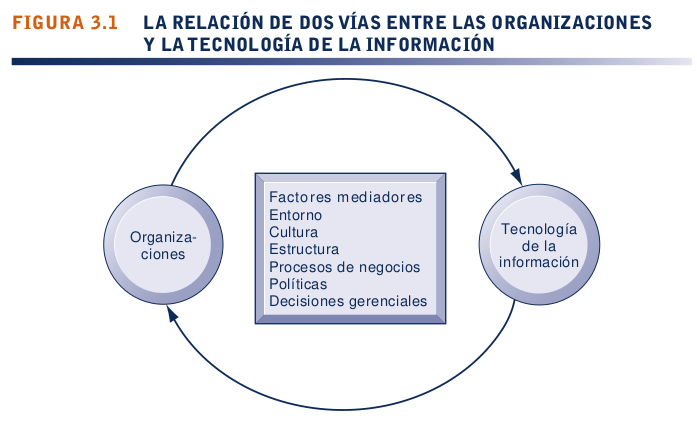
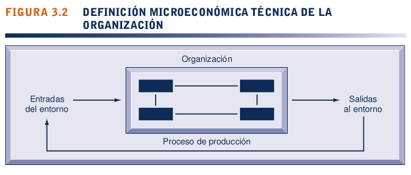
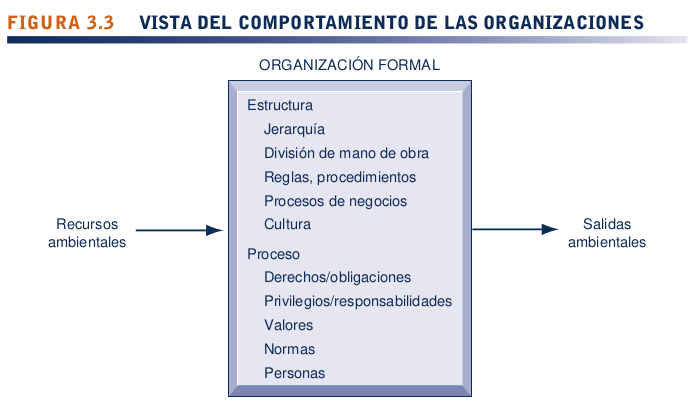
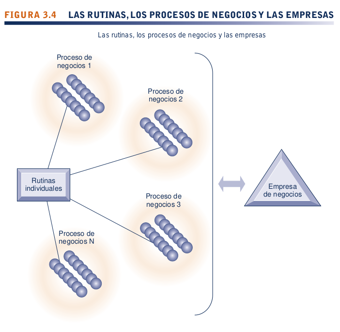
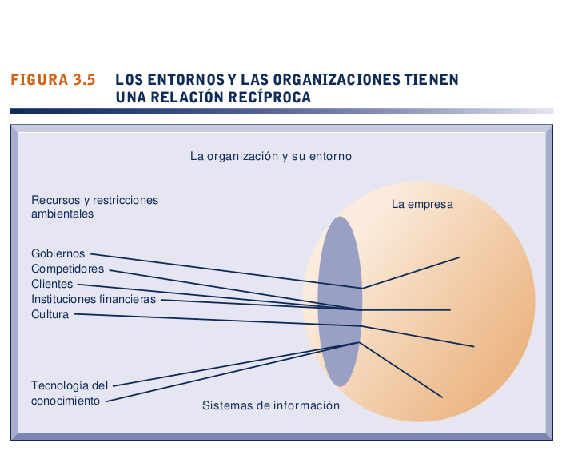
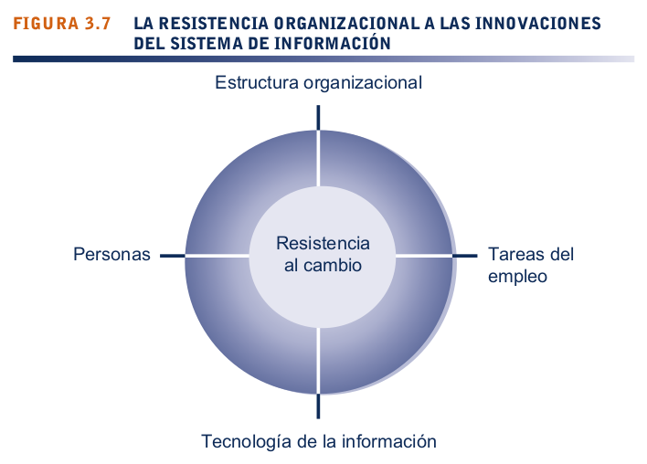
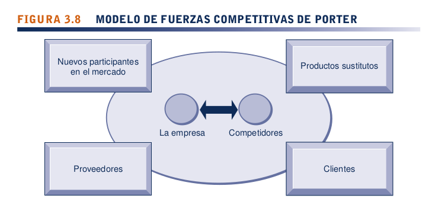
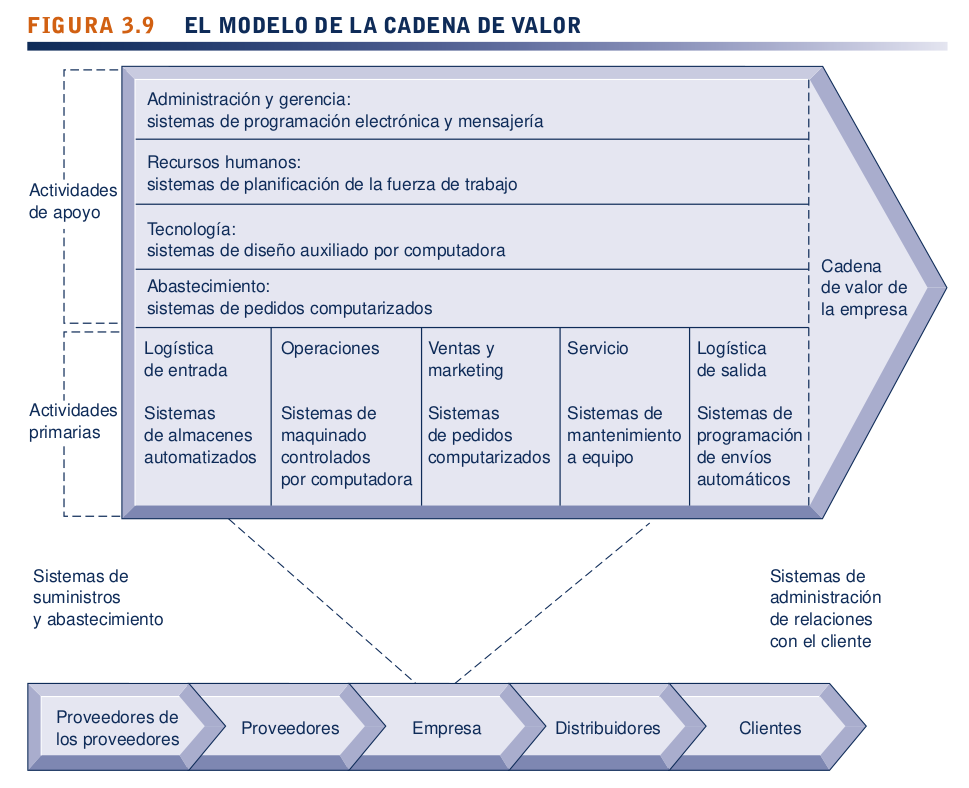
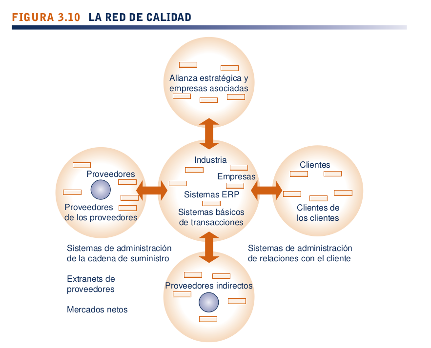
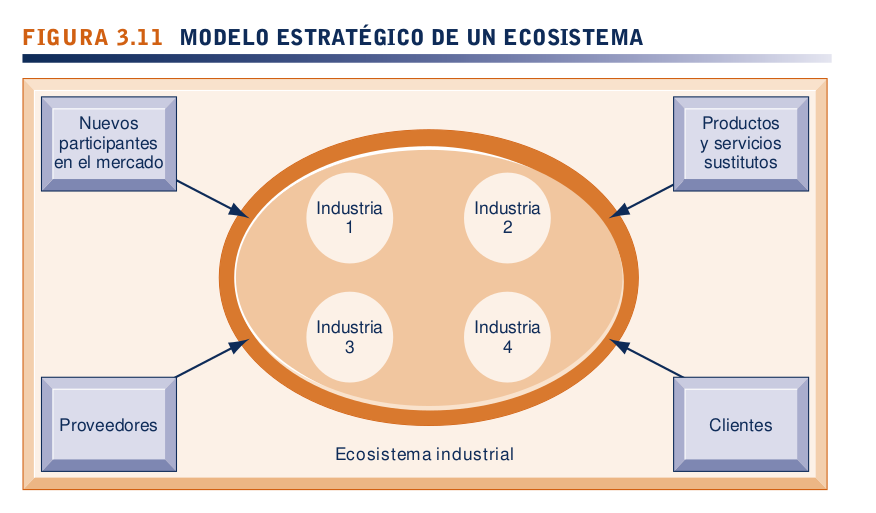

<h1>Sistemas de información, organizaciones y estrategia</h1>

<h3 style = "color:#066694">OBJETIVOS DE APRENDIZAJE</h3>

1. **¿Qué características de las organizaciones necesitan conocer los gerentes para crear y usar con éxito los sistemas de información?**

Todas las organizaciones modernas son jerárquicas, especializadas e imparciales; además, usan rutinas explícitas para maximizar la eficiencia. Todas las organizaciones tienen sus propias culturas y políticas que surgen de las diferencias en los grupos de interés, y se ven afectadas por el entorno que las rodea. Las organizaciones difieren en cuanto a sus objetivos, los grupos a los que dan servicio, sus roles sociales, estilos de liderazgo, incentivos, tipos de tareas realizadas y tipo de estructura. Estas características ayudan a explicar las diferencias en cuanto a la forma en la que las organizaciones usan los sistemas de información. Los sistemas de información y las organizaciones en las que se utilizan interactúan e influyen entre sí.

2. **¿Cuál es el impacto de los sistemas de información en las organizaciones?**

La introducción de un nuevo sistema de información afectará la estructura organizacional, las metas, el diseño funcional, los valores, la competencia entre los grupos de interés, la toma de decisiones y el comportamiento diario. Al mismo tiempo, los sistemas de información se deben diseñar para dar servicio a las necesidades de los grupos organizacionales importantes y se deben modelar en base a la estructura, los procesos de negocios, las metas, la cultura, las políticas y la gerencia de la organización. La tecnología de la información puede reducir los costos de transacción y de agencia, y dichos cambios se han acentuado en las organizaciones que utilizan Internet. Los nuevos sistemas perturban los patrones establecidos de trabajo y las relaciones de poder, por lo que a menudo se enfrentan a una resistencia considerable al momento de introducirlos.

3. **¿Cómo ayudan el modelo de fuerzas competitivas de Porter, el modelo de la cadena de valor, las sinergias, las competencias básicas y la economía de red, a que las compañías desarrollen estrategias competitivas mediante el uso de los sistemas de información?**

En el modelo de fuerzas competitivas de Porter, la posición estratégica de la empresa y sus tácticas se determinan en base a la competencia con sus competidores directos tradicionales, pero estos factores también se ven afectados de manera considerable por los nuevos participantes en el mercado, los productos y servicios sustitutos, los proveedores y los clientes. Los sistemas de información ayudan a las compañías a competir al mantener los costos
bajos, diferenciar los productos o servicios, enfocarse en el nicho del mercado, fortalecer los lazos con los clientes y proveedores, e incrementar las barreras de entrada al mercado con altos niveles de excelencia operacional.
 
El modelo de la cadena de valor resalta las actividades específicas en la empresa donde las estrategias competitivas y los sistemas de información tendrán el mayor impacto. El modelo ve a la empresa como una serie de actividades primarias y de apoyo que agregan valor a los productos o servicios de una empresa. Las actividades primarias están relacionadas de manera directa con la producción y la distribución, en tanto que las actividades de apoyo hacen posible la
entrega de las actividades primarias. La cadena de valor de una empresa se puede enlazar con las cadenas de valor de sus proveedores, distribuidores y clientes. Una red de calidad consiste en los sistemas de información que mejoran la
competitividad a nivel industrial al promover el uso de estándares y consorcios a nivel industrial, y al permitir que las empresas trabajen con más eficiencia con sus socios de calidad.
 
Puesto que las empresas constan de varias unidades de negocios, los sistemas de información obtienen eficiencias adicionales o mejoran sus servicios al unir las operaciones de varias unidades distintas de negocios. Los sistemas de
información ayudan a que las empresas se beneficien de sus competencias clave al promover la compartición de conocimiento a través de las unidades de negocios. Los sistemas de información facilitan los modelos de negocios con base en redes extensas de usuarios o suscriptores que aprovechan la economía de red. Una estrategia de compañía virtual utiliza las redes para enlazarse con otras compañías, de modo que pueda usar las herramientas de esas compañías para crear, comercializar y distribuir productos y servicios. En los ecosistemas de negocios varias industrias trabajan en conjunto para ofrecer valor al cliente. Los sistemas de información dan soporte a una densa red de interacciones entre las empresas participantes.

4. ¿Cuáles son los retos impuestos por los sistemas estratégicos de información y cómo hay que hacerles frente?

Por lo general, la implementación de sistemas estratégicos requiere un extenso cambio organizacional y la transición de un nivel sociotécnico a otro. Dichos cambios se denominan transiciones estratégicas y a menudo son tan difíciles
como dolorosos de lograr. Además, no todos los sistemas estratégicos son redituables, y su integración puede ser costosa. Otras empresas pueden copiar fácilmente muchos de los sistemas estratégicos de información, por lo que la ventaja
estratégica no siempre se puede sostener.

<h2>3.1) ¿QUÉ CARACTERÍSTICAS DE LAS ORGANIZACIONES NECESITAN CONOCER LOS GERENTES PARA CREAR Y USAR CON ÉXITO LOS SISTEMAS DE INFORMACIÓN?</h2>

Los sistemas de información y las organizaciones influyen entre si. Los gerentes crean sistemas de información para dar servicio a los intereses de la empresa de negocios. Al mismo tiempo, la organización debe estar consciente y abierta a las influencias de los sistemas de información, para beneficiarse de las nuevas tecnologias.
 
La interaccion entre la tecnologia de la información y las organizaciones es compleja y se ve influenciada por muchos factores mediadores, como la estructura de la organizacion, los procesos de negocios, la politica, la cultura, el entorno que le rodea y  las deciciones gerenciales. Usted necesitara comprender cómo pueden los sistemas de información cambiar la vida social y laboral en su empresa. No podrá diseñar nuevos sistemas con exito ni comprender los existentes si no entiende su propia organizacion de negocios 

<h3 style = "color:#0F00C3">QUÉ ES UNA ORGANIZACIÓN</h3>

Una <strong>organización</strong> es una estructura social formal y estable, que toma los recursos del entorno y los procesa para producir salidas. Esta definicion técnica se enfoca en tres elementos de una organización. El capital y la mano de obra son los factores primarios de producción proporcionados por el entorno. La organizacion (las empresa) transforma esta entradas en productos y servicios a cambio del suministro de entradas.

Una organizacion es más estable que un grupo informal (Como un grupo de amigos que se reúne cada viernes para almozar) en términos de longevidad y rutina. Las organizaciones son entidades legales serias con reglas internas y procedimientos que debe acatar las leyes. También son estructuras sociales debido a que constituyen una colección de elementos comunes, tal y como una máquina tiene una estructura: un arreglo especifico de válvulas, levas, ejes y otras piezas.
 
Esta definición de las organizaciones es poderosa y simple, pero no es muy descriptiva ni predictiva de las organizaciones reales. <mark>Una definición mas realista del comportamiento de una organización es la de un conjunto de derechos, privilegios, obligaciones y responsabilidades que se equilibran de manera delicada en un lapso de tiempo a través de los conflictos y su solución.</mark>
 
En esta visión del comportamiento de la empresa, las personas que laboran en organizaciones desarrollan formas habituales de trabajar; se apegan a las relaciones existentes y hacen arreglos con los subordinados y superiores en cuanto a la forma de realizar el trabajo, la cantidad y las condiciones de este. La mayoría de estos arreglos y sentimientos no se describen en ningun libro formal de reglas.
 
<strong>¿Cómo se relaciona esta definiciones de las organizaciones con la tecnología de los sistemas de información?</strong>
 
Un punto de vista técnico de las organizaciones nos alienta a enfocarnos en la forma en que se combinan las entradas para crear salidas cuando se introducen cambios de tecnologia en la compañia. La empresa se ve como algo que se puede malear de manera infinita, en donde el capital y la mano de obra se puede sustituir entre si con bastante facilidad. <mark>No obstante, la definicion mas realista del comportamiento de una organización sugiere que para crear nuevos sistemas de información , o volver a instaurar los antiguos, se requiere mucho más que un reordenamiento técnico de máquinas o de trabajadores: se necesita que algunos sistemas de información cambien el balance organizacional de los derechos, privilegios, obligaciones, responsabilidades y sentimientos que se han establecido durante un tiempo extenso.</mark>
 
Es posible que cambiar estos elementos requiera mucho tiempo, que sea un proceso muy perjudicial y que se necesiten más recursos para dar soporte a la capacitación y el aprendizaje. Por ejemplo, el tiempo requerido para implementar de manera efectiva un nuevo sistema de información es mucho mayor de lo que por lo general se prevé, simplemente porque hay un retardo entre la implementación de un sistema técnico y la acción de capacitar a los empleados y gerentes para que utilicen el sistema.
 
La transición tecnológica requiere cambios en cuanto a quién posee y controla la información, quién tiene derecho de acceder a ella y actualizarla, y quién toma las decisiones sobre quién, dónde y cómo. Esta vista más completa nos obliga a analizar la forma en que se diseña el trabajo y los procedimientos que se utilizan para obtener las salidas.
 
Las definiciones técnicas y del comportamiento de las organizaciones no son contradictorias. Más bien, se complementan entre sí. La definición técnica nos dice cómo miles de empresas en mercados competitivos combinan capital, mano de obra y tecnologia de la información, mientras que el modelo del comportamiento nos lleva al interior de cada empresa para ver cómo afecta la tecnologia su funcionamiento ser de ayuda para explicar las relaciones entre los sistemas de información y las organizaciones.

<h3 style = "color:#0F00C3">CARACTERÍSTICAS DE LAS ORGANIZACIONES</h3>

Todas las organizaciones modernas tiene ciertas características. Son burocracias con divisiones bien definidas de la mano de obra y la especialización que ordenan a los especialistas en una jerarquía de autoridad, en la cual todos tienen que rendirle cuentas a alguien y la autoridad se limita a las acciones especificas gobernadas por reglas o procedimientos abstractos. Estas reglas crean un sistema imparcial y universal de toma de decisiones. Las organizaciones tratan de contratar y promover a los empleados con base en sus cualidades tecnicas y profesionalismo (no a sus conexiones personales). La organización se ocupa del principio de la eficiencia: maximizar la salida mediante el uso de entradas limitadas. Otras características de las organizaciones incluyen sus procesos de negocios, la cultura y la políticas organizacionales, los entornos que la rodean, su estructura, objetivos , circuscripciones y estilos de liderazgo. Todas estas características afectan los tipos de sistemas de información que utilizan las organizaciones

* <h4 style = "color:#066694">Rutinas y procesos de negocios</h4>

Todas las organizaciones, entre ellas las empresas de negocios, se vuelven muy eficientes con el tiempo debido a que los individuos en la empresa desarrollan <strong>rutinas</strong> para producir bienes y servicios. las rutinas  conocidad algunas veces como <i>procedimientos estándar de operación</i> son reglas, procedimientos y prácticas precisas que se han desarrollado para enfrentarse con casi todas las situaciones esperadas. A medida que los empleados aprendan esta rutinas, se vuelven muy productivos y eficientes, y al paso del tiempo la empresa puede reducir sus costos, conforme aumenta la eficiencia. Por ejemplo, cuando usted visita el consultorio de un médico, las recepcionistas tiene  un grupo bien desarrollado de rutinas para recopilar información básica de usted; las enfermeras siguen un conjunto distinto de rutinas para prepararlo para la entrevista con un médico y este se basa en una serie bien desarrollada de rutinas para diagnosticarlo. Los <strong>Procesos de negocios</strong>. que presentamos en el capitulo 1 y 2, son conjuntos de dichas rutinas. A su vez, una empresa es un conjuto de procesos de negocios.

* <h4 style = "color:#066694">Políticas organizacionales</h4>

La personas en las organizaciones ocupan distintos puestos con diferentes especialidades, problemas y perspectivas. Como resultado, es natural que tengan puntos de vista divirgentes en cuanto a la forma en que se deben distribuir los recursos, las recompensas y los castigos. Estas diferencias importan tanto a los gerentes como a los empleados, y provocan una lucha política por los recursos, competencia y conflictos dentro de toda organización. La resistencia política es una de las grandes dificultades de provocar un cambio organizacional: en particular, el desarrolo de nuevos sistemas de información. Casi todas las inversiones grandes en sistemas de información que realiza una empresa y que provocan cambios considerables en la estrategia, los objetivos de negocios, los procesos de negocios y los procedimientos, se vuelven eventos con carga politica. Los gerentes que saben cómo trabajar con las políticas de una organización serán mas exitosos que los menos hábiles para implementar nuevos sistemas de información. 

* <h4 style = "color:#066694">Cultura organizacional</h4>

Todas las organizaciones tienen suposiciones fundamentales, invulnerables e incuestionables (por los miembros) que definen sus metas y productos. La cultura organizacional abarca este conjunto de suposiciones sobre los productos que debe elaborar la organización, cómo debe crearlos, en dónde y para quién. Por lo general, estas suposiciones culturales se dan totalmente por sentado y es raro que se enuncien en forma publica o se hable de ellas. Los procesos de negocios la verdadera forma en que las empresas producen valor se reguardan en la cultura organizacional.
 
Usted puede ver la cultura organizacional en acción si analiza los alrededores de su colegio o universidad. Algunos supuestos fundamentales de la vida universitaria son que los profesores saben más que los estudiantes , la razón por la que los alumnos asisten a la escuela es para aprender, y seguir un programa sistemático. La cultura organizacional es una poderosa fuerza unificadora que restringe el conflicto politico y promueve la compresión común, el acuerdo sobre los procedimientos y las prácticas comunes. Si todos compartimos las mismas suposiciones culturales básicas, es más probable estar de acuerdo en otras cuestiones.
 
Al mismo tiempo, la cultura organizacional es una poderosa limitación sobre el cambio, en especial el tecnológico. La mayoría de las organizaciones harían casi cualquier cosa por no tener que modificar las supocisiones básicas. Usualmente, cualquier cambio tecnológico que amenace las suposiciones culturales comunes se enfrentan a una gran resistencia. Sin embargo, hay veces en que la única forma razonable de que una empresa avance es emplear una nueva tecnologia que se oponga de manera directa a una cultura organizacional existente. Cuando esto ocurre, es común que la tecnología se estanque mientras la cultura se ajusta con lentitud.

* <h4 style = "color:#066694">Entornos organizacionales</h4>

Las organizaciones residen en entornos de los que obtiene  recursos y a los que suministran bienes y servicios. Éstas tiene una relación recíproca con los entornos. Por una parte, las organizaciones están abiertas a, y dependen de. el entorno social y físico que las rodea. Sin recursos humanos y finacieros personas dispuestas a trabajar de manera confiable y consistente por un sueldo o ingreso fijo proveniente de los clientes las organizaciones no podrían existir. Deben responder a las leyes y otros requerimientos impuestos por el gobierno, así como alas acciones de los clientes y competidores. Por otra parte, las organizaciones puede influir en sus entornos. Por ejemplo, las empresas de negocios forman alianzas con otros negocios para predisponer el proceso político; se anuncian para influenciar al cliente de manera que acepte sus productos.
 
La figura 3.5 ilustra el rol de los sistemas de información para ayudar a las organizaciones a precibir cambios en sus entornos, y ayudar a que las organizaciones actúen sobre ellos. Los sistemas de información son instrumentos clave para la exploración ambiental, que ayuda a los gerentes a identificar los cambios externos que podrían requerir una respuesta de la organizacion.

Por lo general, los entornos cambia  con mucha más rapidez que las organizaciones. Las nuevas tecnologías, los nuevos productos, además de los gustos y valores cambiantes del público (muchos de los cuales producen nuevas regulaciones gubernamentales) ejercen presión sobre la cultura, las políticas y las personas de una organizacion. La mayoría de las organizaciones son incapaces de adaptarse a un entorno que cambia rápidamente. 
 
La inercia integrada a los procedimientos estándar de operación de una empresa, el conflicto político generado por los cambios en el orden existente y la amenaza para los valores culturales muy controlados, son factores que impiden que las organizaciones realicen cambios considerables. Las empresa jóvenes por lo general carecen de los recursos para sostener incluso periodos cortos de tiempos problematicos. No es sorpresa que sólo el 10% de las compañias en la lista Fortune 500 de 1919 aún existan.
 
<strong>Tecnologias perjudiciales: puesta en práctica.</strong> Algunas veces surge una tecnología con innovaciones que cambian de manera radical el panorama de los negocios y su entorno. A estas tecnologias se les conocen de manera informal como "perjudiciales" ¿Qué hace que una tecnología sea perjudicial? En algunos casos, las <strong>tecnologías perjudiciales</strong> son productos sustitutos que tiene el mismo desempeño o incluso mejor (a menudo superior) que cualquier articulo que se produzca actualmente. El automovil fue el sustituyó al carruaje tirado por caballos; el procesador de palabras a la máquina de escribir; el iPod de Apple a los reproductores de CD portatiles; la fotografica digital a los rollos de peliculas.
 
En estos casos, industrias completas quedan en quiebra; en otros, las tecnologias perjudiciales tan sólo extienden el mercado, por lo general con menos funcionalidad y mucho menos costo que los productos existentes. En un momento dado se convierten en competidores de bajo costo para lo que se vendia antes. Las unidades de disco son un ejemplo: Las pequeñas unidades de disco duro que se utilizan en las PC extendieron el mercado de este producto al ofrecer almacenamiento digital economico para pequeños archivos. Con el tiempo, las unidades pequeñas de disco duro de PC se convirtieron el segmento más grande del mercando de las unidades de disco.
 
Algunas empresas son capaces de crear esta tecnologías y participar en ellas para obtener ganancias; otras aprenden rápido y adaptan sus negocios; otras más quedan arrasadas debido a que sus productos, servicios y modelos de negocios se vuelven obsoletos !Pueden ser muy eficientes para realizar lo que ya no se necesita¡ También hay casos en los que ninguna empresa se beneficia y todas las ganacias van al consumidor (Las empresas no puede capturar ninguna.)
 
Las tecnologias perjudiciales son engañosas. Las empresa que inventa las tecnologías perjudiciales como "Primeros participantes" no siempre se benefician si carece de los recursos para explotar la tecnología o no ven la oportunidad. El equipo MITS  Altair 8800 se conoce popularmente como la primera PC, pero sus inventores no aprovecharon sus estatus de primeros participantes. Los segundos participantes  denominados "Participantes rapidos" como IBM y Microsoft, cosecharon las recompensas.

   * <h5>TABLA 3.1 TECNOLOGÍAS PERJUDICIALES: GANADORES Y PERDEDORES </h5>

|                                   TECNOLOGÍA                                    |                                                                                           DESCRIPCIÓN                                                                                            |                                                                                                                                                                                                                                                          GANADORES                                                                                                                                                                                                                                                           |
| ----------------------------------------------------------------------------- | ---------------------------------------------------------------------------------------------------------------------------------------------------------------------------- | --------------------------------------------------------------------------------------------------------------------------------------------------------------------------------------------------------------------------------------------------------------------------------------------------------------------------------------------------------------------------------------------------------------------------------------------------- |
| Chips de microprocesadores (1971)                                    | Miles y en un momento dado millones de transistores en un chip de silicio                                                                                         | Ganan las empresas de microprocesadores (Intel,Texas Instruments) y pierden las empresa de transistores (GE).                                                                                                                                                                                                                                                                                                                                                      |
| Computadores personales                                                   | Computadores de escritorio pequeñas y económicas, pero totalmente funcionales                                                                             | Los fabricantes de equipos PC (HP,Apple, IBM) y los fabricantes de chips properan (Intel), mientras que las empresas de equipos mainframe (IBM) y minicomputadoras (DEC) pierden.                                                                                                                                                                                                                                      |
| Fotografia digital (1975)                                                       | Uso de chips sensores de imágenes CCD (dispositivo de acoplamiento de carga) para grabar imágenes                                         | Los fabricantes de CCD y las empresas de cámara tradicionales ganan, los fabricantes de productos de filmación pierden.                                                                                                                                                                                                                                                                                                                                        |
| Worl Wide Web (1989)                                                         | Base de datos global de archivos y "Paginas" digitales disponibles de manera instantánea                                                               | Los propietarios de contenida en linea y noticias se benefician, mientras que las editoriales tradicionales (periodicos, revistas, televisión por difusión) pierde.                                                                                                                                                                                                                                                                                  |
| Servicios de música, video y television por internet (1998) | Almacenes de música descargable, video, transmisiones de televisión en Web                                                                                  | Los propietraios de las plataformas de internet, los proveedores de telecomunicaciones que poseen la red troncal de Internet (AT&T, Verizon) y los proveedores de servicios de Internet locales ganan, mientas que los proveedores de contenido y los vendedores minorista con tiendas fisicas pierden (Tower Records, Blockbuster) |
| Algoritmo PageRank                                                            | Método para clasificar páginas Web en términos de su popularidad para complemetar la busqueda Web mediante términos clave | Google es el ganador (es dueño de la patente), mietas que los motores de búsqueda de pablabras tradicionales (Alta Vista) pierden.                                                                                                                                                                                                                                                                                                                        |
| Software como servicio Web                                                | Uso de Internet para proveer acceso remoto al Software en linea                                                                                                       | Las compañias de servicios de software en linea (Salesforce.com)  ganan, mientras que las compañias de software tradicional "en caja" (Microsoft,SAP,Oracle) pierden.                                                                                                                                                                                                                                                               |

* <h4 style = "color:#066694">Estructura organizacional</h4>

Todas las organizaciones tiene una estructura o forma. La clasificación de Mintzberg, que se describe en la tabla 3.2, identifica cinco tipos de estructura organizacional.
 
Los tipos de sistemas de información que se encuentran en una empresa de negocios y la naturaleza de los problemas con estos sistemas reflejan a menudo el tipo de estructura organizacional. Por ejemplo, en una burocracia profesional como un hospital, es común encontrar sistemas paralelos de registros de pacientes, uno elaborado por la administración, otro por los médicos y otro por el personal profesional como las enfermeras y las trabajadoras sociales. En las pequeñas empresas es común encontrar sistemas mal diseñados que se desarrollan con prisa y a menudo se sobrepasa su utilidad con rapidez. En las enormes empresa con varias divisiones que operan en cientos de lugares, es común descubrir que no hay un solo sistema de información integrador sino que cada localidad o división tiene su porpio conjunto de sistemas de información.

   * <h5>TABLA 3.2 ESTRUCTURAS ORGANIZACIONALES </h5>
  
 | TIPO ORGANIZACIONAL    | DESCRIPCIÓN    |  EJEMPLOS   |
 | ------------------------------------- | ----------------------- | ------------------- |
 | Estructura empresarial    | Empresa joven y pequeña en un entorno que cambia con rapidez. Tiene una estructura simple y es administrada por un empresarioque se desempeñancomo su único director general    |   Pequeño negocio que inicia operaciones  |
 |  Burocracia de máquina   | Gran burocracia existente en un entorno que cambia con lentitud y genera productos estándar. Está dominada por un equipo de administración centralizado y una toma de decisiones centralizada    | Empresa de manufactura mediana    |
 | Burocracia divisionalizada    |  Combianacion de varias burocracias de máquina, cada una de ls cuales genera un producto o servicio distinto, encabezadas por unas oficinas generales.   | Empresa Fortune 500, como General Motors    |
 | Burocracia profesional    | Organizacion basada en el conocimiento, donde los bienes y servicios dependen de la experiencia y el conocimiento de los profesionales. Está dominada por jefes de un departamento con autoridad centralizada débil    |   Despachos legales, sistemas escolares, hospitales  |
 |  Adhocracia   |  Organizacion de fuerza de trabajo que debe responder a los entornos que cambia con rapidez. Consiste en grupos extensos de especialistas organizados en equipos multidisiplinarios de corta duración, y tiene una administracion central débil   |  Empresa de consultoría, como Rand Corporation   |
 
* <h4 style = "color:#066694">Otras características organizacionales</h4>

Las organizaciones tienen objetivos y utilizan distintos medios para lograrlos. Algunas establecen odjetivos coactivos (por ejemplo, prisiones); otras, utilirarios (las empresas de negocios). Otras más tienen metas normativas (Universidades, grupos religiosos). Las organizaciones también dan servicio a distintos grupo o tiene diferentes circunscripciones; algunas benefician en primera instancia a sus miembros, otras a los clientes, a los accionistas o al publico. La naturaleza del liderazgo difiere de manera considerable de una organización a otra: algunas organizaciones pueden ser más democrativas o autoritarias que otras. Otra forma en que difieren las organizaciones es en las tareas que realizan y la tecnologia que emplean. La actividad primordial de algunas organizaciones es realizar tareas de rutina que se pueden reducir a reglas formales, las cuales requieren poco juicio (Como la fabricacion de piezas automotrices), mientras que la de otras (Como las empresa de consultoría) es trabajar con tareas que no so rutinarias.

<h2>3.2)¿CUÁL ES EL IMPACTO DE LOS SISTEMAS DE INFORMACIÓN EN LAS ORGANIZACIONES?</h2>

Los sistemas de información se han convertido en herramientas integrales en linea e interactivas, muy involucradas en las operaciones minuto a minuto y en el procesos de toma de decisiones de las grande organizaciones. Durante la última década los sistemas de información han alterado de manera fundamental la economía de las organizaciones, además de aumentar en forma considerable las posibilidades de ordenar el trabajo. Las teorías y conceptos de la economia y la sociología nos ayudan a comprender los cambios provocados por la TI

<h3 style = "color:#0F00C3">IMPACTOS ECONÓMICOS</h3>

Desde el punto de vista de la economía, la TI cambia tanto los costos relativos del capital como los de la información. La tecnología de los sistemas de información se puede ver como un factor de produccion sustituible por capital y mano de obra tradicionales. A medida que disminuye el costo de la tecnología de la información, se sustituye la mano de obra, que a través de la historia ha sido un costo que se eleva. Por ende, la tecnología de la información deberia producir una reduccion en el número de gerentes de nivel medio y trabajadores de oficina, a medida que la tecnología de la información sustituye su mano de obra.
 
A medida que disminuye el costo de la tecnología de la información, tambien sustituye otras formas de capital, como edificios y maquinaria, que siguen siendo relativamente costosas. Así mismo con el paso del tiempo, lo ideal sería que los gerentes incrementaran sus inversiones en TI, debido a que su costo disminuye en relación con otras inversiones de capital.
 
La TI tambien afecta el costo y la calidad de la información, además de cambiar sus economía. La tecnología de la información ayuda a las empresa a contraer sus tamaño, ya que puede reducir los costo de las transacciones, que son en los que incurre una empresa al comprar en el mercado lo que no puede fabricar por sí misma. De acuerdo con la <strong>teoría del costo de transacción</strong>, las empresas y los individuos busca economizar en cuanto a los costo de las transacciones, al igual que en los de producción. Es caro usar al mercado debido a costos como los de localizar y comunicarse con los proveedores distantes, supervisar el cumplimiento del contrato, comprar seguros, obtener información sobre los productos. Por tradición, las empresa han tratado de reducir los costo de transaccion por medio de la <strong>integración vertical</strong>, al aumentar su tamaño , contratar empleados y comprar sus propios proveedores y distribuidores, como solian hacerlo General Motors y Ford.
La tecnologia de la información, en especial el uso de las redes, puede ayudar a las empresas a reducir el costo de la participación en el mercado (costo de transacción) lo cual hace que valga la pena para las empresas realizar contratos con proveedores externos en vez de usar recursos internos. Como resultado, las empresas pueden reducir su tamaño (número de empleados) debido a que es mucho menos costoso externalizar el trabajo hacia un mercado competitivo en vez de contratar empleados.
Por ejemplo, mediante el uso de vinculos de computadora para proveedores externos, los fabricantes automotrices como chrysler, Toyota y Honda puede economizar al obtener mas de 70% de sus piezas del exterior. Los sistemas de información hacen posible que empresas como Cisco Systems y Dell Inc. externalicen su producción para contratar fabricantes como Flextronics, en vez de manufacturar ellos misnos sus productos.
A medida que baja los costo de transacción, debe disminuir el tamaño de la empresa (numero de empleados) debido a que es más fácil y económico para ésta contratar la compra de bienes y servicios del mercado, en vez de fabricar el producto u ofrecer el servicio por su cuenta. El tamaño de la empresa puede permanecer constante o contraerse, incluso a medida que la compañia aumenta sus ingresos. Por ejemplo, cuando la empresa <strogn>Eastman Chemical Company</strong> se separó de <strong>Kodak</strong> en 1994, obtuvo ingresos de $3,300 millones con 24.000 empleados de tiempo completo. En 2013 genero mas de $9.300 millones de ingresos con sólo 14.000 empleados.
 
La tecnologia de la información tambien puede reducir los costo administrativos internos. De acuerdo con la <strong>teoria de la agencia</strong>, la empresa se ve como un "nexo de contratos" entre individuos como sus propios intereses, en vez de como una entidad unificada que maximiza costos (Jensen y Meckling, 1976). Una principal (propietario) emplea "agentes" (empleados) para que realicen trabajo a su favor. Sin embargo, los agentes necesitan una supervisión y administración costantes; de no ser así, tenderán a perseguir sus propios intereses en vez de los de los propietarios. A medida que aumenta el tamaño y alcance de las empresas, los costos de la agencia o de coordinación se elevan, debido a que los propietarios deben esforzarse cada vez más en la supervisión y administración de los empleados.
 
La tecnología de la información, al reducir los costo de adquirir y analizar la información, permite que las organizaciones reduzcan los costos de agencia, ya que es más fácil para los gerentes supervisar a un mayor numero de empleados. Al reducir los costos de administración en general, la tecnología de la información permite a las empresas aumentar sus ingresos, al tiempo que se reduce el número de gerentes de nivel medio y empleados de oficina. Hemos visto ejemplos en capitulos anteriores donde la tecnologia de la información expandió el poder y el alcance de las pequeñas organizaciones al permitirles realizar actividades de coordinación como el procesamiento de pedidos, o mantener la cuenta del inventario con muy pocos empleados de oficina y gerentes.
 
Puesto que la TI reduce los costos de agencia y de transacción para las empresas, lo común es que con el tiempo el tamaño de la empresa se reduzca, a medida que se invierte capital en TI. Las empresas deberian tener menos gerentes y es probable que los ingresos por empleado aumenten con el tiempo.

<h3 style = "color:#0F00C3"> IMPACTOS ORGANIZACIONALES Y DEL COMPORTAMIENTO</h3>

Las teorías basadas en la sociología de las organizaciones complejas también proveen cierta comprensión en cuanto a cómo y por qué las empresas cambia con la implementación de nuevas aplicaciones de TI

* <h4 style = "color:#066694">La TI aplana las organizaciones</h4>

Las organizaciones burocráticas extensas, que se desarrollan en gran parte antes de la era de las computadoras, son a menudo ineficientes lentas para el cambio y menos competitivas que las organizaciones recién creadas. Algunas de estas organizaciones grandes han reducido su tamaño, junto con el número de empleados y niveles en sus jerarquías organizacionales
 
Los investigadores del comportamiento han desarrollado la teoría de que la tecnologia de la información facilita el aplanamiento de las jeraquías, al ampliar la distribución de la información para facultar a los empleado de menor nivel e incrementar la eficiencia gerencial. La TI  empuja los derechos de tomar decisiones más hacia abajo en la organizacion, ya que los empleados de menor nivel reciben la información que necesitan para tomar decisiones sin necesidad de supervisión (este otorgamiento de poderes también es posible debido a los niveles educativos más altos entre la fuerza laboral, con lo cual los empleados tienen la capacidad de tomar decisiones inteligentes). Dado que ahora los gerentes reciben información mucho mas precisa a tiempo, son más rapidos para tomar decisiones y, por ende, se requieren menos gerentes. Los costos de administración disminuyen como un porcentaje de los ingresos, y la jerarquía se vuelve mucho más eficiente.
 
Estos cambios significan que el espacio de control de la gerencia tambien se ha ampliado al permitir que los gerentes de nivel superior administran y controlen mas trabajadores distribuidos a mayores distancias. Como resultado de estos cambios, muchas empresas han eliminado miles de gerentes de nivel medio.

 

* <h4 style = "color:#066694">Organizaciones posindustriales</h4>

Las teorías posindustriales que se basan más en la historia y sociologiá que en la economia tambien apoyan la noción de que las TI debe aplanar las jerarquías. En las sociedades posindustriales la autoridad depende cada vez más del conocimiento y la competencia, y no simplemente de las posiciones formales. Por ende, la forma de las organizaciones se aplana debido a que los trabajadores profesionales tienden a administrarse por su cuenta,y la toma de decisiones se debe volver menos centralizada a media que el conocimiento y la información se esparcen más por toda la empresa.
 
La tecnologia de la información puede alterar a las organizaciones con fuerzas de trabajo en red, en la cual se reúnen grupos profesionales ya sea cara a cara o por medios electronicos durante periodos cortos de tiempo para realizar una tarea especifica (Por ejemplo, diseñar un nuevo automovil ); una vez realizada la tarea, los individuos se unen a otras fueza de trabajo. El servicio de consultoría global de Accenture es un ejemplo. Muchos de sus 293,000 empleados se desplazan de una ubicación a otra para trabajar en proyectos dentro de las ubicaciones de los clientes en más de 56 distintos países. ¿Quién se asegura de que los equipos autoadministrados no vayan en la dirección equivocada? ¿Quién decide qué persona trabaja en cuál equipo y por cuánto tiempo?¿Cómo pueden los gerentes evaluar el desempeño de alguien que cambia de equipo en forma constante? ¿Cómo saben las personas hacia dónde se dirigen sus carreras profesionales? Se requieren nuevas metodologías para evaluar, organizar e informar a los trabajadores, y no todas las compañías pueden hacer efectivo el trabajo virtual.

* <h4 style = "color:#066694">Comprensión de la resistencia organizacional al cambio</h4>

Los sistemas de información terminan relacionándose de manera estrecha en las políticas organizacionales debido a que influyen en el acceso a un recurso clave: es decir, la información. Los sistemas de información pueden afectar a quién hace qué a quiénes, cuándo, dónde y cómo en una organización. Muchos de los nuevos sistemas de información requieren cambios en las rutinas personales e individuales que pueden ser dolorosos para aquellos que están involucrados, además de que se debe volver a capacitar a los empleados y se requiere un esfuerzo adicional que puede o no verse compensado. Puesto que los sistemas de información cambian de manera potencial la estructura de una organización, su cultura, sus procesos de negocios y su estrategia, a menudo hay una resistencia considerable a estos sistemas al momento de introducirlos. Existen varias formas de visualizar la resistencia organizacional. La investigación sobre la resistencia organizacional a la innovación indica que hay cuatro factores fundamentales: la naturaleza de la innovación de TI, la estructura de la organización, la cultura de las personas en la organización y las tareas impactadas por la innovación (vea la figura 3.7).
 
Aquí, los cambios en la tecnología se absorben, interpretan, desvían y vencen mediante los arreglos de tareas, estructuras y personas de la organización. En este modelo la única forma de realizar el cambio es modificar al mismo tiempo la tecnología, las tareas, la estructura y a las personas. Otros autores han hablado sobre la necesidad de “descongelar” a las organizaciones antes de introducir una innovación, implementarla con rapidez y “volver a congelar” o institucionalizar el cambio (Kolb, 1970).
 
Como la resistencia organizacional al cambio es tan poderosa, muchas inversiones en tecnología de la información luchan por mantenerse a flote y no incrementan la productividad. En realidad, la investigación sobre las deficiencias en la implementación de proyectos demuestra que la razón más común de que los proyectos grandes no tengan éxito al tratar de alcanzar sus objetivos no es que la tecnología falle, sino la resistencia organizacional y política al cambio. El capítulo 14 analiza con detalle esta cuestión. Por lo tanto, como gerente involucrado en las futuras inversiones en TI, su habilidad para trabajar con las personas y organizaciones es tan importante como su conciencia y conocimiento técnico.

<h3 style = "color:#0F00C3">INTERNET Y LAS ORGANIZACIONES</h3>

Internet, en especial <strong>World Wide Web</strong>, tiene un impacto importante en las relaciones entre muchas empresas y entidades externas, e incluso sobre la organización de los procesos de negocios dentro de una empresa. Internet incrementa la accesibilidad, el almacenamiento y la distribución tanto de la información como del conocimiento para las organizaciones. En esencia, Internet es capaz de reducir drásticamente los costos de transacción y de agencia a que se enfrenta la mayoría de las organizaciones. Por ejemplo, ahora las empresas de correduría y los bancos en Nueva York pueden ofrecer sus manuales de procedimientos de operación internos a sus empleados en ubicaciones distantes con sólo publicarlos en el sitio Web corporativo, lo que les ahorra millones de dólares en costos de distribución. Una fuerza de ventas global puede recibir actualizaciones de información de precios de los productos casi al instante por Web o instrucciones de la gerencia por correo electrónico o mensajes de texto en smartphones o laptops móviles. Los distribuidores de algunos grandes minoristas pueden acceder directamente a los sitios Web internos de esos vendedores para buscar la información más reciente de ventas, e iniciar pedidos de reabastecimiento al instante. Las empresas están reconstruyendo rápidamente algunos de sus procesos de negocios clave con base en la tecnología de Internet, además de que dicha tecnología se está convirtiendo en un componente clave de sus infraestructuras de TI. Si el trabajo en red anterior sirve como guía, tendrá como resultado la simplificación de los procesos de negocios, menos empleados, y organizaciones mucho más planas que en el pasado.

<h3 style = "color:#0F00C3">IMPLICACIONES PARA EL DISEÑO Y LA COMPRENSIÓN
DE LOS SISTEMAS DE INFORMACIÓN</h3>

Para ofrecer beneficios genuinos hay que construir los sistemas de información con una clara comprensión de la organización en la que se van a utilizar. En nuestra experiencia, los factores organizacionales centrales que se deben considerar al planear un nuevo sistema son:

* El entorno en que debe funcionar la organización.
* La estructura de la organización: jerarquía, especialización, rutinas y procesos de negocios.
* La cultura y las políticas de la organización.
* El tipo de organización y su estilo de liderazgo.
* Los principales grupos de interés afectados por el sistema y las posturas de los trabajadores que utilizarán el sistema.
* Los tipos de tareas, decisiones y procesos de negocios en los que el sistema de información está diseñado para ayudar.

<h2>3.3) ¿CÓMO AYUDAN EL MODELO DE FUERZAS COMPETITIVAS DE PORTER, EL MODELO DE LA CADENA DE VALOR, LAS SINERGIAS, LAS COMPETENCIAS BÁSICAS Y LA ECONOMÍA DE REDES, A QUE LAS EMPRESAS DESARROLLEN ESTRATEGIAS COMPETITIVAS MEDIANTE EL
USO DE SISTEMAS DE INFORMACIÓN?</h2>

En casi cualquier industria que usted examine, descubrirá que a algunas empresas les va mejor que a otras. Casi siempre hay una empresa que sobresale. En la industria automotriz, Toyota se considera una empresa destacada. En las ventas al detalle exclusivas en línea, Amazon es el líder; en las ventas al detalle convencionales Walmart, el minorista más grande en la Tierra, es el líder. En la música en línea, a iTunes de Apple se le considera el número uno con más de 60% del mercado de música descargada, y en la industria relacionada con los reproductores de música digitales, el iPod va a la cabeza. En la búsqueda Web, Google se considera el líder.
 
Se dice que a las empresas que “les va mejor” que a otras tienen una ventaja competitiva sobre las demás: o tienen acceso a recursos especiales y las demás no, o comúnmente pueden utilizar los medios disponibles con más eficiencia; por lo general, se debe a que tienen un conocimiento superior y mejores activos de información. En todo caso, les va mejor en términos de crecimiento de sus ingresos, rentabilidad o crecimiento de su productividad (eficiencia), todo lo cual se traduce, en última instancia y a la larga, en una valuación superior en el mercado de valores que sus competidores.
 
Pero ¿por qué a unas empresas les va mejor que a otras y cómo logran una ventaja competitiva? ¿Cómo puede usted analizar una empresa e identificar sus ventajas estratégicas? ¿Cómo puede desarrollar una ventaja estratégica para su propia empresa? Y, ¿cómo contribuyen los sistemas de información a las ventajas estratégicas? Una respuesta a esa pregunta es el modelo de las fuerzas competitivas de Michael Porter.

<h3 style = "color:#0F00C3">MODELO DE FUERZAS COMPETITIVAS DE PORTER</h3>

Sin duda, el modelo más utilizado para comprender la ventaja competitiva es el modelo de fuerzas competitivas de Michael Porter (vea la figura 3.8). Este modelo proporciona una visión general de la empresa, sus competidores y el ambiente que la rodea. Al principio de este capítulo describimos la importancia del ámbito de una empresa y la dependencia de las empresas en cuanto a dicho entorno. El modelo de Porter trata del entorno de negocios general de la empresa. En este modelo hay cinco fuerzas competitivas que dan forma al destino de la empresa.

* <h4 style = "color:#066694">Competidores tradicionales</h4>

Todas las empresas comparten espacio de mercado con otros competidores que continuamente están ideando nuevas maneras más eficientes de producir mediante la introducción de nuevos productos y servicios, además de que intentan atraer clientes al desarrollar sus marcas e imponer a sus clientes los costos de cambiar.

* <h4 style = "color:#066694">Nuevos participantes en el mercado</h4>

En una economía libre con mano de obra móvil y recursos financieros, siempre hay nuevas compañías que entran al mercado. En algunas industrias las barreras para entrar son muy bajas, mientras que en otras el acceso es muy difícil. Por ejemplo, es bastante fácil empezar un negocio de pizza o casi cualquier comercio pequeño de ventas al detalle, pero es mucho más costoso y difícil entrar al negocio de los chips de computadora, puesto que tiene mayores costos de capital y requiere experiencia y conocimiento considerables, que son difíciles de obtener. Las nuevas compañías tienen varias ventajas posibles. No se encierran en viejas plantas y equipo; a menudo contratan trabajadores más jóvenes que son menos costosos y tal vez más innovadores; no se agobian con nombres de marcas desgastados y viejos, y están “más hambrientos” (tienen más motivación) que los ocupantes tradicionales de una industria. Estas ventajas también son sus debilidades: dependen de un financiamiento externo para nuevas plantas y equipo, lo cual puede ser costoso, además tienen una fuerza de trabajo menos experimentada y muy poco reconocimiento de marca.

* <h4 style = "color:#066694">Productos y servicios sustitutos</h4>

En casi cualquier industria existen sustitutos que sus clientes podrían usar si sus precios aumentan demasiado. Las recientes tecnologías crean nuevos sustitutos todo el tiempo. El etanol puede suplir a la gasolina en los autos; el aceite vegetal al combustible diesel en los camiones, y la energía del viento, solar, de carbón e hidráulica, a la generación de electricidad industrial. Asimismo, el servicio telefónico de Internet e inalámbrico puede suplir al servicio telefónico tradicional y, desde luego, un servicio de música por Internet que le permita descargar pistas en un iPod o smartphone puede remplazar a las tiendas de música basadas en CDs. Cuantos más productos y servicios suplentes existan en su industria, menor será el control que pueda ejercer sobre los precios y menores serán sus márgenes de ganancia.

* <h4 style = "color:#066694">Clientes</h4>

Una compañía rentable depende en gran medida de su habilidad para atraer y retener a sus clientes (al tiempo que se los niega a los competidores), y de cobrar precios altos. El poder de los clientes aumenta si pueden cambiar con facilidad a los productos y servicios de un competidor, o si pueden forzar a que una empresa y sus contrincantes compitan sobre el precio solamente en un mercado transparente en el que exista poca diferenciación de productos, y donde se conozcan todos los precios al instante (como en Internet). Por ejemplo, en el mercado en Internet de libros de texto universitarios usados, los estudiantes (clientes) pueden encontrar varios proveedores de casi cualquier libro de texto universitario actual. En este caso, los clientes en línea tienen un extraordinario poder sobre las empresas de libros usados.

* <h4 style = "color:#066694">Proveedores</h4>

El poder de mercado de los proveedores puede tener un impacto considerable sobre las ganancias de una empresa, en especial si la empresa no está en condiciones de aumentar sus precios a la par que sus suministradores. Cuanto más abastecedores diferentes tenga una empresa, mayor será el control que pueda ejercer sobre ellos en términos de precio, calidad e itinerarios de entrega. Por ejemplo, los fabricantes de computadoras laptop casi siempre cuentan con varios proveedores contrincantes de material clave, como teclados, discos duros y pantallas.

<h3 style = "color:#0F00C3">ESTRATEGIAS DE LOS SISTEMAS DE INFORMACIÓN PARA LIDIAR CON LAS FUERZAS COMPETITIVAS</h3>

¿Qué debe hacer una empresa al enfrentarse a todas estas fuerzas competitivas? ¿Y cómo puede la empresa usar los sistemas de información para contraatacar algunas de estas fuerzas? ¿Cómo puede evitar usted los sustitutos e inhibir la entrada de nuevos participantes en el mercado? Hay cuatro estrategias genéricas, cada una de las cuales se habilita a menudo con el uso de la tecnología y los sistemas de información: liderazgo de bajo costo, diferenciación de productos, enfoque en nichos de mercado y fortalecimiento de la intimidad con los clientes y los proveedores.

* <h4 style = "color:#066694">Liderazgo de bajo costo</h4>

Use los sistemas de información para obtener los costos operacionales más bajos y los menores precios. El ejemplo clásico es Walmart. Al mantener los precios bajos y los anaqueles bien surtidos mediante el uso de un sistema de reabastecimiento de inventario legendario, Walmart se convirtió en la empresa líder de ventas al detalle en Estados Unidos. El sistema de reabastecimiento continuo de Walmart envía pedidos de nueva mercancía de manera directa a los proveedores, tan pronto como los consumidores pagan por sus compras en la caja registradora. Las terminales de punto de venta registran el código de barras de cada artículo que pasa por la caja registradora y envían
directamente una transacción de compra a una computadora central en las oficinas generales de Walmart. La computadora recolecta los pedidos de todas las tiendas y los transmite a los proveedores, quienes también pueden acceder a los datos de ventas e inventario de Walmart utilizando la tecnología Web.
 
Como el sistema reabastece el inventario a velocidad de rayo, Walmart no necesita invertir mucho dinero en mantener extensos inventarios de productos en sus propios almacenes. El sistema también le permite ajustar las compras de artículos de la tienda para satisfacer las exigencias de los clientes. Los competidores como Sears han estado invirtiendo el 24.9% de las ventas en gastos operacionales. Sin embargo, al usar sistemas para mantener los costos de operación bajos, Walmart invierte sólo el 16.6% de sus ingresos por ventas en gastos operacionales (los costos de operación promedian 20.7% de las ventas en la industria de ventas al detalle).
 
El sistema de reabastecimiento continuo de Walmart también es un ejemplo de un sistema de respuesta eficiente al cliente, el cual enlaza directamente el comportamiento del consumidor con las cadenas de distribución, de producción y de suministro. El sistema de reabastecimiento continuo de Walmart provee dicha respuesta eficiente al cliente.

* <h4 style = "color:#066694">Diferenciación de productos</h4>

Use los sistemas de información para habilitar nuevos productos y servicios, o modificar de manera considerable la conveniencia del cliente al usar sus productos y servicios existentes. Por ejemplo, Google presenta continuamente servicios de búsqueda nuevos y únicos en su sitio Web, como Google Maps. Al comprar en 2003 PayPal, un sistema de pagos electrónico, eBay facilitó en gran manera a los clientes el proceso de pagar a los vendedores y expandió el uso de su mercado de subastas. Apple creó el iPod, un reproductor de música digital portátil único, además de un servicio de música Web en línea exclusivo en el que se pueden comprar canciones desde $0.69 hasta $1.29 cada una. Apple ha seguido innovando su iPhone multimedia, su computadora iPad tipo tableta y su reproductor de video iPod.
 
Los fabricantes y los vendedores al detalle utilizan sistemas de información para crear productos y servicios adaptados a la medida y personalizados para ajustarse a las especificaciones precisas de cada cliente. Por ejemplo, Nike vende zapatos tenis adaptados a la medida por medio de su programa NIKEiD en su sitio Web. Los clientes pueden seleccionar el tipo de zapato, colores, material, suelas e incluso un logotipo de hasta ocho caracteres. Nike transmite los pedidos por medio de computadoras a las plantas con equipamiento especial en China y Corea. Los zapatos tenis tardan cerca de tres semanas en llegar al cliente. Esta capacidad de ofrecer productos o servicios confeccionados de manera individual mediante los mismos recursos de producción que la producción en volumen se conoce como personalización en masa.
 
Además de zapatos personalizados, Nike utiliza la tecnología de otras formas para diferenciar sus productos. La Sesión interactiva sobre tecnología describe algunos de los
nuevos productos y servicios basados en tecnología de Nike. La tabla 3.3 muestra una lista de varias compañías que han desarrollado productos y servicios basados en TI que otras empresas han encontrado difíciles de copiar, o que al menos se han tardado mucho tiempo en hacerlo.

* **TABLA 3.3 NUEVOS PRODUCTOS Y SERVICIOS HABILITADOS POR LA TECNOLOGÍA DE LA INFORMACIÓN (TI) QUE PROVEEN UNA VENTAJA COMPETITIVA**

|                                                                                    |                                                                                                                                                                                                                                                                                                                                             |
| -------------------------------------------------------------------- | ----------------------------------------------------------------------------------------------------------------------------------------------------------------------------------------------------------------------------------------------------------------------------------- |
| Amazon: compras con un solo clic                            | Amazon posee una patente sobre las compras con un solo clic y concede licencias a otros vendedores en línea.                                                                                                                                                         |
| Música en línea: iPod y iTunes de Apple                   | El iPod es un reproductor portátil integrado, respaldado por una biblioteca en línea de más de 13 millones de canciones.                                                                                                                                            |
| Personalización de palos de Golf: Ping                     | Los clientes pueden seleccionar de entre más de 1 millón de opciones distintas de palos de golf; un sistema de fabricado-a-la-medida envía sus palos personalizados dentro de un plazo no mayor a 48 horas. |
| Pagos en línea de persona a persona: PayPal.com | PayPal permite transferir dinero entre cuentas bancarias individuales, y entre cuentas bancarias y cuentas de tarjetas de crédito.                                                                                                                              |

* <h4 style = "color:#066694">Enfoque en nichos de mercado</h4>

Use los sistemas de información para habilitar el enfoque en un mercado específico, y ofrezca un mejor servicio a este mercado objetivo más pequeño que sus competidores. Los sistemas de información soportan esta estrategia al producir y analizar datos para ventas y técnicas de marketing ajustadas con precisión. Los sistemas de información permiten a las compañías analizar los patrones de compra de los clientes, sus gustos y preferencias de una manera tan estrecha que pueden dirigir campañas de publicidad y marketing con eficiencia hacia mercados cada vez más pequeños. Los datos provienen de una gama de fuentes: transacciones con tarjeta de crédito, datos demográficos, datos de compras de los escáneres de las cajas registradoras en los supermercados y tiendas de venta al detalle, y los datos recolectados cuando las personas acceden a sitios Web e interactúan con ellos. Las sofisticadas herramientas de software buscan patrones en estas extensas reservas de datos e infieren reglas a partir de ellas para guiar la toma de decisiones. El análisis de dichos datos impulsa el marketing de uno a uno que crea mensajes personales con base en preferencias individualizadas. 
 
Por ejemplo, el sistema OnQ de Hilton Hotels analiza los datos detallados que se recolectan sobre los clientes activos en todas sus propiedades, para determinar las preferencias de cada uno y su rentabilidad. Hilton usa esta información para dar a sus huéspedes más rentables privilegios adicionales, como dejar las habitaciones algo más tarde de lo usual. Los sistemas de administración de relaciones con el cliente (CRM) contemporáneos incluyen herramientas analíticas para este tipo de análisis intensivo de datos (vea los capítulos 2 y 9). La Sesión interactiva sobre organizaciones proporciona más ejemplos de cómo se benefician las empresas de este denso análisis de datos. 
 
Las compañías de tarjetas de crédito pueden usar esta estrategia para predecir quiénes son sus tarjetahabientes más rentables. Las compañías recolectan enormes cantidades de datos sobre las compras de los consumidores y otros comportamientos, y los extraen para construir perfiles detallados que identifiquen a los tarjetahabientes que puedan ser riesgos crediticios buenos o malos. En los capítulos 6 y 12 nos referimos a las herramientas y tecnologías para el análisis de datos.

* <h4 style = "color:#066694">Fortalecimiento de la intimidad con los clientes y proveedores</h4>

Use los sistemas de información para estrechar los lazos con los proveedores y desarrollar intimidad con los clientes. Chrysler Corporation utiliza sistemas de información para facilitar el acceso directo de los proveedores a programas de producción, e incluso permite a los proveedores decidir cómo y cuándo enviar provisiones a las fábricas de Chrysler. Esto permite a los proveedores un mayor tiempo para producir los bienes. Por el lado del cliente, Amazon.com mantiene el registro de las preferencias de los usuarios en cuanto a sus compras de libros y CDs, y puede recomendar a sus clientes los títulos comprados por otras personas. Los lazos fuertes con los clientes y proveedores aumentan los costos de cambio (el costo de cambiar de un producto, a uno de la competencia) y la lealtad a su empresa.
 
La tabla 3.4 sintetiza las estrategias competitivas que acabamos de describir. Algunas compañías se enfocan en una de estas estrategias, pero es común ver algunas que persiguen varias tácticas al mismo tiempo. Por ejemplo Starbucks, el vendedor minorista de café especializado más grande del mundo, ofrece cafés y bebidas especiales exclusivas de gama alta, pero también trata de competir al reducir costos.

* **TABLA 3.4 CUATRO ESTRATEGIAS COMPETITIVAS BÁSICAS**

|                   ESTRATEGIA                   |                                                                                                                         DESCRIPCIÓN                                                                                                                         |                   EJEMPLO                   |
| ------------------------------------------------- | ---------------------------------------------------------------------------------------------------------------------------------------------------------------------------------------------------------------------------- | -------------------------------------------- |
| Liderazgo de bajo costo                     | Use los sistemas de información para producir productos y servicios a un precio más bajo que los competidores, al tiempo que mejore la calidad y el nivel del servicio | Walmart                                        |
| Diferenciación de productos               | Use los sistemas de información para diferenciar los productos, además de permitir nuevos servicios y artículos                                                                                       | Google, eBay, Apple, Lands’ End |
| Enfoque en nichos de mercado          | Use los sistemas de información para permitir una estrategia enfocada en un solo nicho de mercado; especialícese                                                                                  | Hilton Hotels, Harrah’s                  |
| Intimidad con clientes y proveedores | Use los sistemas de información para desarrollar lazos sólidos y lealtad con clientes y proveedores                                                                                                            | Chrysler Corporation, Amazon     |

<h3 style = "color:#0F00C3">IMPACTO DE INTERNET SOBRE LA VENTAJA COMPETITIVA</h3>

Debido a Internet, las fuerzas competitivas tradicionales siguen en funcionamiento, pero la rivalidad competitiva se ha vuelto mucho más intensa (Porter, 2001). La tecnología de Internet se basa en estándares universales que cualquier compañía puede usar, lo cual facilita a los rivales competir sólo por los precios y a los nuevos competidores ingresar al mercado. Como la información está disponible para todos, Internet eleva el poder de negociación de los clientes, quienes pueden encontrar rápidamente en Web al proveedor de menor costo. Las ganancias se han reducido. La tabla 3.5 sintetiza algunos de los impactos potencialmente negativos de Internet sobre las empresas de negocios, identificados por Porter.
 
Internet casi ha destruido algunas industrias y amenazado gravemente a otras. Por ejemplo, la industria de las enciclopedias impresas y la de las agencias de viajes casi han sucumbido debido a la disponibilidad de sustitutos a través de Internet. De igual forma, Internet ha tenido un impacto importante en las industrias de ventas al detalle, de la música, de libros impresos, correduría minorista, software, telecomunicaciones y periódicos. Sin embargo, también ha creado mercados totalmente nuevos, ha formado la base para miles de nuevos productos, servicios y modelos de negocios, y ha proporcionado nuevas oportunidades para crear marcas con bases de clientes muy grandes y fieles. Amazon, eBay, iTunes, YouTube, Facebook, Travelocity y Google son algunos ejemplos. En este sentido, Internet está “transformando” industrias enteras y obliga a las empresas a cambiar la forma en que hacen negocios.
 
Para la mayoría de los formatos de medios, Internet ha representado una amenaza para los modelos de negocios y la rentabilidad. El ritmo de aumento en las ventas de libros además de los libros de texto y publicaciones profesionales ha sido muy lento, a medida que nuevas formas de entretenimiento siguen compitiendo por el tiempo de los consumidores. Los periódicos y las revistas han recibido un golpe más duro, puesto que el número de sus lectores disminuye, el de sus anunciantes se reduce y cada vez más personas reciben las noticias de manera gratuita en línea. Las industrias cinematográfica y de televisión se han visto obligadas a lidiar con los piratas que les roban parte de sus ganancias, así como con los servicios en línea que transmiten videos y programas de televisión en flujo continuo.

* **TABLA 3.5 IMPACTO DE INTERNET SOBRE LAS FUERZAS COMPETITIVAS Y LA ESTRUCTURA DE LA INDUSTRIA**

|               FUERZA COMPETITIVA               |                                                                                                                                                                                                                              IMPACTO DE INTERNET                                                                                                                                                                                                                               |
| -------------------------------------------------------- | -------------------------------------------------------------------------------------------------------------------------------------------------------------------------------------------------------------------------------------------------------------------------------------------------------------------------------------------------------------------------------------------------------------------- |
| Productos o servicios sustitutos                 | Permite que emerjan nuevos sustitutos con nuevas metodologías para satisfacer necesidades y desempeñar funciones                                                                                                                                                                                                                                                                                                       |
| Poder de negociación de los clientes         | La disponibilidad de la información global sobre precios y productos desplaza el poder de negociación hacia los clientes                                                                                                                                                                                                                                                                                                      |
| Poder de negociación de los proveedores | El abastecimiento a través de Internet tiende a elevar el poder de negociación en manos de los proveedores; éstos también se pueden beneficiar de la reducción de las barreras para entrar y de la eliminación de los distribuidores junto con otros intermediarios que se interponen entre ellos y sus usuarios |
| Amenaza de nuevos participantes             | Internet reduce las barreras para la entrada, como la necesidad de una fuerza de ventas, el acceso a los canales y los activos físicos; provee una tecnología para impulsar los procesos de negocios que facilita realizar las demás cosas                                                                                                                |
Posicionamiento y rivalidad entre los competidores existentes | Amplía el mercado geográfico, incrementa el número de competidores y reduce las diferencias entre los competidores; dificulta el hecho de sostener las ventajas operacionales; ejerce presión para competir sobre el precio |

<h3 style = "color:#0F00C3">EL MODELO DE LA CADENA DE VALOR DE NEGOCIOS</h3>

Aunque el modelo de Porter es muy útil para identificar las fuerzas competitivas y sugerir estrategias genéricas, no es muy específico en cuanto a lo que se debe hacer con exactitud, además de que no provee una metodología a seguir para lograr ventajas competitivas. Si su objetivo es lograr la excelencia operacional, ¿dónde debe empezar? Aquí es donde el modelo de la cadena de valor de negocios es útil.
 
El modelo de la cadena de valor resalta las actividades específicas en las empresas donde se pueden aplicar mejor las estrategias competitivas (Porter, 1985) y donde es más probable que los sistemas de información tengan un impacto estratégico. Este modelo identifica los puntos de influencia fundamentales específicos donde una empresa puede utilizar la tecnología de la información con la máxima eficiencia para mejorar su posición competitiva. El modelo de la cadena de valor ve a la empresa como una serie o cadena de actividades básicas que añaden un margen de valor a los productos o servicios de una empresa, y a estas actividades se les pueden categorizar como primarias o de apoyo (vea la figura 3.9).
 
Las actividades primarias se relacionan en su mayor parte con la producción y distribución de los productos y servicios de la empresa, los cuales crean valor para el cliente. Las actividades primarias son: logística de entrada, operaciones, logística de salida, ventas y marketing, y servicio. La logística de entrada consiste en la recepción y el almacenamiento de materiales para distribuirlos a producción. La de operaciones transforma las entradas en productos terminados. La logística de salida se encarga de almacenar y distribuir los productos terminados. A ventas y marketing les corresponde la promoción y venta de los productos de la empresa. La actividad de servicio contempla el mantenimiento y la reparación de los bienes y servicios de la empresa. Las actividades de apoyo hacen posible la entrega de las actividades primarias y consisten en infraestructura de la organización (administración y gerencia), recursos humanos (reclutamiento, contratación y capacitación de empleados), tecnología (mejora de productos y el proceso de producción) y abastecimiento (compra de entrada). Ahora puede preguntar en cada etapa de la cadena de valor, <strong>¿cómo podemos usar los sistemas de información para mejorar la eficiencia operacional y la intimidad con el cliente y el proveedor?</strong>. Esto le obligará a examinar de manera crítica cómo desempeña las actividades que agregan valor en cada etapa, además de la forma en que podrían mejorarse los procesos de negocios. También puede empezar a preguntar cómo se pueden utilizar los sistemas de información para mejorar la relación con los clientes y con los proveedores que se encuentran fuera de la cadena de valor de la empresa, pero que pertenecen a su cadena de valor extendida, donde son, sin lugar a dudas, imprescindibles para su éxito. Aquí, los sistemas de administración de la cadena de suministro que coordinan el flujo de recursos hacia su empresa, junto con los sistemas de administración de relaciones con el cliente que coordinan sus ventas y apoyan a los empleados con los clientes, son dos de las aplicaciones más comunes de sistemas que resultan de
un análisis de la cadena de valor de una empresa. Más adelante, en el capítulo 9, analizamos con detalle estas aplicaciones empresariales.
 
Al usar el modelo de la cadena de valor de una empresa también podrá considerar el hecho de medir mediante benchmarking sus procesos de negocios contra los de sus competidores o de otros en industrias relacionadas, y de identificar las mejores prácticas industriales. El benchmarking implica comparar la eficiencia y la eficacia de sus procesos de negocios con estándares estrictos, para después medir su desempeño contra ellos. Por lo general, las compañías de consultoría, organizaciones de investigación, agencias gubernamentales y asociaciones industriales identifican las mejores prácticas como las soluciones o métodos más exitosos para resolver problemas y lograr de manera tanto consistente como eficaz un objetivo de negocios.
 
Una vez que haya analizado las diversas etapas en la cadena de valor en su empresa, podrá concebir las posibles aplicaciones de los sistemas de información. Después, una vez que tenga una lista de aplicaciones candidatas, podrá decidir cuál desarrollar primero. Al hacer mejoras en la cadena de valor de su propia empresa de modo que sus competidores no se enteren, podrá obtener una ventaja competitiva al adquirir excelencia operacional, reducir costos, mejorar los márgenes de utilidad y forjar una relación más estrecha con los clientes y proveedores. Si sus competidores realizan mejoras similares, entonces ¡al menos no estará en desventaja competitiva, que sería el peor de los casos!

* <h4 style = "color:#066694">Extensión de la cadena de valor: red de calidad</h4>

La figura 3.9 muestra que la cadena de valor de una empresa está vinculada a las cadenas de valor de sus proveedores, distribuidores y clientes. Después de todo, el desempeño de la mayoría de las empresas no sólo depende de lo que pasa en el interior de una empresa, sino también en la forma en que se coordina con los proveedores directos e indirectos, las empresas de entrega (socios de logística, como FedEx o UPS) y, desde luego, los clientes.
 
<strong>¿Cómo se pueden utilizar los sistemas de información para obtener una ventaja estratégica a nivel industrial?</strong> Al trabajar con otras empresas, los participantes de las industrias pueden usar la tecnología de la información para desarrollar estándares a nivel industrial para intercambiar electrónicamente información o transacciones de negocios, lo que obliga a todos los participantes en el mercado a suscribirse a estándares similares. Dichos esfuerzos incrementan la eficiencia, hacen que sea menos probable la sustitución de productos y tal vez hasta eleven los costos de entrada, con lo cual desaniman a los nuevos participantes. Además, los miembros de la industria pueden crear consorcios, simposios y redes de comunicaciones con soporte de TI a nivel industrial, para coordinar las actividades concernientes a las agencias gubernamentales, la competencia del extranjero y las industrias competidoras.
 
El proceso de analizar la cadena de valor industrial lo alienta a pensar en cómo usarlos sistemas de información de una manera más eficiente para enlazarse con sus proveedores, socios estratégicos y clientes. La ventaja estratégica se deriva de la habilidad que usted tenga de relacionar su cadena de valor con las cadenas de valor de los otros socios en el proceso. Por ejemplo, si usted es Amazon.com, querrá construir sistemas que:

* Faciliten a los proveedores el proceso de mostrar productos y abrir tiendas en el sitio de Amazon.
* Faciliten a los clientes el proceso de pagar por los productos.
* Desarrollen sistemas que coordinen el envío de los productos a los clientes.
* Desarrollen sistemas de rastreo de envíos para los clientes.

La tecnología de Internet ha hecho posible la creación de cadenas de valor industriales con un alto grado de sincronización, conocidas como redes de calidad. Una red de calidad es un conjunto de empresas independientes que utilizan la tecnología de la información para coordinar sus cadenas de valores y producir colectivamente un producto o servicio para un mercado. Está más orientada al cliente y opera en una forma
menos lineal que la cadena de valor tradicional.
 
La figura 3.10 muestra que esta red de calidad sincroniza los procesos de negocios de los clientes, proveedores y socios comerciales entre las distintas compañías en una
industria, o en industrias relacionadas. Estas redes de calidad son flexibles y se adaptan a los cambios en la oferta y la demanda. Las relaciones se pueden agrupar o desagrupar en respuesta a las condiciones cambiantes del mercado. Las empresas acelerarán el tiempo para comercializar y para los clientes al optimizar sus relaciones en la red de calidad para tomar decisiones rápidas acerca de quién puede ofrecer los productos o
servicios requeridos, al precio y ubicación correctos.

<h3 style = "color:#0F00C3">SINERGIAS, COMPETENCIAS BÁSICAS Y ESTRATEGIAS BASADAS EN RED</h3>

Típicamente, una gran corporación es un conjunto de negocios. A menudo la empresa se organiza en el aspecto financiero como un conjunto de unidades estratégicas de negocios y los rendimientos de la empresa se enlazan directamente con el desempeño de todas las unidades estratégicas de negocios. Los sistemas de información pueden mejorar el desempeño general de estas unidades de negocios, al promover sinergias y competencias básicas.

* <h4 style = "color:#066694">Sinergias</h4>

La idea de las sinergias es que cuando se puede utilizar la salida de algunas unidades como entrada para otras, o cuando dos organizaciones juntan mercados y experiencia, estas relaciones reducen los costos y generan ganancias. Las recientes fusiones de empresas bancarias y financieras, como la fusión de JP Morgan Chase y Bank of New York, así como la de Bank of America y Countrywide Financial Corporation, ocurrieron
precisamente con este fin.
 
Un uso de la tecnología de la información en estas situaciones de sinergia es enlazar las operaciones de distintas unidades de negocios, de modo que puedan actuar como un todo. Por ejemplo, al adquirir la empresa Countrywide Financial, el Bank of America pudo extender su negocio de préstamos hipotecarios y entrar en un extenso grupo de nuevos clientes que podrían estar interesados en su tarjeta de crédito, sus servicios bancarios para el consumidor, y en otros productos financieros. Los sistemas de información podrían ayudar a las compañías fusionadas a consolidar sus operaciones, reducir los costos de venta al detalle e incrementar el marketing cruzado de productos
financieros.

* <h4 style = "color:#066694">Mejora de las competencias básicas</h4>

Otra forma más de usar los sistemas de información para una ventaja competitiva es la de pensar en los medios para que los sistemas puedan mejorar las competencias básicas. El argumento es que el desempeño de todas las unidades de negocios aumentará en la medida en que estas unidades de negocios desarrollen, o creen, un núcleo central de competencias. Una competencia básica es una actividad en la que una empresa es líder a nivel mundial. Las competencias básicas pueden implicar ser el mejor diseñador de piezas en miniatura en el mundo, el mejor servicio de entrega de paquetería o el mejor fabricante de películas delgadas. Por lo general, una competencia básica depende del conocimiento que se obtiene a través de muchos años de experiencia práctica en el campo con una tecnología. Usualmente, este conocimiento práctico se complementa con un esfuerzo de investigación en el largo plazo y empleados dedicados.
 
Cualquier sistema de información que fomente la compartición de conocimiento entre las unidades de negocios mejora la competencia. Dichos sistemas podrían fomentar o mejorar las competencias existentes y ayudar a que los empleados estén conscientes del nuevo conocimiento externo; también podrían ayudar a un negocio a aprovechar las competencias existentes para los mercados relacionados.
 
Por ejemplo, Procter & Gamble, líder mundial en administración de marcas e innovación en productos para el consumidor, usa una serie de sistemas para mejorar sus competencias básicas. Una intranet llamada InnovationNet ayuda a las personas que trabajan en problemas similares a compartir ideas y experiencia. InnovationNet conecta a los que trabajan en investigación y desarrollo (R&D), ingeniería, compras, marketing, asuntos legales y sistemas de información de negocios alrededor del mundo, mediante un portal para proveer acceso basado en navegador a documentos, informes, diagramas, videos y otros datos de diversas fuentes. Cuenta con un directorio de expertos en la materia que se puede aprovechar para obtener consejos o colaboración para solucionar problemas y desarrollar productos, además de enlaces a científicos de investigación externos, y empresarios que buscan nuevos productos innovadores en todo el mundo.

* <h4 style = "color:#066694">Estrategias basadas en red</h4>

La disponibilidad de Internet y la tecnología de red han inspirado estrategias que aprovechan las habilidades de las empresas para crear redes o conectarse todas en red. Las estrategias basadas en red incluyen el uso de la economía de red, un modelo de compañía virtual, y ecosistemas de negocios.

* **`Economía de red.`**

Los modelos de negocios basados en una red pueden ayudar estratégicamente a las empresas al aprovechar la economía 
de red. En la economía tradicional (la economía de las fábricas y la agricultura), la producción experimenta rendimientos decrecientes. Cuanto más se aplique un recurso dado a la producción, menor será la ganancia marginal en la salida, hasta que se llegue a un punto en el que las entradas adicionales no produzcan salidas extra. Ésta es la ley de los rendimientos decrecientes, y es la base para la mayor parte de la economía actual.
 
En algunas situaciones la ley de los rendimientos decrecientes no funciona. Por ejemplo, en una red los costos marginales de agregar otro participante son casi cero, en tanto que la ganancia marginal es mucho mayor. Cuanto más grande sea el número de suscriptores en un sistema telefónico o en Internet, mayor será el valor para todos los participantes debido a que cada usuario puede interactuar con más personas. No es mucho más costoso operar una estación de televisión con 1,000 suscriptores que con 10 millones. El valor de una comunidad de personas aumenta con el tamaño, mientras que el costo de agregar nuevos miembros es inconsecuente.
 
Desde esta perspectiva de la economía de red, la tecnología de la información puede ser estratégicamente útil. Las empresas pueden usar los sitios de Internet para crear comunidades de usuarios: clientes con ideas afines que desean compartir experiencias. Esto genera lealtad en los clientes y los divierte, además de crear lazos únicos con ellos. eBay, el gigantesco sitio de subastas en línea, junto con iVillage, una comunidad en línea para mujeres, son algunos ejemplos. Ambas empresas se basan en redes de millones de usuarios, y las dos han usado las herramientas de comunicación en Internet y en Web para crear comunidades. Cuantas más personas ofrezcan productos en eBay, más valioso será el sitio para todos debido a que se listan más productos, y una mayor competencia entre los proveedores reduce los precios. La economía de red también provee beneficios estratégicos a los distribuidores de software comercial. El valor de su software y los productos complementarios de éste aumenta a medida que más personas los utilizan, y hay una base instalada más grande para justificar el uso continuo del producto y el soporte del distribuidor.

* **`Modelo de compañía virtual.`**

Otra estrategia basada en red utiliza el modelo de una compañía virtual para crear una empresa competitiva. Una compañía virtual, que se conoce también como organización virtual, utiliza las redes para enlazar personas, activos e ideas, lo cual le permite aliarse con otras compañías para crear y distribuir productos y servicios sin restringirse por los límites organizacionales tradicionales o las ubicaciones físicas. Una compañía puede utilizar las capacidades de otra sin estar atada físicamente a esa compañía. El modelo de compañía virtual es útil cuando a una empresa se le hace más económico adquirir productos, servicios o herramientas de un distribuidor externo, o cuando necesita avanzar con rapidez para explotar nuevas oportunidades de mercado y carece tanto del tiempo como de los recursos para responder por su propia cuenta.
 
Las empresas de modas como GUESS, Ann Taylor, Levi Strauss y Reebok, se apoyan en la compañía Li & Fung con sede en Hong Kong para gestionar la producción y el envío de sus prendas. Li & Fung se encarga del desarrollo del producto, abastecimiento de materia prima, planificación de producción, aseguramiento de calidad, y envío. No posee fábricas, bodegas ni equipos, ya que subcontrata todo su trabajo a una red de más de 15,000 proveedores en 40 países de todo el mundo. Los clientes colocan sus pedidos a través de la extranet privada de Li & Fung, que entonces envía instrucciones a los proveedores y fábricas de materia prima apropiados donde se pro- duce la ropa. La extranet de Li & Fung rastrea todo el proceso de producción para cada pedido. Al trabajar como compañía virtual, Li & Fung se mantiene flexible y adaptable, de modo que puede diseñar y elaborar los productos ordenados por sus clientes en poco tiempo para mantenerse a la par con las tendencias en la moda, que cambian con rapidez.

* **`Ecosistemas de negocios`**

Empresas clave y de nicho. Internet y el surgimiento de las empresas digitales exigen cierta modificación al modelo de fuerzas competitivas de la industria. El modelo tradicional de Porter supone un entorno industrial relativamente estático, límites industriales bastante claros y un conjunto muy estable de proveedores, sustitutos y clientes, con énfasis en los participantes de la industria en un entorno de mercado. En vez de participar en una sola industria, algunas de las empresas actuales están mucho más conscientes de que participan en conjuntos industriales: conjuntos de industrias que proveen servicios y productos relacionados (vea la figura 3.11). Ecosistema de negocios es otro término para estas redes de acoplamiento débil pero interdependientes de proveedores, distribuidores, empresas de outsourcing, de servicios de transporte, y fabricantes de tecnología (Lansiti y Levien, 2004).
 
El concepto de un ecosistema de negocios se basa en la idea de la red de calidad que describimos antes, pero la principal diferencia es que la cooperación se realiza a través de muchas industrias en vez de muchas empresas. Por ejemplo, tanto Microsoft como Walmart proveen plataformas compuestas de sistemas de información, tecnologías y servicios que utilizan miles de empresas en distintas industrias para mejorar
sus propias capacidades. Microsoft ha estimado que más de 40,000 empresas usan su plataforma Windows para ofrecer sus propios productos, soporte para los productos de Microsoft y extender el valor de la propia empresa de Microsoft. El sistema de gestión de entrada de pedidos e inventario de Walmart es una plataforma que utilizan miles de proveedores para obtener acceso en tiempo real a la demanda de los clientes, rastrear los pedidos y controlar inventarios.
 
Los ecosistemas de negocios se pueden caracterizar como aquellos que tienen una o varias empresas clave que dominan el ecosistema y crean las plataformas utilizadas por otras empresas de nicho. Las empresas clave en el ecosistema de Microsoft incluyen a Microsoft y los productores de tecnología como Intel e IBM. Las empresas de nicho incluyen miles de empresas de aplicaciones de software, desarrolladores de software, empresas de servicio, de redes, y de consultoría que dan soporte y confían en los productos de Microsoft.
 
La tecnología de la información desempeña un poderoso rol en el establecimiento de ecosistemas de negocios. Obviamente, muchas empresas usan los sistemas de información para convertirse en empresas clave por la creación de plataformas basadas en TI que otras empresas puedan utilizar. En la era de las empresas digitales podemos esperar un mayor énfasis en el uso de la TI para crear ecosistemas industriales, debido a que los costos de participar en dichos ecosistemas se reducirán y se incrementarán con rapidez los beneficios para todas, a medida que la plataforma crezca.
 
Las empresas individuales deben considerar la forma en que sus sistemas de información les permitan convertirse en participantes de nicho redituables en los ecosistemas más grandes creados por empresas clave. Por ejemplo, para tomar decisiones en cuanto a qué productos fabricar o cuáles servicios ofrecer, una empresa debe considerar los ecosistemas de negocios existentes relacionados con estos productos, además de la forma en que podría utilizar la TI para poder participar en estos ecosistemas de mayor tamaño. Un ejemplo actual y poderoso de un ecosistema que se expande con rapidez es la plataforma de Internet móvil. En este ecosistema hay cuatro industrias: fabricantes de dispositivos (Apple iPhone, Samsung Galaxy, Motorola, LG y otros), empresas de telecomunicaciones inalámbricas (AT&T, Verizon T-Mobile, Sprint y otros), proveedores independientes de aplicaciones de software (por lo general, pequeñas empresas que venden juegos, aplicaciones y tonos de teléfonos), y proveedores de servicio de Internet (quienes participan como proveedores del servicio de Internet para la plataforma móvil). Cada una de estas industrias tiene su propia historia, intereses y fuerzas motrices. No obstante, estos elementos se reúnen en una nueva industria, algunas veces cooperativa y otras competitiva, a la cual denominamos ecosistema de plataforma digital móvil.
 
Apple, más que otras empresas, ha logrado combinar estas industrias en un sistema. La misión de Apple es vender dispositivos físicos (iPhones) que sean casi tan poderosos como las computadoras personales de la actualidad. Estos dispositivos sólo funcionan con una red de banda ancha de alta velocidad proporcionada por las compañías de telefonía inalámbrica. Para poder atraer una gran base de clientes, el iPhone tuvo que ser algo más que un simple teléfono celular, y para diferenciar este producto, lo convirtió en un “teléfono inteligente”, capaz de ejecutar miles de aplicaciones distintas y útiles. Apple no pudo desarrollar sola todas estas aplicaciones; de modo que depende de desarrolladores independientes de software, por lo general pequeños, para que le provean estas aplicaciones, las cuales se pueden comprar en la tienda iTunes. En el fondo se encuentra la industria de proveedores de servicio de Internet, que gana dinero cada vez que los usuarios del iPhone se conectan a Internet.

<h2>3.4) ¿CUÁLES SON LOS RETOS IMPUESTOS POR LOS SISTEMAS ESTRATÉGICOS DE INFORMACIÓN Y CÓMO HAY QUE HACERLES FRENTE?</h2>

Con frecuencia, los sistemas estratégicos de información cambian la organización al igual que sus productos, servicios y procedimientos de operación, y la impulsan hacia nuevos patrones de comportamiento. Utilizar exitosamente los sistemas de información para lograr una ventaja competitiva es desafiante y requiere una coordinación precisa de tecnología, organizaciones y administración.

<h3 style = "color:#0F00C3">SOSTENER LA VENTAJA COMPETITIVA</h3>

 
Las ventajas competitivas que confieren los sistemas estratégicos no siempre duran lo suficiente como para asegurar una rentabilidad en el largo plazo. Como los competidores pueden contraatacar y copiar los sistemas estratégicos, la ventaja competitiva no siempre se puede sostener. Los mercados, las expectativas de los clientes y la tecnología se modifican; la globalización ha provocado que estos cambios sean todavía más rápidos e impredecibles. Internet puede hacer que la ventaja competitiva desaparezca con mucha rapidez, ya que casi todas las compañías pueden usar esta tecnología. Los sistemas estratégicos clásicos, como el sistema de reservaciones por computadora SABRE de American Airlines, el sistema de ATM de Citibank y el de rastreo de paquetes de FedEx, se beneficiaron al ser los primeros en sus industrias. Después emergieron los sistemas rivales. Amazon fue líder del e-commerce, pero ahora se enfrenta a la competencia de eBay, Yahoo y Google. Los sistemas de información por sí solos no pueden proveer una ventaja de negocios perdurable; los que en un principio estaban diseñados para ser estratégicos se vuelven con frecuencia herramientas para la supervivencia, se hacen obligatorios para que todas las empresas puedan permanecer en sus actividades de negocios, o pueden evitar que las organizaciones realicen los cambios estratégicos esenciales para un éxito a futuro.

<h3 style = "color:#0F00C3">ALINEAR LA TI CON LOS OBJETIVOS DE NEGOCIOS</h3>

La investigación sobre la TI y el desempeño de negocios ha descubierto que (a) cuanto más tenga éxito una empresa para alinear la tecnología de la información con sus objetivos de negocios, mayor será su rentabilidad, y (b) sólo una cuarta parte de las empresas logran una alineación entre la TI y los negocios. Casi la mitad de las ganancias de una empresa de negocios se pueden explicar por la alineación de la TI con los negocios (Luftman, 2003).
 
La mayoría de las empresas no lo entienden bien: la tecnología de la información tiene vida propia y no es muy buena para dar servicio a los intereses de la gerencia y de los accionistas. En vez de que las personas de negocios tomen un papel activo para modelar la TI y adaptarla a la empresa, la ignoran; afirman que no la entienden y toleran las fallas en el área de TI como si fuera sólo una molestia a la que hay que sacarle la vuelta. Dichas empresas pagan un fuerte precio que se traduce en un mal desempeño. Las empresas y los gerentes exitosos comprenden lo que la TI puede hacer y cómo funciona, toman un rol activo para darle forma a su uso, y miden su impacto sobre los ingresos y las ganancias.

* <h4 style = "color:#066694">Lista de comprobación gerencial: realización de un análisis de sistemas estratégicos</h4>

Para alinear la TI con la empresa y utilizar los sistemas de información en forma eficaz a fin de obtener una ventaja competitiva, los gerentes necesitan realizar un análisis de sistemas estratégicos. Para identificar los tipos de sistemas que proveen una ventaja estratégica a sus empresas, los gerentes deben hacer las siguientes preguntas:

1. **¿Cuál es la estructura de la industria en la que se encuentra la empresa?**
    * ¿`Cuáles son algunas de las fuerzas competitivas en acción en la industria`? ¿`Hay nuevos participantes en la industria`? ¿`Cuál es el poder relativo de los proveedores, clientes, productos y servicios sustitutos sobre los precios`?
    * ¿`La base de la competencia es la calidad, el precio o la marca`?
    * ¿`Cuáles son la dirección y la naturaleza del cambio dentro de la industria`? ¿`De dónde provienen el ímpetu y el cambio`?
    * ¿`Cómo utiliza la industria la tecnología de la información en la actualidad`? ¿`Está la organización detrás o adelante de la industria en cuanto a su aplicación de los sistemas de información`?

2.  **¿Cuáles son las cadenas de valor de negocios, de la empresa o de la industria para esta empresa en particular?**
    * ¿`Cómo crea valor la compañía para el cliente: a través de menores precios y costos de transacción, o de una mayor calidad`? ¿`Existen lugares en la cadena de valor donde la empresa podría crear más valor para el cliente y una ganancia adicional para la compañía`?
    * ¿`Comprende la empresa y administra sus procesos de negocios mediante las mejores prácticas disponibles`? ¿`Está aprovechando al máximo los sistemas de administración de la cadena de suministro, de administración de relaciones con el cliente y empresariales`?
    * ¿`Se beneficia la empresa de sus competencias básicas`?
    * ¿`Está cambiando la cadena de suministro industrial y la base de clientes en formas que benefician o perjudican a la empresa`?
    * ¿`Puede la empresa beneficiarse de las sociedades estratégicas y de las redes de calidad`?
    * ¿`En qué parte de la cadena de valor proveerán los sistemas de información el mayor valor para la empresa`?

3.  **¿Hemos alineado la TI con nuestra estrategia y objetivos de negocios?**
    * ¿`Hemos articulado correctamente nuestra estrategia y objetivos de negocios`?
    * ¿`Está la TI mejorando los procesos de negocios y actividades apropiadas para promover esta estrategia`?
    * ¿`Estamos utilizando la métrica correcta para medir el progreso hacia esos objetivos`?

<h3 style = "color:#0F00C3">ADMINISTRAR LAS TRANSICIONES ESTRATÉGICAS</h3>

Por lo general, para adoptar los tipos de sistemas estratégicos descritos en este capítulo se requieren cambios en los objetivos de negocios, en las relaciones con los clientes y proveedores, y en los procesos de negocios. Estos cambios sociotécnicos, que afectan a los elementos tanto sociales como técnicos de la organización, se pueden considerar como transiciones estratégicas: un movimiento entre los niveles de sistemas sociotécnicos. A menudo, dichos cambios conllevan un desenfoque de los límites organizacionales, tanto externos como internos. Los proveedores y clientes se deben enlazar de manera íntima y pueden compartir las responsabilidades uno con el otro. Los gerentes tendrán
que idear nuevos procesos de negocios para coordinar las actividades de sus empresas con las de los clientes, los proveedores y otras organizaciones. Los requerimientos para el cambio organizacional que rodean a los nuevos sistemas de información son tan importantes que merecen atención a lo largo de este libro.

