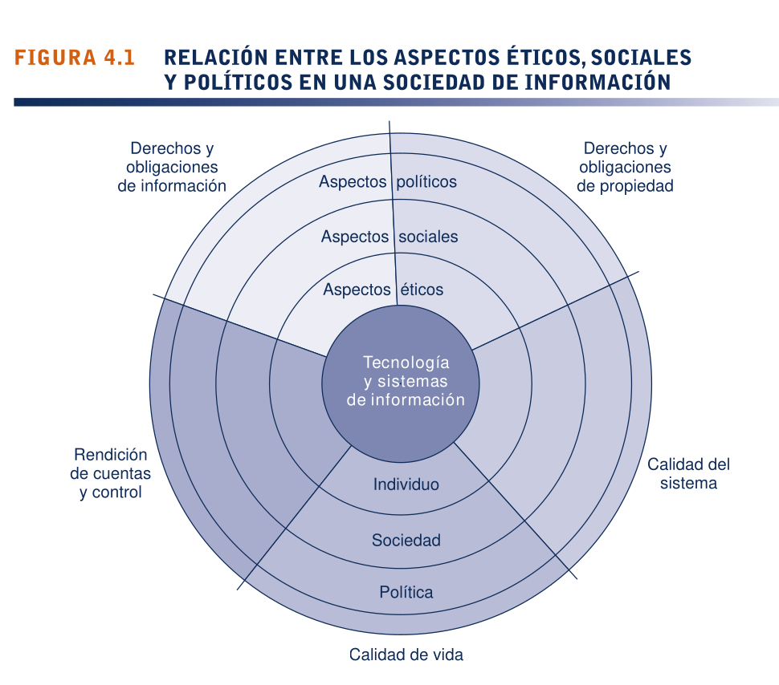
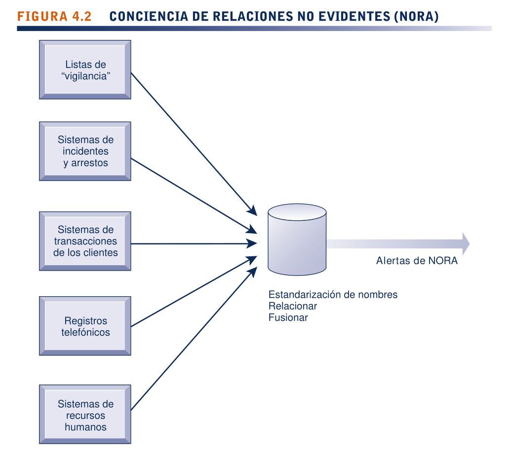
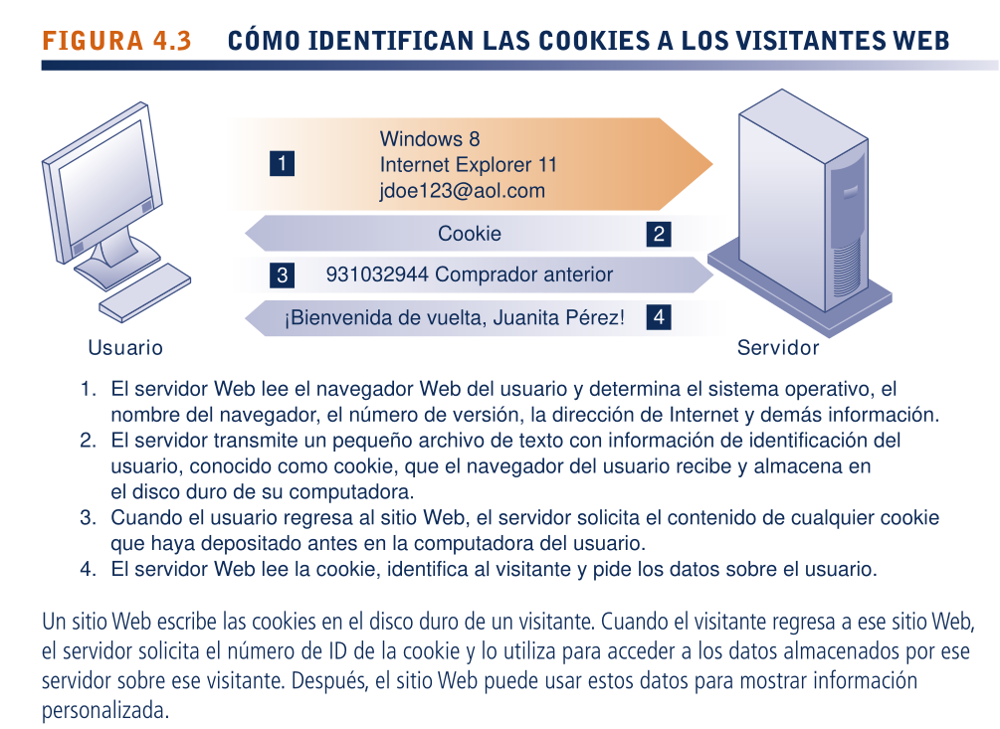

<h1>Aspectos éticos y sociales en los sistemas de información</h1>

* <h2>Resumen</h2>

    1.  ¿Qué aspectos éticos, sociales y políticos generan los sistemas de información?

La tecnología de la información está introduciendo cambios para los que aún no se han desarrollado leyes y reglas de conducta aceptables. El aumento constante en el poder de cómputo, capacidad de almacenamiento y de red (incluyendo Internet) expanden el alcance de las acciones individuales y organizacionales, además de magnificar sus impactos. La facilidad y el anonimato con que se comunica, copia y manipula la información
actualmente en los entornos en línea impone nuevos desafíos a la protección de la privacidad y la propiedad intelectual. Los principales aspectos éticos, sociales y políticos generados por los sistemas de información se concentran alrededor de los derechos y obligaciones de la información, los derechos y obligaciones de la propiedad, la rendición de cuentas y el control, la calidad del sistema y la calidad de vida.

   2.  ¿Qué principios específicos para la conducta se pueden utilizar para guiar las decisiones éticas?

Hay seis principios éticos para juzgar la conducta: Regla dorada, Imperativo categórico de Emmanuel Kant, Regla del cambio de Descartes, Principio utilitarista, Principio de aversión al riesgo y la regla ética de “no hay
comida gratis”. Estos principios se deben usar en conjunto con un análisis ético.

   3.  ¿Por qué la tecnología de los sistemas de información contemporáneos e Internet imponen desafíos a la protección de la privacidad individual y la propiedad intelectual?

La tecnología contemporánea de análisis y almacenamiento de datos permite a las compañías recopilar con facilidad datos personales sobre individuos de muchos orígenes distintos, y analizarlos para crear perfiles electrónicos detallados sobre los individuos y sus comportamientos. Los datos que fluyen a través de Internet se pueden monitorear en muchos puntos. Las cookies y otras herramientas de monitoreo Web rastrean de cerca las actividades de los visitantes de sitios Web. No todos los sitios Web tienen políticas sólidas de protección de la privacidad, y no siempre permiten el consentimiento informado en cuanto al uso de la información personal. Las leyes tradicionales de derechos de autor no son suficientes para proteger contra la piratería de software, debido a que el material digital se puede copiar con mucha facilidad y transmitirse simultáneamente a muchas ubicaciones distintas a través de Internet.

   4.  ¿Cómo han afectado los sistemas de información a las leyes para establecer responsabilidad, rendición de cuentas y la calidad de nuestra vida diaria?

Las nuevas tecnologías de la información desafían las leyes de responsabilidad legal y las prácticas sociales existentes para responsabilizar a los individuos e instituciones del daño realizado a otras personas. Aunque los sistemas computacionales han sido fuentes de eficiencia y riqueza, tienen ciertos impactos negativos. Los errores de computadora pueden ocasionar daños graves tanto a los individuos como a las organizaciones. La mala calidad de los datos también es responsable de las interrupciones y pérdidas en las empresas. Se pueden perder empleos cuando las computadoras reemplazan trabajadores o las tareas se hacen innecesarias en los procesos de negocios rediseñados. La capacidad de poseer y usar una computadora puede estar exacerbando discrepancias socioeconómicas entre distintos grupos étnicos y clases sociales. El uso extendido de las computadoras incrementa las oportunidades para cometer delitos por computadora y abuso computacional. Las computadoras también pueden crear problemas de salud, como la lesión por esfuerzo repetitivo, el síndrome de visión de computadora y el tecnoestrés.

<h2>4.1) ¿QUÉ ASPECTOS ÉTICOS, SOCIALES Y POLÍTICOS GENERAN LOS SISTEMAS DE INFORMACIÓN?</h2>

En los últimos 10 años, sin duda hemos sido testigos de uno de los periodos más desafiantes en el sentido ético para Estados Unidos y los negocios globales. La tabla 4.1 provee una pequeña muestra de los casos recientes que demuestran un juicio ético erróneo por parte de los gerentes de nivel superior y medio. Estos lapsos en el juicio ético y de negocios de la gerencia ocurrieron a través de un amplio espectro de industrias.
 
En el nuevo entorno legal de hoy es probable que los gerentes que violen la ley y reciban condena pasen un tiempo en prisión. Los lineamientos de las sentencias federales en Estados Unidos que se adoptaron en 1987 obligan a los jueces federales a imponer sentencias duras a los ejecutivos de negocios, con base en el valor monetario del crimen, la presencia de una conspiración para evitar que se descubra el ilícito, el uso
de transacciones financieras estructuradas para ocultar el delito y el no querer cooperar con la fiscalía (Comisión de sentencias de Estados Unidos, 2004).
 
Aunque en el pasado las empresas de negocios pagaban a menudo por la defensa legal de sus empleados enredados en cargos civiles e investigaciones criminales, ahora se anima a las empresas a que cooperen con los fiscales para reducir los cargos contra toda la empresa por obstruir las investigaciones. Estos avances significan que, ahora más que nunca, como gerente o empleado usted tendrá que decidir por su cuenta qué es lo que constituye una conducta legal y ética apropiada.
 
Aunque estos casos importantes de juicio ético y legal fallido no fueron planeados por los departamentos de sistemas de información, los sistemas de información fueron instrumentales en muchos de estos fraudes. En muchos casos los perpetradores de estos crímenes utilizaron con astucia los sistemas de información generadores de informes financieros para ocultar sus decisiones del escrutinio público, con la vaga esperanza de que nunca los atraparan.
 
En el capítulo 8 veremos el control en los sistemas de información. En este capítulo hablaremos sobre las dimensiones éticas de éstas y otras acciones con base en el uso de los sistemas de información. La ética se refiere a los principios del bien y del mal que los individuos, al actuar como agentes con libre moral, utilizan para guiar sus comportamientos. Los sistemas de información generan nuevas cuestiones éticas tanto para los individuos como para las sociedades, ya que crean oportunidades para un intenso cambio social y, por ende, amenazan las distribuciones existentes de poder, dinero, derechos y obligaciones. Al igual que otras tecnologías, como los motores de vapor, la electricidad, el teléfono y la radio, la tecnología de la información se puede usar para alcanzar el progreso social, pero también para cometer crímenes y amenazar los preciados valores sociales. El desarrollo de la tecnología de la información producirá beneficios para muchos y costos para otros.
 
A los aspectos éticos en los sistemas de información se les ha dado una nueva urgencia debido al surgimiento de Internet y del e-commerce. Internet y las tecnologías de las empresas digitales facilitan ahora más que nunca los procesos de ensamblar, integrar y distribuir la información, lo cual desencadena nuevas preocupaciones respecto del uso apropiado de la información de los clientes, la protección de la privacidad personal y la protección de la propiedad intelectual.
 
Otros aspectos éticos urgentes generados por los sistemas de información son: establecer la rendición de cuentas por las consecuencias de los sistemas de información, fijar estándares para salvaguardar la calidad del sistema que protege la seguridad del individuo y de la sociedad, así como preservar los valores y las instituciones que se consideran esenciales para la calidad de vida en una sociedad de información. Al utilizar sistemas de información es indispensable preguntar: <strong>¿cuál es el curso de acción ética y socialmente responsable?</strong>

**`TABLA 4.1:` EJEMPLOS RECIENTES DE JUICIOS ÉTICOS FALLIDOS DE GERENTES DE NIVEL SUPERIOR**
| | |
|--|--|
| `General Motors Inc. (2014)` | El CEO de General Motors admite que la empresa encubrió durante más de una década los interruptores de encendido defectuosos, lo que ocasionó la muerte de al menos 13 clientes. La empresa ha retirado 2.7 millones de autos. |
| `Endo Health Solutions, Inc. (2014)` | La empresa farmacéutica Endo Health Solutions Inc. acordó pagar $192.7 millones para resolver la responsabilidad criminal y civil que surgió debido a la comercialización por parte de Endo del medicamento recetado Lidoderm para usos no aprobados como seguros y efectivos por parte de la Administración Nacional de Alimentos y Fármacos (FDA). |
| `SAC Capital (2013)` | SAC Capital, un fondo de cobertura dirigido por Steven Cohen, se declaró culpable de cargos por tráfico de información privilegiada y acordó pagar una multa récord de $1,200 millones. La empresa también se vio forzada a dejar el negocio de gestión monetaria. Los corredores individuales de SAC resultaron culpables de cargos criminales y fueron sentenciados a prisión. |
| `Barclays Bank PLC (2012)` | Uno de los bancos más grandes del mundo admitió manipular sus propuestas para las tasas de interés de referencia LIBOR con el fin de beneficiar sus posiciones de negociación y la percepción de los medios en cuanto a la salud financiera del banco. Recibió una multa de $160 millones. |
| `GlaxoSmithKline LLC (2012)` | El gigante global de servicios médicos admitió una promoción ilegal y criminal de ciertos medicamentos de receta, no haber reportado ciertos datos de seguridad, y su responsabilidad civil por supuestas prácticas de informes de precios falsos. Fue multado con $3 mil millones, la resolución por fraude de servicio médicos más grande en la historia de Estados Unidos y el pago más alto realizado por una empresa farmacéutica. |
| `Walmart Inc. (2012)` | Los ejecutivos de Walmart en México fueron acusados de pagar millones de dólares en sobornos a funcionarios mexicanos para recibir permisos de construcción. El Departamento de Justicia mantiene la investigación del caso. |
| `Galleon Group (2011)` | El fundador de Galleon Group fue sentenciado a 11 años de cárcel por traficar información privilegiada. Resultó culpable de pagar $250 millones a bancos de Wall Street y obtener a cambio información del mercado que otros inversionistas no recibieron. |
| `Siemens (2009)` | La empresa de ingeniería más grande del mundo pagó más de $4 mil millones a las autoridades alemanas y estadounidenses por un esquema de soborno a nivel mundial que duró varias décadas, aprobado por los ejecutivos corporativos para influenciar a los clientes potenciales y a los gobiernos. Los pagos se ocultaron de los sistemas contables que generaban informes normales. |
| `McKinsey & Company (2011)` | El CEO Rajat Gupta escuchó cintas que filtraban información privilegiada. El anterior CEO de la prestigiosa empresa de consultoría gerencial McKinsey & Company fue encontrado culpable en 2012 y sentenciado a dos años en prisión. |
| `Bank of America (2012)` | Los fiscales federales acusaron a Bank of America y a su afiliado Countrywide Financial de defraudar a las agencias  hipotecarias respaldadas por el gobierno, al generar préstamos a un ritmo rápido sin controles apropiados. Los fiscales solicitan $1 mil millones en multas del banco como compensación por el comportamiento que dicen que obligó a los contribuyentes a garantizar miles de millones en préstamos incobrables. |

* <h3>UN MODELO PARA PENSAR EN LOS ASPECTOS ÉTICOS, SOCIALES Y POLÍTICOS</h3>

Los aspectos éticos, sociales y políticos están muy vinculados. El dilema ético al que usted se puede enfrentar como gerente de sistemas de información se suele reflejar en el debate social y político. En la figura 4.1 se muestra una forma de pensar acerca de estas relaciones. Imagine la sociedad como un estanque más o menos tranquilo en un día de verano, un delicado ecosistema en equilibrio parcial con los individuos y
con las instituciones tanto sociales como políticas. Los individuos saben cómo actuar en este estanque, ya que las instituciones sociales (familia, educación, organizaciones) han desarrollado reglas bien elaboradas de comportamiento, y éstas se apoyan en leyes desarrolladas en el sector político, las cuales prescriben la conducta y prometen sanciones para las violaciones. Ahora lance una piedra al centro del estanque. ¿Qué sucede? Se producen ondas, desde luego.
 
Imagine que en vez de la fuerza perturbadora hay una poderosa sacudida provocada por una nueva tecnología y nuevos sistemas de información que impactan a una sociedad más o menos inerte. De repente, los actores individuales se enfrentan a nuevas situaciones que con frecuencia no las cubren las reglas antiguas. Las instituciones sociales no pueden responder de un día para otro a estas ondas; tal vez se requieran años para desarrollar reglas de etiqueta, expectativas, responsabilidad social, actitudes políticamente correctas o aprobadas. Las instituciones políticas también requieren tiempo para poder elaborar nuevas leyes y a menudo necesitan que se demuestre el verdadero daño antes de que actúen. Mientras tanto, tal vez usted tenga que actuar y quizá se vea obligado a hacerlo en un área legal no muy clara.
 
Podemos usar este modelo para ilustrar la dinámica que conecta los aspectos éticos, sociales y políticos. Este modelo también es útil para identificar las principales dimensiones morales de la sociedad de información, las cuales atraviesan varios niveles de acción: individual, social y político.

* <h3>CINCO DIMENSIONES MORALES DE LA ERA DE LA INFORMACIÓN</h3>

Los principales aspectos éticos, sociales y políticos que generan los sistemas de información incluyen las siguientes dimensiones morales:

   1. **Derechos y obligaciones de información.** ¿Qué derechos de información poseen los individuos y las organizaciones con respecto a sí mismos? ¿Qué pueden proteger?

   2. **Derechos y obligaciones de propiedad.** ¿Cómo se protegerán los derechos de propiedad intelectual tradicionales en una sociedad digital en la que es difícil rastrear y rendir cuentas sobre la propiedad, y es muy fácil ignorar tales derechos de propiedad?

   3. **Rendición de cuentas y control.** ¿Quién puede y se hará responsable de rendir cuentas por el daño hecho a la información individual y colectiva, y a los derechos de propiedad?

   4. **Calidad del sistema.** ¿Qué estándares de calidad de los datos y del sistema debemos exigir para proteger los derechos individuales y la seguridad de la sociedad?

   5. **Calidad de vida.** ¿Qué valores se deben preservar en una sociedad basada en la información y el conocimiento? ¿Qué instituciones debemos proteger para evitar que se violen sus derechos? ¿Qué valores y prácticas culturales apoya la nueva tecnología de la información?

* <h3>TENDENCIAS DE TECNOLOGÍA CLAVE QUE GENERAN ASPECTOS ÉTICOS</h3>

Los aspectos éticos han existido desde mucho antes que la tecnología de la información. Sin embargo, ésta ha enaltecido las cuestiones éticas, ha puesto a prueba los arreglos sociales existentes y ha vuelto obsoletas o severamente imposibilitadas a algunas leyes. Existen cinco tendencias tecnológicas clave responsables de estas tensiones éticas, las cuales se sintetizan en la <strong>tabla 4.2.</strong>

**`TABLA 4.2:` TENDENCIAS DE TECNOLOGÍA QUE GENERAN ASPECTOS ÉTICOS.**

|                                           TENDENCIA                                           |                                                                                                                      IMPACTO                                                                                                                       |
| --------------------------------------------------------------------------------------- | ----------------------------------------------------------------------------------------------------------------------------------------------------------------------------------------------------------------- |
| El poder de cómputo se duplica cada 18 meses                              | Cada vez más organizaciones dependen de los sistemas computacionales para sus operaciones críticas.                                                                                    |
| Los costos del almacenamiento de datos disminuyen con rapidez | Las organizaciones pueden mantener con facilidad bases de datos detalladas sobre individuos.                                                                                                    |
| Avances en el análisis de datos                                                       | Las compañías pueden analizar grandes cantidades de datos recopilados sobre individuos para desarrollar perfiles detallados del comportamiento individual. |
| Avances en las redes                                                                       | El costo de mover los datos y hacerlos accesibles desde cualquier parte disminuye en forma exponencial.                                                                                   |
| Impacto del crecimiento de los dispositivos móviles                        | Los teléfonos celulares individuales pueden rastrearse sin el consentimiento o conocimiento del usuario.                                                                                      |

Dado que el poder de cómputo se duplica cada 18 meses, la mayoría de las organizaciones han podido utilizar sistemas de información para sus procesos básicos de producción. Como resultado, nuestra dependencia de los sistemas y nuestra vulnerabilidad para con los errores de los sistemas se ha incrementado, así como la mala calidad de los datos. Las reglas y leyes sociales aún no se han ajustado a esta dependencia. Los estándares para asegurar la precisión y confiabilidad de los sistemas de información (vea el capítulo 8) no se aceptan ni se implementan de manera universal.
 
Los avances en las técnicas de almacenamiento de datos y el rápido decremento de los costos del almacenamiento han sido responsables del aumento en el número de bases de datos sobre individuos (empleados, clientes y clientes potenciales) que las organizaciones privadas y públicas mantienen. Estos avances en el almacenamiento de datos han hecho que la violación rutinaria de la privacidad individual sea tanto económica como efectiva. Los sistemas de almacenamiento de datos masivos de terabytes y petabytes de datos están ahora disponibles en el sitio o como servicios en línea para que empresas de todos tamaños, los utilicen para identificar a los clientes.
 
Los avances en las técnicas de análisis de datos para las grandes reservas de información son otra tendencia tecnológica que enaltece las cuestiones éticas, ya que las compañías y las agencias gubernamentales pueden averiguar información personal muy detallada sobre los individuos. Con las herramientas contemporáneas de gestión de datos (vea el capítulo 6), las compañías pueden ensamblar y combinar la multitud de piezas de información sobre usted que están almacenadas en las computadoras, con mucha más facilidad que en el pasado.
 
Piense en todas las formas en que se genera información de computadora sobre usted: compras con tarjetas de crédito, llamadas telefónicas, suscripciones de revistas, rentas de video, compras por correo, registros bancarios, registros gubernamentales locales, estatales y federales (entre ellos registros en tribunales y policiacos), y visitas a sitios Web. Si se reúne y explota en forma apropiada, esta información podría revelar no sólo su información de crédito, sino también sus hábitos de manejo, sus gustos, asociaciones e intereses políticos.
 
Las compañías con productos que vender compran información relevante de estas fuentes para que les ayude a optimizar con más detalle sus campañas de marketing. Los capítulos 6 y 11 describen cómo las compañías pueden analizar grandes reservas de datos de varias fuentes para identificar con rapidez los patrones de compra de los clientes y sugerir respuestas individuales. El uso de las computadoras para combinar los datos de varias fuentes y crear expedientes electrónicos de información detallada sobre ciertos individuos se conoce como creación de perfiles.
 
Por ejemplo, varios miles de los sitios Web más populares permiten que DoubleClick (propiedad de Google), una agencia de publicidad por Internet, rastree las actividades de sus visitantes a cambio de los ingresos por los anuncios basados en la información sobre los visitantes que DoubleClick recopila. DoubleClick utiliza esta información para crear un perfil de cada visitante en línea, y agrega más detalles a medida que el visitante accede a un sitio asociado con esta propiedad. Con el tiempo, DoubleClick crea un expediente detallado de los hábitos de gasto y de uso de la computadora de una persona
en la Web, el cual vende a las compañías para ayudarles a dirigir sus anuncios Web con más precisión. Los 50 principales sitios Web en Estados Unidos contienen en promedio más de 100 programas de rastreo instalados por las empresas de publicidad para rastrear su comportamiento en línea.
 
ChoicePoint recopila datos de los registros policiacos, criminales y de automotores; los historiales de créditos y empleo; las direcciones actuales y anteriores; las licencias profesionales y las reclamaciones de los seguros, para ensamblar y mantener expedientes electrónicos sobre casi cualquier adulto en Estados Unidos. La compañía vende esta información personal a las empresas y agencias gubernamentales. La demanda de datos personales es tan grande que los negocios de agencias de datos como ChoicePoint están floreciendo. Las dos redes de tarjetas de crédito más grandes, Visa Inc. y MasterCard Inc., acordaron enlazar la información de las compras con tarjeta de crédito a las redes sociales de los consumidores y demás información, para crear perfiles de clientes que puedan venderse a empresas de publicidad. En 2013, Visa procesó más de 45 mil millones de transacciones durante el año y MasterCard procesó más de 23 mil millones. En la actualidad, esta información transaccional no está enlazada con las actividades del
consumidor en Internet.
 
Hay una nueva tecnología de análisis de datos conocida como conciencia de relaciones no evidentes (NORA), gracias a la cual el gobierno y el sector privado obtuvieron herramientas aún más poderosas para crear perfiles. NORA puede recibir información sobre personas de muchas fuentes distintas, como solicitudes de empleo, registros telefónicos, listados de clientes y listas de “buscados”, para luego correlacionarlos y encontrar conexiones ocultas oscuras que podrían ayudar a identificar criminales o terroristas (vea la figura 4.2).
 
La tecnología de NORA explora datos y extrae información a medida que se generan estos datos, de modo que pueda, por ejemplo, descubrir de inmediato a un hombre en la taquilla de una aerolínea que comparta un número telefónico con un terrorista conocido antes de que esa persona aborde un avión. La tecnología se considera una herramienta valiosa para la seguridad nacional, pero tiene implicaciones de privacidad debido a que puede proveer una imagen muy detallada de las actividades y asociaciones de un solo individuo.
 
Un ejemplo de cómo el gobierno y la industria privada no sólo usan las mismas técnicas de minería de datos para identificar y rastrear individuos, sino que en casos de seguridad nacional cooperan estrechamente entre sí para recopilar datos, se proporcionó mediante la liberación no autorizada de documentos que describen las actividades de vigilancia electrónica de la Agencia de Seguridad Nacional (NSA) de Estados Unidos. La Sesión interactiva sobre administración describe este programa y la controversia que ha generado.
 
Por último, los avances en las redes (incluyendo Internet) prometen reducir en gran medida los costos de desplazar y acceder a grandes cantidades de datos; además, abren la posibilidad de explotar las reservas extensas de datos en forma remota mediante el uso de pequeñas máquinas de escritorio, lo cual permite una invasión de la privacidad a una escala y con una precisión nunca antes imaginada.

<h2>4.2) ¿QUÉ PRINCIPIOS ESPECÍFICOS PARA LA CONDUCTA SE PUEDEN UTILIZAR PARA GUIAR LAS DECISIONES ÉTICAS?</h2>

La ética es una cuestión de los seres humanos que tienen libertad de elección. Se refiere a la elección individual: al enfrentarse a cursos de acción alternativos, ¿cuál es la opción moral correcta? ¿Cuáles son las principales características de la elección ética?

* <h3>CONCEPTOS BÁSICOS: RESPONSABILIDAD, RENDICIÓN DE CUENTAS Y RESPONSABILIDAD LEGAL</h3>

Las elecciones éticas son decisiones que toman los individuos responsables de las consecuencias de sus acciones. La responsabilidad es un elemento clave de la acción ética. Responsabilidad significa que usted acepta los costos, deberes y obligaciones potenciales por las decisiones que toma. La rendición de cuentas es una característica de los sistemas e instituciones sociales: significa que hay mecanismos en vigor para determinar quién tomó una acción responsable, y quién está a cargo. Los sistemas y las instituciones en las que es imposible averiguar quién tomó qué acción son por naturaleza incapaces de un análisis ético o de una acción ética. La responsabilidad legal extiende el concepto de responsabilidad hasta el área de la ley. La responsabilidad legal es una característica de los sistemas políticos en la cual entran en vigor un grupo de leyes que permite a los individuos recuperar los daños que reciben de parte de otros actores, sistemas u organizaciones. El debido proceso es una característica relacionada de las sociedades gobernadas por leyes y es un proceso en el que las normas se conocen y comprenden, además de que existe la capacidad de apelar a las autoridades superiores
para asegurar que se apliquen las leyes correctamente.
 
Estos conceptos básicos forman el fundamento de un análisis ético de los sistemas de información y de quienes los administran. En primer lugar, las tecnologías de la información se filtran a través de instituciones sociales, organizaciones e individuos. Los sistemas no tienen impactos por sí solos. Los impactos que existan de los sistemas de información son producto de acciones y comportamientos institucionales, organizacionales e individuales.
 
En segundo lugar, la responsabilidad de las consecuencias de la tecnología recae sin duda en las instituciones, organizaciones y gerentes individuales que eligen usar la tecnología. Utilizar la tecnología de la información de una manera
socialmente responsable significa que quien la usa puede ser y será considerado responsable de las consecuencias de sus acciones. En tercer lugar, en una sociedad ética y política, los individuos y otras entidades pueden recuperarse de los daños sufridos por medio de un conjunto de leyes caracterizadas por el debido proceso.

* <h3>ANÁLISIS ÉTICO</h3>

Al enfrentarse a una situación que parece presentar cuestiones éticas, ¿cómo debería analizarla? El siguiente proceso de cinco pasos le será de utilidad:

<ol>
    <li>
    

<strong>Identificar y describir los hechos con claridad.</strong> Averigüe quién hizo qué a quién, y dónde, cuándo y cómo lo hizo. En muchos casos se sorprenderá de los errores en los hechos reportados inicialmente, y a menudo descubrirá que con solo obtener los hechos correctos es posible definir la solución. También es útil hacer que las partes opositoras involucradas en un dilema ético se pongan de acuerdo en los hechos.

    </li>
    <li>
    

<strong>Definir el conflicto o dilema e identificar los valores involucrados de mayor orden.</strong> Los aspectos éticos, sociales y políticos siempre hacen referencia a valores superiores. Todas las partes en una disputa afirman que persiguen valores superiores (por ejemplo, libertad, privacidad, protección de la propiedad y el sistema de libre empresa). Por lo general, una cuestión ética implica un dilema: dos cursos de acción diametralmente opuestos que apoyan valores de utilidad. Por ejemplo, el caso de estudio al inicio del capítulo ilustra dos valores que compiten entre sí: la necesidad de mejorar el acceso a contenido digital, y la de proteger los derechos de los propietarios de ese contenido.
    

    </li>
    <li>
    

<strong>Identificar a los participantes.</strong> Todo aspecto ético, social y político tiene participantes: jugadores que tienen un interés en el resultado; quienes han invertido en la situación, y por lo general quienes tienen opiniones verbales. Averigüe la identidad de estos grupos y lo que quieren. Esto será de utilidad más adelante, a la hora de diseñar una solución
    

    </li>
    <li>
    

<strong>Identificar las opciones que se pueden tomar de manera razonable.</strong> Tal vez descubra que ninguna de las opciones satisfacen todos los intereses implicados, pero que algunas hacen un mejor trabajo que otras. Algunas veces llegar a una solución buena o ética tal vez no siempre sea un balance de consecuencias para los participantes.
    

    </li>
    <li>
    

<strong>Identificar las consecuencias potenciales de sus opciones.</strong> Algunas opciones pueden ser correctas en el sentido ético, pero desastrosas desde otros puntos de vista. Tal vez otras opciones funcionen en un caso, pero no en otros casos similares. Siempre debe preguntarse: “¿qué pasa si selecciono consistentemente esta opción todo el tiempo?”
    

    </li>
</ol>

* <h3>PRINCIPIOS ÉTICOS CANDIDATOS</h3>

Una vez que ha completado su análisis, ¿qué principios o reglas éticas debe usar para tomar una decisión? ¿Qué valores de orden superior deberían conformar su juicio? Aunque usted sea el único que puede decidir cuál de varios principios éticos seguirá y
cómo les asignará prioridades, es útil considerar algunos principios éticos con raíces profundas en muchas culturas que han sobrevivido a través de los registros de la historia:

<ol>
    <li>
    

Haga a los demás lo que quiera que le hagan a usted (la regla dorada). Si se pone en el lugar de otros y piensa en sí mismo como el objeto de la decisión, le será más fácil pensar sobre la imparcialidad de la toma de decisiones.

    </li>
    <li>
    

Si una acción no es correcta para que todos la tomen, no es correcta para nadie (imperativo categórico de Emmanuel Kant). Pregúntese a sí mismo, “si todos hicieran esto, ¿podría sobrevivir la organización, o la sociedad?”
    

    </li>
    <li>
    

Si no se puede tomar una acción en forma repetida, no es correcto tomarla de ningún modo. Esta es la regla de la cuerda resbalosa: una acción puede traer un pequeño cambio ahora, el cual es aceptable; pero si se repite, a la larga provocaría cambios inaceptables. En lengua vernácula podría decirse así: “una vez que se encuentre en un camino resbaloso, tal vez no se pueda detener”.
    

    </li>
    <li>
    

Tome la acción que obtenga el valor más alto o grande (principio utilitarista). Esta regla asume que usted puede asignar prioridades a los valores por orden de rango y comprender las consecuencias de diversos cursos de acción.
    

    </li>
    <li>
    

Tome la acción que produzca el menor daño o que tenga el menor costo potencial (principio de aversión al riesgo). Algunas acciones tienen costos demasiado altos por fallar, con una probabilidad muy baja (por ejemplo, construir una planta generadora de
energía nuclear en un área urbana) o costos muy altos por fallar, con una probabilidad moderada (accidentes de automóviles y por exceso de velocidad). Evite estas acciones de alto costo de falla, y ponga más atención al potencial de alto costo de falla con una probabilidad entre moderada y alta.
    

    </li>
    <li>
    

Suponga que casi todos los objetos tangibles e intangibles le pertenecen a alguien más, a menos que haya una declaración específica de lo contrario (ésta es la regla ética de “no hay comida gratis”). Si lo que alguien más ha creado es útil para usted, tiene un valor y debe suponer que el creador desea una compensación por su trabajo.
    

    </li>
</ol>

Las acciones que no pasan fácilmente estas reglas merecen una atención estricta y mucha precaución. La aparición del comportamiento no ético puede hacerle tanto daño a usted y su compañía como el comportamiento no ético real.

* <h3>CÓDIGOS PROFESIONALES DE CONDUCTA</h3>

Cuando grupos de personas afirman ser profesionales, adquieren derechos y obligaciones especiales debido a sus afirmaciones especiales de conocimiento, sabiduría y respeto. Los códigos profesionales de conducta los promulgan asociaciones de profesionales como la Asociación médica estadounidense (AMA), el Colegio estadounidense de abogados (ABA), la Asociación de profesionales en tecnología de la información (AITP) y la Asociación de maquinaria computacional (ACM). Estos grupos profesionales asumen la responsabilidad de regular en forma parcial sus profesiones al determinar los requisitos de entrada y la competencia. Los códigos de ética son promesas que hacen las profesiones de regularse a sí mismas en el interés general de la sociedad. Por ejemplo, evitar dañar a otros, honrar los derechos de propiedad (entre ellos la propiedad intelectual) y respetar la privacidad, son algunos de los imperativos morales generales del Código de ética y conducta profesional de la ACM.

* <h3>ALGUNOS DILEMAS ÉTICOS DEL MUNDO REAL</h3>

Los sistemas de información han creado nuevos dilemas éticos en los que un conjunto de intereses se compara con otro. Por ejemplo, muchas de las grandes compañías telefónicas en Estados Unidos utilizan la tecnología de la información para reducir el tamaño de sus fuerzas laborales. El software de reconocimiento de voz reduce la necesidad de operadores humanos al permitir que las computadoras reconozcan las respuestas de un cliente a una serie de preguntas computarizadas. Muchas compañías supervisan lo que hacen sus empleados en Internet para evitar que desperdicien recursos de la compañía en actividades que no estén relacionadas con la empresa. Facebook monitorea a sus suscriptores y luego vende la información a los anunciantes y desarrolladores de apps (vea el caso de estudio al final del capítulo).
 
En cada instancia puede encontrar valores rivales en acción, con grupos alineados en ambos lados de un debate. Por ejemplo, una compañía puede argumentar que tiene el derecho de usar los sistemas de información para aumentar la productividad y reducir el tamaño de su fuerza de trabajo a fin de bajar los costos y permanecer en el negocio. Los empleados desplazados por los sistemas de información pueden argumentar que los patrones tienen cierta responsabilidad por su bienestar. Los propietarios de las empresas se podrían sentir obligados a supervisar el correo electrónico y el uso que los usuarios hacen de Internet para minimizar las fugas de productividad. Los trabajadores podrían creer que deben ser capaces de usar la red para tareas personales cortas en lugar del teléfono. Un análisis detallado de los hechos puede algunas veces producir soluciones comprometidas que otorguen a cada parte “mitad y mitad”. Trate de aplicar a cada uno de estos casos algunos de los principios descritos sobre el análisis ético. ¿Cuál es la acción correcta a tomar?

<h2>4.3) ¿POR QUÉ LA TECNOLOGÍA DE LOS SISTEMAS DE INFORMACIÓN CONTEMPORÁNEOS E INTERNET IMPONEN DESAFÍOS A LA PROTECCIÓN DE LA PRIVACIDAD INDIVIDUAL Y DE LA PROPIEDAD INTELECTUAL?</h2>

En esta sección analizaremos con más detalle las cinco dimensiones morales de los sistemas de información que describimos por primera vez en la figura 4.1. En cada dimensión vamos a identificar los niveles ético, social y político del análisis; además,
usaremos ejemplos reales para ilustrar los valores implicados, los participantes y las opciones elegidas.

* <h3>DERECHOS DE INFORMACIÓN: PRIVACIDAD Y LIBERTAD EN LA ERA DE INTERNET</h3>

La privacidad es el derecho de los individuos a no ser molestados, a no estar bajo vigilancia ni interferencia por parte de otros individuos u organizaciones, incluyendo el estado. Los derechos a la privacidad también se ven involucrados en el lugar de trabajo: millones de empleados están sujetos a formas electrónicas y otros tipos de vigilancia de alta tecnología. La tecnología y los sistemas de información amenazan los derechos individuales de privacidad al hacer que la invasión de la privacidad sea algo económico, redituable y eficaz.
 
El derecho a la privacidad está protegido en las constituciones de Estados Unidos, Canadá y Alemania en varias formas distintas, y en otros países por medio de diversos estatutos. En Estados Unidos, el derecho a la privacidad está protegido en primera instancia por las garantías de libertad de expresión y asociación de la Primera Enmienda, las protecciones de la Cuarta Enmienda contra el cateo y el embargo irracional de los documentos personales o el hogar de una persona, y por la garantía del debido proceso. La tabla 4.3 describe los principales estatutos federales de Estados Unidos que exponen las condiciones para manejar la información sobre los individuos en áreas como informes crediticios, educación, registros financieros, registros en periódicos y las comunicaciones electrónicas. La Ley de la privacidad de 1974 ha sido la más importante de estas leyes puesto que regula la recolección, uso y divulgación de la información por parte del gobierno federal. A la fecha, la mayoría de las leyes federales de privacidad de Estados Unidos se aplican sólo al gobierno federal y regulan muy pocas áreas del sector privado.

**`TABLA 4.3:` LEYES FEDERALES DE PRIVACIDAD EN ESTADOS UNIDOS**

|               LEYES FEDERALES GENERALES DE PRIVACIDAD               |                                                                                                                LEYES DE PRIVACIDAD QUE AFECTAN A LAS INSTITUCIONES PRIVADAS                                                                                                                |
| ----------------------------------------------------------------------------------------------- | ------------------------------------------------------------------------------------------------------------------------------------------------------------------------------------------------------------------------------------------------------------------------------------------------- |
| Ley de libertad de información,1966, enmendada (5 USC 552)                | Ley de informes imparciales de crédito, 1970                                                                                                                                                                                                                                                                                     |
| Ley de privacidad, 1974, enmendada (5 USC 552a)                                 | Ley de derechos educativos y privacidad de la familia, 1974                                                                                                                                                                                                                                                             |
| Ley de privacidad de las comunicaciones electrónicas, 1986                   | Derecho a la Ley de privacidad financiera, 1978                                                                                                                                                                                                                                                                                |
| Ley de comparación por computadora y protección de privacidad, 1988 | Ley de protección de privacidad, 1980                                                                                                                                                                                                                                                                                                |
| Ley de seguridad informática, 1987                                                           | Ley de políticas de comunicaciones por cable, 1984                                                                                                                                                                                                                                                                          |
| Ley federal sobre la integridad financiera de los gerentes, 1982              | Ley de privacidad de las comunicaciones electrónicas, 1986                                                                                                                                                                                                                                                            |
| Ley de protección a la privacidad de los conductores, 1994                     | Ley de protección de la privacidad en video, 1988                                                                                                                                                                                                                                                                             |
| Ley de gobierno electrónico, 2002                                                             | La ley de portabilidad y rendición de cuentas del seguro médico, 1996 (HIPAA) Ley de protección de la privacidad de los niños en línea (COPPA), 1998 Ley de modernización financiera (Ley Gramm-Leach-Bliley), 1999 |

La mayor parte de la ley de privacidad estadounidense y europea se basa en un régimen conocido como Prácticas honestas de información (FIP), que se expuso por primera vez en un informe escrito en 1973 por un comité consultivo del gobierno federal y se actualizó de manera más reciente en 2010 para tener en cuenta la nueva tecnología invasora de la privacidad (FTC, 2010; Departamento de salud, educación y bienestar de Estados Unidos, 1973). FIP es un conjunto de principios que gobiernan la recolección y el uso de la información sobre las personas. Los principios de FIP se basan en la noción de un interés mutuo entre el poseedor del registro y el individuo. Al individuo le interesa participar en una transacción, y el que posee el registro (por lo general una empresa o agencia gubernamental) requiere información sobre el individuo para apoyar la transacción. Una vez recopilada la información, el individuo mantiene interés en el registro, el cual no se puede usar para apoyar otras actividades sin su consentimiento. En 1998, la FTC replanteó y extendió el régimen FIP original para proveer lineamientos relacionados con la protección de la privacidad en línea. La tabla 4.4 describe los principios de prácticas honestas de información de la FTC.
 
Los principios de FIP de la FTC se utilizan como lineamientos para impulsar los cambios en la legislación privada En julio de 1998, el Congreso de Estados Unidos aprobó la Ley de protección de la privacidad de los niños en línea (COPPA), la cual exige a los sitios Web que obtengan permiso de los padres antes de recolectar información sobre los niños menores de 13 años. La FTC ha recomendado legislación adicional para proteger la privacidad en línea del consumidor en las redes de publicidad que recolectan registros de la actividad Web del cliente para desarrollar perfiles detallados, que a su vez los utilizan otras compañías para dirigir sus anuncios en línea. En 2010, la FTC agregó tres prácticas a su marco de trabajo para privacidad. Las empresas deben adoptar la “privacidad por diseño”, creando productos y servicios que protejan la privacidad. Las empresas deben aumentar la transparencia de sus prácticas de datos, y deben requerir el consentimiento del consumidor además de ofrecer opciones claras para salirse de esquemas de recolección de datos (FTC, 2010). Otra legislación adicional propuesta sobre la privacidad en Internet se enfoca en proteger el uso en línea de los números de identificación personal, como los números de seguro social, proteger la información personal recolectada en Internet que trata sobre los individuos que no están cubiertos por la COPPA, y limitar el uso de la minería de datos para la seguridad nacional.

* **`TABLA 4.4:` PRINCIPIOS DE LAS PRÁCTICAS HONESTAS DE INFORMACIÓN DE LA COMISIÓN FEDERAL DE COMERCIO**

   1. **Aviso/conciencia (principio básico).** Los sitios Web deben divulgar sus prácticas de información antes de recolectar datos. Se incluyen la identificación del recolector, los usos de los datos, otros receptores de los datos, la naturaleza de la recolección (activa/inactiva), estatus voluntario u obligatorio, consecuencias del rechazo, los pasos realizados para proteger la confidencialidad, integridad y calidad de los datos.¨

    2. **Elección/consentimiento (principio básico).** Debe haber un régimen de elecciones en vigor para permitir a los consumidores elegir la forma en que se utilizará su información para fines secundarios, además de apoyar la transacción, el uso interno y la transferencia a terceros.

    3. **Acceso/participación.** Los consumidores deben ser capaces de revisar y contestar la precisión y exactitud de los datos recolectados sobre ellos en un proceso oportuno y económico.

    4. **Seguridad.** Los recolectores de datos deben tomar las medidas responsables para asegurar que la información del consumidor sea precisa y esté protegida contra el uso no autorizado.

    5. **Aplicación.** Debe haber un mecanismo en vigor para aplicar los principios de FIP. Esto puede implicar una legislación autorregulatoria que ofrezca a los consumidores remedios legales por violaciones, o estatutos y regulaciones federales.

A partir de 2009 y hasta 2012, la FTC extendió su doctrina de las prácticas honestas de información para manejar la cuestión del marketing dirigido en base al comportamiento. La FTC sostuvo audiencias para comentar su programa sobre los principios industriales voluntarios para regular el marketing dirigido en base al comportamiento. El grupo comercial de publicidad en línea Iniciativa de publicidad en la red (que veremos más adelante en esta sección) publicó sus propios principios autorregulatorios que coincidían en gran parte con la FTC. Sin embargo, el gobierno, los grupos de privacidad y la industria de la publicidad en línea aún están en desacuerdo sobre dos cuestiones. Los defensores de la privacidad desean una política de optar por participar en todos los sitios, además de una lista de personas que no se deben rastrear a nivel nacional. La industria se opone a estos movimientos y sigue insistiendo en que la capacidad de optar por no recibir publicidad es la única forma de evitar el rastreo.
 
En mayo de 2011, el senador Jay D. Rockefeller (D-WV), presidente del Subcomité de Comercio del Senado sobre Protección al Consumidor, Seguridad de productos y Seguros, sostuvo audiencias para hablar sobre las cuestiones de privacidad del consumidor y para explorar el posible rol del gobierno federal en la protección de los consumidores en el mercado de dispositivos móviles. Rockefeller apoya la ley Do-Not-Track Online (no rastrear en línea) de 2011 (que se reintrodujo en 2013), la cual requiere que las empresas notifiquen a los consumidores que están siendo rastreados y permite a los consumidores optar por no ser rastreados (Senado de Estados Unidos, 2011). No obstante, hay un consenso emergente entre todas las partes, el cual establece que se requiere una mayor transparencia y control del usuario (en especial contar con la opción de no participar en el rastreo como predeterminada) para lidiar con el rastreo del comportamiento. Si bien hay muchos estudios de cuestiones privadas a nivel federal, no ha habido una legislación significativa en los últimos años.
 
También se han agregado protecciones de privacidad a las leyes recientes que liberalizan los servicios financieros y salvaguardan el mantenimiento y la transmisión de la información sobre la salud de los individuos. La Ley Gramm-Leach-Bliley, de 1999, que revoca las restricciones anteriores sobre las afiliaciones entre bancos, empresas de seguridad y compañías de seguros, incluye cierta protección de privacidad para los consumidores de servicios financieros. Todas las instituciones financieras tienen que divulgar sus políticas y prácticas para proteger la privacidad de la información personal que no es pública, y deben permitir a los clientes la opción de no participar en los acuerdos de compartición de información con terceros no afiliados.
 
La ley de portabilidad y rendición de cuentas del seguro médico (HIPAA) de 1996, que entró en vigor el 14 de abril de 2003, incluye protección de la privacidad de los registros médicos. La ley otorga a los pacientes el acceso a sus registros médicos personales que mantienen los proveedores de salud, hospitales y aseguradoras médicas, además del derecho a autorizar cómo se puede usar o divulgar la información protegida sobre sí mismos. Los médicos, hospitales y demás proveedores de salud deben limitar la divulgación de la información personal sobre los pacientes al mínimo necesario para lograr un propósito dado.

<ul>
    <li>
<h4>La directiva europea sobre la protección de los datos</h4>

En Europa, la protección de la privacidad es mucho más estricta que en Estados Unidos. A diferencia de Estados Unidos, los países europeos no permiten que las empresas utilicen la información personal identificable sin el previo consentimiento de los consumidores. El 25 de octubre de 1998 entró en vigor la Directiva sobre protección de datos de la Comisión Europea, para ampliar la protección de la privacidad en las naciones de la Unión Europea (UE). La directiva exige a las compañías que informen a las personas cuando recolectan información sobre ellas y divulguen cómo se va a almacenar y utilizar. Los clientes deben dar su consentimiento informado antes de que cualquier compañía pueda usar legalmente los datos personales, y tienen el derecho de acceder a esa información, corregirla y solicitar que no se recolecten más datos. El consentimiento informado se puede definir como el permiso que se otorga con el conocimiento de todos los hechos necesarios para tomar una decisión racional. Las naciones que sean miembros de la UE deben traducir estos principios en sus propias leyes y no pueden transferir datos personales a países como Estados Unidos, que no tienen regulaciones similares de protección de la privacidad. En 2009, el Parlamento Europeo aprobó nuevas reglas que gobiernan el uso de cookies de terceros para fines de rastreo conductual. Estas nuevas reglas se implementaron en mayo de 2011 y requieren que los visitantes de los sitios Web den su consentimiento explícito para ser rastreados por cookies. Los sitios Web deberán tener advertencias altamente visibles en sus páginas si se usan cookies de terceros (Parlamento Europeo, 2009).
 
En enero de 2012, la Unión Europea emitió cambios importantes propuestos a sus reglas de protección de datos, la primera transformación desde 1995 (Comisión Europea, 2012). Las nuevas reglas se aplicarían a todas las empresas que proporcionan servicios en Europa, y requieren que las empresas de Internet como Amazon, Facebook, Apple, Google y otras, obtengan el consentimiento explícito de los consumidores en cuanto al uso de sus datos personales, eliminar información a solicitud del usuario (con base en el “derecho a ser olvidado”) y retener información sólo mientras sea absolutamente necesario. En 2014 la Unión Europea consideraba cambios importantes en las políticas de privacidad al extender un mayor control a los usuarios de Internet. Mientras que las políticas de privacidad de las empresas de Estados Unidos son en su mayoría voluntarias, en Europa las prácticas de privacidad son obligatorias y más consistentes entre las diversas jurisdicciones. Entre los cambios que se van a debatir está un requerimiento mediante el cual las empresas deben informar a los usuarios antes de recolectar datos, cada vez que lo hacen y cómo los van a usar. Los usuarios tendrían que dar su consentimiento para cualquier tipo de recolección de datos. Otras propuestas exigen que los usuarios tengan el “derecho de acceso” a los datos personales y el “derecho a ser olvidados”.
 
Al trabajar con la Comisión Europea, el Departamento de Comercio de Estados Unidos desarrolló un marco de trabajo de puerto seguro para las empresas estadounidenses. Un puerto seguro es una política privada autorregulatoria y mecanismo de aplicación que cumple con los objetivos de las regulaciones gubernamentales y la legislación, pero no implica la regulación o cumplimiento por parte del gobierno. A las empresas estadounidenses se les permitiría usar datos personales provenientes de países de la UE si desarrollaran políticas de protección a la privacidad que cumplan con los estándares de la UE. El cumplimiento ocurriría en Estados Unidos mediante el uso del autocontrol, la regulación y el cumplimiento de los estatutos de comercio honesto por parte del gobierno.

    </li>
    <li>
<h4>Desafíos de Internet al a privacidad</h4>

La tecnología de Internet ha impuesto nuevos desafíos a la protección de la privacidad individual. La información que se envía a través de esta enorme red de redes puede pasar por muchos sistemas computacionales distintos antes de llegar a su destino final. Cada uno de estos sistemas es capaz de monitorear, capturar y almacenar las comunicaciones que pasan a través de ellos.
 
Los sitios Web registran las búsquedas que se han realizado, los sitios Web y las páginas Web que se visitaron, el contenido en línea al que ha accedido una persona y qué elementos ha inspeccionado o comprado a través de Web. Este monitoreo y rastreo de los visitantes de sitios Web ocurre en el fondo sin que el visitante se dé cuenta. No solamente lo realizan los sitios Web individuales, sino también las redes de publicidad como Microsoft Advertising, Yahoo y DoubleClick de Google, que son capaces de rastrear todo el comportamiento de navegación en miles de sitios Web. Tanto los editores de sitios Web como la industria de la publicidad defienden el rastreo de individuos en Web debido a que, al hacerlo, es posible dirigir más anuncios relevantes a los usuarios, y esto paga por el costo de publicar sitios Web. En este sentido, es como las emisiones de televisión: contenido apoyado por anunciantes que es gratuito para el usuario. La demanda comercial de esta información es prácticamente insaciable. Sin embargo, estas prácticas también afectan la privacidad individual, como se describe en la Sesión interactiva sobre tecnología.
 
Las cookies son pequeños archivos de texto que se depositan en el disco duro de una computadora cuando un usuario visita sitios Web. Las cookies identifican el software navegador Web del visitante y rastrean las visitas al sitio. Cuando el visitante regresa a un sitio que tiene almacenada una cookie, el software del sitio Web busca en la computadora del visitante, encuentra la cookie y sabe qué ha hecho esa persona en el pasado. También es posible que actualice la cookie, dependiendo de la actividad durante la visita. De esta forma, el sitio puede personalizar su contenido para los intereses de cada visitante. Por ejemplo, si usted compra un libro en Amazon.com y regresa más tarde en el mismo navegador, el sitio le dará la bienvenida por su nombre y le recomendará otros libros de interés, con base en sus compras en el pasado. DoubleClick, que describimos antes en este capítulo, usa cookies para crear sus expedientes con detalles de las compras en línea y examinar el comportamiento de los visitantes al sitio Web. La figura 4.3 ilustra cómo trabajan las cookies.
 
Los sitios Web que utilizan tecnología de cookies no pueden obtener directamente los nombres y direcciones de los visitantes. No obstante, si una persona se registra en un sitio, se puede combinar esa información con los datos de la cookie para identificar al visitante. Los propietarios de sitios Web también pueden combinar los datos que recopilan de las cookies y demás herramientas de monitoreo de sitios Web con la información personal de otras fuentes, como los datos recolectados fuera de línea por medio de encuestas o compras por catálogos impresos, para desarrollar perfiles muy detallados de sus visitantes. Incluso ahora hay herramientas más sutiles y subrepticias para vigilancia de los usuarios de Internet. Las denominadas “supercookies” o cookies de Flash no pueden eliminarse fácilmente y se instalan cada vez que una persona hace clic en un video de Flash.
 
Estos archivos, que se conocen también como archivos de “Objeto local compartido”, se usan a través de Flash para reproducir videos y se colocan en la computadora del usuario sin su consentimiento. Los comercializadores usan bugs Web como otra herramienta para monitorear el comportamiento en línea. Los bugs Web, también conocidos como bichos Web (o “archivos de rastreo”), son pequeños programas de software que llevan el registro del flujo de clics en línea de los usuarios y reportan estos datos al propietario del archivo de rastreo de manera invisible incrustados en los mensajes de correo
electrónico y las páginas Web, los cuales están diseñados para monitorear el comportamiento del usuario que visita un sitio o envía un correo electrónico. Las empresas formadas por “terceros” (otros fabricantes) colocan los bugs Web en sitios Web populares; estas empresas pagan a los sitios Web una cuota por el acceso a su audiencia. ¿Entonces, qué tan común es el rastreo Web? En una innovadora serie de artículos en el Wall Street Journal en 2010 y 2011, los investigadores examinaron los archivos de rastreo en 50 de los sitios Web más populares de Estados Unidos. Lo que descubrieron reveló un sistema de vigilancia muy extendido. En los 50 sitios descubrieron 3,180 archivos de rastreo instalados en las computadoras de los visitantes. Solo un sitio, Wikipedia, no tenía archivos de rastreo. Algunos sitios populares como Dictionary.com, MSN y Comcast, ¡instalaron más de 100 archivos de rastreo! Dos terceras partes de los archivos provenían de 131 empresas cuyo negocio principal es identificar y rastrear usuarios de Internet para crear perfiles de consumidores que puedan venderse a las empresas de publicidad que buscan tipos específicos de clientes. Los mayores rastreadores eran Google, Microsoft y Quancast; todos ellos están en el negocio de vender anuncios a empresas publicitarias y comercializadores. Un estudio de seguimiento en 2012 descubrió que la situación había empeorado: ¡el rastreo en los más de 50 sitios populares había aumentado casi cinco veces! La causa, el crecimiento de las subastas de anuncios en línea donde los anunciantes compran información sobre el comportamiento de navegación Web de los usuarios. El spyware se puede instalar de manera secreta a sí mismo en la computadora de un usuario de Internet, para lo cual se aprovecha de las aplicaciones más grandes. Una vez instalado, se contacta con los sitios Web para que envíen anuncios tipo banner (pancarta) y diversos tipos de material no solicitado al usuario, y también puede informar sobre los movimientos del usuario en Internet a otras computadoras. En el capítulo 8 hay más información disponible sobre el indiscreto software.
 
Cerca de 80% de los usuarios globales de Internet usan la búsqueda de Google y otros de sus servicios, lo cual convierte a Google en el mayor recolector de datos de usuarios en línea a nivel mundial. Cualquier cosa que haga Google con los datos obtenidos tiene un enorme impacto sobre la privacidad en línea. La mayoría de los expertos creen que este buscador posee la mayor colección de información personal en el mundo: más datos sobre más personas que cualquier agencia gubernamental. Su competidor más cercano es Facebook. Después de que Google adquirió la red de publicidad DoubleClik en 2007, Google ha estado utilizando el marketing dirigido en base al comportamiento para que le ayude a mostrar anuncios más relevantes con base en las actividades de búsqueda de los usuarios y a dirigirse a individuos a medida que pasan de un sitio a otro para mostrarles anuncios de publicidad y pancartas. Google permite software de rastreo en sus páginas de búsqueda y, con DoubleClick, puede  los usuarios de Google, junto con cualquier otra información que el usuario envíe a Google y que éste pueda obtener, como la edad, región demográfica y otras actividades Web (como los blogs). El programa AdSense permite a Google ayudar a los anunciantes a seleccionar palabras clave y diseñar anuncios para diversos segmentos del mercado con base en los historiales de búsqueda; por ejemplo, ayudar a un sitio Web de venta de ropa a crear y probar anuncios dirigidos a las adolescentes. Un estudio reciente encontró que el 88% de 400,000 sitios Web tenía al menos un bug de rastreo de Google.
 
Google también ha estado explorando el contenido de los mensajes que reciben los usuarios de su servicio de correo electrónico gratuito basado en Web, conocido como Gmail. Los anuncios que ven los usuarios cuando leen su correo electrónico se relacionan con los asuntos de estos mensajes. Se desarrollan perfiles sobre los usuarios individuales con base en el contenido en su correo electrónico. Ahora Google muestra anuncios dirigidos en YouTube y en aplicaciones móviles de Google, y su red de anuncios DoubleClick sirve en los anuncios de pancarta de marketing dirigido.
 
Estados Unidos ha permitido que las empresas recopilen la información de las transacciones generadas en el mercado, para después utilizar esa información con otros fines de marketing sin necesidad de obtener el consentimiento informado del individuo
cuya información se está usando. Un modelo de consentimiento informado con opción de no participar (opt-out) permite la recolección de información personal hasta que el consumidor solicita de manera explícita que no se recolecten los datos. A los defensores de la privacidad les gustaría ver un uso más amplio del modelo de consentimiento informado con opción de participar (opt-in), en el cual se prohíbe a una empresa recolectar información personal a menos que el consumidor tome una acción específica para aprobar la recolección y el uso de la información. Aquí, la opción predeterminada es no recolectar la información del usuario.
 
La industria en línea ha preferido la autorregulación en vez de la legislación de la privacidad para proteger a los consumidores. La industria en línea formó la Alianza para la privacidad en línea con el fin de fomentar la autorregulación para desarrollar un conjunto de lineamientos de privacidad para sus miembros. El grupo promueve el uso de sellos en línea, como el de TRUSTe que certifica a los sitios Web que se adhieren a ciertos principios de privacidad. Los miembros de la industria de redes de publicidad, entre ellos DoubleClick de Google, han creado una asociación industrial adicional conocida como Iniciativa de publicidad en la red (NAI) para desarrollar sus propias políticas de privacidad con el fin de ayudar a los consumidores a optar por no participar en los programas de las redes de publicidad y compensarlos por abusos.
 
Empresas individuales como Microsoft, Mozilla Foundation, Yahoo y Google adoptaron recientemente sus propias políticas en un esfuerzo por tratar con la opinión pública acerca del rastreo de las personas en línea. En 2013 se lanzó al mercado el navegador Web Microsoft Internet Explorer 10 con la opción de no participar como predeterminada. Otros navegadores tienen opciones de no participar pero los usuarios necesitan activarlas y aquí es donde la mayoría de los usuarios fracasan. AOL estableció una política de optar por no participar, la cual permite a los usuarios de su sitio la opción de no ser rastreados. Yahoo sigue los lineamientos de la NAI y también permite a sus usuarios optar por no participar en los rastreos y en los bugs Web. Google ha reducido el tiempo de retención de los datos de rastreo.
 
Por lo general, la mayoría de las empresas en Internet hacen poco por proteger la privacidad de sus clientes, y los consumidores no hacen todo lo que deberían por protegerse. Para los sitios Web comerciales que dependen de la publicidad para sobrevivir, la mayoría de los ingresos se derivan de la venta de información de los clientes. De las compañías que publican políticas de privacidad en sus sitios Web, casi la mitad de ellas no monitorean sus sitios para asegurar que se apeguen a estas políticas. La gran mayoría de los clientes en línea afirman que se preocupan por la privacidad en línea, pero menos de la mitad lee las declaraciones de privacidad en los sitios Web. Usualmente, para entender las políticas de privacidad en los sitios Web se requiere una licenciatura en derecho; además, son ambiguas en los términos clave (Laudon y Traver, 2015). En 2014, lo que empresas como Facebook y Google llaman “política de privacidad” es de hecho una “política de uso de datos”. El concepto de privacidad está asociado con los derechos de los consumidores, el cual las empresas no desean reconocer. Una política de uso de datos simplemente indica a los clientes cómo se utilizará la información sin mencionar los derechos.
 
En uno de los estudios más intuitivos sobre las posturas de los consumidores acerca de la privacidad en Internet, un grupo de estudiantes de Berkeley realizó encuestas de los usuarios en línea, y de las quejas presentadas a la Comisión federal de comercio en relación con las cuestiones de privacidad. He aquí algunos de sus resultados: las personas sienten que no tienen control sobre la información que se recolecta sobre ellas, además de que no saben con quién quejarse. Los sitios Web capturan toda esta información pero no permiten el acceso a los usuarios; las políticas en los sitios Web no están claras; comparten datos con los “afiliados” pero nunca identifican quiénes son esos afiliados y cuántos hay. Los rastreadores de bichos Web son omnipresentes y no se informa a los usuarios que están en las páginas que visitan. Los resultados de este estudio y de otros más sugieren que los consumidores no están diciendo: “Ten mis datos privados, no me importa, envíame el servicio gratuito”, sino: “Queremos acceso a la información, control sobre lo que se puede recolectar, lo que se hace con la información, la opción de no participar en todo el asunto de rastreo y cierta claridad en cuanto a lo que son las políticas en realidad, y no deseamos que esas políticas cambien sin nuestra participación y permiso” (el informe completo está disponible en inglés en knowprivacy.org).

    </li>
    <li>
<h4>Soluciones técnicas</h4>

Además de la legislación, hay algunas tecnologías para proteger la privacidad de los usuarios durante las interacciones con los sitios Web. Muchas de estas herramientas se utilizan para encriptar correo electrónico, para hacer que las actividades de enviar/recibir correo electrónico o navegar en Web parezcan anónimas, para evitar que las computadoras cliente acepten cookies o para detectar y eliminar el spyware. En gran parte, las soluciones técnicas no han podido proteger a los usuarios contra el rastreo mientras se mueven de un sitio a otro.
 
Debido a la crítica cada vez mayor del público en cuanto al marketing dirigido en base al comportamiento, la segmentación de los anuncios y el fracaso de la industria en cuanto a la autorregulación, la atención se concentra ahora en los navegadores. Muchos navegadores tienen opciones Do Not Track (no rastrear). Para los usuarios que seleccionaron la opción Do Not Track en su navegador, este enviará una solicitud a los sitios Web en la que pedirá que no se rastree el comportamiento del usuario. Pero los sitios Web no están obligados a honrar las solicitudes de sus visitantes de no rastrearlos. No hay un acuerdo de la industria de la publicidad en línea sobre cómo responder a las solicitudes Do Not Track y actualmente no hay legislación que exija que los sitios Web dejen de rastrear.

    </li>
</ul>

* <h3>DERECHOS DE PROPIEDAD: PROPIEDAD INTELECTUAL</h3>

Los sistemas contemporáneos de información han desafiado severamente las leyes existentes y las prácticas sociales que protegen la propiedad intelectual privada, la cual está considerada como como propiedad intangible creada por individuos o corporaciones. La tecnología de la información ha dificultado el proceso de proteger la propiedad intelectual, ya que es muy fácil copiar o distribuir la información computarizada en las redes. La propiedad intelectual está sujeta a varias protecciones bajo tres distintas tradiciones legales: secretos comerciales, derechos de autor y ley de patentes.

<ul>
    <li>
<h4>Secretos comerciales</h4>

Cualquier producto del trabajo intelectual —fórmula, dispositivo, patrón o compilación de datos— que se utilice para un fin comercial se puede clasificar como secreto comercial, siempre y cuando no se base en información del dominio público. Las protecciones para los secretos comerciales varían de un estado a otro. Por lo general, las leyes de secretos comerciales conceden un monopolio sobre las ideas detrás del producto de un trabajo, pero puede ser un monopolio muy tenue.
 
El software que contiene elementos, procedimientos o compilaciones nuevas o únicas se puede incluir como un secreto comercial. La ley de secretos comerciales protege las ideas actuales en un producto de trabajo, no sólo su manifestación. Para hacer valer esto, el creador o propietario debe tener cuidado de obligar a los empleados y clientes a firmar contratos de no divulgación y evitar que el secreto caiga en el dominio público. La limitación de la protección de los secretos comerciales es que, aunque casi todos los programas de software de cualquier complejidad contienen elementos únicos de alguna clase, es difícil evitar que las ideas en la obra caigan en el dominio público cuando el software se distribuya ampliamente.

    </li>
    <li>
<h4>Derechos de autor</h4>

Los derechos de autor, o copyright, son una concesión legal que protege a los creadores de propiedad intelectual contra la copia por parte de otras personas para cualquier fin durante la vida del autor y durante 70 años más después de su muerte. Para las obras que pertenecen a corporaciones, la protección de los derechos de autor dura 95 años a partir de su creación inicial. El congreso ha extendido la protección de los derechos de autor a los libros, periódicos, conferencias, teatro, composiciones musicales, mapas, dibujos, cualquier tipo de obras artísticas y películas cinematográficas. La intención detrás de las leyes de derechos de autor ha sido fomentar la creatividad y la autoría al asegurar que las personas creativas reciban los beneficios financieros y otros tipos de compensaciones por su obra. La mayoría de las naciones industriales tienen sus propias leyes de derechos de autor, además de que existen varias convenciones internacionales y acuerdos bilaterales por medio de los cuales las naciones se coordinan y hacen valer sus leyes.
 
A mediados de la década de 1960, la Oficina de derechos de autor empezó a registrar programas de software, y en 1980 el Congreso aprobó la Ley de derechos de autor de software de computadora, la cual provee claramente protección para el código de programas de software y las copias del original que se venden en comercios, y expone los derechos del comprador a usar el software mientras el creador retenga el título legal. Los derechos de autor protegen contra la copia de programas completos o alguna de sus partes. Las compensaciones por los daños se obtienen con rapidez al momento de una infracción. La desventaja de la protección de los derechos de autor es que no se protegen las ideas subyacentes detrás de una obra, sólo su manifestación en ésta. Un competidor puede usar su software, entender cómo funciona y crear un nuevo software que siga los mismos conceptos sin infringir los derechos de autor.
 
Las demandas por infracción de los derechos de autor en cuanto a la “apariencia visual” tratan precisamente sobre la distinción entre una idea y su expresión. Por ejemplo, a principios de la década de 1990, Apple Computer demandó a Microsoft Corporation y a Hewlett-Packard por infringir los derechos de la expresión de la interfaz de la Apple Macintosh, pues afirmaban que los acusados habían copiado la expresión de las ventanas que se traslapaban. Los acusados respondieron que la idea de ventanas que
se traslapan sólo se puede expresar de una manera y, por lo tanto, no se podía proteger bajo la doctrina que establece que la idea se funde con la obra (merger doctrine) de la ley de los derechos de autor. Cuando se funden las ideas y su expresión, la expresión no se puede proteger por derechos de autor.
 
Al parecer los juzgados siguen el razonamiento de un caso de 1989 (Brown Bag Software vs. Symantec Corp.) en el cual el juzgado diseccionó los supuestos elementos de software infractores. El juzgado dictaminó que el concepto, la función, las características funcionales generales (por ejemplo, los menús desplegables) y los colores similares no se pueden proteger por la ley de los derechos de autor (Brown Bag Software vs. Symantec Corp., 1992).

    </li>
    <li>
<h4>Patentes</h4>

Una patente otorga al propietario un monopolio exclusivo durante 20 años sobre las ideas detrás de una invención. La intención del congreso con respecto a la ley de patentes era asegurar que los inventores de nuevas máquinas, dispositivos o métodos recibieran las recompensas financieras completas junto con otras recompensas adicionales por su trabajo, y que al mismo tiempo fuera posible un uso extendido de la invención al proporcionar diagramas detallados para quienes desearan usar la idea bajo licencia del propietario de la patente. La Oficina de patentes y marcas registradas de Estados Unidos otorga las patentes y se basa en las resoluciones de los juzgados.
 
Los conceptos clave en la ley de patentes son originalidad, novedad e invención. La Oficina de patentes no solía aceptar las solicitudes de patentes de software sino hasta una decisión de la Suprema Corte en 1981, la cual declaró que los programas de computadora podían ser parte de un proceso patentable. A partir de entonces se han otorgado cientos de patentes y miles están en espera de ser consideradas.
 
La solidez de la protección de las patentes es que concede un monopolio sobre los conceptos y las ideas subyacentes del software. La dificultad es aprobar los rigurosos criterios de la no evidencia (es decir, la obra debe reflejar cierta comprensión y contribución especiales), originalidad y novedad, así como los años de espera para recibir protección.
 
En lo que algunos denominan el juicio sobre patentes del siglo, en 2011, Apple demandó a Samsung por violar las patentes de sus dispositivos iPhone, iPad y iPod. El 24 de agosto de 2012, un jurado de California en un tribunal de distrito federal concedió una victoria decisiva para Apple y una impactante derrota para Samsung. El jurado otorgó a Apple $1 mil millones por daños. La decisión fincó criterios para determinar qué tan cerca puede llegar un competidor de un producto que establece las normas y es líder en la industria, como el iPhone de Apple, antes de violar las patentes de diseño y utilidad de la empresa líder. El mismo tribunal dictó que Samsung no podía vender su nueva computadora tablet (Galaxy 10.1) en Estados Unidos. En una posterior disputa sobre patentes, Samsung ganó un caso de infracción contra Apple. En junio de 2013, la Comisión de Comercio Internacional de Estados Unidos dictó una prohibición para varios dispositivos iPhone y iPad anteriores, debido a que violaban las patentes de Samsung de años atrás. En 2014 Apple demandó de nuevo a Samsung, reclamando la infracción de cinco patentes relacionadas con las técnicas de hardware y software para manejar fotografías, videos y listas utilizadas en el popular Galaxy 5. Apple pretende obtener $2 mil millones por daños.
 
Para complicar aún más las cosas, Apple ha sido uno de los mayores clientes de Samsung en cuanto a procesadores de memoria flash, chips de gráficos, unidades de estado sólido y piezas de pantalla que se usan en los dispositivos iPhone, iPad y iPod Touch de Apple, además de las computadoras MacBook. Los casos de las patentes de Samsung y Apple indican las complejas relaciones entre las principales empresas de cómputo.

    </li>
    <li>
<h4>Desafíos a los derechos de propiedad intelectual</h4>

Las tecnologías contemporáneas de información, en especial el software, imponen serios desafíos a los regímenes existentes de propiedad intelectual y, por lo tanto, generan importantes aspectos éticos, sociales y políticos. Los medios digitales difieren de
los libros, periódicos y otros medios en términos de facilidad de duplicación, facilidad de transmisión, facilidad de alteración; dificultad en la clasificación de una obra de software como un programa, libro o incluso música, compactibilidad, lo cual facilita el robo, y dificultades para establecer la unicidad.
 
La proliferación de las redes electrónicas, incluyendo Internet, ha dificultado aún más la acción de proteger la propiedad intelectual. Antes del uso extendido de las redes, había que almacenar copias de software, libros, artículos de revistas o películas en
medios físicos como papel, discos de computadora o videocinta, lo cual creaba algunos obstáculos para la distribución. Mediante las redes, la información se puede reproducir y distribuir con mucha más amplitud. El Noveno estudio global anual sobre piratería de software realizado por la International Data Corporation y la Alianza de software comercial (Business Software Alliance) informó que el índice de piratería de software global aumentó a 42% en 2013, lo cual representa $73 mil millones en pérdidas globales.A nivel mundial, por cada $100 de software legítimo vendido ese año, se obtuvieron $75 adicionales de manera ilegal (Alianza de software comercial, 2014).
 
Internet se diseñó para transmitir libremente información alrededor del mundo, incluso la que aún tiene derechos de autor. Con World Wide Web en particular, es fácil copiar y distribuir casi cualquier cosa a miles, e incluso millones, de computadoras en
todo el mundo, aunque utilicen distintos tipos de sistemas computacionales. La información se puede copiar de manera ilícita de un lugar y distribuirse por otros sistemas y redes, aun cuando estas partes no participen de manera consciente en la infracción.
Durante varias décadas, los individuos han copiado y distribuido de manera ilegal archivos de música digitalizados en Internet. Los servicios de compartición de archivos como Napster, y posteriormente Grokster, Kazaa, Morpheus, Megaupload y The Pirate Bay, surgieron para ayudar a los usuarios a localizar e intercambiar archivos de música digital, incluso los que están protegidos por derechos de autor. 
 
La compartición ilegal de archivos se extendió tanto que amenazó la viabilidad de la industria de grabación de música y, en cierto momento, llegó a consumir el 20% del ancho de banda de Internet. Esta industria
ganó algunas batallas legales y pudo cerrar estos servicios, pero no ha podido detener la compartición ilegal de archivos en su totalidad. Las industrias cinematográfica y de televisión por cable enfrentan batallas similares, como se describe en el caso de estudio de apertura del capítulo. Varias naciones europeas han trabajado con las autoridades estadounidenses para cerrar sitios de compartición ilegal, con resultados mixtos. En Francia, los que descargan contenido ilegal pueden perder acceso a Internet por un año o más. A medida que se expandieron las tiendas de música legítimas en línea como iTunes Store, y más recientemente los servicios de radio por Internet como Pandora, disminuyeron ciertas formas de compartición de archivos ilegales. La tecnología alteró de manera radical los prospectos de protección de propiedad intelectual contra robo, al menos en cuanto a la música, los videos y los programas de televisión (no tanto para el software).
 
La iTunes Store de Apple legitimó el pago por la música y el entretenimiento, además de crear un entorno cerrado en donde no era fácil copiar música y videos para distribuirlos ampliamente a menos que se reprodujeran en dispositivos Apple. El dispositivo Kindle de Amazon también protege los derechos de las editoriales y los escritores, ya que sus libros no pueden copiarse a Internet y distribuirse. La transmisión por flujo continuo de radio por Internet, en servicios como Pandora y Spotify, junto con las películas de Hollywood (en sitios como Hulu y Netflix) también inhibe la piratería, debido a que no es fácil grabar los flujos continuos de información en dispositivos separados y los videos sí pueden descargarse con mucha facilidad. Además, los grandes distribuidores en Web como Apple, Google y Amazon no quieren fomentar la piratería en la música y los videos, simplemente porque necesitan estas propiedades para obtener ingresos. La Ley de derechos de autor para el milenio digital (DMCA) de 1998 también provee cierta protección de los derechos de autor.
 
La DCMA implementó un Tratado de la Organización mundial de la propiedad intelectual, el cual establece que es ilegal evadir las protecciones basadas en tecnología de los materiales con derechos de autor. Los proveedores de servicios de Internet (ISPs) tienen que cerrar los sitios de los infractores de los derechos de autor que estén hospedando, una vez que se les notifique sobre el problema. Microsoft y otras empresas importantes de software y contenido de información están representadas por la Asociación de la industria del software y de información (SIIA), la cual ejerce presión para obtener nuevas leyes y el cumplimiento de las existentes para proteger la propiedad intelectual en todo el mundo. La SIIA opera una línea telefónica antipiratería para que los individuos reporten actividades relacionadas con el plagio, ofrece programas educativos para ayudar a las organizaciones a combatir la piratería de software y ha publicado lineamientos para que los empleados utilicen el software.

    </li>
</ul>

<h2>4.4) ¿CÓMO HAN AFECTADO LOS SISTEMAS DE INFORMACIÓN LAS LEYES PARA ESTABLECER RESPONSABILIDAD, RENDICIÓN DE CUENTAS Y LA CALIDAD DE NUESTRA VIDA DIARIA?</h2>

Además de las leyes de privacidad y de propiedad, las nuevas tecnologías de la información desafían las leyes de responsabilidad legal existentes así como las prácticas sociales de rendición de cuentas de los individuos y las instituciones. Si una persona se lesiona debido a una máquina controlada, en parte, por software, ¿quién debe rendir cuentas de ello y, por ende, hacerse responsable en el sentido legal? ¿Acaso un sitio de redes sociales como Facebook o Twitter debe tener la responsabilidad y rendir cuentas por la publicación de material porno- gráfico o insultos raciales, o deben librarse de cualquier responsabilidad legal con respecto a lo que publiquen los usuarios (como es el caso con los proveedores de comunicaciones comunes, como el sistema telefónico)? ¿Qué hay sobre Internet? Si usted subcontrata el procesamiento de su información en la nube y el proveedor de esa nube no le proporciona un servicio adecuado, ¿qué puede hacer usted al respecto? A menudo los proveedores de nubes afirman que el software que usted utiliza es el problema y no los servidores de esa nube. Tal vez algunos ejemplos del mundo real esclarezcan estas dudas.

* <h3>PROBLEMAS DE RESPONSABILIDAD LEGAL RELACIONADOS CON LAS COMPUTADORAS</h3>

Durante los últimos días de la temporada de compras navideñas de 2013, Target, uno de los más grandes vendedores minoristas de Estados Unidos, confirmó públicamente que se había comprometido la información de las tarjetas de crédito y débito de sus 40 millones de clientes. Unas semanas después, la empresa dijo que también se había expuesto información personal adicional, como direcciones de correo electrónico y de correo convencional, de entre 70 y 110 millones de sus clientes. Entretanto, los analistas de seguridad observaron un enorme aumento en la cantidad de números de tarjetas de crédito a la venta en los sitios Web de hackers. Las ventas de Target sufrieron un impacto inmediato del que todavía no se ha recuperado. La empresa sostiene que unos hackers de Europa del Este entraron a sus sistemas de punto de ventas usando técnicas de fuerza bruta para quebrantar su seguridad. Los funcionarios federales creen que el mismo grupo de hackers atacó a otros seis minoristas grandes, incluyendo Nieman Marcus. Más adelante, en 2014, el director de tecnología de Target renunció. La empresa dice que ha invertido más de $60 millones en reforzar sus sistemas, pero ha pagado un precio aún mayor debido a la pérdida de ventas y de confianza (en la Sesión interactiva sobre administración del capítulo 8 encontrará más información sobre los problemas de piratería de Target).
 
¿Quién es responsable del daño económico provocado a los individuos o negocios cuyas tarjetas de crédito se comprometieron? Es Target responsable de permitir que ocurra la fuga a pesar de los esfuerzos que hizo por asegurar la información? ¿O acaso
este es el costo de hacer negocios en el mundo de las tarjetas de crédito, en el cual los clientes y negocios tienen políticas de seguros para protegerlos contra las pérdidas? Por ejemplo, los clientes tienen una responsabilidad legal máxima de $50 por el robo de tarjetas de crédito según la ley bancaria federal.
 
Este caso revela las dificultades a las que se enfrentan los ejecutivos de sistemas de información que, en última instancia, son responsables de los daños realizados por los sistemas que han seleccionado e instalado. Más allá de los gerentes de TI, en la
medida en que el software sea parte de una máquina, y ésta provoque daños físicos o económicos, el productor del software y el operador se pueden hacer responsables legales de los daños. En el caso de que el software actúa como un libro, en el cual se
almacena y muestra información, los juzgados se han mostrado renuentes a responsabilizar de manera legal a los autores, las editoriales y los vendedores de libros por el contenido (excepto en los casos de fraude o difamación), y en consecuencia han tenido mucha cautela a la hora de responsabilizar a los autores del software.
 
Por lo general, es muy difícil (si no imposible) responsabilizar legalmente a los productores de software por sus productos que se consideran parecidos a los libros, sin importar el daño físico o económico que resulte. A lo largo de la historia, jamás se ha responsabilizado a las editoriales de material impreso, libros y periódicos debido al temor de que los alegatos de responsabilidad interfieran con los derechos de la Primera Enmienda que garantizan la libertad de expresión. Además, el tipo de daño provocado por las fallas de software raras veces es fatal; por lo general provoca inconveniencias a los usuarios pero no los daña físicamente (excepto los servicios médicos).
 
¿Qué hay sobre el software como un servicio? Los cajeros ATM son un servicio que se proporciona a los clientes de los bancos. En caso de que este servicio falle, los clientes tendrán inconvenientes y tal vez hasta sufran daños económicos si no pueden acceder a sus fondos de manera oportuna. ¿Se deben extender las protecciones de responsabilidad legal a los editores de software y operadores de sistemas financieros, de contabilidad, de simulación o de marketing defectuosos?
 
El software es muy distinto a los libros. Los usuarios de software pueden desarrollar expectativas de infalibilidad sobre el software; éste se inspecciona con menos facilidad que un libro, y es más difícil de comparar con otros productos de software en cuanto a su calidad; el software afirma realizar una tarea en vez de describirla, como en el caso de un libro, y las personas llegan a depender de los servicios que se basan esencialmente en el software. Dada la centralidad del software en cuanto a la vida diaria, hay excelentes probabilidades de que la ley de responsabilidad legal extienda su alcance para incluirlo, aun cuando solamente proporcione un servicio de información.
 
Nunca se ha responsabilizado a los sistemas telefónicos por los mensajes transmitidos ya que son portadoras comunes reguladas. A cambio de su derecho de proveer servicio telefónico, deben proveer acceso a todos, a tarifas razonables, y lograr una
confiabilidad aceptable. No obstante, las difusoras y las estaciones de televisión están sujetas a una amplia variedad de restricciones federales y locales en cuanto al contenido y las instalaciones. En Estados Unidos, con pocas excepciones, no es posible
responsabilizar a los sitios Web por el contenido que se publique en ellos sin importar el hecho de que haya sido publicado por los propietarios del mismo o sus usuarios.

* <h3>CALIDAD DEL SISTEMA: CALIDAD DE DATOS Y ERRORES DEL SISTEMA</h3>

La blanca Navidad del 25 de diciembre de 2012 se convirtió en un apagón para millones de clientes de Netflix y para los usuarios de redes sociales. El apagón fue provocado por la falla del servicio de computación en la nube de Amazon, que provee almacenamiento y poder de cómputo para todos los tipos de sitios y servicios Web, incluyendo Netflix. La pérdida del servicio duró un día. Amazon culpó a “Elastic Load Balancing”, un programa de software que equilibra las cargas en todos sus servidores de la nube para evitar una sobrecarga. Los servicios de computación en la nube de Amazon han tenido varios fallos subsiguientes, aunque no tan extensos como el de la Nochebuena. Los fallos de energía en los servicios de computación en la nube son raros, pero recurrentes. Estos fallos han cuestionado la confiabilidad y la calidad de los servicios en la nube. ¿Son aceptables estos fallos?
 
El debate sobre la responsabilidad legal y la rendición de cuentas por las consecuencias no intencionales del uso de sistemas genera una dimensión moral relacionada pero independiente: ¿cuál es un nivel factible y aceptable, desde un sentido tecnológico, de calidad de un sistema? ¿En qué punto deben decir los gerentes de sistemas: “dejen de probar, ya hicimos todo lo que pudimos para perfeccionar este software. ¡Embárquenlo!”? Es posible hacer responsables a los individuos y a las organizaciones por consecuencias que se puedan evitar y prever, las cuales tienen el deber de percibir y corregir. El área gris es que algunos errores de sistemas son predecibles y corregibles sólo mediante un costo muy elevado; tan alto, que no es económicamente viable buscar este nivel de perfección; nadie podría costear el producto.
 
Por ejemplo, aunque las compañías de software tratan de depurar sus productos antes de liberarlos al mercado, están conscientes de que embarcan productos defectuosos debido a que el tiempo y costo para corregir todos los errores pequeños evitaría que estos productos se liberaran algún día. ¿Qué pasaría si el producto no se ofreciera en el mercado? ¿Acaso no podría avanzar el bienestar social en su totalidad y tal vez hasta decaería? Si profundizamos un poco más en esto, ¿cuál es la responsabilidad de un productor de servicios de computadora? ¿Debería retirar el producto que nunca podrá ser perfecto, advertir al usuario, u olvidarse del riesgo (dejar que el comprador se preocupe)?
 
Las tres principales fuentes de un mal desempeño del sistema son: (1) bugs y errores de software; (2) fallas de hardware o de las instalaciones provocadas por causas naturales o de otro tipo, y (3) mala calidad de los datos de entrada. Una Trayectoria
de aprendizaje del capítulo 8 analiza por qué no se pueden lograr cero defectos en el código de software con algún grado de complejidad, y por qué no se puede estimar la gravedad de los bugs restantes. Por consiguiente, hay una barrera tecnológica que impide lograr el software perfecto y los usuarios deben estar conscientes del potencial de una falla catastrófica. La industria del software aún no ha ideado estándares de prueba para producir software con un desempeño aceptable pero imperfecto. Aunque es probable que los errores o bugs de software y las catástrofes en las instalaciones se informen de manera extensa en la prensa, hasta ahora la fuente más común de falla en los sistemas de negocios es la calidad de los datos. Pocas compañías miden de manera rutinaria la calidad de sus datos, pero las organizaciones individuales reportan tasas de errores de datos que varían desde 0.5% hasta 30%.

* <h3>CALIDAD DE VIDA: EQUIDAD, ACCESO Y LÍMITES</H3>

Los costos sociales negativos de introducir tecnologías y sistemas de información están empezando a aumentar junto con el poder de la tecnología. Muchas de estas consecuencias sociales negativas no son violaciones de los derechos individuales o crímenes de propiedad. Sin embargo, estas consecuencias negativas pueden ser muy dañinas para individuos, sociedades e instituciones políticas. Las computadoras y las tecnologías de la información pueden llegar a destruir elementos valiosos de nuestra cultura y sociedad, incluso aunque nos brinden beneficios. Si hay un balance de buenas y malas consecuencias en cuanto al uso de los sistemas de información, ¿a quién responsabilizamos por las malas consecuencias? A continuación examinaremos brevemente algunas de las consecuencias sociales negativas de los sistemas, considerando las respuestas individuales, sociales y políticas.

<ul>
    <li>
    
<h4>Balanceo del poder: centralizado vs periférico</h4>

Uno de los primeros temores de la era de las computadoras era que las enormes computadoras mainframe centralizarían el poder en la capital de la nación, lo cual produciría una sociedad tipo Big Brother, como sugería la novela de George Orwell en 1984. El cambio hacia una computación cliente-servidor muy descentralizada, acoplado con una ideología de otorgamiento de poderes a los usuarios de Twitter y de los social media, junto con la descentralización de la toma de decisiones hacia niveles más bajos en la organización, hasta hace poco redujeron los temores de la centralización del poder en las instituciones. Aun así, gran parte del otorgamiento de poderes que se describe en las revistas de negocios populares es trivial. Tal vez se otorguen poderes a los empleados de nivel no tan alto para tomar decisiones menores, pero las decisiones de las políticas clave pueden estar tan centralizadas como en el pasado. Al mismo tiempo, los gigantes corporativos en Internet como Google, Apple, Yahoo, Amazon y Microsoft han llegado a dominar la recolección y el análisis de la información personal privada de todos los ciudadanos. Desde los ataques terroristas contra Estados Unidos el 11 de septiembre de 2001, el gobierno federal ha expandido de manera considerable su uso de esta información del sector privado, así como otras formas de comunicación digital, en búsqueda de la seguridad nacional. En este sentido, el poder se ha vuelto más centralizado en manos de unos cuantos oligopolios privados y grandes agencias gubernamentales.

    </li>
    <li>
<h4>Rapidez del cambio: tiempo de respuesta reducido para la competencia</h4>

Los sistemas de información han ayudado a crear mercados nacionales e internacionales mucho más eficientes. El mercado global, que ahora es más eficiente, ha reducido los depósitos sociales normales que permitieron a las empresas durante muchos años ajustarse a la competencia. La competencia basada en tiempo tiene un lado malo: la empresa para la que usted trabaja tal vez no tenga suficiente tiempo para responder a los competidores globales y quede fuera del camino en un año, junto con su empleo. Nos enfrentamos al riesgo de desarrollar una “sociedad justo a tiempo”, con “empleos justo a tiempo”, lugares de trabajo, familias y vacaciones “justo a tiempo”.

    </li>
    <li>
<h4>Mantenimiento de los límites: familia, trabajo y diversión</h4>

Partes de este libro se produjeron en trenes y aviones, así como en algunas vacaciones y durante lo que de alguna otra forma podría haber sido tiempo “en familia”. El peligro de la computación ubicua, el teletrabajo, la computación nómada y el entorno de
computación tipo “haga cualquier cosa en cualquier parte” es que en realidad se está volviendo verdad. Los límites tradicionales que separan el trabajo de la familia y la diversión simple y pura se han debilitado.
 
Aunque los autores han trabajado por tradición en casi cualquier parte, la llegada de los sistemas de información, aunada al aumento de las ocupaciones de trabajo del conocimiento, significa que cada vez más personas trabajan cuando deberían
de estar jugando o comunicándose con la familia y los amigos. La sombrilla del trabajo se extiende ahora más allá del día de ocho horas hacia el tiempo de trayectos, tiempo de vacaciones y tiempo de diversión. El explosivo crecimiento y uso de los smart-
phone solo ha aumentado la sensación de muchos empleados de que nunca están “lejos de la oficina”.
 
Incluso el tiempo libre invertido en la computadora amenaza estas relaciones sociales estrechas. El uso intensivo de Internet y del teléfono celular, incluso para fines de entretenimiento o recreativos, aleja a las personas de su familia y amigos. Entre los niños de edad escolar media y los adolescentes, puede conducir a un comportamiento antisocial dañino, como el reciente aumento en el fenómeno del “cyberbulling”.
 
La debilitación de estas instituciones impone riesgos muy claros. A través de la historia, la familia y los amigos han proporcionado poderosos mecanismos de apoyo para los individuos, además de que actúan como puntos de balance en una sociedad al preservar la vida privada, proveer un lugar para que las personas reúnan sus pensamientos y permitirles pensar en formas contrarias a las de su patrón, además de soñar.

    </li>
    <li>
<h4>Dependencia y vulnerabilidad</h4>

En la actualidad, nuestras empresas, gobiernos, escuelas y asociaciones privadas, como las iglesias, son en extremo dependientes de los sistemas de información y, por lo tanto, muy vulnerables si éstos fallan. Por ejemplo, las escuelas preparatorias usan y dependen cada vez más del software educativo. Por lo general, los resultados de las pruebas se almacenan fuera del campus. Si se apagaran estos sistemas, no hay una estructura educativa o contenido de respaldo que pueda compensar la pérdida del sistema. Ahora que los sistemas son tan ubicuos como el sistema telefónico, es asombroso recordar que no hay fuerzas regulatorias o normalizadoras vigentes que sean similares a las tecnologías telefónica, eléctrica, de la radio, la televisión, o cualquier otra tecnología de servicios públicos. Es probable que la ausencia de estándares y la criticidad de ciertas aplicaciones de sistemas requieran la presencia de estándares nacionales y tal vez de una supervisión regulatoria.

    </li>
    <li>
<h4>Delincuencia y abuso computacional</h4>

Las tecnologías recientes, entre ellas las computadoras, crean nuevas oportunidades para cometer delitos al crear nuevos artículos valiosos para robar, nuevas formas de robarlos y nuevas maneras de dañar a otros. El crimen por computadora es la acción de cometer actos ilegales a través del uso de una computadora, o contra un sistema computacional. Las computadoras o sistemas computacionales pueden ser el objeto del crimen (destruir el centro de cómputo de una compañía o sus archivos de computadora), así como el instrumento del crimen (robar listas de computadora al obtener acceso de manera ilegal a un sistema mediante el uso de una computadora en el hogar). El simple hecho de acceder a un sistema computacional sin autorización o con la intención de hacer daño, incluso por accidente, ahora se considera un delito federal. ¿Qué tan común es el crimen por computadora? Una fuente de información es el Centro de Denuncias de Delitos en Internet (“IC3”), una sociedad entre el Centro Nacional de Delitos Financieros y la Agencia Federal de Investigación (FBI). Los datos del IC3 son útiles para medir los tipos de delitos de e-commerce con mayores probabilidades de ser reportados por los consumidores. En 2012, el IC3 procesó alrededor de 290,000 denuncias de delitos por Internet, la segunda cifra más alta en su historia de 11 años. Más de la mitad de los denunciantes reportaron una pérdida financiera; el monto total reportado fue de $525 millones.
 
El monto promedio para quienes reportaron una pérdida financiera fue de más de $4,573. Las quejas más comunes fueron de algunas estafas en las que se involucraba el FBI, el robo de identidad, el fraude de cuota anticipada (Centro Nacional de Delitos Financieros y Agencia Federal de Investigaciones, 2013). La Encuesta de delito por computadora y seguridad (Computer Crime and Security Survey) anual del Instituto para la Seguridad Informática (Computer Security Institute’s) es otra fuente de información. En 2011, su informe más reciente, la encuesta se basó en las respuestas de 351 profesionales de seguridad en corporaciones estadounidenses, agencias gubernamentales, instituciones financieras, instituciones médicas y universidades. La encuesta reportó que el 46% de las organizaciones encuestadas experimentaron un incidente de seguridad computacional durante el último año. El tipo más común de ataque experimentado fue una infección de malware (67%), seguida de fraude tipo phishing (suplantación de identidad) (39%); robo de hardware móvil y laptops (34%), ataques por botnets (29%) y abuso interno (25%). El verdadero costo de los delitos computacionales se estima en miles de millones de dólares. Se calcula que el costo promedio aproximado para una empresa de un solo delito computacional es de $8.9 millones (Ponemon Institute, 2012).
 
El abuso de la computadora es el hecho de cometer actos en los que se involucra una computadora, que tal vez no sean ilegales pero se consideran poco éticos. La popularidad de Internet y del correo electrónico ha convertido una forma de abuso de la
computadora (el correo basura, o “spamming”) en un grave problema tanto para las personas como para las empresas. En principio, el spam es correo electrónico basura que una organización o un individuo envían a una audiencia masiva de usuarios de Internet, quienes no han expresado interés alguno en el producto o servicio que se comercializa. Pero a medida que el uso de teléfonos celulares se expandió de manera considerable, el spam le siguió de inmediato. Los criminales cibernéticos que roban identidades e información financiera están centrando su atención en los smartphone, ya que los usuarios revisan su correo, entran a sus cuentas bancarias y realizan operaciones en línea; pagan sus recibos y revelan información personal. Por lo general, el spam de teléfonos celulares se presenta en forma de mensajes de texto SMS, pero cada vez es más frecuente que los usuarios reciban spam en sus fuentes de noticias de Facebook y también en su servicio de mensajería. Verizon estima que bloquea cerca de 200 millones de mensajes de spam al mes mediante sus filtros y revisiones de seguridad. Los spammers tienden a comercializar pornografía, tratos y servicios fraudulentos, estafas descaradas y otros productos que no son muy aprobados en la mayoría de las sociedades civilizadas. Algunos países han aprobado leyes para prohibir el spamming o restringir su uso. En Estados Unidos aún es legal si no implica un fraude y tanto el emisor como el asunto del correo electrónico se identifican en forma apropiada.
 
El spamming se ha multiplicado de manera considerable porque sólo cuesta algunos centavos enviar miles de mensajes que anuncian conjuntos de utensilios a los usuarios de Internet. En 2014 la estimación aproximada de todo el correo electrónico que es spam fue de 66% (Symantec, 2014). La mayor parte del spam se origina en las redes de bots, las cuales constan de miles de equipos PC capturados que pueden iniciar y retransmitir mensajes de spam. El volumen de spam disminuyó ligeramente desde que las autoridades inhabilitaron el botnet Rustock en 2011. El spam es cíclico por temporadas y varía de un mes a otro debido al impacto de las nuevas tecnologías (tanto las que apoyan como las que disuaden a los spammers), los nuevos procesos y la demanda de productos y servicios por temporada. Los costos del spam para las empresas son muy altos (se estiman en más de $50 mil millones por año) debido a los recursos de cómputo y red consumidos por miles de millones de mensajes de correo electrónico no deseados y el tiempo requerido para lidiar con ellos.
 
Los proveedores de servicio de Internet y los individuos pueden combatir el spam utilizando software de filtrado de spam para bloquear el correo electrónico sospechoso antes de que entre a la bandeja de correo electrónico de un destinatario. Sin embargo,
los filtros de spam pueden bloquear los mensajes legítimos. Los spammers saben cómo evadir los filtros, cambian continuamente sus cuentas de correo electrónico, incorporan mensajes de spam en imágenes, incrustan spam en los adjuntos de correo electrónico y las tarjetas de felicitación electrónicas, y utilizan computadoras de personas que han sido secuestradas por botnets (vea el capítulo 8). Muchos mensajes de spam se envían desde un país, en tanto que otro país hospeda el sitio Web de spam.
 
El spamming está regulado en forma más estricta en Europa que en Estados Unidos. En 2002, el Parlamento Europeo aprobó una prohibición sobre la mensajería comercial no solicitada. El marketing electrónico sólo puede ir dirigido a personas que hayan dado su consentimiento previo.
 
La Ley CAN-SPAM de Estados Unidos de 2003, que entró en vigor en 2004, no prohíbe el spamming sino las prácticas engañosas de correo electrónico, al exigir que los mensajes de correo electrónico comerciales muestren líneas de asunto precisas, identifiquen a los verdaderos emisores y ofrezcan a los destinatarios una manera fácil de eliminar sus nombres de las listas de correo electrónico. También prohíbe el uso de direcciones de retorno falsas. Se han interpuesto procesos judiciales a algunas personas, pero esto ha tenido un impacto insignificante en el spamming, en gran parte debido a la seguridad excepcionalmente deficiente de Internet y el uso de servidores y botnets extraterritoriales. En 2008, Robert Soloway, conocido como el “Rey del spam” de Seattle, fue sentenciado a 47 meses en prisión por enviar más de 90 millones de mensajes de spam en solo tres meses desde dos servidores. En 2011, Sanford Wallace, conocido como el “Rey del spam” en Facebook, fue acusado de enviar más de 27 millones de mensajes de spam a usuarios de Facebook. Enfrenta una sentencia de 40 años debido a sus condenas anteriores relacionadas con el spam. En 2014 la mayoría del spam a gran escala se ha desplazado hacia Rusia y Europa Oriental, donde los hackers controlan botnets globales capaces de generar miles de millones de mensajes de spam. La red de spam más grande en 2013 fue la red rusa Festi, ubicada en San Petersburgo. Festi se conoce mejor como el generador de spam detrás de la industria global de spam relacionado con Viagra, que se extiende desde Rusia hasta las empresas farmacéuticas de la India que venden Viagra falsificado. La industria del spam en Rusia genera cerca de $60 millones para los grupos criminales (Kramer, 2013).

    </li>
    <li>
<h4>Empleo: tecnología de derrame y pérdida de empleos de reingeniería</h4>

El trabajo de reingeniería suele ser aclamado en la comunidad de los sistemas de información como un importante beneficio de la nueva tecnología de la información. Es mucho menos frecuente recalcar que el rediseño de los procesos de negocios podría
llegar a ser la causa de que millones de gerentes de nivel medio y empleados de oficina pierdan sus empleos. Un economista ha externado la posibilidad de que vamos a crear una sociedad operada por una pequeña “elite de profesionales corporativos de alta tecnología… en una nación de desempleados permanentes” (Rifkin, 1993). En 2011 algunos economistas hicieron llamados de alerta sobre la información y la tecnología informática que amenazan los empleos financieros de la clase media (además de los empleos de fábrica de salarios bajos).
 
Erik Brynjolfsson y Andrew P. McAfee argumentan que el ritmo de automatización se ha incrementado en los últimos años, debido a una combinación de tecnologías como la robótica, máquinas controladas en forma numérica, control de inventario computarizado, reconocimiento de patrones, reconocimiento de voz y el comercio en línea. Un resultado es que las máquinas pueden hacer ahora muchos trabajos excelentes que antes estaban reservados a los humanos, como: soporte técnico,
call centers, análisis de rayos X e incluso revisión de documentos legales (Brynjolfsson y McAfee, 2011). Estas perspectivas contrastan con las evaluaciones anteriores de los economistas en las que tanto la mano de obra como el capital recibirían una participación estable en los ingresos y que las nuevas tecnologías crearían tantos o más trabajos nuevos como los anteriores que habían destruido. Pero no hay garantía de que esto vaya a ocurrir en el futuro y la participación de la mano de obra en la obtención de ingresos puede seguir disminuyendo en relación con el capital, provocando la pérdida de empleos con salarios altos y la reducción de salarios.
 
Otros economistas son mucho más optimistas acerca de las pérdidas potenciales de empleos. Creen que liberar a los trabajadores brillantes y educados de los empleos de reingeniería hará que éstos avancen a mejores empleos en industrias de rápido crecimiento. Fuera de esta ecuación están los obreros sin habilidades y los gerentes de nivel medio, más viejos y con menos educación. No queda claro si no es complicado capacitar de nuevo a estos grupos para empleos de alta calidad (sueldos altos).

    </li>
    <li>
<h4>Equidad y acceso : incremento de las divisiones raciales y de clases sociales</h4>

¿Será que todos tienen la misma oportunidad de participar en la era digital? ¿Acaso las brechas sociales, económicas y culturales que hay en Estados Unidos y otras sociedades se reducirán mediante la tecnología de los sistemas de información? ¿O se incrementarán las divisiones para permitir que los que se encuentran bien estén todavía mejor con respecto a los demás?
 
Estas preguntas aún no se han contestado del todo, debido a que no se ha estudiado con detalle el impacto de la tecnología de sistemas en los diversos grupos de la sociedad. Lo que se sabe es que la información, el conocimiento, las computadoras y el acceso a estos recursos por medio de las instituciones educativas y las bibliotecas públicas, no se distribuyen de manera equitativa a lo largo de las líneas étnicas y de las clases sociales, al igual que muchos otros recursos de información. Varios estudios han demostrado que ciertos grupos pobres y minoritarios en Estados Unidos tienen menos probabilidades de tener computadoras o acceso a Internet en línea, aun cuando el número de personas que poseen computadora y acceso a Internet se ha disparado durante los últimos cinco años. Aunque la brecha se está haciendo más pequeña, las familias con ingresos más altos en cada grupo étnico tienen más probabilidades de poseer computadoras en su hogar y acceso a Internet que las familias con menores ingresos en el mismo grupo.
 
En las escuelas de Estados Unidos existe una brecha digital similar, donde es menos probable que las escuelas en áreas de más pobreza tengan computadoras, programas de tecnología educativos de alta calidad o disponibilidad de acceso a Internet para los estudiantes. Si no se corrige, la brecha digital podría conducir a una sociedad de personas que poseen información, conocimientos y habilidades relacionadas con las computadoras, en contraste con un extenso grupo de personas que no tienen información, conocimientos ni habilidades relacionadas con computadoras. Los grupos de interés público quieren reducir esta brecha digital al poner los servicios de información digital (que abarcan Internet) a disposición de casi cualquier persona, de la misma forma que el servicio telefónico básico actual.

    </li>
    <li>
<h4>Riesgos de salud: RSI, CVS y tecnoestrés</h4>

La enfermedad ocupacional más común en la actualidad es la lesión por esfuerzo repetitivo (RSI). Esta enfermedad ocurre cuando se fuerzan grupos de músculos debido a acciones repetitivas con cargas de alto impacto (como el tenis), o a decenas de miles de repeticiones con cargas de bajo impacto (como trabajar en un teclado de computadora). Se estima que la incidencia de la lesión por esfuerzo repetitivo es de 3 a 6% de la fuerza laboral (LeBlanc y Cestia, 2011).
 
La fuente individual más grande de RSI son los teclados de computadora. El tipo más común de RSI relacionada con las computadoras es el síndrome de túnel carpiano (CTS), en el que la presión sobre el nervio mediano que pasa por la estructura ósea de la muñeca, conocida como túnel carpiano, produce dolor. La presión es provocada por la repetición constante de las pulsaciones de tecla: en un solo turno, un capturista de datos puede realizar 23,000 pulsaciones de tecla. Los síntomas del síndrome de túnel carpiano incluyen adormecimiento, dolor punzante, incapacidad de sujetar objetos y hormigueo. A millones de trabajadores se les ha diagnosticado con síndrome de túnel carpiano.
 
Pero la RSI se puede evitar. Los elementos que contribuyen a una postura apropiada y a reducir la RSI son el diseño de estaciones de trabajo para una posición neutral de la muñeca (con el uso de un descanso de muñeca para apoyarla), las bases apropiadas para los monitores y descansos para los pies. Los teclados ergonómicos son también una opción. Estas medidas deben complementarse con descansos frecuentes y la rotación de los empleados en distintos trabajos.
 
La RSI no es la única enfermedad ocupacional que provocan las computadoras. Los dolores de espalda y cuello, tensión en las piernas y dolor en los pies, también son el resultado de los malos diseños ergonómicos de las estaciones de trabajo.
 
El síndrome de visión de computadora (CVS) se refiere a cualquier condición de fatiga ocular relacionada con el uso de las pantallas en las computadoras de escritorio, laptops, lectores electrónicos, smartphones y videojuegos portátiles. El CVS afecta a cerca de 90% de las personas que invierten tres horas o más al día en una computadora (Beck, 2010). Algunos de los síntomas, por lo general temporales, son dolores de cabeza, visión borrosa y ojos secos e irritados.
 
La enfermedad más reciente relacionada con las computadoras es el tecnoestrés, el cual consiste en el estrés inducido por el uso de computadoras y teléfonos celulares. Los síntomas incluyen fastidio, hostilidad hacia las personas, impaciencia y fatiga. De acuerdo con los expertos, quienes trabajan de manera continua con computadoras esperan que las demás personas e instituciones humanas se comporten como computadoras, den respuestas instantáneas, estén atentos y demuestren falta de emoción. Se
piensa que el tecnoestrés está relacionado con los altos niveles de rotación laboral en la industria de la computación, así como con la gran cantidad de personas que se retiran antes de tiempo de las ocupaciones en las que se utiliza mucho la computadora, y con los niveles elevados de abuso de drogas y alcohol.
 
La incidencia de tecnoestrés no se conoce aún, pero se piensa que se trata de millones y que aumenta con rapidez en Estados Unidos. Ahora los empleos relacionados con computadoras están al principio de la lista de ocupaciones estresantes, con base en las estadísticas de salud en varios países industrializados.
 
Además de estas enfermedades, la tecnología de las computadoras puede estar dañando nuestras funciones cognitivas, o al menos cambiando la forma en que pensamos y resolvemos problemas. Aunque Internet ha facilitado en gran parte a las personas
los procesos de acceso, creación y uso de la información, algunos expertos piensan que también evita que la gente se enfoque y piense con claridad.
 
La computadora se ha vuelto parte de nuestras vidas: tanto en el sentido personal como social, cultural y político. Es poco probable que las cuestiones y nuestras elecciones se vuelvan más sencillas a medida que la tecnología de la información continúe transformando nuestro mundo. El crecimiento de Internet y de la economía de la información sugiere que todos los aspectos éticos y sociales que hemos descrito se enaltecerán aún más a medida que avancemos hacia el primer siglo digital.

    </li>
</ul>

