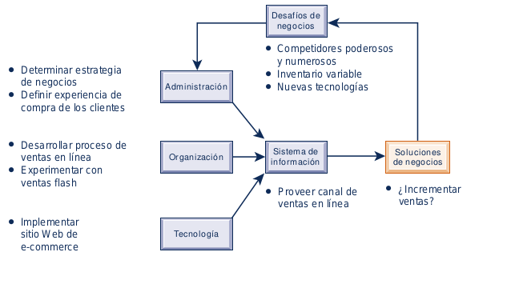

<h1>CASOS DE NEGOCIOS CAPITULO 3: </h1>

* **¿DEBE T.J. Maxx VENDER EN LÍNEA?**
* **NIKE SE CONVIERTE EN UNA EMPRESA TECNOLÓGICA**
* **IDENTIFICACIÓN DE LOS NICHOS DEL MERCADO EN LA ERA DE BIG DATA**
* **¿Quién es el mejor vendedor minorista del mundo? Walmart y Amazon lo resuelven**

<h2>¿DEBE T.J. Maxx VENDER EN LÍNEA?</h2>

<strong>T.J. Maxx</strong>, el gigante vendedor minorista de ropa de descuento con más de 1000 tiendas en Estados Unidos, ha sido uno de los últimos en adoptar las ventas en linea. No lanzó su plataforma de e-commerce sino hasta septiembre de 2013, muchos años despues respecto a sus rivales como Target y Kohl lo hicieran.
 
Las razones a la tardia incersion en el mercado en linea se debe a varias razones, es dificil para una tienda en linea como <strong>T.J. Maxx</strong> ofrecer un inventario estable y predecible para las compras en linea. <strong>T.J. Maxx</strong> compra inventario sobrante y modas fuera de temporada  de una enorme red de tiendas departamentales y fabricantes, de lo cual el 15% es mercancia que quedó del año anterior. Pero compra estos articulos en lotes mucho más pequeños que los vendedores minoristas tradicionales. El inventario en <strong>T.J. Maxx</strong> varia mucho de una tienda a otra; nunca se sabe lo que uno encontrara al visitar una tienda <strong>T.J Maxx</strong> . Los compradores son atraidos a las tienda con la esperanza de que encotraran una oferta realmente buena.
 
En 2012, la empresa matriz de <strong><strong>T.J. Maxx</strong> (TJX) </strong> compró al minorista de descuentos por Internet Sierra Tranding Post para aprender a vender en linea. El nuevo sitio de <strong><strong>T.J. Maxx</strong></strong> trata de preservar la apariencia de sus tiendas. No basta con buscar "Nanatte Lepore": es imprescindible repasar todos los vestidos o zapatos para dama. A los compradores en linea puede o no gustarles eso. El minorista tambien esta experimentando con su propio sitio de ventas flash conocido como Maxx Flash. A diferencia de otros sitios flash, este puede aceptar devoluciones en las tiendas y revender en ellas los articulos

<h2>NIKE SE CONVIERTE EN UNA EMPRESA TECNOLÓGICA</h2>

Nike, cuyo nombre proviene de la diosa griega de la victoria, es la empresa de calzado y ropa deportiva más grande del mundo. Nike diseña, desarrolla y vende una variedad de productos y servicios para ayudar a jugar básquetbol y fútbol soccer, así como equipo para correr, de entrenamiento para hombres y mujeres, y otros deportes de acción. Nike también comercializa los productos inspirados en los deportes para niños y diversas actividades competitivas y recreativas, como béisbol, golf, tenis, volibol y caminata.
 
Nike es conocida por sus tecnologías de vanguardia para hacer que sus productos sean más atractivos y mejorar el desempeño del usuario, incluyendo la tecnología avanzada que se utiliza para dar soporte a las superestrellas deportivas asociadas con Nike, así como la tecnología que se utiliza en los zapatos para correr que puede comprar en línea. Por ejemplo, la tecnología Nike Air usa “supergases” alojados en plástico de uretano para ofrecer un acolchonado superior en los zapatos para correr que minimiza el estrés en las articulaciones de los corredores cada vez que sus pies tocan el suelo. La generación del gas, la fuerza del plástico y su colocación dentro del zapato brindan un excelente acolchonado sin perder desempeño. Nike Air fue la primera pieza importante de tecnología para zapatos que salió de Nike y ha influido desde entonces en todos los demás zapatos para correr.
Desde luego que Nike ha estado utilizando la tecnología de la información en el diseño y la fabricación de estos productos de vanguardia, y ahora adopta la tecnología de la información en nuevas formas con un mayor
alcance. Algunos de los productos más recientes que ofrece Nike son en realidad productos de tecnología de la información. Considere por ejemplo el producto Nike+ FuelBand, un rastreador de actividad que se usa en la pulsera junto con un dispositivo iPhone o iPad de Apple. La pulsera FuelBand permite a quien la usa rastrear su actividad física, los pasos dados a diario y la cantidad de calorías quemadas. La información de la pulsera se integra a la comunidad en línea y aplicación de teléfono Nike+, que permite a quienes usan la pulsera establecer sus propias metas físicas, monitorear su progreso en la pantalla LED y compararse con otros miembros de la comunidad. Y con la tecnología inalámbrica Bluetooth 4.0, la FuelBand permanece conectada constantemente, sincronizando los datos que recolecta con la cuenta Nike+ del usuario y proporcionando retroalimentación y motivación cuando se necesita.
La Nike FuelBand tiene competidores, entre ellos los rastreadores de Fitbit y Jawbone. Nike realizó algunas mejoras en su FuelBand SE para mantenerse a la par con estos dispositivos competidores, como la habilidad de
recordar a los usuarios que deben levantarse y caminar periódicamente, medir entrenamientos específicos y actividades como yoga o bicicleta. Así como lo han hecho los rastreadores Fitbit, también la nueva FuelBand es capaz de medir el sueño. Sin embargo, el diferenciador clave de la FuelBand no es el hardware ni cierta característica: es el sistema de puntos creado junto con el gadget conocido
como NikeFuel.
 
El software propietario de Nike convierte todo el movimiento rastreado en puntos NikeFuel, que pueden mostrar logros, compartirse con amigos o usarse para competir con otros usuarios. De acuerdo con Nike, NikeFuel es su forma universal de medir el movimiento en todo tipo de actividades. NikeFuel provee a los usuarios una métrica que permite comparaciones (sin importar la altura, peso, género o actividad) con el desempeño anterior, con otra persona o un promedio diario, que Nike define como 2,000 puntos de NikeFuel. Nike no ha divulgado con exactitud cómo se calcula la métrica.
El deseo de Nike es que cada vez más productos de tecnología de acondicionamiento físico se integren con Nike +, además de proveer financiamiento y asistencia a las empresas pequeñas que crean aplicaciones para
este fin. Cuantas más personas midan su actividad con NikeFuel, más se engancharán en el ecosistema Nike + de dispositivos de rastreo de movimiento (y más difícil será cambiar a otros dispositivos de cómputo usables).
No hay forma de recibir crédito por los puntos NikeFuel que haya acumulado si decide cambiar a una pulsera Fitbit. La integración de la información de Nike y la tecnología de la información en sus productos hace que la gente siga regresando al propio sitio Web y las apps de Nike.
 
En octubre de 2013 Apple Computer declaró que su nuevo iPhone tendría sensores para que la gente pudiera usar sus teléfonos para llevar el registro de sus puntos NikeFuel. Aunque Apple tal vez esté desarrollando un reloj inteligente competidor, Nike se siente cómoda trabajando con Apple.
 
Otros dispositivos Nike+ son el Nike+ SportWatch GPS y la app Nike+ Running, disponible para los dispositivos móviles Apple y Android. El Nike+ SportWatch GPS lleva el registro de su ubicación, ritmo, distancia, vueltas,
calorías quemadas y (con el Polar Wearlink+) el ritmo cardiaco. Después de grabar una carrera en el Nike+ SportWatch GPS, puede enviar la información del entrenamiento a nikeplus.com conectando el SportWatch en el puerto USB de su computadora. Una vez que se hayan enviado sus datos, nikeplus.com le permitirá rastrear su progreso, establecer metas, ver dónde corrió y encontrar excelentes rutas.
La app Nike+ Running registra sus carreras en un mapa usando GPS, rastrea su progreso y proporciona la motivación que necesita para seguir adelante. La app Nike+ Running rastrea la distancia, el ritmo, el tiempo y las calorías quemadas, y le ofrece retroalimentación de audio mientras corre. Los usuarios pueden enviar automáticamente sus datos a nikeplus.com para ver sus carreras, incluyendo la ruta, elevación y puntos NikeFuel. Incluso pueden publicar el inicio de su carrera en Facebook y escuchar vítores en tiempo real por cada “Me gusta” o comentario que reciban. La versión más reciente de este software incluye programas de capacitación, sugerencias de preparación y entrenamientos diarios. Una nueva característica “Next Moves” (próximos movimientos) en la pantalla inicial permite a los corredores desplazarse con facilidad a través de desafíos sugeridos: por ejemplo, correr 5 kilómetros lo más rápido que puedan o alcanzar la máxima distancia.
 
Los usuarios de varios dispositivos Nike+ pueden visitar el sitio nikeplus.com para acceder a todos sus datos (incluyendo los puntos NikeFuel vitalicios acumulados de todos sus dispositivos NIKE+).
El ecosistema Nike + es parte de un fenómeno más grande conocido como la “Internet de las cosas” (vea el capítulo 7), en el cual los dispositivos individuales como los sensores, medidores y aparatos eléctricos se conectan a Internet para poder monitorear y analizar su desempeño.
 
Otras compañías de productos para el consumidor además de Nike están adoptando esta tecnología, con gadgets como botellas de agua conectadas a Internet para recopilar los datos de consumo de agua o el cepillo de dientes con capacidad Web de Procter & Gamble, que se enlaza a un smartphone y registra los hábitos de cepillado.
 
A Nike no le interesa ganar dinero vendiendo la información detallada que recopila sobre las rutinas de entrenamiento de los usuarios para ayudar a las empresas y anunciantes a orientar sus anuncios. Esa información podría ser valiosa para otras empresas, pero lo que Nike realmente desea hacer es fabricar dispositivos geniales que se conecten estrechamente con su propio software. De lo que se trata es de dar servicio a un tipo específico de cliente: el atleta.

<h2>IDENTIFICACIÓN DE LOS NICHOS DEL MERCADO EN LA ERA DE BIG DATA</h2>

Con la cantidad de datos disponibles para las empresas, que se duplica cada año, los nuevos orígenes de datos y las innovaciones en la recolección de los datos, las posibilidades de que los comercializadores identifiquen los nichos del mercado y afinen las campañas son ilimitadas. Por ejemplo, en el mercado de los libros electrónicos, tres empresas jóvenes de servicios de suscripción de lectura (Scribd, Oyster y Entitle) buscan obtener beneficios al descubrir con exactitud qué es lo que hace vibrar a los lectores.
 
Una tarifa mensual fija da a los usuarios acceso ilimitado a una amplia selección de títulos de las bibliotecas digitales de estas empresas. Al igual que Barnes and Noble y Amazon, los recién llegados recolectarán una variedad de datos de los dispositivos de lectura digitales de sus clientes (e-readers o lectores electrónicos, tablets, smartphones), incluyendo si un libro está completo, qué páginas se hojearon y cuáles se saltaron, y qué géneros se terminan con más frecuencia. Estos servicios de suscripción intentan diseminar lo que han aprendido. La idea es que los escritores puedan usarlos para adaptar mejor sus obras a sus lectores, y que los editores de libros puedan usarlos para elegir qué originales publicar.
 
Cuando los clientes se inscriben en estos servicios, se les informa que algunos de sus datos se recolectarán y usarán pero se les asegura que su identidad estará protegida. Smashwords, una editorial grande e independiente es entusiasta del valor de dichos datos para los autores que usan su plataforma para autopublicar y distribuir su trabajo. Muchos autores contemporáneos ya exploraron las oportunidades de retroalimentación disponibles a través de sus propios sitios Web, sitios de redes sociales y Goodreads, una base de datos poblada por los mismos usuarios de libros, anotaciones y reseñas, que ahora pertenece a Amazon. Los servicios de suscripción llevarán este tipo de investigación de mercado a un nivel más cuantificable.
 
El análisis de datos preliminares ya reveló que, a medida que aumenta la longitud de una novela de misterio, también aumenta la probabilidad de que un lector se salte hasta el final para descubrir el desenlace. Es menos probable que los libros de negocios terminen de leerse en comparación con las biografías; la mayoría de los lectores completan sólo un capítulo de un libro de yoga y parte de las lecturas más rápidas se adjudican a las novelas de romance, de las cuales las de tipo erótico están en primer lugar. Los capítulos más cortos incitan a los lectores en dispositivos de lectura electrónicos, tablets y smartphones, a terminar un libro 25%
con más frecuencia que los libros de capítulos extensos.
Pero ¿finalizar un libro puede traducirse en ventas de libros? ¿Y cómo impactará este conocimiento al proceso creativo? ¿Se verá impactada negativamente la calidad para satisfacer las preferencias de los lectores? Antes
de responder cualquiera de estas preguntas, los autores necesitarán acceso a datos exhaustivos. Y eso depende de que las grandes casas editoriales firmen contratos con los servicios de suscripción. Después de casi dos décadas de interrupciones del mercado dirigidas por Amazon, las editoriales no se están apurando por suministrar títulos. Hasta ahora, solo Harper Collins ha firmado con Oyster y Scribd, mientras que Random House, Penguin y Simon & Schuster se mantienen al margen.
 
En la industria de las aerolíneas, casi todos los transportistas recolectan datos de los pasajeros, pero algunos buscan de manera agresiva la minería de datos para personalizar la experiencia de vuelo. Los conjuntos de datos, que anteriormente no estaban vinculados, ahora pueden consolidarse para generar perfiles de usuario detallados. Los tripulantes de la cabina equipados con tablets o smartphones pueden identificar a los cinco mejores clientes en el avión, los pasajeros con dietas o alergias especiales, preferencias de asientos, recién casados que se embarcan en su luna de miel, y clientes cuyo equipaje se extravió o que experimentaron retrasos
en sus vuelos anteriores. El historial de navegación Web en el vuelo y los “Me gusta” de Facebook se utilizan incluso para moldear los argumentos de marketing relevantes.
Este aspecto de “público cautivo” del viaje aéreo, en conjunto con el enorme volumen de información que las aerolíneas recolectan, representa una oportunidad única para los comercializadores. La empresa Allegiant Travel ya ha podido vender boletos para espectáculos, rentas de autos y paseos en helicóptero a clientes que viajan a Las Vegas. La modernización que realizó United Airlines en su sitio Web, los quioscos y la app móvil, junto con su iniciativa de integración de datos, le permitió dirigirse a los viajeros predispuestos a mejorar su boleto por un asiento de clase mejor.
 
Pero no todos los clientes están complacidos. Un usuario se quejó en el foro FlyerTalk de Delta de que un vínculo del nuevo sitio Web DL.com llevaba a un perfil personal que incluía mucho más que sus millas acumuladas y su aeropuerto local; se habían incluido el ingreso anual, el valor de su casa y los rangos de edades de sus hijos junto con datos esperados como la cantidad que gasta en tarifas aéreas, preferencias de hotel y el tipo de tarjeta de crédito.
La publicidad negativa resultante hizo que Delta se disculpara rápidamente, pero defendió su uso de los datos demográficos y los datos no cubiertos bajo su política de privacidad. El socio de tarjetas de crédito American Express había suministrado algunos datos, según lo permitido bajo la política. El grupo de servicios globales de información Experian suministró el resto de los datos, sin que los usuarios estuvieran enterados.
Estos enfoques de marketing orientados a los datos no son perfectos. Incluso los clientes que aceptan lo inevitable de la creación de perfiles se molestan cuando reciben ofertas inadecuadas basadas en la información personal incorrecta. Una encuesta de Quantas sobre los viajeros frecuentes descubrió que la mayoría de los clientes desean que se trace una línea entre la recolección de datos para facilitar ofertas útiles y la recolección de datos que sea demasiado intrusiva. British Airways cruzó la línea con su programa “Know Me” (Conóceme). Las búsquedas en Google Image se usaron para identificar clientes VIP cuando entraban al aeropuerto y la sala de primera clase; desde entonces esa práctica se descontinuó. Los clientes pueden optar por no recibir los servicios de personalización de British Airways, pero no de su recolección de datos. Si se solicita, se agrega una nota al perfil del cliente, que a pesar de ello sigue creciendo. En la actualidad ninguna de las aerolíneas permite a los usuarios salirse de sus programas de datos.
 
A medida que los fabricantes de autos exploren sus oportunidades de Big Data, la privacidad del cliente también se convertirá en un problema para ellos. Ford Motor Company comenzó a explorar cómo la integración de
bases de datos y el uso de algoritmos complejos podrían haber generado un aumento en las ventas hace tres años, cuando desarrolló un programa para sus concesionarios de modo que pudieran adaptar mejor el inventario del lote de autos a la demanda de los compradores. Utilizando las tendencias de compra, el abastecimiento de vehículos local y nacional, y el inventario del lote de autos actual, Ford ideó un programa para realizar recomendaciones de compras a los concesionarios. No sólo mejoró la tasa de renovación de vehículos sino que aumentó el precio neto (el precio que paga un consumidor menos el subsidio del fabricante), impulsando un repunte en las ganancias de Ford.
Pero Ford está pensando en cosas más grandes. El monitoreo del rendimiento mediante las conexiones a Internet de los vehículos para recolectar datos sobre el ahorro de combustible, fallas mecánicas y demás métricas de seguridad y rendimiento podrían usarse pronto para mejorar la ingeniería de producto. Además, las conexiones a bordo podrían usarse para enviar mensajes a los conductores sobre los potenciales problemas de descompostura, tal vez evitando así una costosa llamada a revisión. Como Ford estima que para 2016 hasta una tercera parte de la comunicación de sus clientes ocurrirá dentro de sus vehículos, las posibilidades abundan. Los datos de uso de vehículos arrendados podrían informar sobre argumentos de marketing al final del periodo de arrendamiento; el patrón de conducción, el programa, y los datos de las maniobras de conducción podrían sugerir las rutas más compatibles según los hábitos de un conductor; los datos de ubicación del auto podrían enviarse a los sistemas de gestión del tráfico para controlar los semáforos; los datos de los autos conectados en red podrían alertar a otros conductores sobre condiciones peligrosas y embotellamientos de tráfico, y los datos sobre el valor y los pagos actuales del auto podrían aconsejar a los conductores sobre su fecha óptima de cambio.
 
No es difícil pronosticar las cuestiones de privacidad que podrían entrar en juego a medida que los conductores se den cuenta que no solo se está rastreando su ubicación, sino también cada movimiento dentro de su vehículo. Hay implicaciones para las agencias policiales (multas y atribución de culpa en accidentes). Equilibrar los dilemas de privacidad con la conveniencia, seguridad y oportunidad de las transacciones será el reto ahora para todas las empresas mientras exploran las capacidades de análisis de Big Data emergentes.

<h2>¿ Quién es el mejor vendedor minorista del mundo ? Walmart y Amazon lo resuelven</h2>

Walmart es el minorista más grande y exitoso del mundo, con $476 mil millones en ventas en el año fiscal 2014 y cerca de 11,000 tiendas en todo el mundo, incluyendo más de 4,000 en Estados Unidos. Walmart tiene 2 millones de empleados y se clasifica en el primer lugar de la lista de empresas Fortune 500. Walmart tenía una máquina de ventas tan grande y poderosa que en realidad no tenía una
competencia seria. Ningún otro minorista podía alcanzarlo (hasta ahora). La mayor amenaza actual de Walmart es nada más y nada menos que Amazon.com, conocido comúnmente como el “Walmart de Web”. Amazon no solo vende libros sino prácticamente todo lo demás que las personas desean comprar: discos DVD, descargas de video y música por flujo continuo, software, videojuegos, aparatoselectrónicos, ropa, muebles, alimentos, juguetes y joyería.
La empresa también produce aparatos electrónicos para el consumidor: en especial, el lector de libros electrónicos Amazon Kindle. Ningún otro minorista en Internet puede igualar la amplitud de selección de Amazon, sus bajos precios y su servicio de envío es tan rápido como confiable.
 
Durante muchos años Amazon ha sido el líder de las ventas minoristas por Internet y es ahora el minorista de e-commerce más grande del mundo. Además, tiene una máquina de ventas muy grande y poderosa, aunque su
enfoque principal es vender por Internet. Pero si Amazon tiene su modo de hacer negocios, está a punto de cambiar debido a que ansía entrar en el terreno de Walmart.
Walmart se fundó en 1962 como una tienda tradicional física sin conexión a Internet, y eso es lo que la hace ser mejor. Pero se está viendo forzada a competir en el e-commerce, le guste o no. Hace seis o siete años, solo una cuarta parte de todos los clientes de Walmart compraban en Amazon.com, de acuerdo con los datos de la empresa investigadora Kantar Retail. Sin embargo, en la actualidad la mitad de los clientes de Walmart dicen haber comprado con ambos minoristas. La competencia en línea de Amazon se ha vuelto demasiado fuerte para ignorarla. ¿Por qué le está ocurriendo esto a Walmart? Hay dos tendencias que amenazan su dominio. En primer lugar, los clientes tradicionales de Walmart (que son en su mayoría cazadores de ofertas que ganan menos de $50,000 al año) están usando la tecnología cada vez con más comodidad.
 
Los clientes más pudientes que comenzaron a comprar en Walmart durante la recesión, están regresando a Amazon a medida que sus finanzas mejoran. Amazon ha comenzado a incluir existencias de categorías de mercancías que vendía Walmart tradicionalmente, como bolsas para aspiradoras, pañales y ropa, y sus ingresos están aumentando con mucha mayor rapidez que los de Walmart. En 2013, Amazon logró ventas aproximadas de $67 mil millones, en comparación con las ventas en línea aproximadas de $9 mil millones de Walmart.
 
Si cada vez más personas desean realizar una parte de sus compras en línea, Amazon tiene ciertas ventajas determinantes: ha creado una marca reconocida y altamente exitosa en las ventas minoristas por Internet. La
empresa desarrolló extensas instalaciones de almacenamiento y una red de distribución en extremo eficiente, diseñada de manera específica para las compras a través de Web. Su servicio de envío de nivel superior, Amazon Prime, ofrece envíos “gratuitos” de dos días por un precio asequible de suscripción anual fijo ($99 al año), que a menudo se considera un punto débil para los minoristas que venden por Internet. De acuerdo con el Wall Street Journal, los costos de envío de Amazon son menores que los de Walmart y varían de $3 a $4 por paquete, en tanto que el envío por Internet de Walmart puede costar entre $5 y $7 por paquete. La enorme cadena de suministro de Walmart tiene que dar soporte a más de 4,000 tiendas físicas en todo el mundo; a Amazon esto no le preocupa. Los costos de envío pueden hacer una gran diferencia para una tienda como Walmart, donde las compras populares tienden a ser artículos de bajo costo como los paquetes de ropa interior de $10. Para Walmart no tiene sentido crear otra cadena de suministro para el e-commerce .
 
Sin embargo, Walmart no es ningún debilucho. Es una marca incluso más grande y reconocida que Amazon. Los consumidores asocian a Walmart con los precios más bajos, que esta tienda tiene la flexibilidad de ofrecer en cualquier artículo debido a su tamaño. La empresa puede perder dinero vendiendo un producto popular con márgenes en extremo bajos y aun así logra ganar dinero gracias a la solidez de las grandes cantidades de los demás artículos que vende. Además, Walmart tiene una presencia física considerable con tiendas en todo Estados Unidos. Sus tiendas proporcionan la gratificación instantánea de ir de compras, elegir un artículo y llevarlo a casa de inmediato, en contraste con el hecho de tener que esperar hasta el momento de hacer un pedido de Amazon. Dos terceras partes de la población de Estados Unidos están a cinco millas de distancia de una tienda Walmart, según los informes de la gerencia de la empresa.
 
Walmart ha incrementado de manera estable su inversión en su negocio en línea, invirtiendo más de $300 millones para adquirir cinco empresas de tecnología, incluyendo Small Society, One Riot, Kosmix y Grabble, además de contratar a más de 300 ingenieros y escritores de código. Otras adquisiciones recientes son: Torbit, OneOps, Tasty Labs e Inkiru, las cuales ayudarán a que Walmart obtenga más experiencia en cosas como mejorar las recomendaciones de productos para los visitantes Web de Walmart.com, usar teléfonos inteligentes como un canal de marketing y personalizar la experiencia de compras. Walmart ha estado agregando de manera estable nuevas aplicaciones a sus canales de compras, móvil y por Internet, y está expandiendo su integración con las redes sociales como Pinterest.
 
El equipo tecnológico de la empresa está trabajando en una aplicación conocida como Endless Aisle, el cual permitirá a los compradores realizar pedidos instantáneos en Walmart.com a través de sus teléfonos inteligentes si un artículo está agotado. Un programa llamado Pay With Cash permite al 25% de los clientes de Walmart que no tienen tarjetas de crédito ni cuentas bancarias, ordenar sus productos en línea y luego pagar en efectivo en su tienda Walmart más cercana. La división de desarrollo en línea y digital de Walmart @WalmartLabs adquirió la joven empresa tecnológica de recetas Yumprint para expandir sus servicios de entrega de abarrotes en línea. La gerencia espera que Yumprint ayude a los clientes de Walmart a realizar listas de compras con más facilidad a partir de las recetas que encuentren en Yumprint antes de comprar. La empresa también contrató a Jamie Iannone, exejecutivo de eBay, para administrar la integración del sitio Web de Sam’s Club en la unidad de e-commerce global de Walmart.
 
Sam’s Club de Walmart ha estado probando un nuevo servicio de suscripción conocido como My Subscriptions, el cual permite a sus 47 millones de miembros ordenar más de 700 artículos, incluyendo las categorías de bebés, belleza y suministros de oficina, para poder competir con el programa Subscribe & Save de Amazon. Los clientes en línea no tendrán que pagar cuotas de envío por estos artículos de suscripción. Anteriormente Sam’s Club no se veía afectado por los competidores como Amazon con relación a los clientes que compraban alimentos frescos, abarrotes y productos básicos que, o no se vendían en Amazon, o eran más costosos en línea. Ahora hay entre 35 y 40 millones de hogares inscritos en Amazon Prime, y muchos miembros de Sam’s Club tienden a pertenecer a Amazon Prime también. Sam’s Club está comenzando a sentir la presión. Amazon busca iniciar un nuevo negocio llamado “Pantry”, el cual permitirá a los clientes comprar productos como papel higiénico y artículos de limpieza en mayores cantidades para reducir los costos de envío.
 
Walmart también está tratando de mejorar los vínculos entre su inventario en las tiendas, su sitio Web y las apps de teléfonos celulares para que cada vez más clientes puedan realizar pedidos en línea y recoger sus compras en las
tiendas. Los compradores pueden pedir artículos en línea y recogerlos de los casilleros en las tiendas locales sin tener que esperar en la fila (Walmart ya ofrece el servicio de recoger en tienda los pedidos realizados en línea). Los casilleros de Walmart son similares al reciente trato de Amazon con Staples y 7-Eleven para hacer lo mismo. La idea es poder ofrecer los productos de Walmart en cualquier parte en la que un cliente prefiera comprar, ya sea en línea, en las tiendas o por teléfono.
 
La empresa está rediseñando su experiencia en la tienda para atraer a más personas. Más de la mitad de los clientes de Walmart poseen teléfonos inteligentes. Walmart diseñó su app móvil para maximizar su ventaja contra Amazon: sus
ubicaciones físicas. Cerca de 140 millones de personas visitan una tienda Walmart cada semana. La empresa comenzó a probar el modo en tienda de la app, que detecta cuando un cliente se encuentra en una tienda física. Cuando se
activa el modo, los clientes pueden revisar sus listas de artículos deseados, localizar artículos de interés en la tienda y ver las promociones locales. La característica “Scan & Go” de la app permite a los clientes explorar los artículos mien-
tras compran para poder avanzar con rapidez por las filas de autoservicio a la hora de pagar. Los compradores pueden agregar artículos a sus listas mediante el uso de voz o escaneando los códigos de barras.
 
El sitio Web de Walmart usa software para monitorear los precios de los minoristas competidores en tiempo real y reducir sus precios en línea si es necesario. La empresa también está duplicando el inventario que se vende a través de minoristas terceros en su mercado en línea y rastrea los patrones en los datos de búsqueda y de los social media para que le ayuden a seleccionar los productos más buscados. Esto ataca de manera directa el mercado de terceros de Amazon, que representa un flujo de ingresos considerable para esta empresa. Además, Walmart está expandiendo sus ofertas en línea para incluir artículos de lujo como anteojos de sol Nike de $146 y refrigeradores para vinos, que cuestan más de $2,500, para atraer a los clientes que nunca han puesto un pie en una tienda Walmart.
 
Amazon está trabajando en expandir su selección de productos para que sea tan exhaustiva como la de Walmart. Además, por años ha permitido que los vendedores independientes vendan productos a través de su sitio Web y expandió de manera considerable su selección de productos mediante adquisiciones, como su compra en 2009 del sitio de compra de zapatos en línea Zappos.com, para tener la ventaja en la venta de zapatos.
 
El 18 de junio de 2014 Amazon anunció su propio Fire Phone para ofrecer una mejor plataforma móvil en la que pueda vender sus productos y servicios en línea. El smartphone de Amazon tiene cuatro cámaras que pueden rastrear rostros para mostrar imágenes que parezcan tener una profundidad similar a la de un holograma. Los usuarios pueden desplazarse por las páginas Web o de los libros con solo inclinar el dispositivo, o para navegar rápidamente por los menús, usar accesos directos y ver notificaciones. Mayday es un servicio de soporte al cliente las 24 horas para usuarios de dispositivos Amazon; ofrece acceso con un solo toque a los agentes de servicio al cliente de Amazon que pueden hablar con los usuarios del teléfono a través de chat con video y pueden acceder a la pantalla de los dispositivos de estos usuarios para mostrarles con exactitud cómo hacer algo. Firefly es una herramienta que mediante la cámara reconoce automáticamente más de 100 millones de artículos como mercancía, música o programas de televisión, y luego ofrece una forma de comprarlos a través de la tienda en línea de Amazon. Por ejemplo, un usuario podría apuntar el teléfono a un par de zapatos para correr y luego ordenarlos de inmediato de Amazon.com.
 
Amazon sigue creando centros de cumplimiento más cercanos a los centros urbanos y expandir sus servicios de entrega del mismo día; además, tiene una cadena de suministro optimizada para el comercio en línea que Walmart simplemente no puede igualar. Pero Walmart cuenta con miles de tiendas, en casi todos los vecindarios, algo que Amazon nunca podrá igualar. El ganador de esta épica lucha será la empresa que aproveche mejor su ventaja. La
iniciativa tecnológica de Walmart se ve prometedora, pero aún no ha tenido éxito en lograr que sus tiendas locales sean algo más que solo tiendas locales. Aún está en el aire la pregunta de la relación de las ventas en línea con el
modelo de negocios general de Walmart. ¿Debería Walmart tratar de vencer a Amazon como el sitio de e-commerce dominante a nivel mundial? ¿O sería mejor que usara las ventas en línea para impulsar los ingresos para todo el
entorno Walmart? ¿Se generarían más ingresos a nivel de empresa si tuviera un sitio modesto en línea y usara la tecnología para impulsar las ganancias de la tienda?

